# awesome-hajimi
collections of hajimi (哈基米 in Chinese) on the Internet.

## 视频列表 (Video List)

| 视频标题 (Title) | 封面 | 播放量 (Views) | 发布日期 (Date) |
|---|---|---|---|
| [可爱哈基米在线卖萌](https://www.bilibili.com/video/BV1sDDZBwE3M) |  | 0 | 2026-04-10 |
| [哈基米](https://www.bilibili.com/video/BV158DZB1EVF) |  | 1 | 2026-04-10 |
| [【哈基米音乐】What Makes You Beautiful](https://www.bilibili.com/video/BV1L3D4BtE7q) | 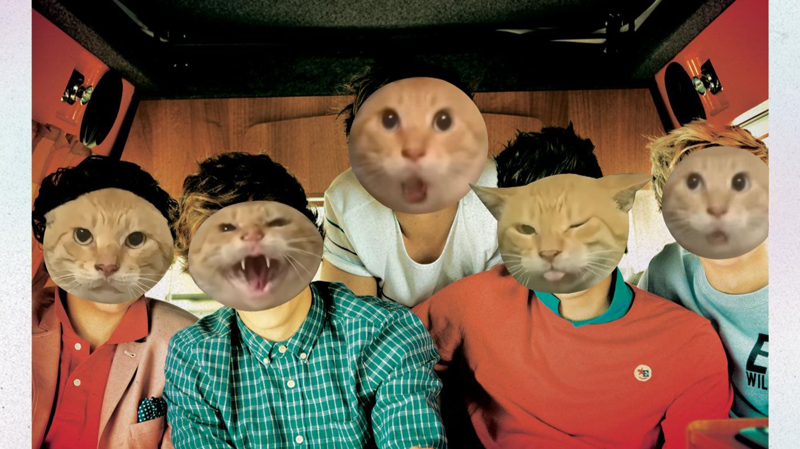 | 493 | 2026-04-10 |
| [哈基米成为城市的一部分](https://www.bilibili.com/video/BV11bDfBNEge) | 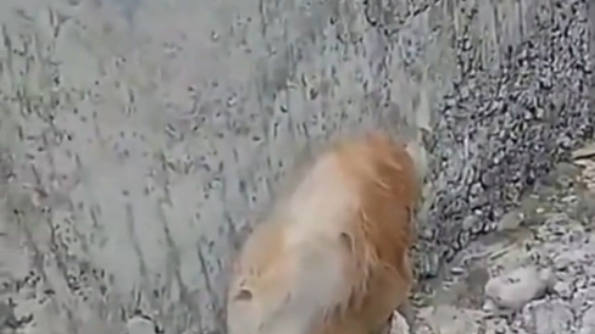 | 1010 | 2026-04-10 |
| [哈基米录像之求求你了](https://www.bilibili.com/video/BV1rqDfBfEPc) | 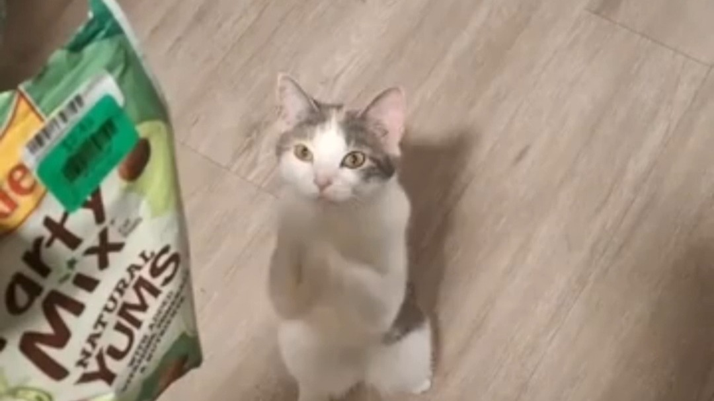 | 13 | 2026-04-10 |
| [QQ飞车手游庄园哈基米音乐的名字](https://www.bilibili.com/video/BV1rqDfBfEke) | 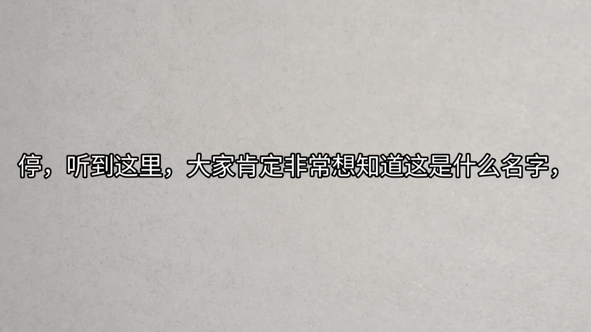 | 54 | 2026-04-10 |
| [哈基米录像之俯瞰臣民](https://www.bilibili.com/video/BV1kiDfB8E72) |  | 35 | 2026-04-10 |
| [哈基米录像之飞起来](https://www.bilibili.com/video/BV1D7DfBkErG) | 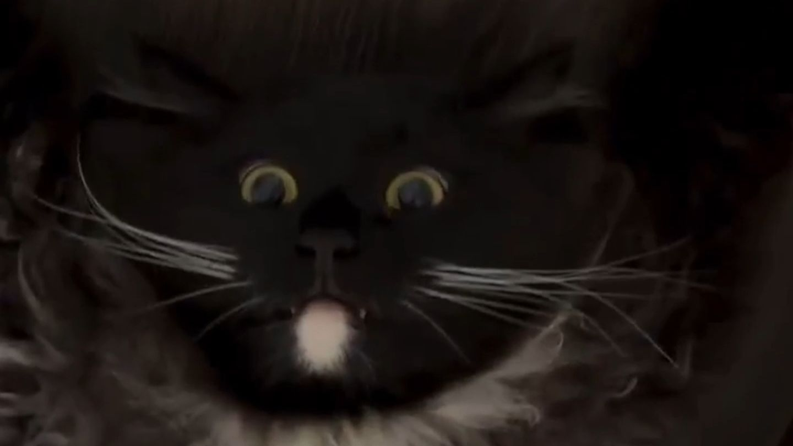 | 7 | 2026-04-10 |
| [哈基米这个爵士豪猫](https://www.bilibili.com/video/BV1mpDfBuE9e) | 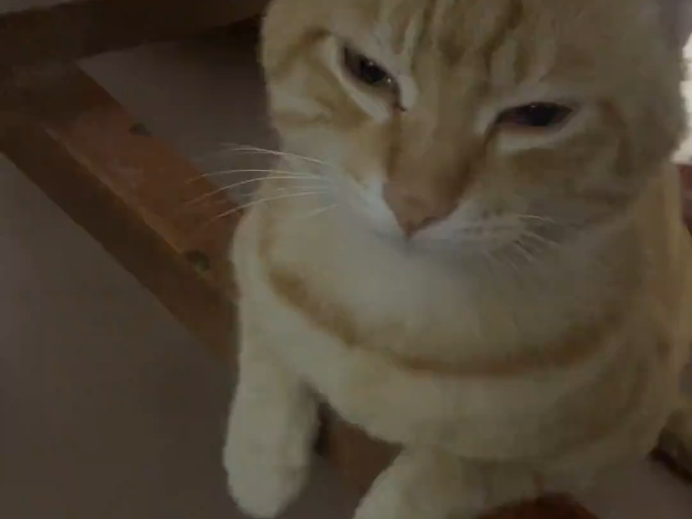 | 81 | 2026-04-10 |
| [【哈基米音乐】洛克王国：彩虹河流](https://www.bilibili.com/video/BV1YUDoBCEEs) |  | 432 | 2026-04-09 |
| [奇计百出的哈基米！](https://www.bilibili.com/video/BV1ZUD4BwEiq) |  | 1641 | 2026-04-09 |
| [2026.4.10哈基米速通星辰塔第八层青钟翾狐，白嫖30钻石到手](https://www.bilibili.com/video/BV1oADoB5EMe) |  | 91 | 2026-04-09 |
| [哈基米的一天第13集](https://www.bilibili.com/video/BV1V6SdBTEC6) | 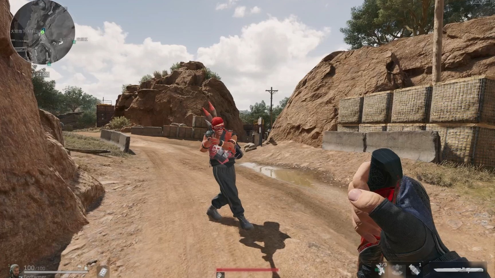 | 169 | 2026-04-09 |
| [点击即看威廉唱哈基米](https://www.bilibili.com/video/BV1qBDoBnEDm) | 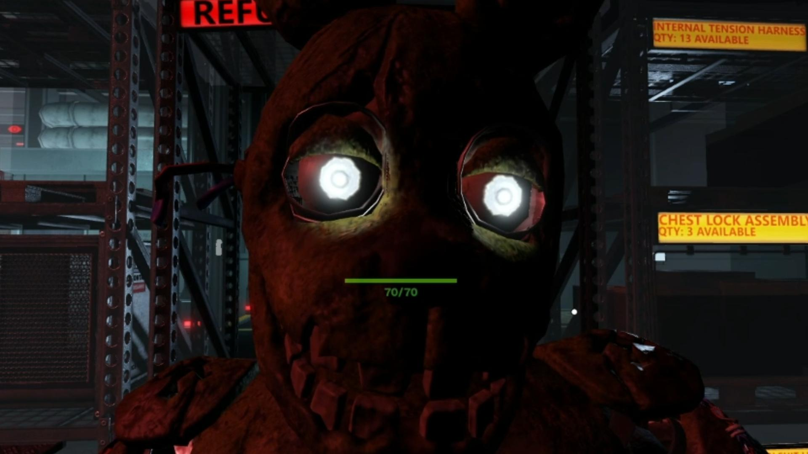 | 75 | 2026-04-09 |
| [哈基米没有人类了tz](https://www.bilibili.com/video/BV1rqD4BzEUK) |  | 1 | 2026-04-09 |
| [哈基米啃自己jiojio说是](https://www.bilibili.com/video/BV1nWDtBMEus) | 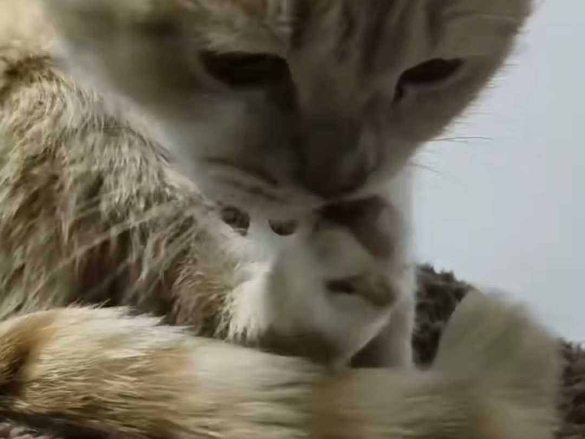 | 50 | 2026-04-09 |
| [哈基米包治百病（续）](https://www.bilibili.com/video/BV1j8DtBPEwj) |  | 101 | 2026-04-09 |
| [哈基米这个勇气](https://www.bilibili.com/video/BV1wFDbBCEwT) | 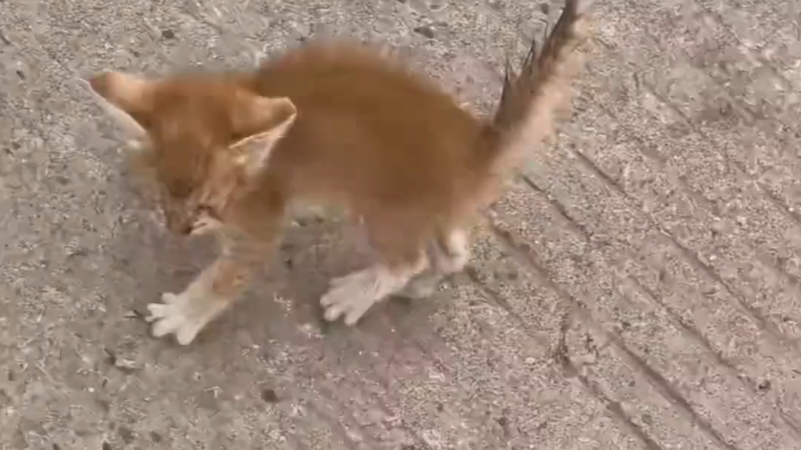 | 1384 | 2026-04-09 |
| [哈基米南北绿豆](https://www.bilibili.com/video/BV1CVDxBTEmh) |  | 0 | 2026-04-09 |
| [哈基米教培](https://www.bilibili.com/video/BV1s3DxBBETC) |  | 20 | 2026-04-09 |
| [一回家发现猫咪在地上留下了神秘图案](https://www.bilibili.com/video/BV1xTDxB3Efn) | 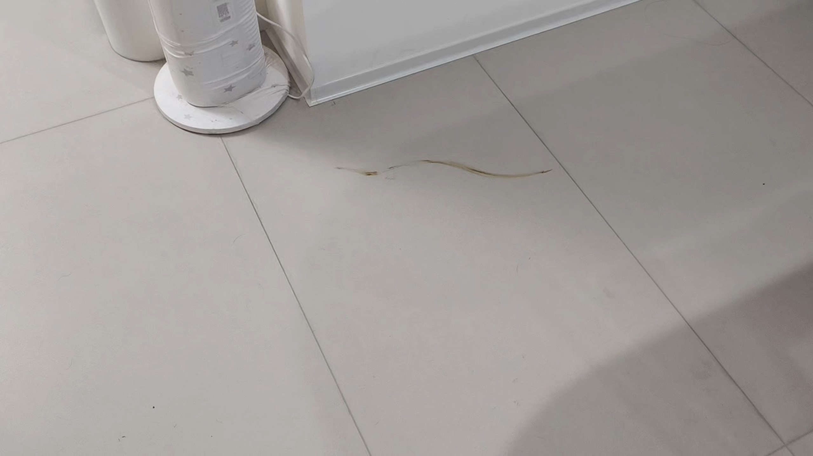 | 1.4万 | 2026-04-09 |
| [废基悲😭😭😭](https://www.bilibili.com/video/BV1t1DxBLEhX) | 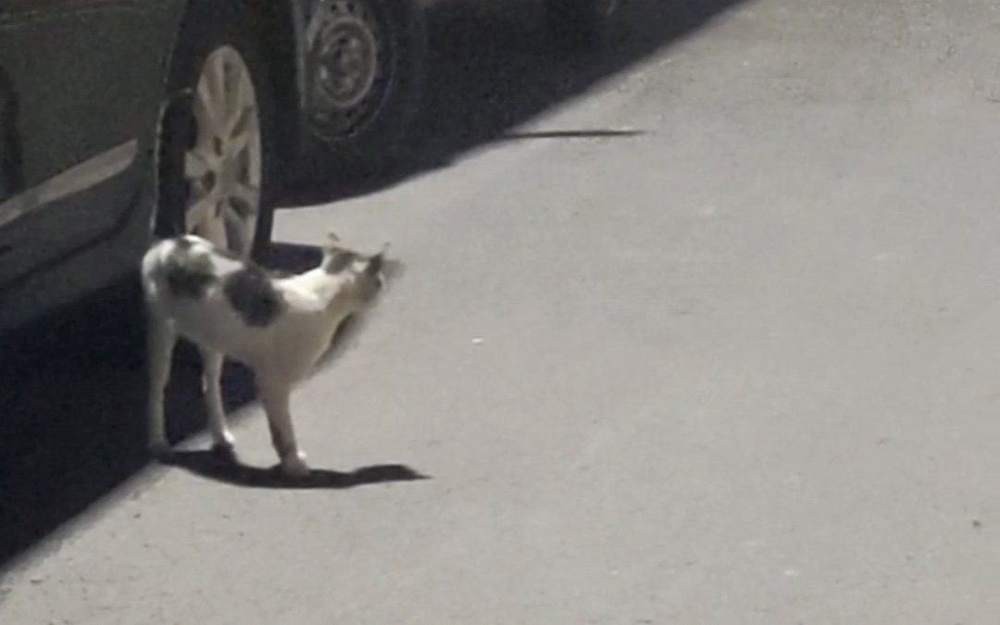 | 886 | 2026-04-09 |
| [哈基米三过家门而不入](https://www.bilibili.com/video/BV1LtDxBoEoU) | 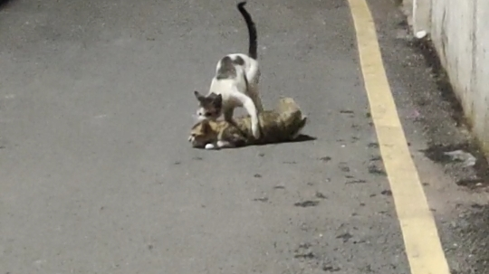 | 53 | 2026-04-09 |
| [基米TV之报恩好猫15分钟剧场版，一次看个够！](https://www.bilibili.com/video/BV1fPD4BwE6G) |  | 4709 | 2026-04-09 |
| [玩转哈基米](https://www.bilibili.com/video/BV17PD4BAEkC) |  | 165 | 2026-04-09 |
| [大家跟我唱！我要擦皮鞋，叮咚鸡哈基米，大东北……](https://www.bilibili.com/video/BV1JcD4BNE8E) |  | 25 | 2026-04-09 |
| [耄耋火花摇【哈基动物园258期】](https://www.bilibili.com/video/BV1juD4BfELG) | 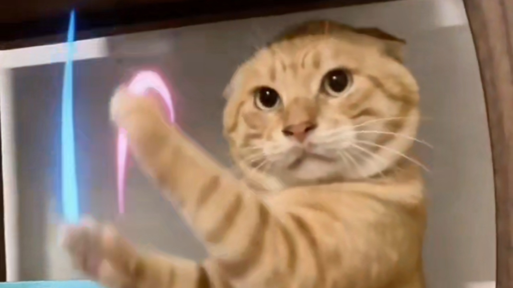 | 1455 | 2026-04-09 |
| [哈基米工作室大卡标准版安装视频](https://www.bilibili.com/video/BV1ARDxBuEvc) | 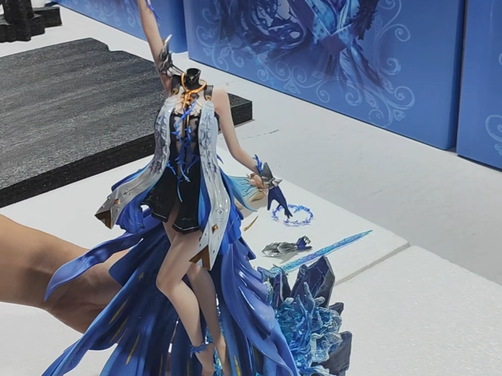 | 1609 | 2026-04-09 |
| [哈基米工作室大卡豪华版安装视频](https://www.bilibili.com/video/BV1mtD4B1EHL) | 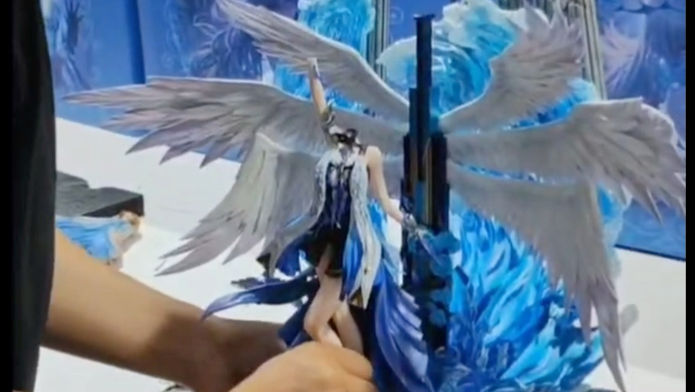 | 200 | 2026-04-09 |
| [赛博朋克2078：圆哈镇委托](https://www.bilibili.com/video/BV12tD4B1EgX) |  | 10.2万 | 2026-04-09 |
| [耄蛙种子](https://www.bilibili.com/video/BV1SWD4BEETz) | 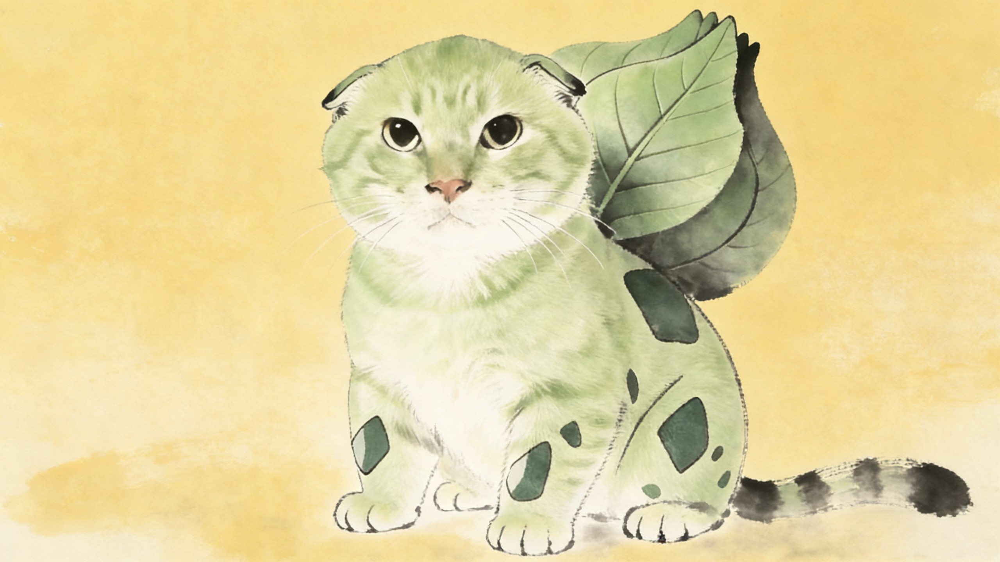 | 2187 | 2026-04-09 |
| [哈基米工作室小卡安装视频](https://www.bilibili.com/video/BV1UsD4BmEY8) | 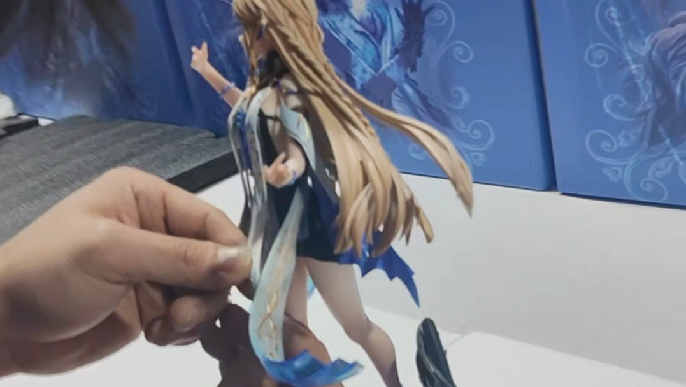 | 85 | 2026-04-09 |
| [人！其实快乐很简单，跟me下乡吧！希望me平凡的一天可以治愈奔波忙碌的你～](https://www.bilibili.com/video/BV1WeD4BkEjD) |  | 2024 | 2026-04-09 |
| [【哈基米音乐】😸护花使者😸（完整）](https://www.bilibili.com/video/BV1D7D4BpEXz) |  | 3187 | 2026-04-09 |
| [航海王壮志雄心，哈基米烟鬼大人！](https://www.bilibili.com/video/BV1Q7D4BpEfC) |  | 118 | 2026-04-09 |
| [蛋仔惊魂趣玩杯：找到哈基米开箱！这也太感人了！](https://www.bilibili.com/video/BV1MBDWBGE2G) |  | 2070 | 2026-04-09 |
| [哈基米-土象：你们知道的太多了](https://www.bilibili.com/video/BV18zDvB3EqK) |  | 795 | 2026-04-09 |
| [拿破仑摇，但是哈基米](https://www.bilibili.com/video/BV1jWDWBQEku) |  | 129 | 2026-04-09 |
| [哈基米这个女高音！](https://www.bilibili.com/video/BV1GbDWBEES9) |  | 3378 | 2026-04-09 |
| [哈基米这个喜欢](https://www.bilibili.com/video/BV154DWBSErQ) |  | 1.5万 | 2026-04-09 |
| [哈基汪TV之邪恶泰迪锻炼心肺](https://www.bilibili.com/video/BV1dNDsBXEpN) | 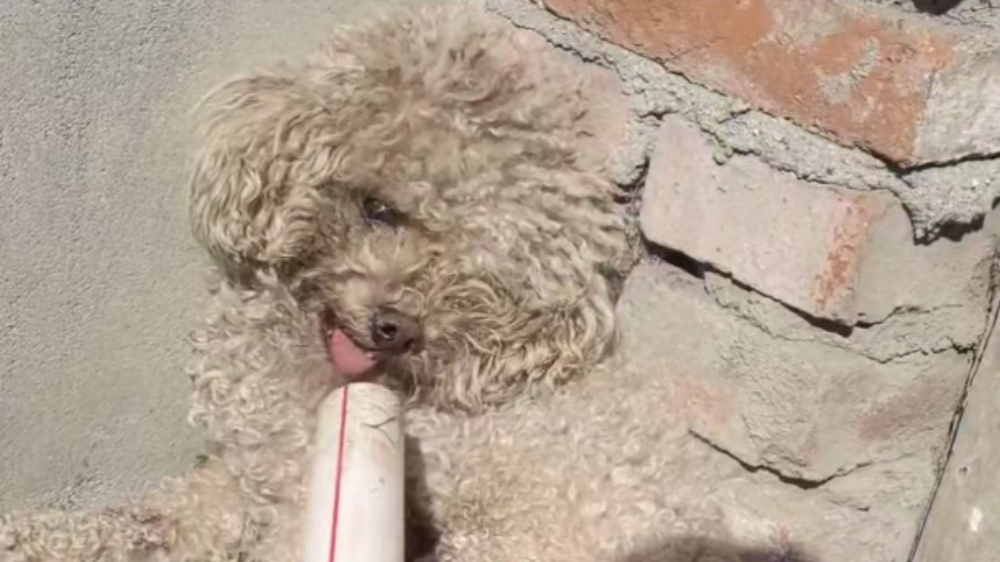 | 1.8万 | 2026-04-09 |
| [哈基米的约定](https://www.bilibili.com/video/BV1EZDWBbE1M) | 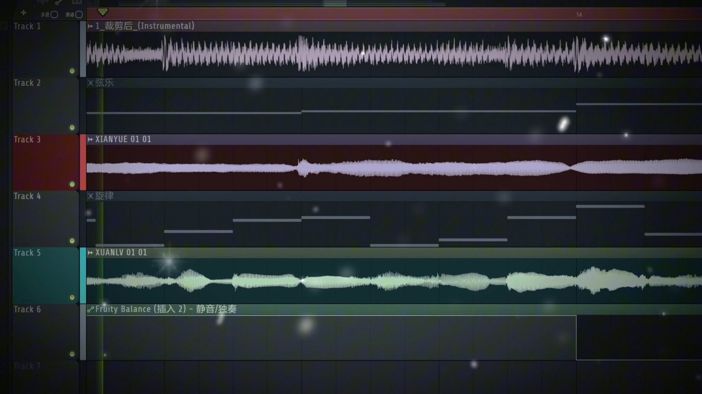 | 212 | 2026-04-09 |
| [哈基米视角～](https://www.bilibili.com/video/BV1EZDWBbEdz) |  | 131 | 2026-04-09 |
| [（优雅）哈基米误入音乐厅？](https://www.bilibili.com/video/BV1RBDrBNEjG) |  | 699 | 2026-04-09 |
| [小火耄陪我露营](https://www.bilibili.com/video/BV1owDsBREeV) |  | 4436 | 2026-04-09 |
| [别说大脸猫不干人事了，他只是哈基米，你还要他怎样😭](https://www.bilibili.com/video/BV1p9DWBwETZ) |  | 516 | 2026-04-09 |
| [【哈基米音乐】Under Our 哈气~ 【MLP鬼畜音乐】](https://www.bilibili.com/video/BV1TnDsBCEXX) |  | 396 | 2026-04-09 |
| [《哈基米＝可爱小猫》](https://www.bilibili.com/video/BV1G5DsBmEw3) | 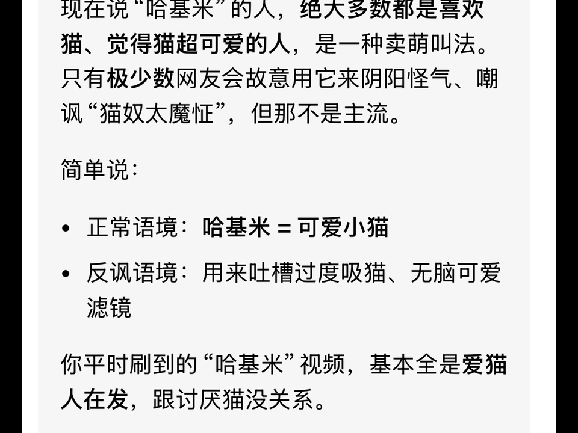 | 343 | 2026-04-09 |
| [哈基米](https://www.bilibili.com/video/BV1HBDsBwEMZ) | 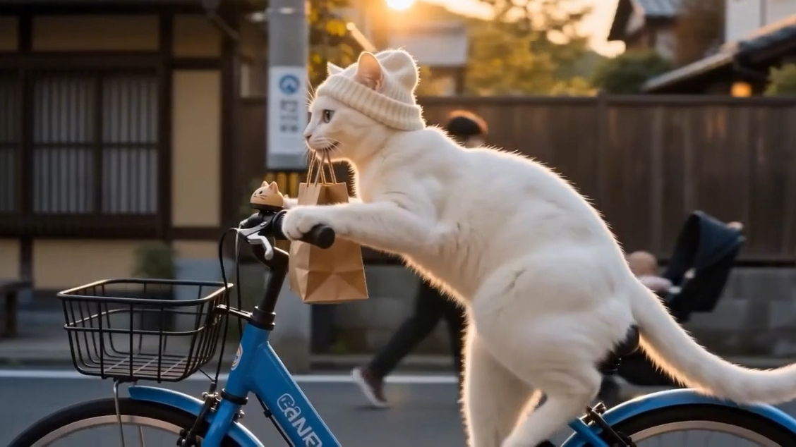 | 54 | 2026-04-09 |
| [你们确定这玩意（哈基米）是玩直伤的？](https://www.bilibili.com/video/BV1B6DsBfEDZ) | 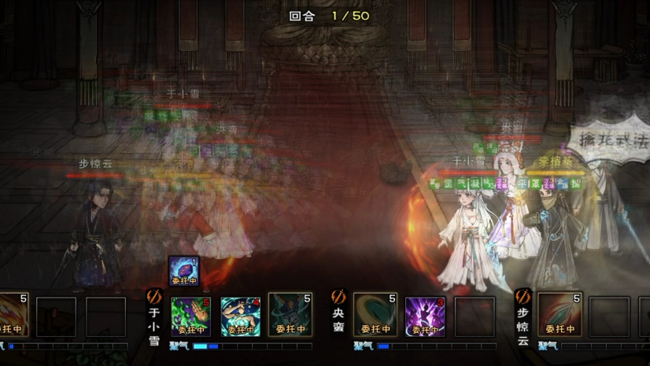 | 514 | 2026-04-09 |
| [【哈基米FM】🐱曼波不是罪过🐱](https://www.bilibili.com/video/BV1n9DHBWEgd) |  | 9626 | 2026-04-09 |
| [哈基米怎么改的？](https://www.bilibili.com/video/BV1dFDpBEEm2) | 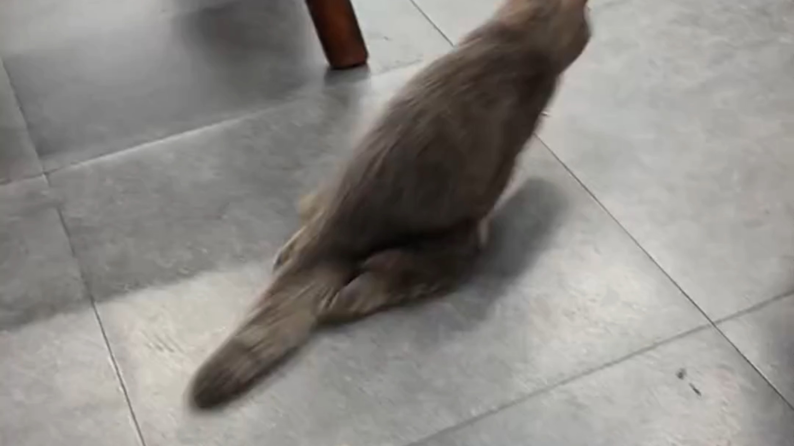 | 283 | 2026-04-09 |
| [《百米自由搏击》](https://www.bilibili.com/video/BV1ktDpBFEQN) |  | 494.3万 | 2026-04-09 |
| [哈基米送别老吴，感人泪下！](https://www.bilibili.com/video/BV1agDpBkExc) | 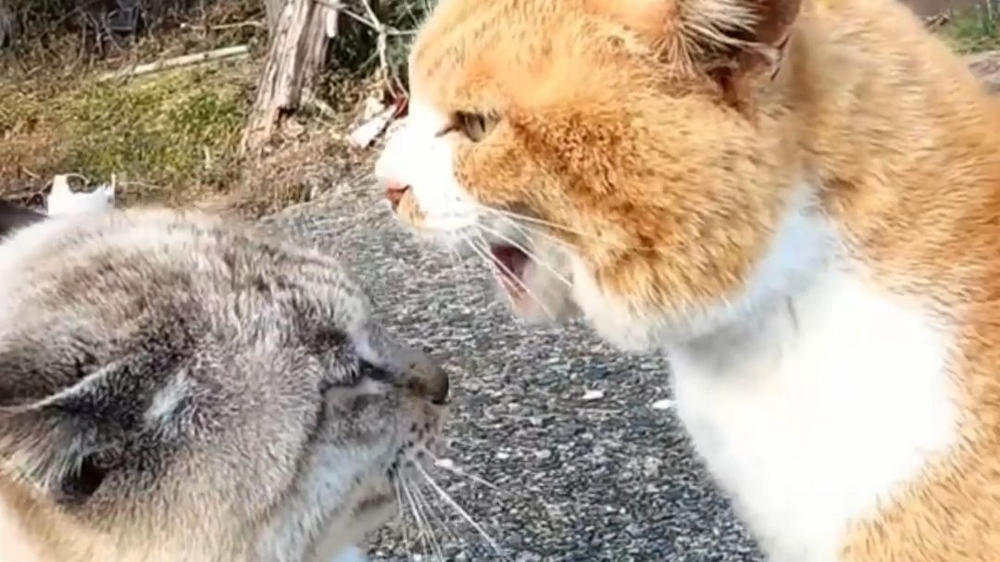 | 2064 | 2026-04-09 |
| [当家里的哈基米对你哈气怎么办](https://www.bilibili.com/video/BV1ggDpBkEoy) | 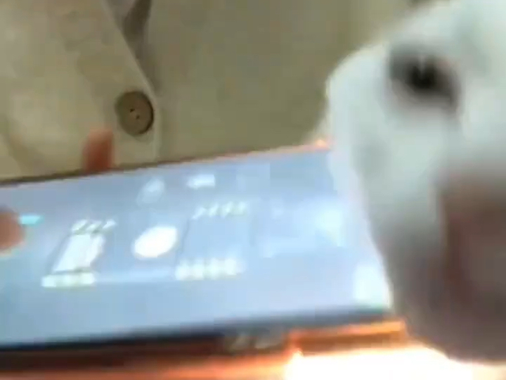 | 2764 | 2026-04-09 |
| [哈基米第二届神人杯宣传视频](https://www.bilibili.com/video/BV1mjDpBqERV) |  | 5945 | 2026-04-09 |
| [前卫基米 我不想像你们那样 重置版](https://www.bilibili.com/video/BV1aDDpB5EYn) |  | 322 | 2026-04-09 |
| [哈基米莫名哈气了](https://www.bilibili.com/video/BV1fBDpBpEet) |  | 351 | 2026-04-09 |
| [乖猫tv之霸王龙哈基米🦖](https://www.bilibili.com/video/BV1WuDWBwE3n) |  | 50 | 2026-04-09 |
| [消失的哈基米，触发方式未知](https://www.bilibili.com/video/BV1tFDWBMEFR) |  | 89 | 2026-04-09 |
| [后攻闪灵otk七音哈基米新手突破实战教学第十七弹，对手最唐的一集](https://www.bilibili.com/video/BV1tcDWBqEEa) | 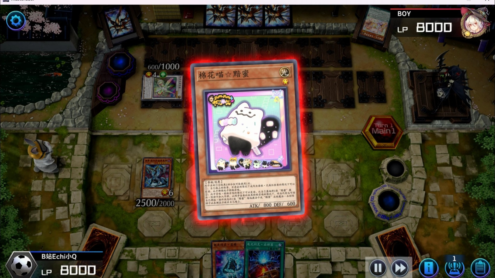 | 27 | 2026-04-09 |
| [每天都要撸撸撸的哈基米～](https://www.bilibili.com/video/BV11LDnB8E2z) | 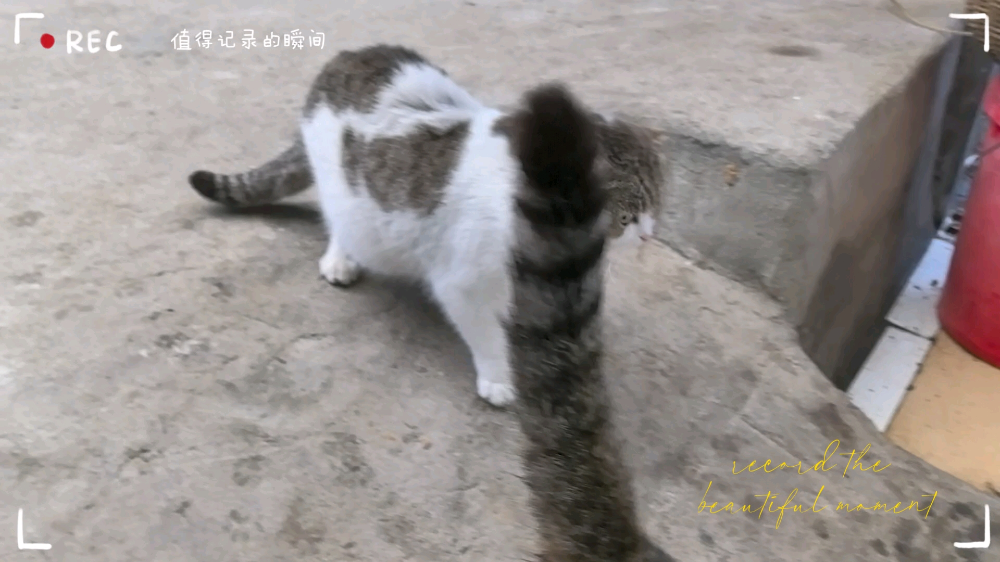 | 0 | 2026-04-09 |
| [【哈基米FM】灾变先驱者：哈气程序](https://www.bilibili.com/video/BV17TD7BuE2i) | 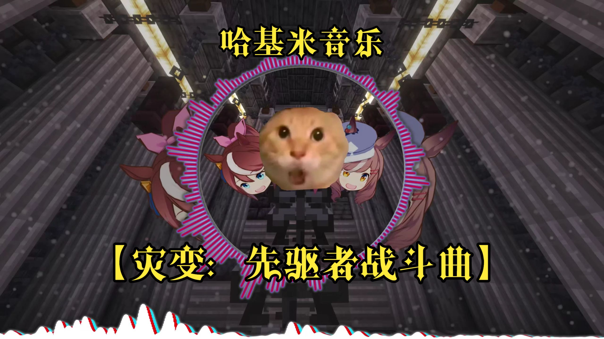 | 544 | 2026-04-09 |
| [洛克王国4月9日星辰塔第八层威压：双方每5回合重置正负面强化。毒王碧水打法，战斗暴龙兽打法，哈基米打法，玛瑙战车打法](https://www.bilibili.com/video/BV1sADHBtEJ3) |  | 2835 | 2026-04-08 |
| [召唤哈基米的猫草小鱼饼干磨牙排毛肥腮腮](https://www.bilibili.com/video/BV1geDHBTEGu) | 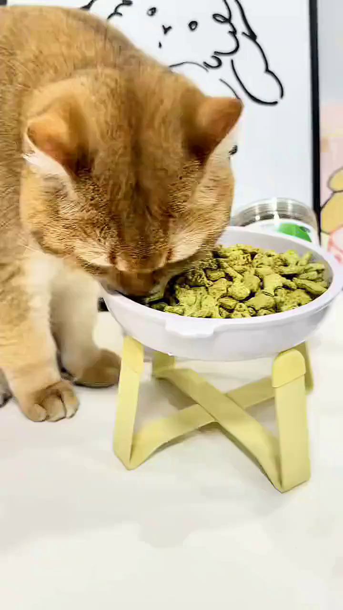 | 0 | 2026-04-08 |
| [哈基米你怎么做的地图](https://www.bilibili.com/video/BV1wADJBDEPC) | 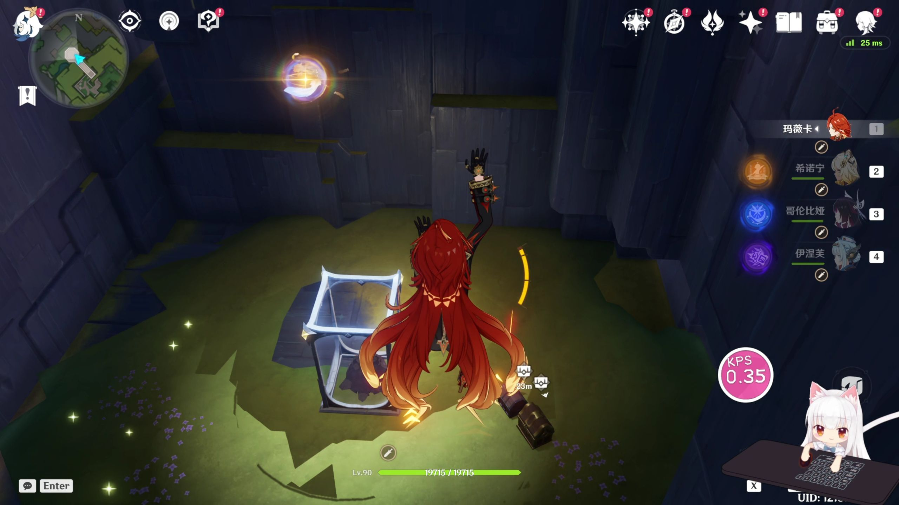 | 314 | 2026-04-08 |
| [⚡饭 钱 我 有⚡](https://www.bilibili.com/video/BV1KBDJBdE54) | 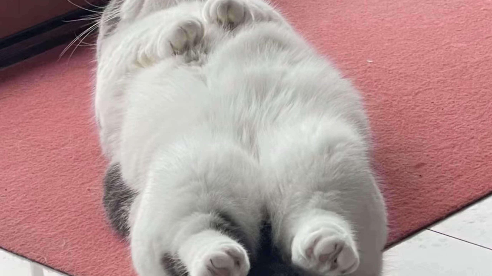 | 5.6万 | 2026-04-08 |
| [耄耋VS孙笑川](https://www.bilibili.com/video/BV1MtD7BREZK) |  | 586 | 2026-04-08 |
| [哈基米回家了](https://www.bilibili.com/video/BV1MXDrBdEaZ) | 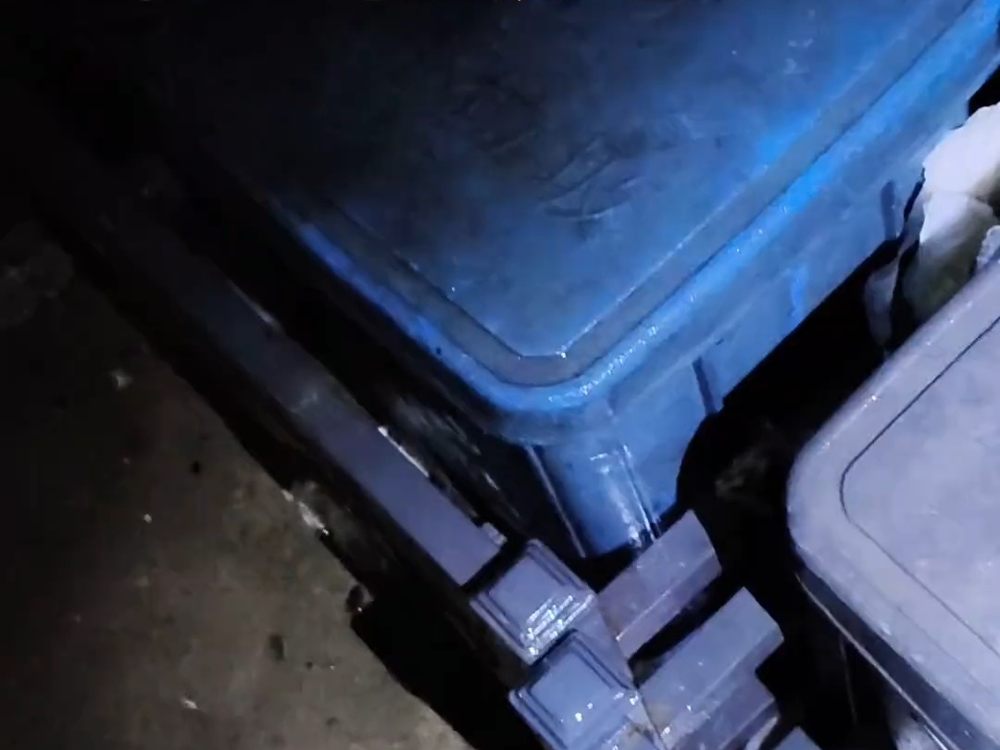 | 2780 | 2026-04-08 |
| [哈基偶觉得手机里有坏人！！](https://www.bilibili.com/video/BV1UnDiBGE4H) |  | 2110 | 2026-04-08 |
| [收留“落魄小少爷”的第9天](https://www.bilibili.com/video/BV1HBDBBBEu2) | 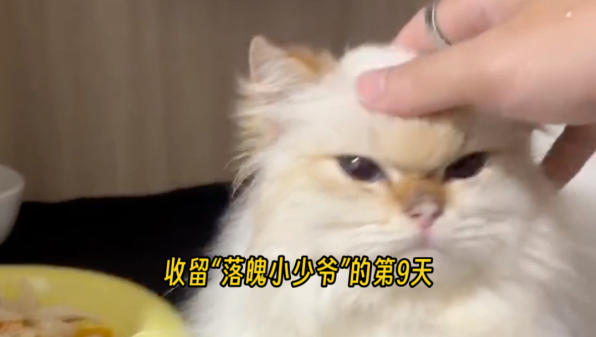 | 8.4万 | 2026-04-08 |
| [耄血馒头这一块，火速开播挣百万这一块](https://www.bilibili.com/video/BV1kcD6BrEaE) | 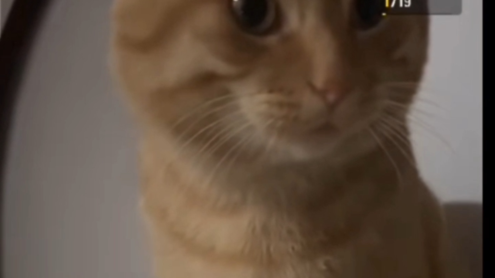 | 15.8万 | 2026-04-07 |
| [教猫咪滑滑梯，没想到它玩上瘾了](https://www.bilibili.com/video/BV1e3DiBEE7b) | 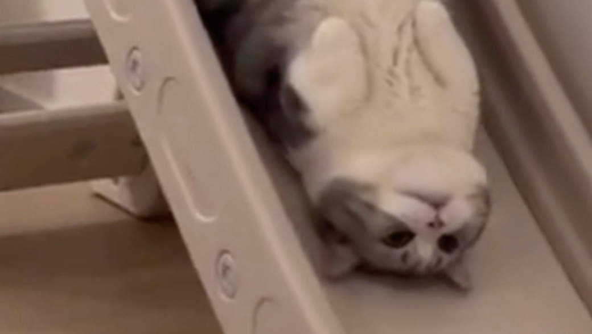 | 3.1万 | 2026-04-07 |
| [哈基米哟南北绿豆](https://www.bilibili.com/video/BV18vDYBKEif) |  | 13.2万 | 2026-04-07 |
| [测试招募 Mouse团娜娜魔改 代号；哈基米](https://www.bilibili.com/video/BV1AcSoBXEHZ) |  | 3521 | 2026-04-06 |
| [哈基米倒在了3月版本，接下来登场的是漂泊小南(•̀へ•́╮)](https://www.bilibili.com/video/BV1FdSQB6EZU) |  | 3870 | 2026-04-05 |
| [猫崽复仇大作战：直升机救援被霸凌的猫妈！🚁🐱💥](https://www.bilibili.com/video/BV1RrSUBpEL8) |  | 5186 | 2026-04-05 |
| [老艺术家还在坚持手搓](https://www.bilibili.com/video/BV1tiDgBKEHS) |  | 27.7万 | 2026-04-05 |
| [蛋仔派对：高画质下的哈基米毛绒感好真实](https://www.bilibili.com/video/BV1dYDTB6E8R) |  | 5900 | 2026-04-04 |
| [为什么不选“哈基米的复仇”](https://www.bilibili.com/video/BV1EJ9gBZExy) |  | 3.1万 | 2026-04-04 |
| [这一次，我们重新定义蜂蜜水！Hachimi OS正式更新！](https://www.bilibili.com/video/BV1Lk9TBjEE5) |  | 27.5万 | 2026-04-03 |
| [基米小学：春天是适合栽种的季节](https://www.bilibili.com/video/BV1RD9FBdE5h) |  | 2.4万 | 2026-04-02 |
| [老亚洲母系与哈基米立体度对比，差距很绝望](https://www.bilibili.com/video/BV1xg95BnEta) | 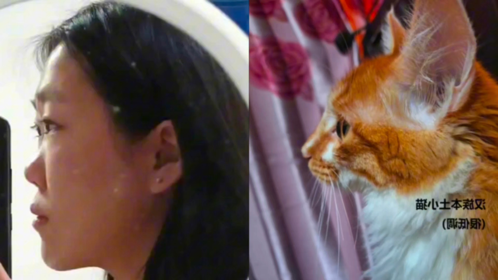 | 3140 | 2026-03-31 |
| [哈基米难被驴逗～](https://www.bilibili.com/video/BV15NXZBSE73) | 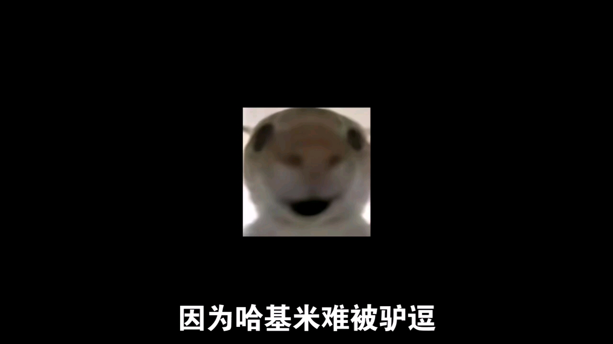 | 153 | 2026-03-30 |
| [【哈基米音乐】肘WOW](https://www.bilibili.com/video/BV1bkXKBYEY8) |  | 3805 | 2026-03-27 |
| [神兵天基](https://www.bilibili.com/video/BV1SCQ1B3Epv) | 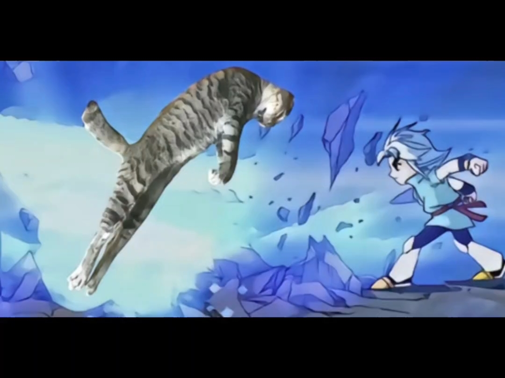 | 10.4万 | 2026-03-25 |
| [哈基米VS布鲁斯](https://www.bilibili.com/video/BV1cyQqBzEyB) |  | 2946 | 2026-03-24 |
| [以防你们不知道，生化危机9的制作名单里有普京与哈基米](https://www.bilibili.com/video/BV1EMNgzxErJ) | 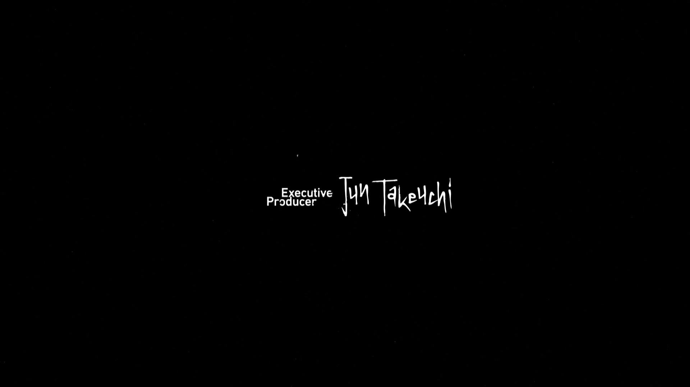 | 1846 | 2026-03-08 |
| [基米tv之能量回收这一块](https://www.bilibili.com/video/BV1j1fHBMEXH) | 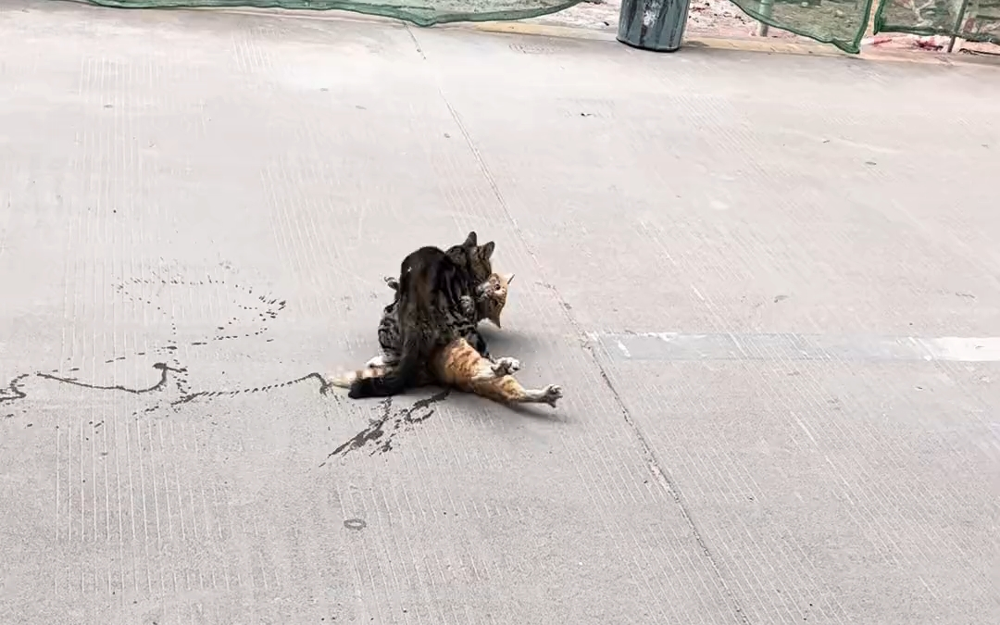 | 1.7万 | 2026-02-21 |
| [哈基米那没路躲的搭配和使用技巧](https://www.bilibili.com/video/BV1XrffBvEku) |  | 2123 | 2026-02-07 |
| [哈基米典中典之底层代码冲突](https://www.bilibili.com/video/BV1HqmJB1EfE) | 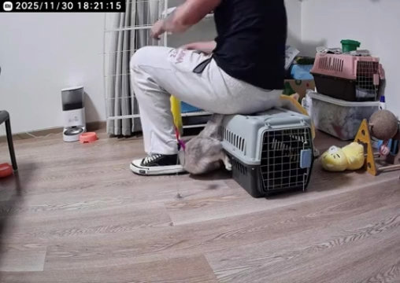 | 4662 | 2025-12-09 |
| [神人丁春秋结束副业街霸开始主业金铲铲，直播间惊现哈基米音乐](https://www.bilibili.com/video/BV1HdnezvEi9) |  | 3.4万 | 2025-09-26 |
| [（补档）还以为殉情只是古老的传说](https://www.bilibili.com/video/BV1dHK8z3EmU) | 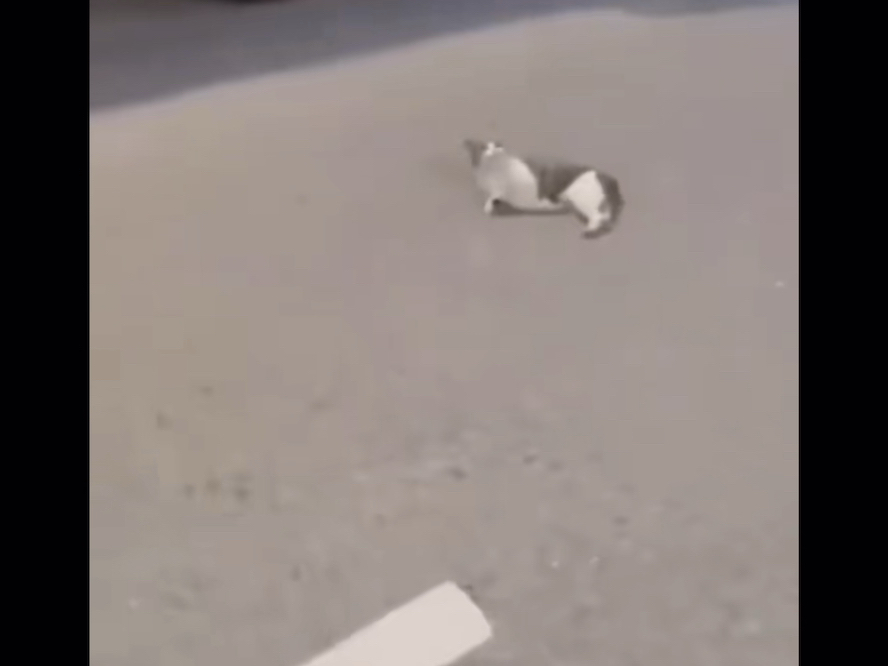 | 20.9万 | 2025-06-23 |
| [哈基米：谐谑曲](https://www.bilibili.com/video/BV1xDEdzhEFg) |  | 27.9万 | 2025-05-19 |
| [你能30秒唱完大石碎基米吗？I can](https://www.bilibili.com/video/BV1ZhQUYqEfX) | 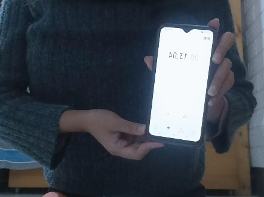 | 22.4万 | 2025-03-15 |
| [⚡曼波の135秒⚡](https://www.bilibili.com/video/BV1rbFiefE7f) |  | 16.0万 | 2025-02-01 |
| [【星引擎】哈基米一回合怒冲boss五次](https://www.bilibili.com/video/BV1WtF7emE7H) |  | 1.1万 | 2025-01-31 |
| [冰封王座之定冻基](https://www.bilibili.com/video/BV1Ah6NYbEKn) | 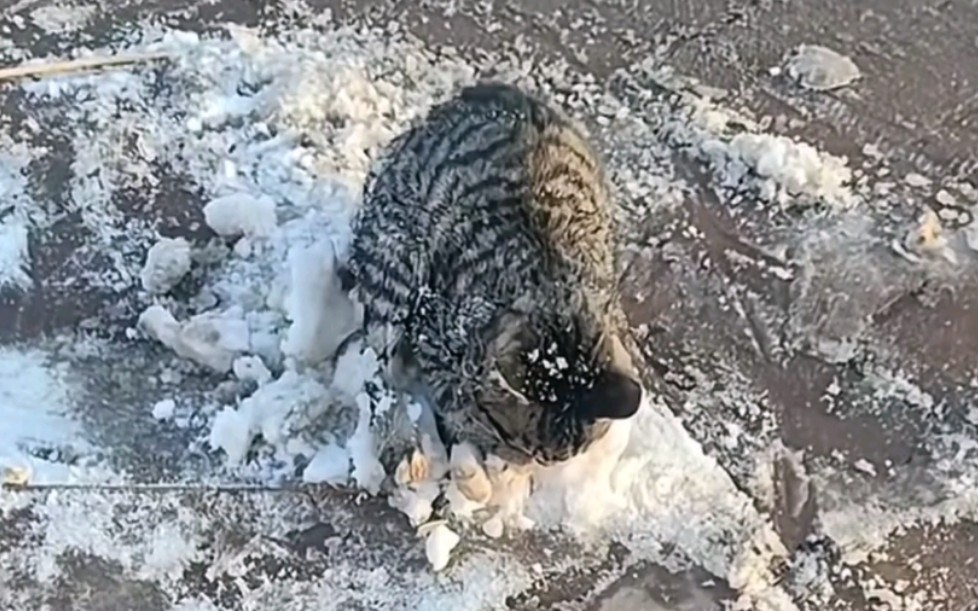 | 34.9万 | 2024-12-02 |
| [哈基米制作展示（纯录屏）](https://www.bilibili.com/video/BV1bYUHY6Ev6) | 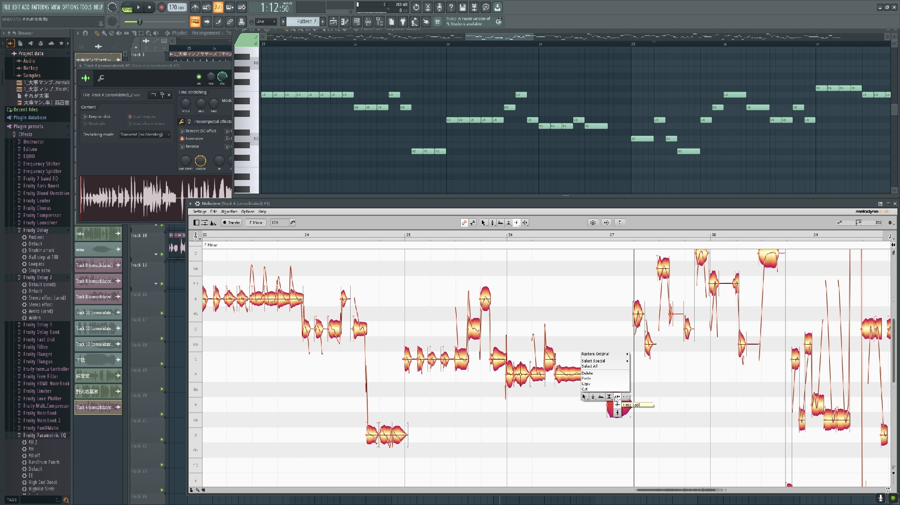 | 1.2万 | 2024-11-18 |
| [114514%的P3R玩家学会哈基米多顿后做的第一件事](https://www.bilibili.com/video/BV1x3UNYDEWW) |  | 4.1万 | 2024-11-13 |

---
*最后更新: 2026-04-10 03:18:44 (自动生成)*
*数据来源: [Bilibili](https://www.bilibili.com)*

## 使用说明

运行以下命令更新视频列表:
```bash
python3 fetch_hajimi_videos.py
```
