# awesome-hajimi
collections of hajimi (哈基米 in Chinese) on the Internet.

## 视频列表 (Video List)

| 视频标题 (Title) | 封面 | 播放量 (Views) | 发布日期 (Date) |
|---|---|---|---|
| [一只又脏又丑又会哈气，还会棘背龙形态的小小哈基米啊！我只看到了一颗任意球](https://www.bilibili.com/video/BV14FDWBMEYg) | 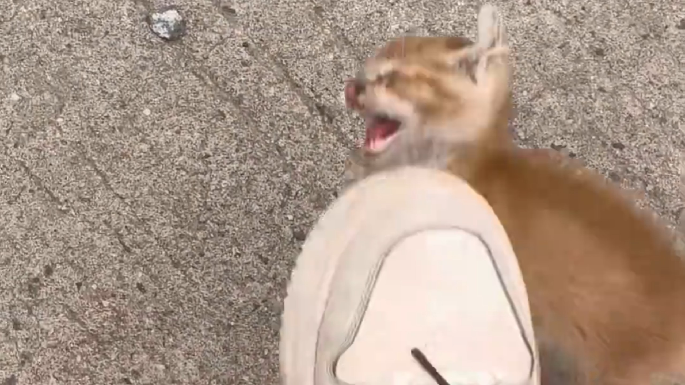 | 526 | 2026-04-09 |
| [收留“落魄小少爷”的第10天](https://www.bilibili.com/video/BV17MD7BBEtL) | 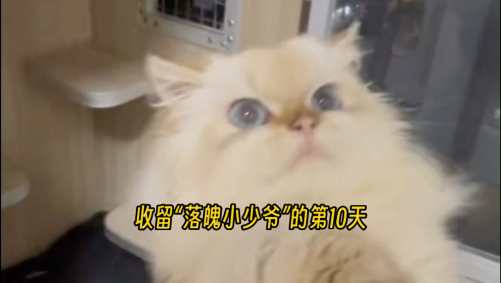 | 1.7万 | 2026-04-09 |
| [哈基米这个卡墙](https://www.bilibili.com/video/BV1a2DnBuELh) | 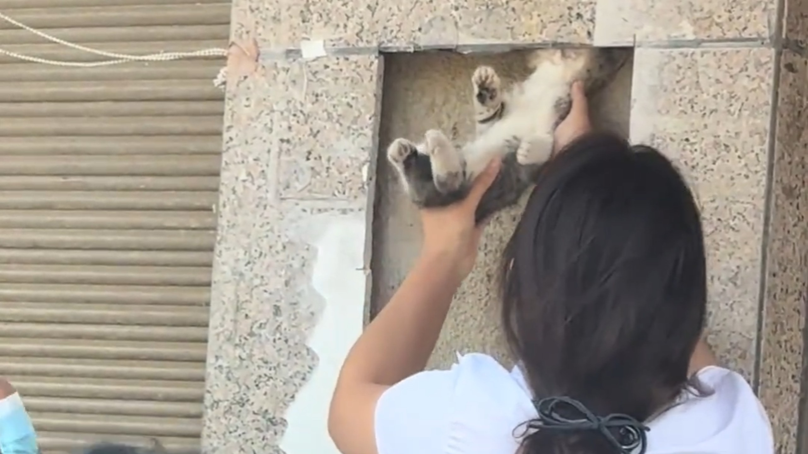 | 590 | 2026-04-08 |
| [这 诗 猫 啊 ？ ？ ？](https://www.bilibili.com/video/BV1zhDnBJEb8) | 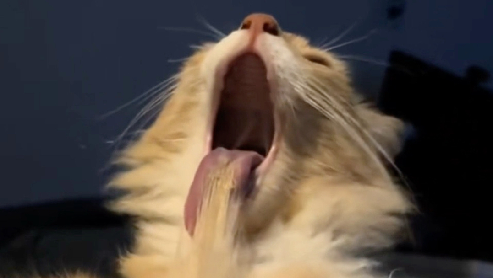 | 1204 | 2026-04-08 |
| [嘻嘻，我一定要活下来口牙](https://www.bilibili.com/video/BV1nmDJBSENV) | 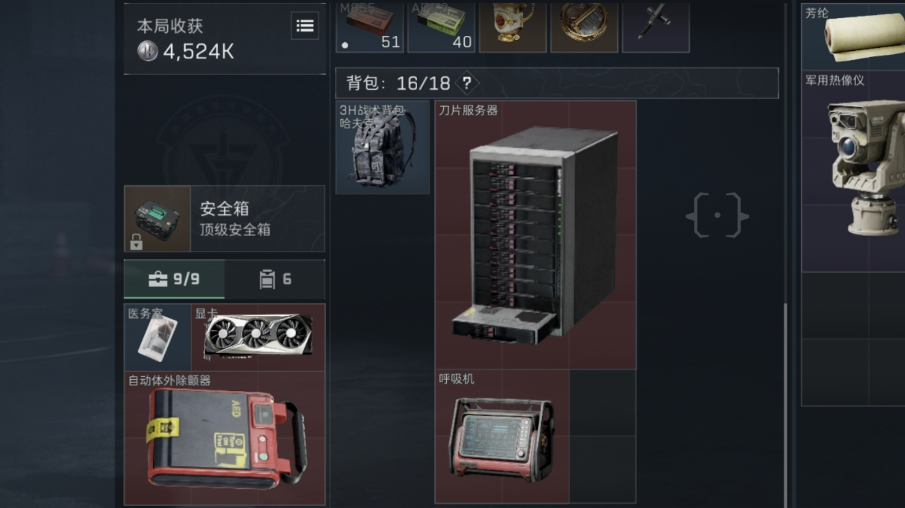 | 266 | 2026-04-08 |
| [绝了！这一刻哈基米音乐和曼波AI机器狗灵魂附体｜让曼波表情转起来](https://www.bilibili.com/video/BV1MsD7BoEhj) | 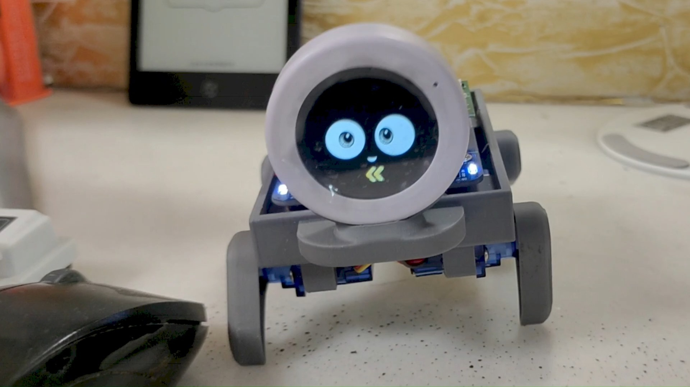 | 1103 | 2026-04-08 |
| [搓搓小狗头](https://www.bilibili.com/video/BV1xeD7BDEiL) | 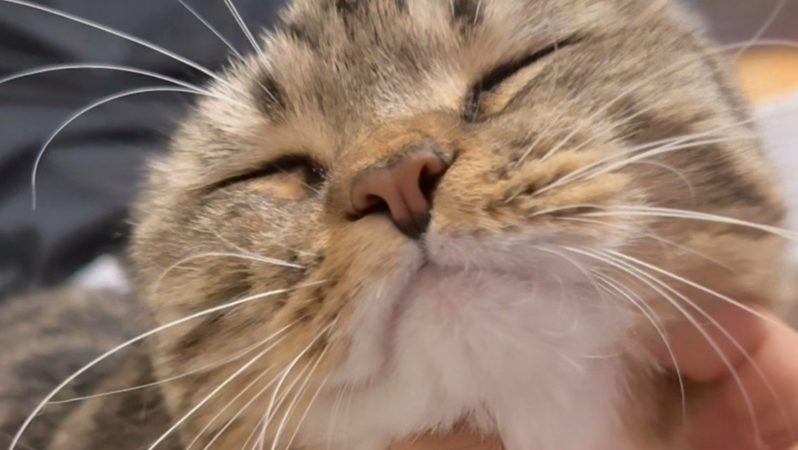 | 1670 | 2026-04-08 |
| [🐱基米我总是一个人🐱](https://www.bilibili.com/video/BV155D7BeEuJ) | 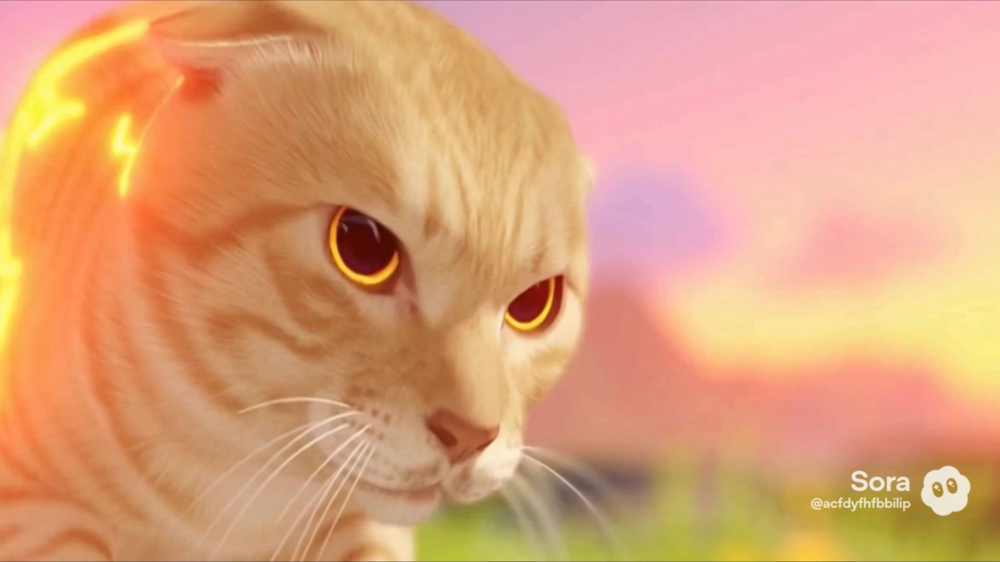 | 726 | 2026-04-08 |
| [哈基米](https://www.bilibili.com/video/BV1iVD7BNEeM) |  | 79 | 2026-04-08 |
| [【b猫日记】你的哈基米心机太重。天天欺负弱智猫](https://www.bilibili.com/video/BV15dD7BiEVC) | 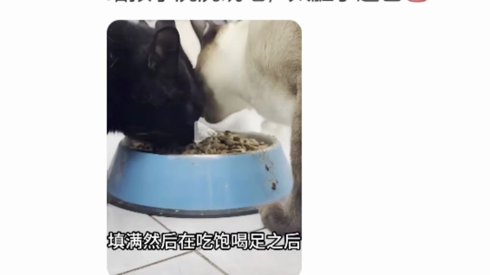 | 1.5万 | 2026-04-08 |
| [小基米勇斗老虎！](https://www.bilibili.com/video/BV1A6D7B2EKs) | 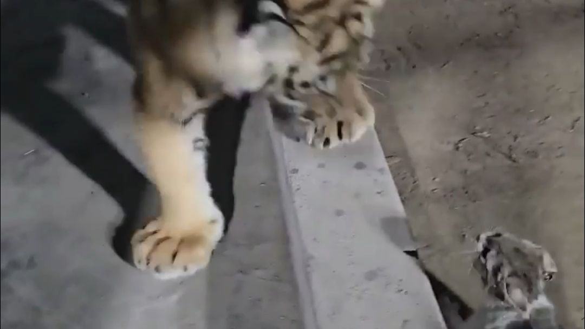 | 695 | 2026-04-08 |
| [跳楼基](https://www.bilibili.com/video/BV12GDEB9EPq) |  | 409 | 2026-04-08 |
| [基米进程出现BUG](https://www.bilibili.com/video/BV13wDEBaE3g) | 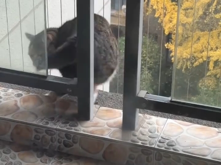 | 420 | 2026-04-08 |
| [你以为猫趴在窗边是发呆？它看的是自己一辈子都去不了的世界](https://www.bilibili.com/video/BV1UKDEBZErT) |  | 1188 | 2026-04-08 |
| [救命！这狞猫吃个饭还哈气奶凶超呆萌](https://www.bilibili.com/video/BV1w8XZBYE1n) | 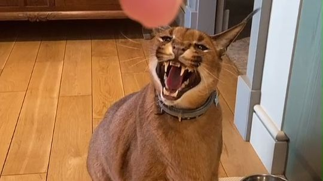 | 1349 | 2026-04-08 |
| [热爱跑步机运动的哈基米](https://www.bilibili.com/video/BV1KbDLBjEWG) | 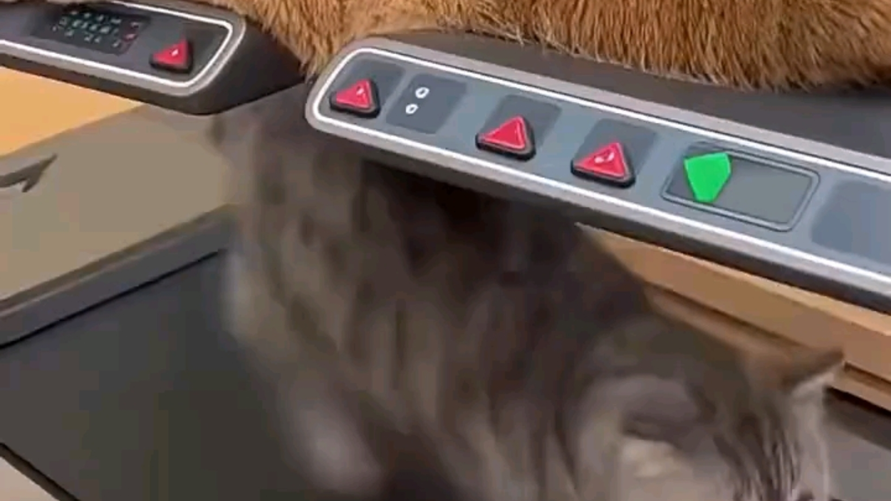 | 576 | 2026-04-08 |
| [耄耋喝豆汁【哈基动物园257期】](https://www.bilibili.com/video/BV1VVDLB4E2Y) | 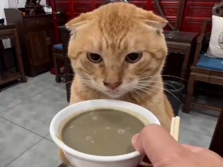 | 7262 | 2026-04-08 |
| [攀爬一千米高楼去上班！](https://www.bilibili.com/video/BV1LgDLBbEtd) |  | 1699 | 2026-04-08 |
| [千万别养奶牛猫](https://www.bilibili.com/video/BV1vgDLBbE8p) | 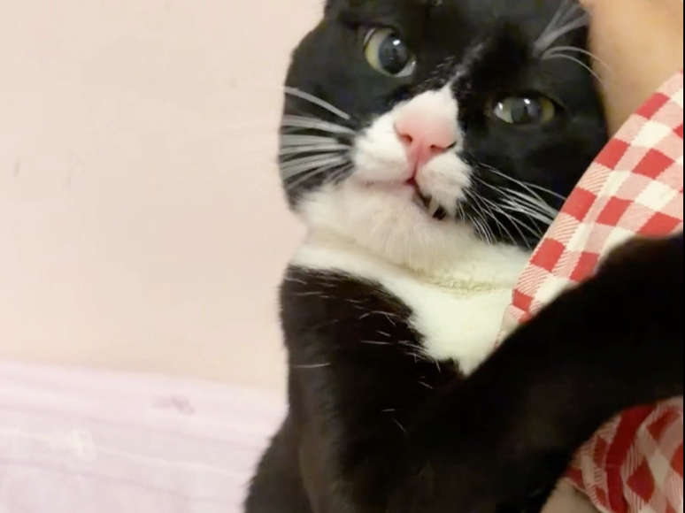 | 9527 | 2026-04-08 |
| [训5](https://www.bilibili.com/video/BV1LUDLBYEUe) | 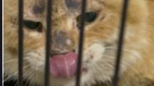 | 3645 | 2026-04-08 |
| [【哈基米】有明/Ariake](https://www.bilibili.com/video/BV1ZmDLBAEEu) | 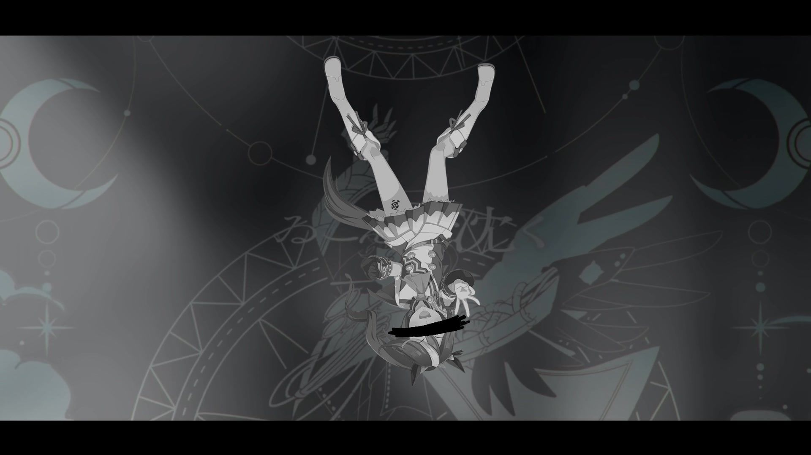 | 233 | 2026-04-08 |
| [干嘛猫和香蕉猫meme海南之旅及岛上“探险”vlog（海南太好玩太美了，咪希望能给人带来快乐）](https://www.bilibili.com/video/BV1MMDrBdE9o) |  | 2.5万 | 2026-04-08 |
| [哈基汪TV之依旧犟种柯基，依旧心肺复苏](https://www.bilibili.com/video/BV1nkDLBqE3x) | 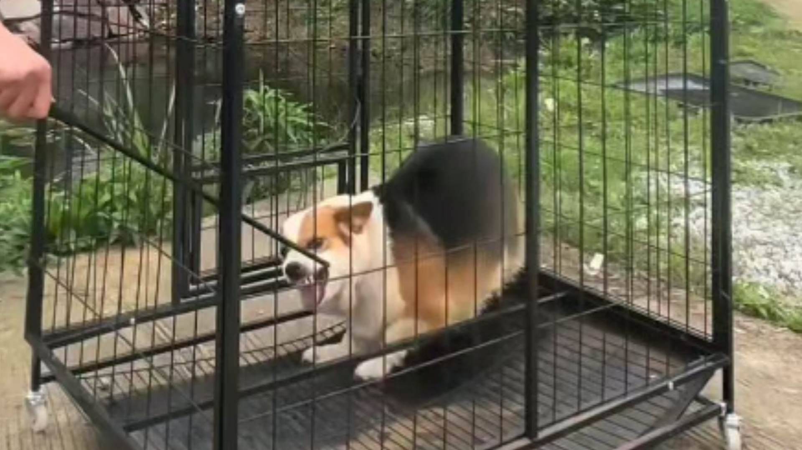 | 9375 | 2026-04-08 |
| [大过年太难驯了 给你们看点废片吧](https://www.bilibili.com/video/BV1nzDLBzExE) | 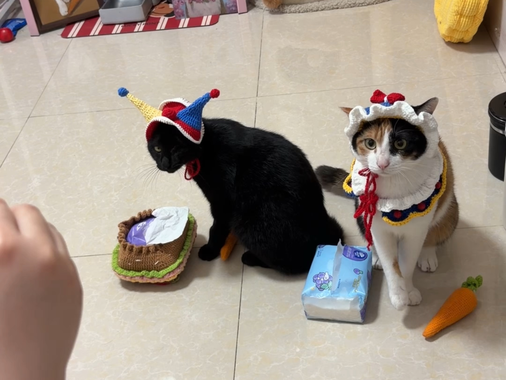 | 9.8万 | 2026-04-08 |
| [哈基米武汉旅游Vlog](https://www.bilibili.com/video/BV1nrDLBMEbT) |  | 402 | 2026-04-08 |
| [极限拉扯！橘园流浪猫绝育抓捕大作战（中）](https://www.bilibili.com/video/BV178DjBvEjp) | 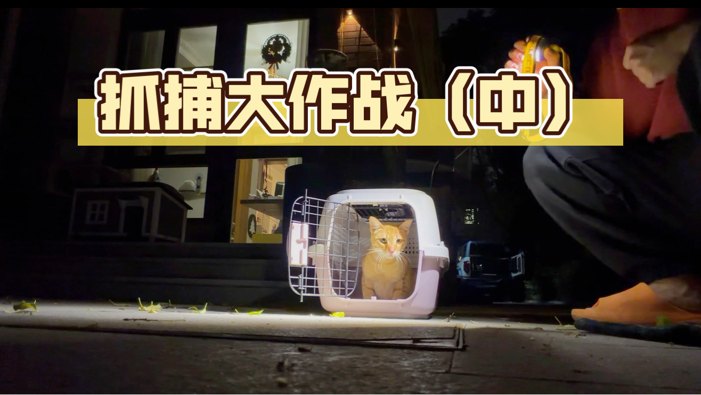 | 5992 | 2026-04-08 |
| [“这辈子……没见过这么犟的小猫！”](https://www.bilibili.com/video/BV1C5DjByEE8) | 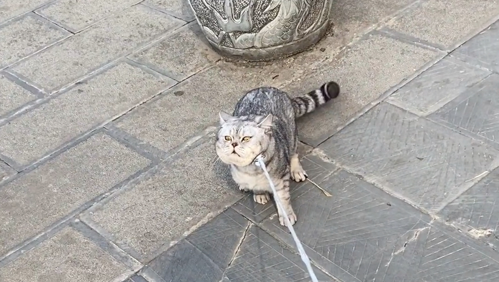 | 5.4万 | 2026-04-08 |
| [基米TV:哈基米开启自毁模式](https://www.bilibili.com/video/BV1UwDjBXEQb) | 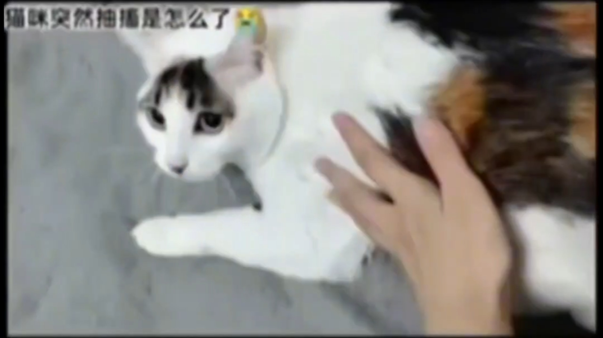 | 1708 | 2026-04-08 |
| [哈基米营业的第54天:打手给板板单局摸了三幻神？？？](https://www.bilibili.com/video/BV1mTDjBJEk7) |  | 1209 | 2026-04-08 |
| [怎么当美国总统？【基米大科普】](https://www.bilibili.com/video/BV1NRD8BREo8) |  | 3.4万 | 2026-04-08 |
| [鼠鼠美味循环小曲《哈基米：花田》8D环绕版](https://www.bilibili.com/video/BV1GcDrBhEH6) | 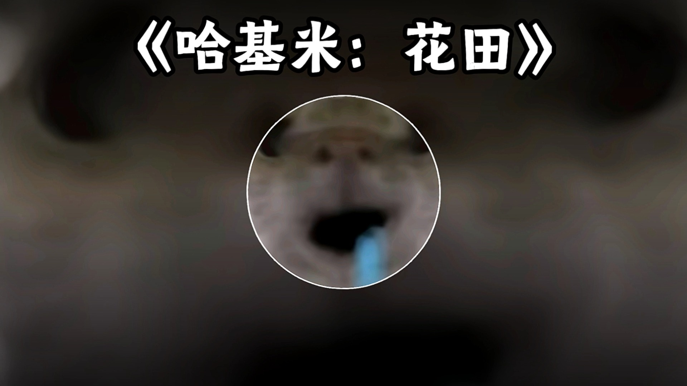 | 166 | 2026-04-08 |
| [哈基米这个喜欢游泳](https://www.bilibili.com/video/BV1G6DjBZEbS) | 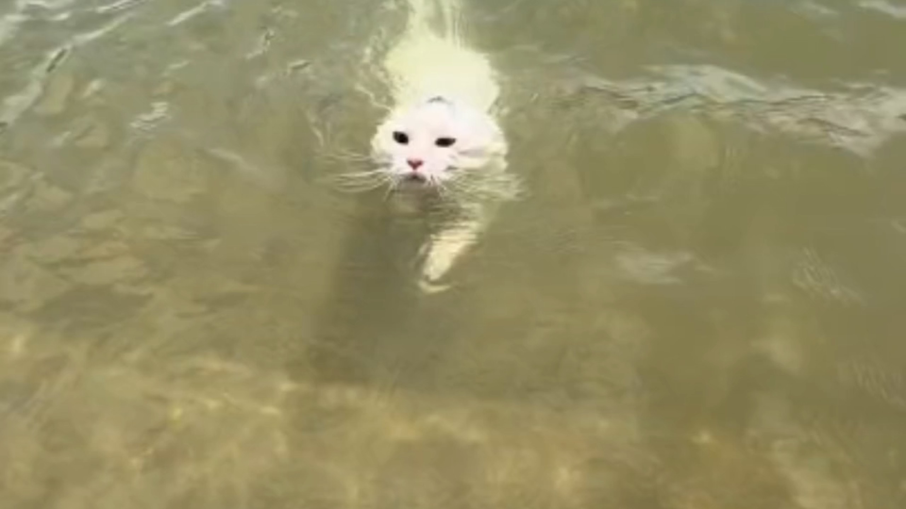 | 1.2万 | 2026-04-08 |
| [猫：像我这样把爪子收回去](https://www.bilibili.com/video/BV1v8DjBeEXC) | 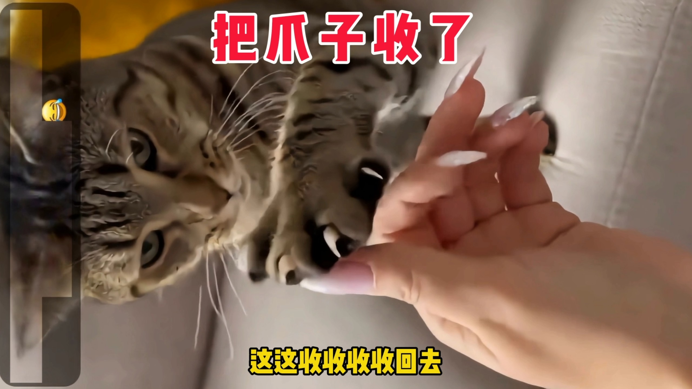 | 1.3万 | 2026-04-08 |
| [哈气小猫合集2](https://www.bilibili.com/video/BV13PDrBbEZY) | 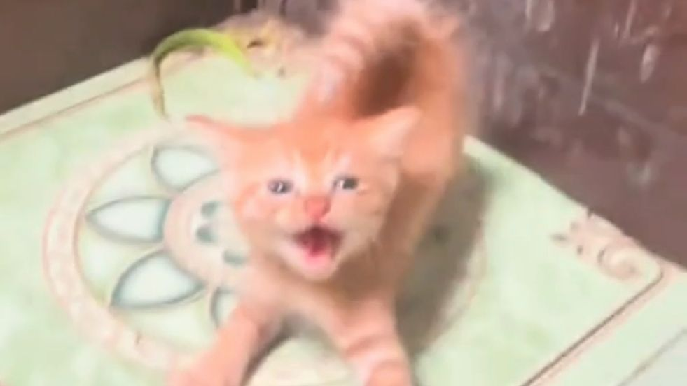 | 4696 | 2026-04-08 |
| [同样的剧本上演两次了 哈基米没了](https://www.bilibili.com/video/BV1MSDrBZEKJ) | 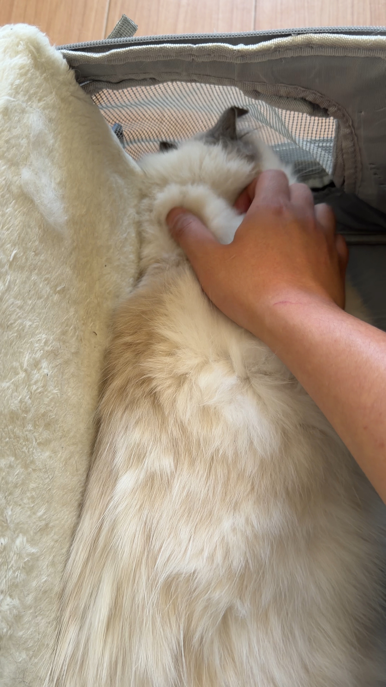 | 2.7万 | 2026-04-08 |
| [给基米们补习历史课](https://www.bilibili.com/video/BV1kSDvBYEX2) | 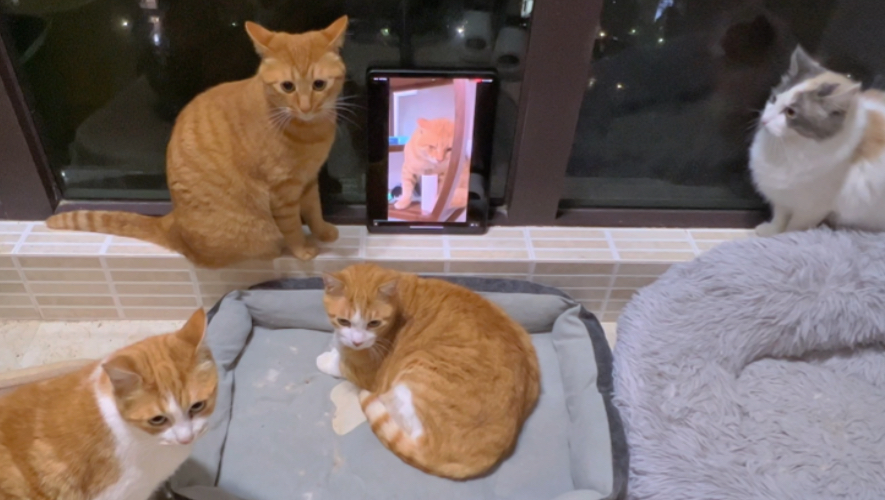 | 1.8万 | 2026-04-08 |
| [Sugar crash! 但是不止哈基米](https://www.bilibili.com/video/BV1YQDeBVENV) |  | 2271 | 2026-04-08 |
| [【海龟汤】哈基米这一块儿](https://www.bilibili.com/video/BV1vMDiBnEbY) | 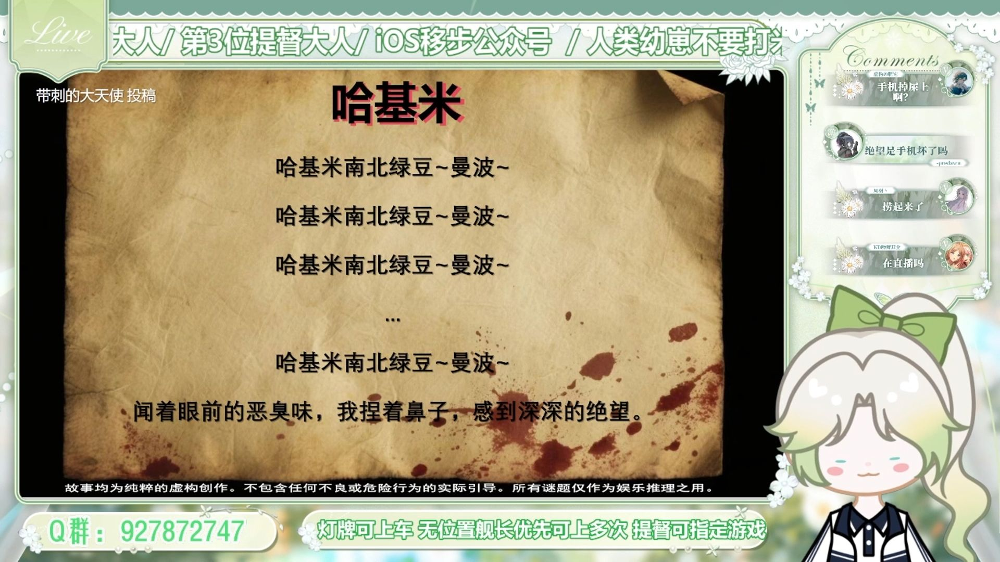 | 503 | 2026-04-08 |
| [哈基米的内心是绝望的，他无能为力](https://www.bilibili.com/video/BV12RDrBWENa) | 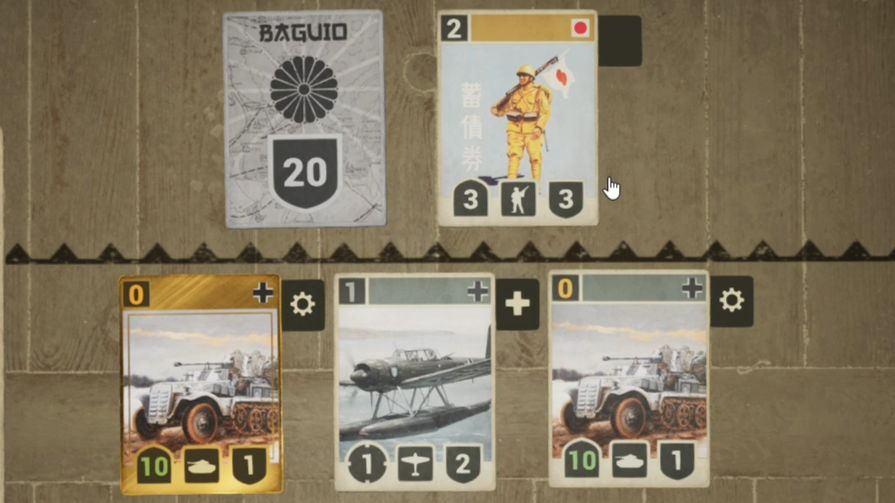 | 557 | 2026-04-08 |
| [挑战麦克雷，没喝醉哦，没啥挑战性，，，，](https://www.bilibili.com/video/BV1NZDrBpEna) | 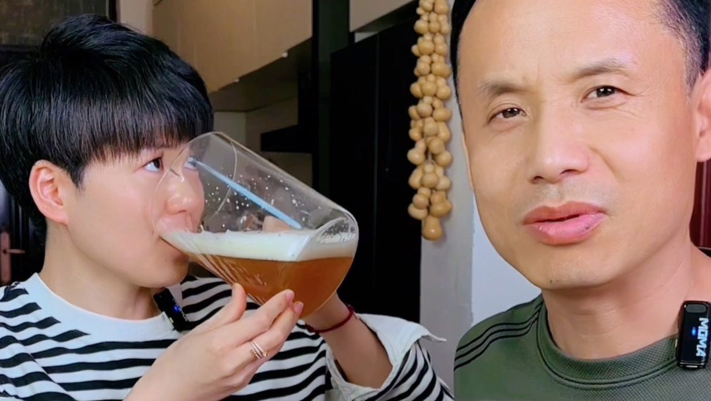 | 6.2万 | 2026-04-08 |
| [给你们10秒投降 要不然](https://www.bilibili.com/video/BV1tcDvBTEeM) | 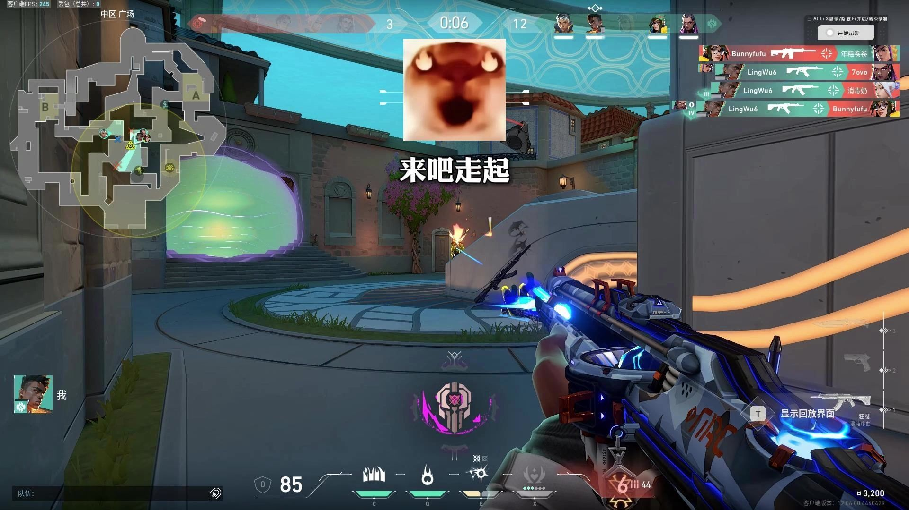 | 4.5万 | 2026-04-08 |
| [哈基米cos孙悟空](https://www.bilibili.com/video/BV1ftDzBPEM4) | 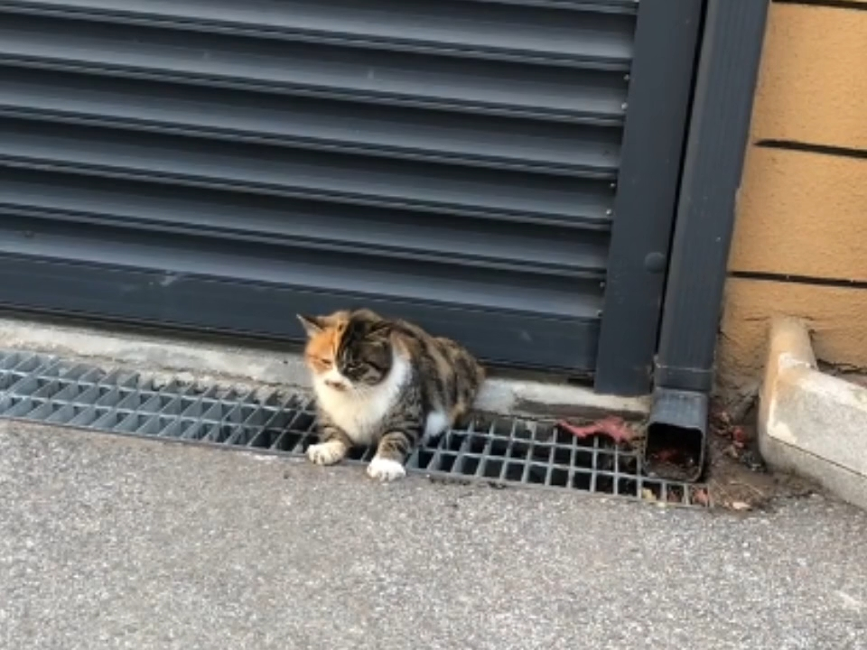 | 2704 | 2026-04-08 |
| [《真没礼猫》](https://www.bilibili.com/video/BV1tJDeBNEDv) | 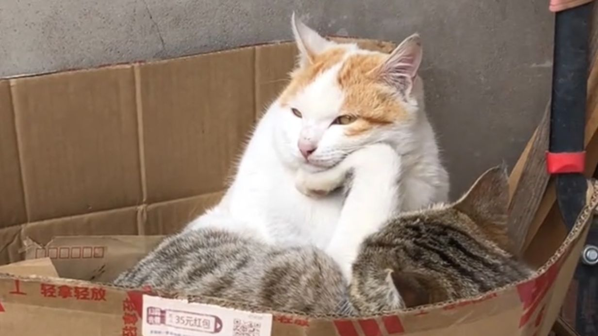 | 8.8万 | 2026-04-08 |
| [【哈基米音乐】威廉基堡（洛克王国：威廉古堡）](https://www.bilibili.com/video/BV13oDBBxESq) |  | 2330 | 2026-04-07 |
| [哈基米疑似找到了回喵星的飞船](https://www.bilibili.com/video/BV16RDvBFEmw) | 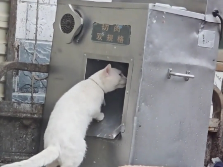 | 2.3万 | 2026-04-07 |
| [41度高温来了：今年高温已破纪录还要扩大，暴雨北上四号台风即将生成](https://www.bilibili.com/video/BV1J6DiBbEth) |  | 57.2万 | 2026-04-07 |
| [麻麻残忍地关上了门](https://www.bilibili.com/video/BV1MADqBCE1s) | 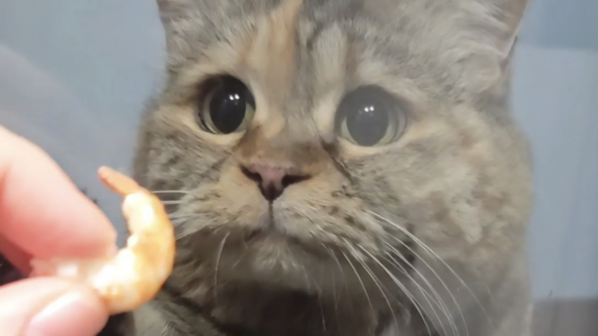 | 12.0万 | 2026-04-07 |
| [有的猫洗着洗着就变液体了....](https://www.bilibili.com/video/BV1sWDeBaEGt) | 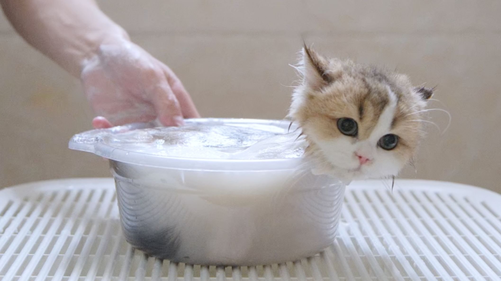 | 5.0万 | 2026-04-07 |
| [4月7日热点快刷，量大管饱](https://www.bilibili.com/video/BV1B6DeBDEMU) |  | 16.0万 | 2026-04-07 |
| [哈基米，因为洗澡咬人被关进笼子里洗](https://www.bilibili.com/video/BV1mwDvBiEuE) |  | 2.9万 | 2026-04-07 |
| [大橘哥124-上](https://www.bilibili.com/video/BV1t6DvB6EGz) | 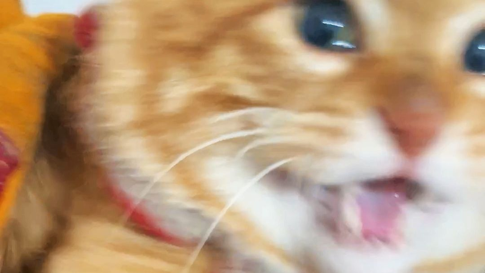 | 8.9万 | 2026-04-07 |
| [【智人TV】史上第一个被恐龙咬的人出现了](https://www.bilibili.com/video/BV1cKDhB7EG7) | 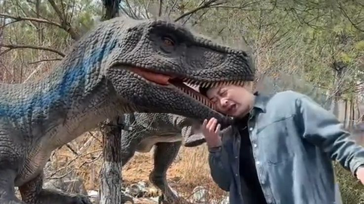 | 12.6万 | 2026-04-07 |
| [咪咪都死了，你怎么笑的出来的？](https://www.bilibili.com/video/BV1jzDaBCEVw) | 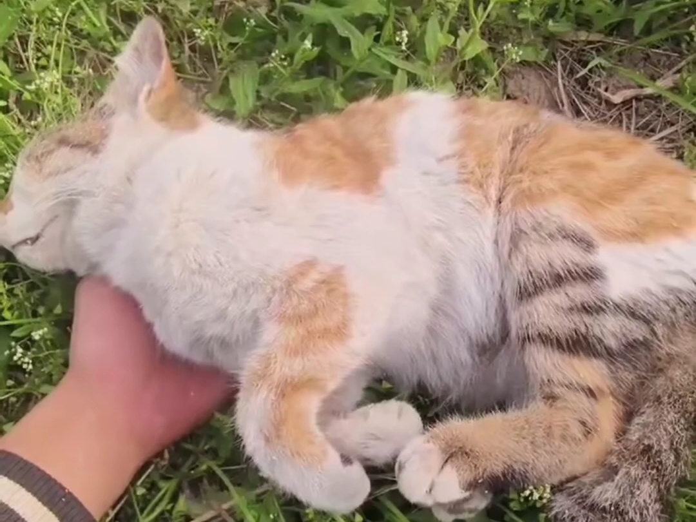 | 2.0万 | 2026-04-07 |
| [小ber娄给小猫熏哭了😂](https://www.bilibili.com/video/BV1n3DYBQEqY) | 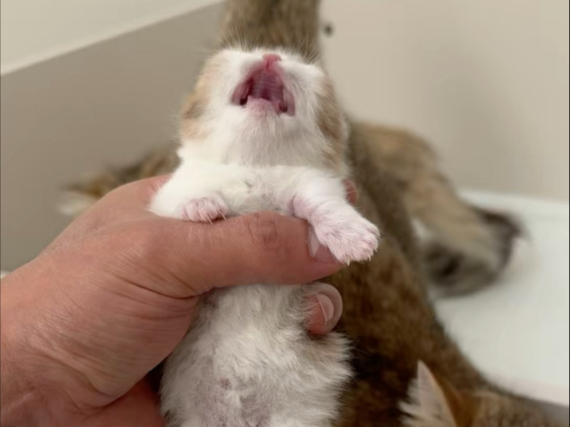 | 5.5万 | 2026-04-07 |
| [《我的刀盾入侵》第九集](https://www.bilibili.com/video/BV175DYBSEXm) |  | 264.5万 | 2026-04-07 |
| [两只小摔炮真可爱](https://www.bilibili.com/video/BV1exDYBgE5v) | 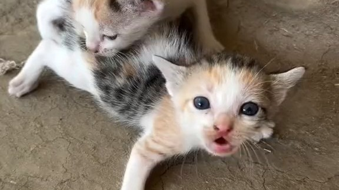 | 499 | 2026-04-07 |
| [总有些奇奇怪怪的小癖好](https://www.bilibili.com/video/BV1KfDFB6EmN) | 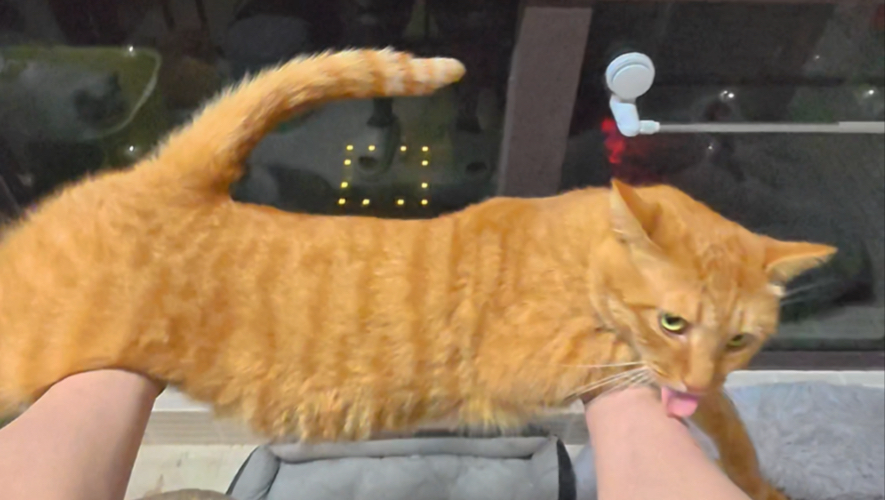 | 8552 | 2026-04-07 |
| [哈基米这个战斗爽](https://www.bilibili.com/video/BV1MYDhBfEXF) | 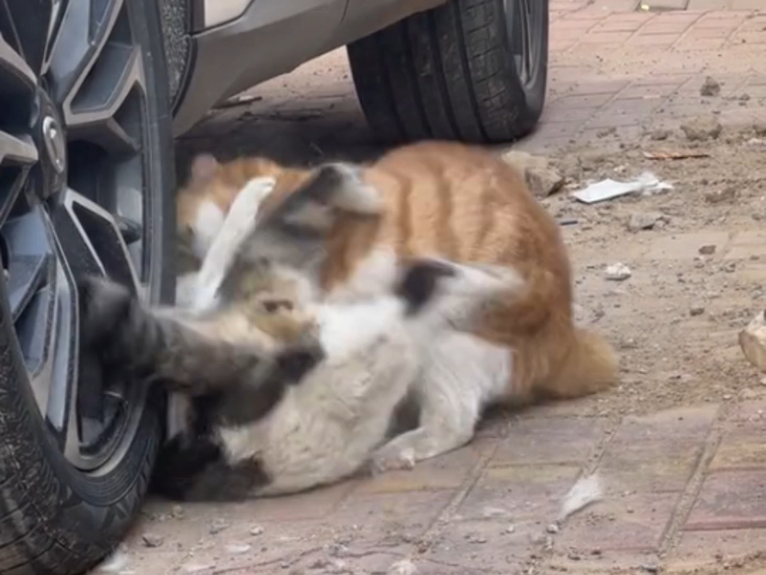 | 1.5万 | 2026-04-07 |
| [出了个哈气词条的哈基米](https://www.bilibili.com/video/BV1VsDhBNEVY) | 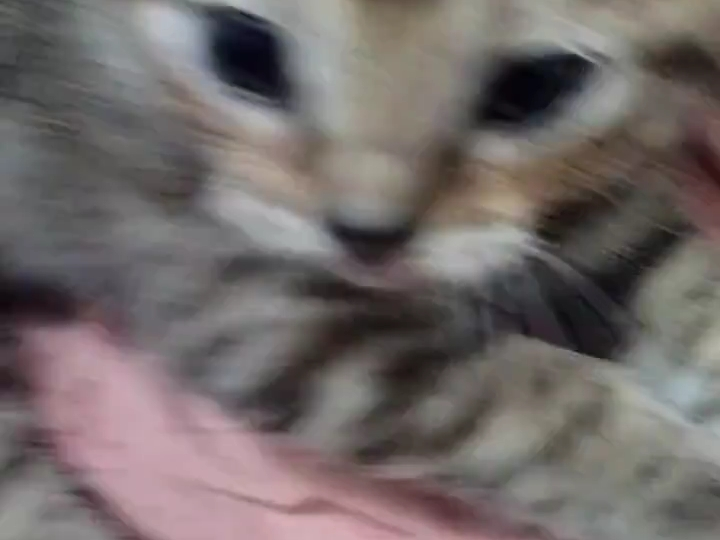 | 33.7万 | 2026-04-07 |
| [剑人TV#22 骗我爸说姐姐晚上带了一群黑人回家😭](https://www.bilibili.com/video/BV1D4SfBkEDT) |  | 23.6万 | 2026-04-06 |
| [你长得这么漂亮，为什么要骂人呢！](https://www.bilibili.com/video/BV1yzSoBdEiU) | 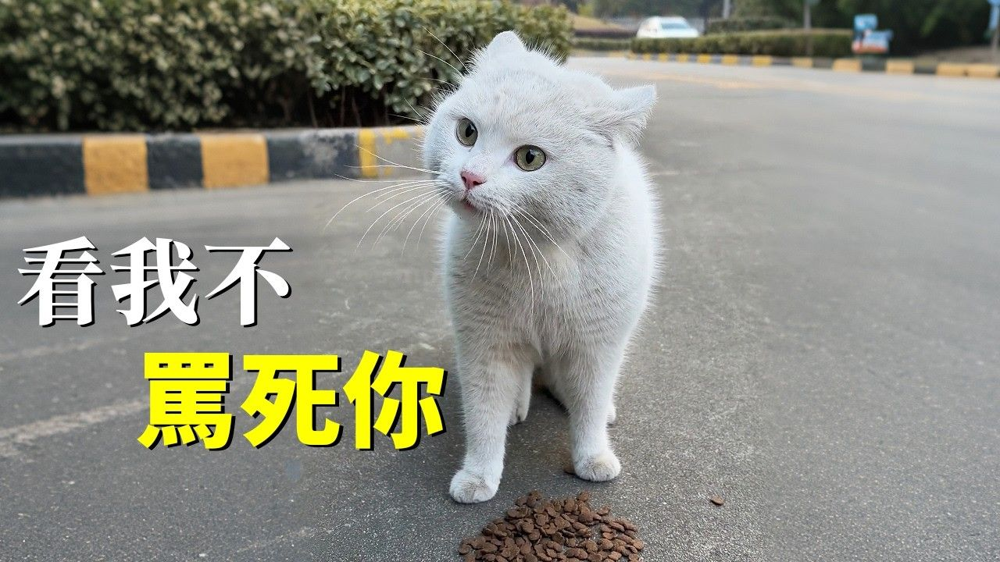 | 8.3万 | 2026-04-06 |
| [这鹦鹉的嘴松的跟棉裤腰子似的](https://www.bilibili.com/video/BV1WySfBwEfY) |  | 30.0万 | 2026-04-06 |
| [【梗百科】唐毒蛇是啥？用毒蛇的毒毒毒蛇！](https://www.bilibili.com/video/BV19NDFB2Ei2) |  | 29.2万 | 2026-04-06 |
| [天台上的富家女，树上的黄毛](https://www.bilibili.com/video/BV1StSoBPE5o) | 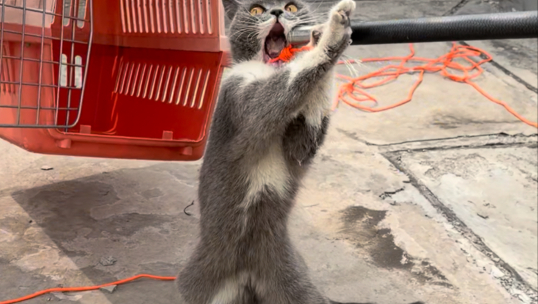 | 26.0万 | 2026-04-06 |
| [［补档］芬兰哦齁保时捷](https://www.bilibili.com/video/BV17YSZBSEJF) | 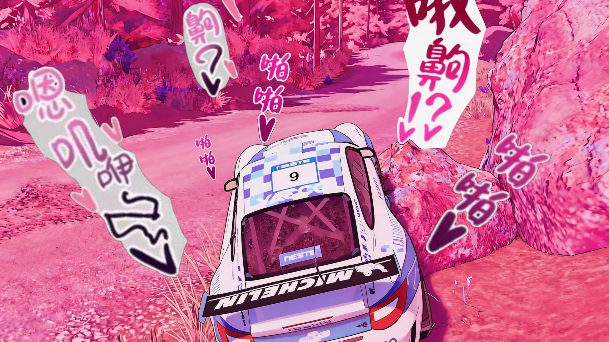 | 15.1万 | 2026-04-06 |
| [剑人tv.41](https://www.bilibili.com/video/BV1JbSZBpEGK) | 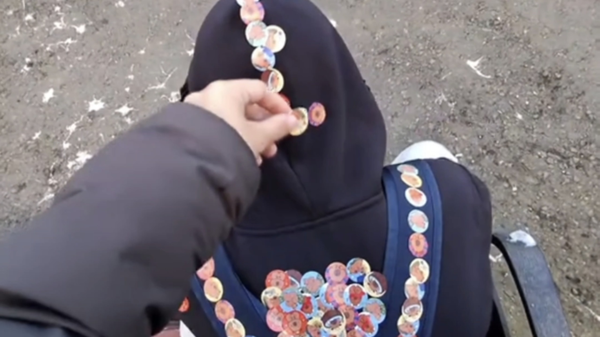 | 11.7万 | 2026-04-06 |
| [剑人TV EP.80](https://www.bilibili.com/video/BV12pSDBVEsZ) |  | 26.4万 | 2026-04-05 |
| [猫猫的战斗日常](https://www.bilibili.com/video/BV1jRDMBLExM) | 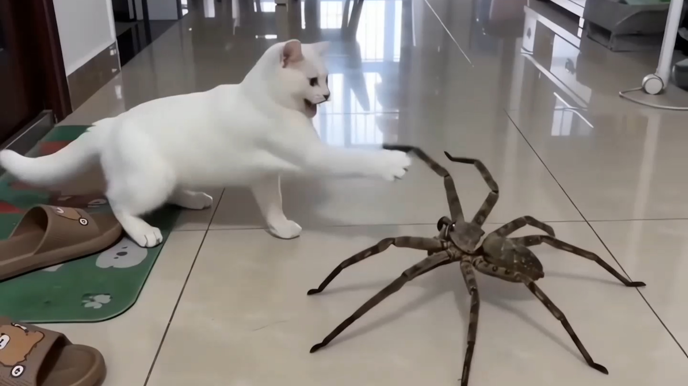 | 9.0万 | 2026-04-05 |
| [鬼畜拼好歌：叮咚鸡](https://www.bilibili.com/video/BV1ALD5BTEKe) | 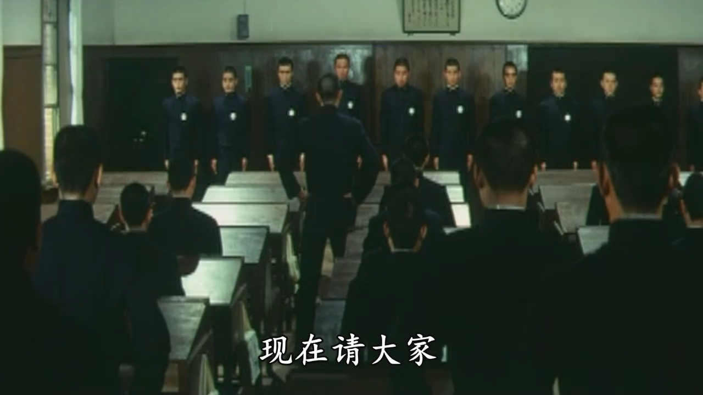 | 126 | 2026-04-05 |
| [你知道我花了多长时间才忘掉吗？](https://www.bilibili.com/video/BV1m3DuBaEnS) |  | 50.6万 | 2026-04-04 |
| [代码冲突了](https://www.bilibili.com/video/BV16fDABTEgv) | 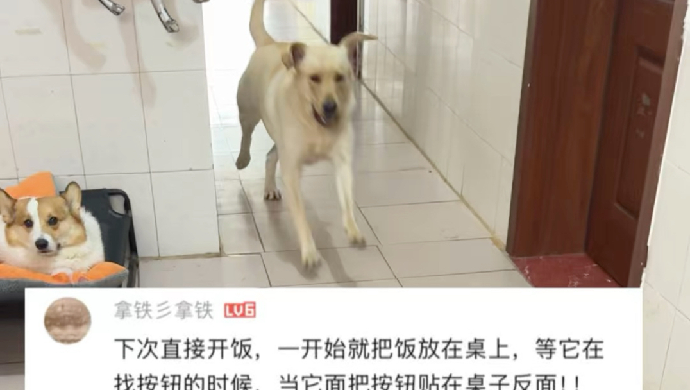 | 105.1万 | 2026-04-04 |
| [就像十几年前一样，一进游戏就选择了喵喵......](https://www.bilibili.com/video/BV1iADwBdESW) |  | 163.4万 | 2026-04-04 |
| [咪记煎饺，好吃得不得了！！](https://www.bilibili.com/video/BV1fF93B8EST) |  | 26.8万 | 2026-04-03 |
| [小猫Mugi想学自行车🚲💨](https://www.bilibili.com/video/BV1Tz9MBTEs9) | 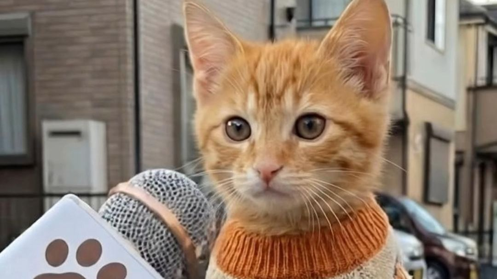 | 15.6万 | 2026-04-03 |
| [他 怎 么 一 直 按](https://www.bilibili.com/video/BV1Lw9uBHEXK) |  | 3.3万 | 2026-04-03 |
| [【五周年纪念/翻唱】《猫中毒》完整版PV/嘉然](https://www.bilibili.com/video/BV1gV9TBKEc8) |  | 67.9万 | 2026-04-03 |
| [不鸡道！专心经营自己的呆萌生活！](https://www.bilibili.com/video/BV1Zy9wBBE6P) |  | 11.8万 | 2026-04-03 |
| [底层代码混乱不堪](https://www.bilibili.com/video/BV1zv9uBZEPd) | 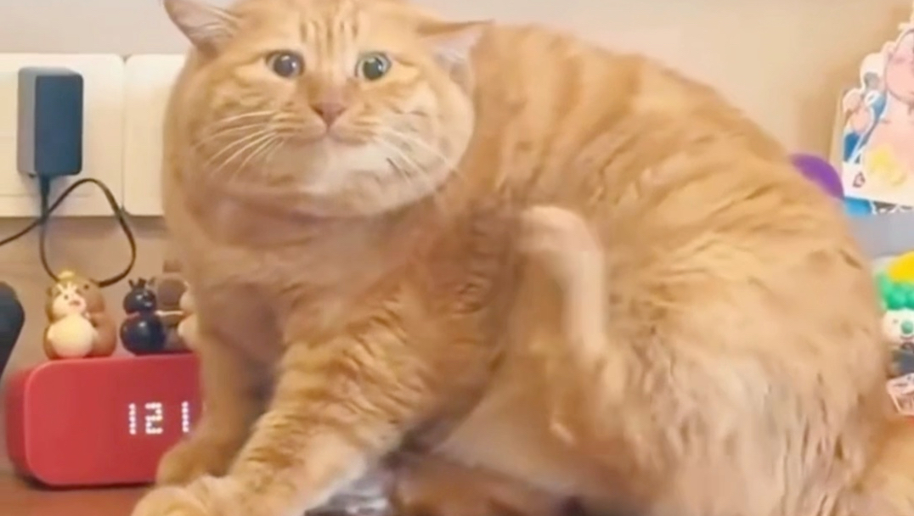 | 11.2万 | 2026-04-03 |
| [我说哈基米之间亦有差距](https://www.bilibili.com/video/BV1GN9TBrEjW) |  | 17.6万 | 2026-04-03 |
| [猫是打不服的，它只会认为你在欺负它](https://www.bilibili.com/video/BV1679cBME8T) | 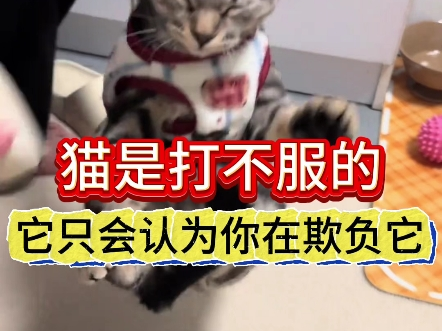 | 18.2万 | 2026-04-02 |
| [《基米不想走》](https://www.bilibili.com/video/BV1jb9WBFEnB) |  | 132 | 2026-04-02 |
| [神了！传世哈气之作《出基》](https://www.bilibili.com/video/BV1wg9JBdEAb) |  | 1536 | 2026-04-01 |
| [这才是《太阳之子》的最佳打开方式！太阳之子朝鲜语改编版](https://www.bilibili.com/video/BV1tNXQBxEt4) |  | 50.4万 | 2026-03-29 |
| [☝🤓一 秒 变 异 ⚡⚡⚡](https://www.bilibili.com/video/BV1TFXVBLEe3) |  | 838.9万 | 2026-03-28 |
| [【AI爱丽速子】低皮质醇的小曲⟪Ai Đưa Em Về⟫](https://www.bilibili.com/video/BV1CSAVzTE1g) |  | 9.8万 | 2026-03-19 |
| [lolsos_2026-02-19](https://www.bilibili.com/video/BV16kPCz7EAJ) |  | 90.3万 | 2026-03-05 |
| [“你 和 你 的 同 事”](https://www.bilibili.com/video/BV1HHfVBQE4u) | 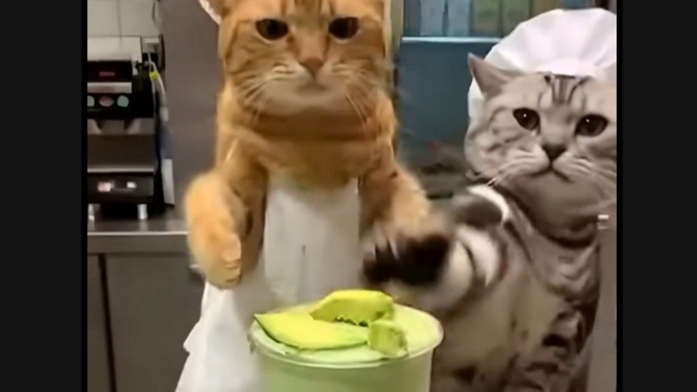 | 6.2万 | 2026-02-20 |
| [犬科动物交配](https://www.bilibili.com/video/BV17XrUBiEYN) |  | 11.2万 | 2026-01-17 |
| [大狗大狗交交交，大狗大狗叫叫叫](https://www.bilibili.com/video/BV1FgyABJEPY) |  | 4.3万 | 2025-11-20 |
| [《東南苦行山》×2倍速](https://www.bilibili.com/video/BV1MNy3BREsm) |  | 73.2万 | 2025-11-18 |
| [9岁男孩深夜在大街上强行侵犯20岁女大学生！(简直就是天生的超雄综合症)！](https://www.bilibili.com/video/BV1zk3RzaEVA) |  | 58.3万 | 2025-07-05 |
| [我是猫猫陈茂盛](https://www.bilibili.com/video/BV137Lmz3EWy) | 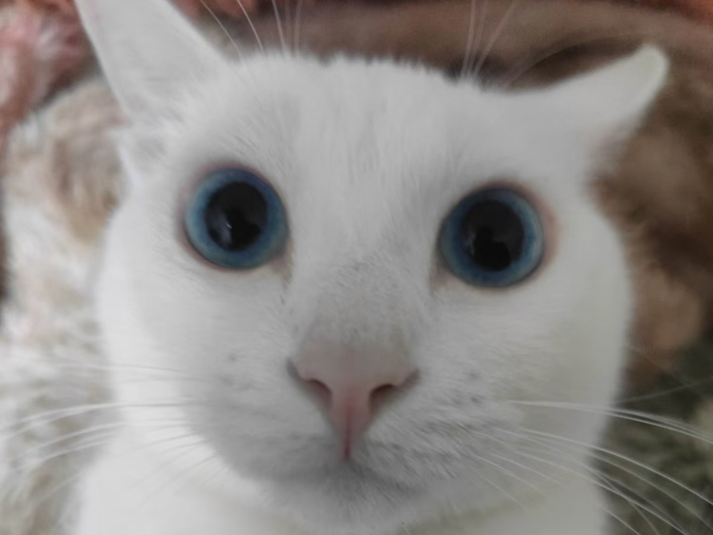 | 69.9万 | 2025-04-28 |
| [ピノキオピー - 超主人公 feat. 初音ミク](https://www.bilibili.com/video/BV1nvKnewEcU) |  | 797.4万 | 2025-02-14 |
| [米塔の小曲 有前奏无Rap版 前奏后纯音乐 Lightning moment](https://www.bilibili.com/video/BV1qKwFedEBm) |  | 374.5万 | 2025-01-18 |
| [在百万豪装录音棚大声听 30年前，50年后《精卫》【Hi-res】](https://www.bilibili.com/video/BV1Nk4y1V7DS) |  | 1342.9万 | 2023-07-26 |
| [Wer wer wer werwer wer werwer wer werwer wer werwer wer werwer wer werwer wer we](https://www.bilibili.com/video/BV1qq4y1a7mY) | 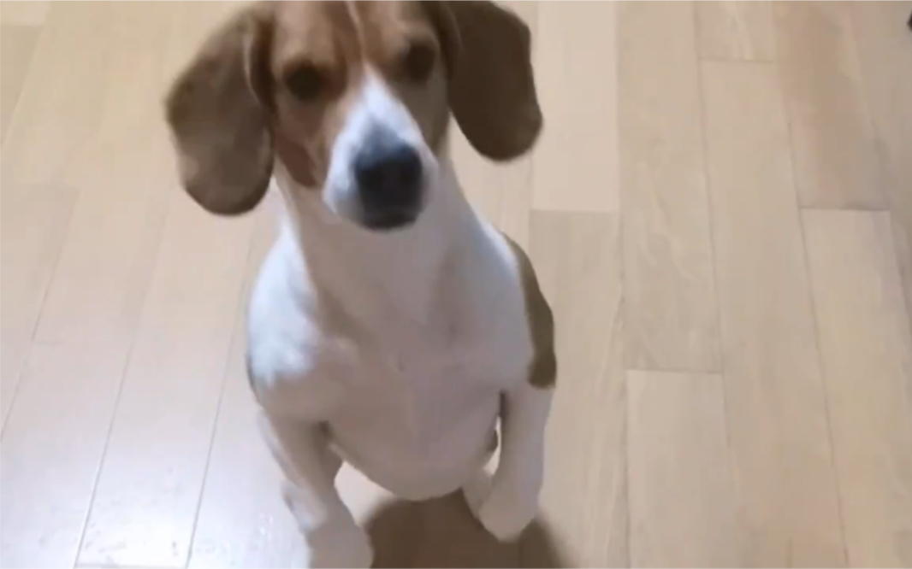 | 455.5万 | 2022-04-06 |
| [这才是猛男该看的猫片！PS：未成年人禁止看猫片](https://www.bilibili.com/video/BV1754y1S7Jk) | 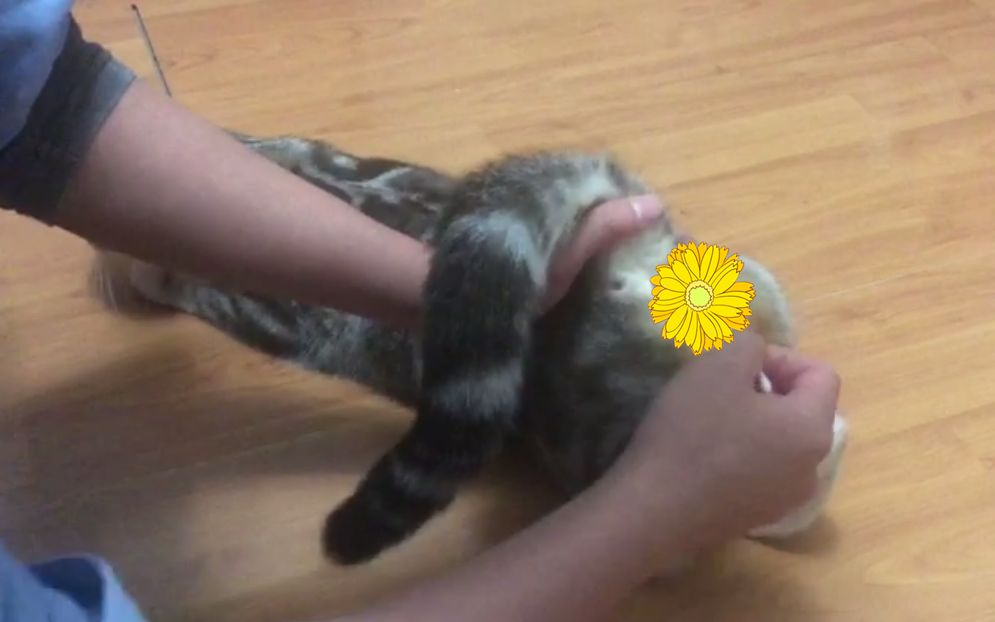 | 106.8万 | 2020-07-23 |
| [看完狮子的看看狗猫片](https://www.bilibili.com/video/BV1Us411F7iU) | 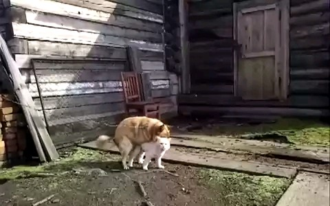 | 33.7万 | 2018-08-28 |
| [甩葱歌原版](https://www.bilibili.com/video/BV1Ls411w7r7) |  | 621.1万 | 2018-07-31 |
| [【记录】动物繁衍大全](https://www.bilibili.com/video/BV1nW411w7wR) |  | 258.0万 | 2018-06-13 |

---
*最后更新: 2026-04-09 03:17:22 (自动生成)*
*数据来源: [Bilibili](https://www.bilibili.com)*

## 使用说明

运行以下命令更新视频列表:
```bash
python3 fetch_hajimi_videos.py
```
