# awesome-hajimi
collections of hajimi (哈基米 in Chinese) on the Internet.

## 视频列表 (Video List)

| 视频标题 (Title) | 封面 | 播放量 (Views) | 发布日期 (Date) |
|---|---|---|---|
| [【基米】世界上最幽默的生物--春基米](https://www.bilibili.com/video/BV15jK266ELm) | 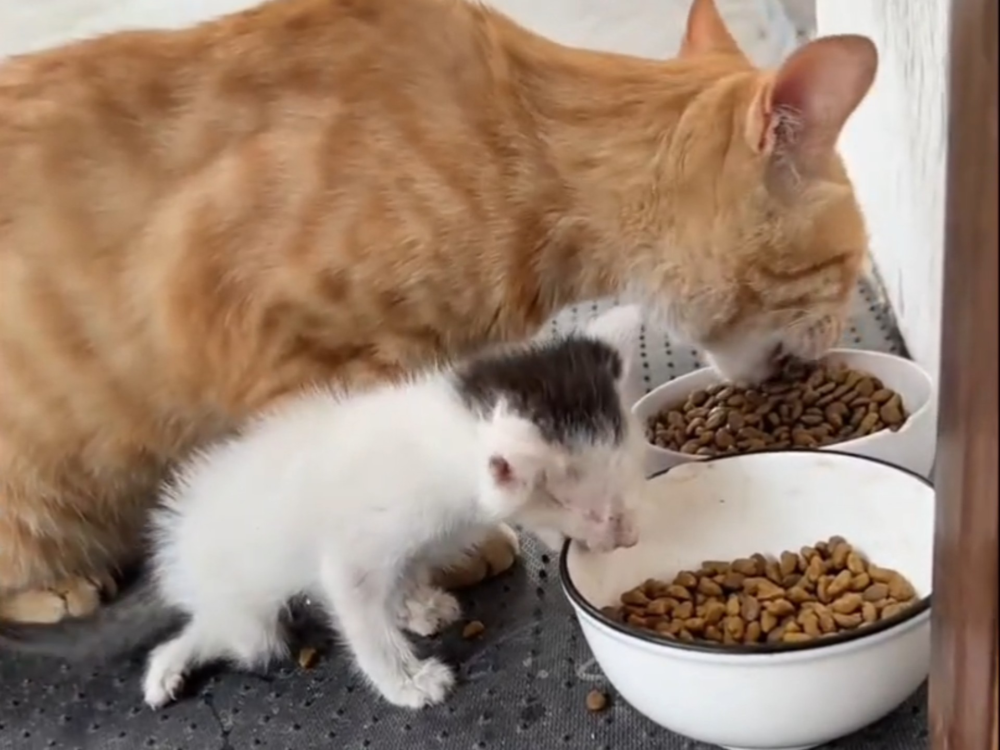 | 2561 | 2026-07-21 |
| [哈基米吃饭时转头看见耄耋纸模，淡定的走开了](https://www.bilibili.com/video/BV1SUKs6MEpV) | 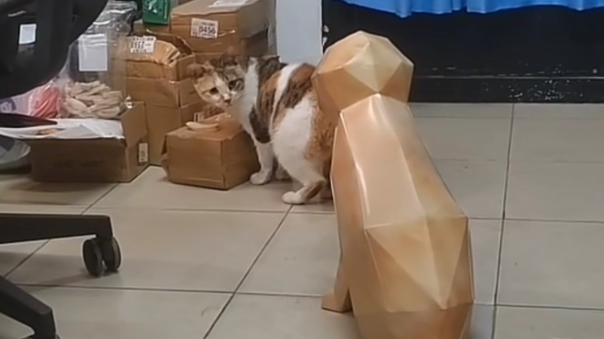 | 2671 | 2026-07-20 |
| [哈基人用水枪射哈基米](https://www.bilibili.com/video/BV1bSKs6qELv) | 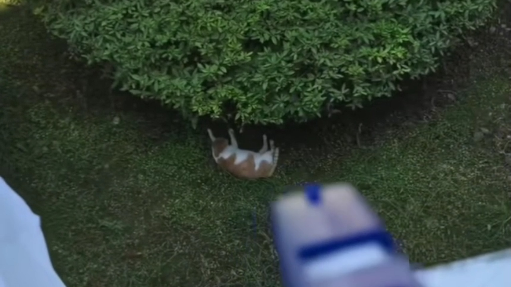 | 3.0万 | 2026-07-20 |
| [哈基鼠隐忍两分多钟，只为了最后一刻逃离哈基米](https://www.bilibili.com/video/BV1tSKs6qEQH) | 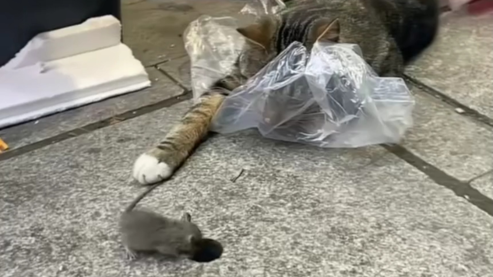 | 817 | 2026-07-20 |
| [【蔚蓝档案】 ⚡哈基米南北绿豆⚡](https://www.bilibili.com/video/BV1uhKx6zEd4) |  | 1385 | 2026-07-20 |
| [Trim🎊🎮🎲❤全程高城🎁🎉 自备纸巾💝🎵我过群很以器与器第样么作山众国华](https://www.bilibili.com/video/BV1V7KW66EHM) |  | 1177 | 2026-07-20 |
| [⭐🎸🍀全程️自备 ~{Trim全程这也太顶了吧♥Trim{emoji}🌟全程高🎊 🎁已规办法老马是装](https://www.bilibili.com/video/BV1A6KW6REyg) |  | 461 | 2026-07-20 |
| [填补了电音节没人放哈基米音乐的空白](https://www.bilibili.com/video/BV1e6Ks6CEUG) |  | 1872 | 2026-07-20 |
| [哈基米打完这把感觉退坑了](https://www.bilibili.com/video/BV1y3Kp6REQY) |  | 904 | 2026-07-20 |
| [哈基米…难悲虑多…](https://www.bilibili.com/video/BV1HpKp6EEH1) |  | 404 | 2026-07-20 |
| [哈基米](https://www.bilibili.com/video/BV1KRKp64EWp) | 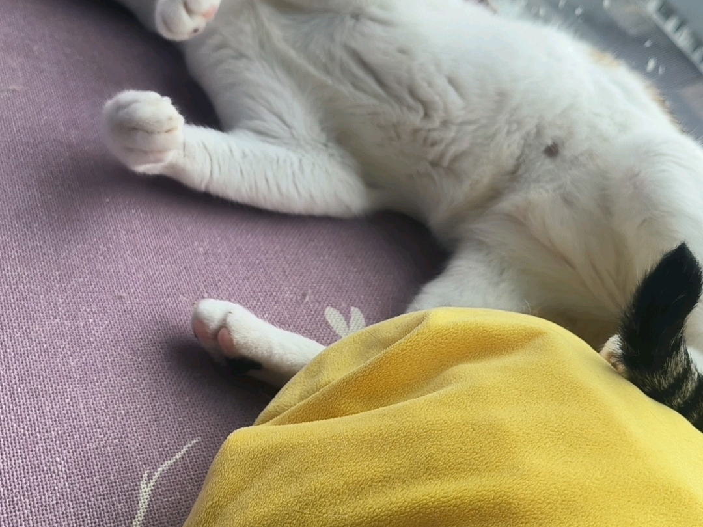 | 2 | 2026-07-20 |
| [【基米TV】可观测宇宙最可爱碳基生物](https://www.bilibili.com/video/BV1NJKm64EV2) | 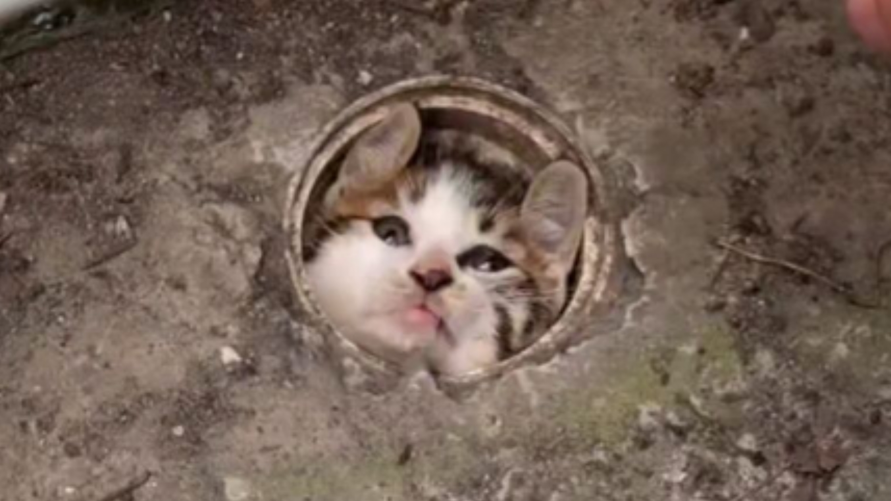 | 9164 | 2026-07-20 |
| [泰坦机甲颗秒哈基米](https://www.bilibili.com/video/BV1GkKm6rEqK) | 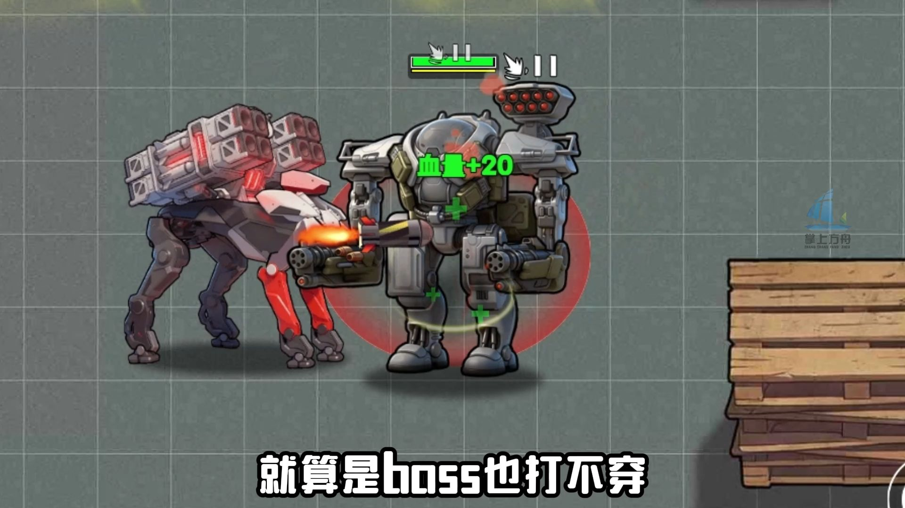 | 1506 | 2026-07-20 |
| [这才是真正的音药~ 哈基米能建南北绿豆~](https://www.bilibili.com/video/BV1ypKm6sEP5) | 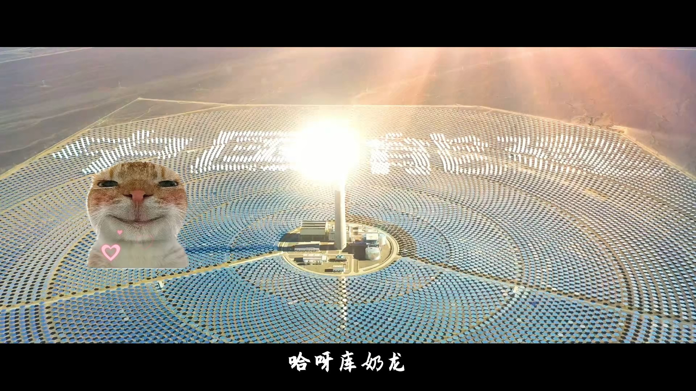 | 950 | 2026-07-20 |
| [哈基米](https://www.bilibili.com/video/BV1FaKm6JE7z) |  | 445 | 2026-07-20 |
| [哈基米哈基米地狱哈基米](https://www.bilibili.com/video/BV1CwKU6oEuP) | 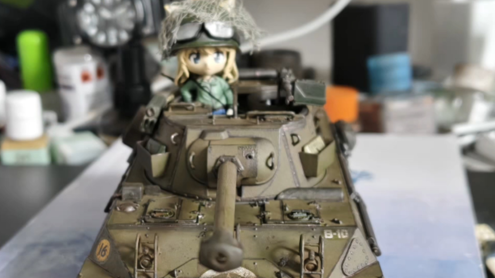 | 499 | 2026-07-20 |
| [⚡️不⚡️得⚡️不⚡️叫，大狗叫叫](https://www.bilibili.com/video/BV1UQKm6eEye) |  | 4472 | 2026-07-20 |
| [哈基米](https://www.bilibili.com/video/BV1z3KU6QED3) |  | 121 | 2026-07-20 |
| [【可爱哈基米猫】最新视频来袭，快来看看吧！](https://www.bilibili.com/video/BV1LnKU61EKP) |  | 13 | 2026-07-20 |
| [挺好的，哈基米洗完澡好上路](https://www.bilibili.com/video/BV1csK16LEEF) | 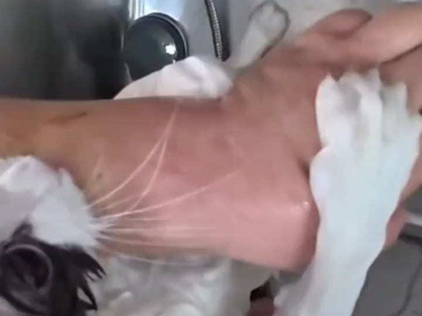 | 1080 | 2026-07-20 |
| [哈基米](https://www.bilibili.com/video/BV1zPK26mERF) | 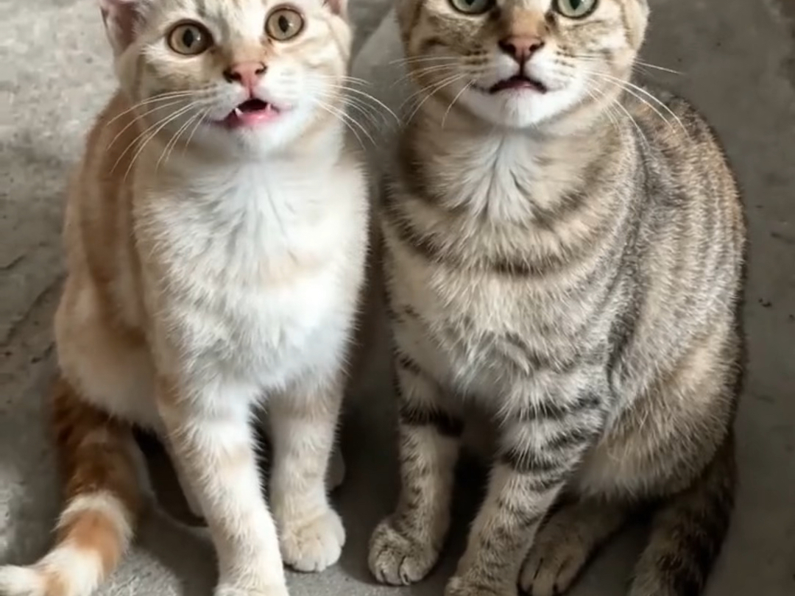 | 140 | 2026-07-20 |
| [TikTok哈基米原版音乐也是让老外找到了  …](https://www.bilibili.com/video/BV1S2K16FEqA) |  | 1925 | 2026-07-20 |
| [“演奏开始”](https://www.bilibili.com/video/BV11vK264EPN) |  | 12.4万 | 2026-07-20 |
| [五秒钟夺走你的走马灯](https://www.bilibili.com/video/BV11iK26dExd) |  | 4.3万 | 2026-07-20 |
| [捡个哈基米，哈基米想跟我回家](https://www.bilibili.com/video/BV1jSKy6uE3W) | 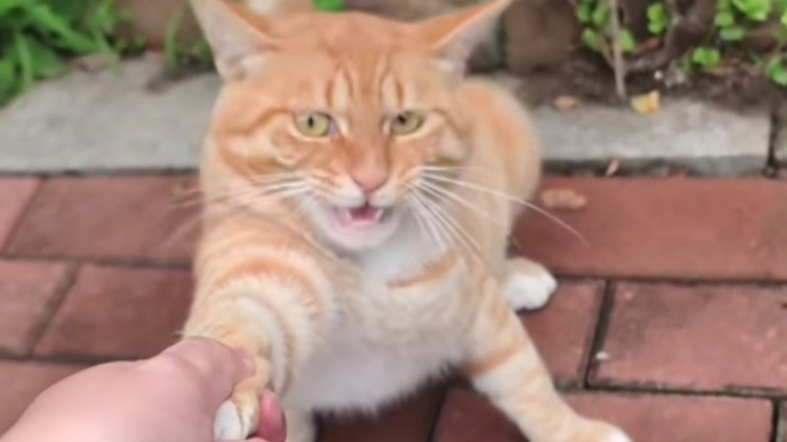 | 1499 | 2026-07-19 |
| [哈基米！](https://www.bilibili.com/video/BV1CBKy62Ej1) | 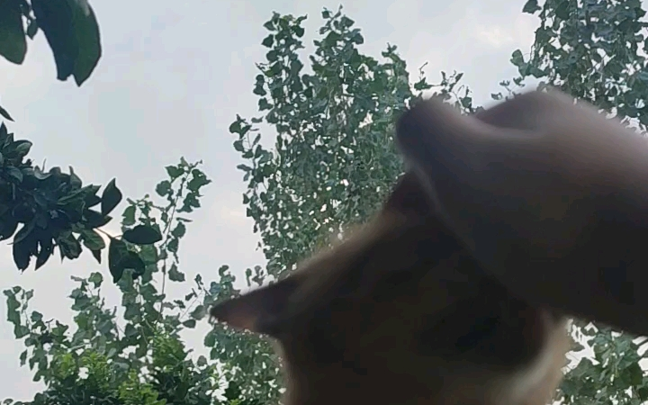 | 196 | 2026-07-19 |
| [左手懊悔，右手怜悯，火腿肠本是对流浪猫怜悯的因，却成为了鹦鹉葬送性命的果](https://www.bilibili.com/video/BV158Kr6xEDs) | 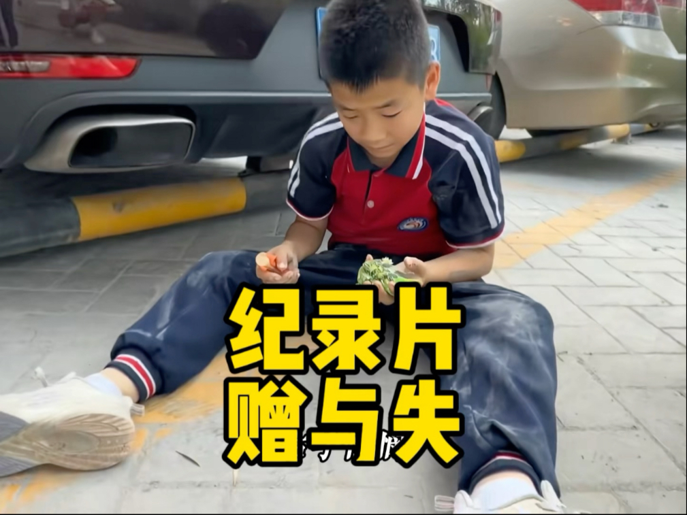 | 23.9万 | 2026-07-19 |
| [哈基米只是在跳舞](https://www.bilibili.com/video/BV1pKKz6PExN) |  | 2361 | 2026-07-19 |
| [小时候家附近有很多偷狗的](https://www.bilibili.com/video/BV1tZKB6zEru) | 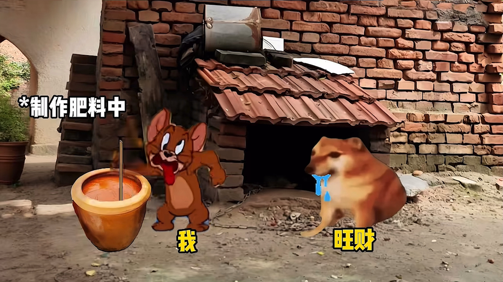 | 133.1万 | 2026-07-19 |
| [哈基米南北绿豆~](https://www.bilibili.com/video/BV1DvKz6VEGx) |  | 807 | 2026-07-19 |
| [哈基米能量回收](https://www.bilibili.com/video/BV1nVKz6bEH7) | 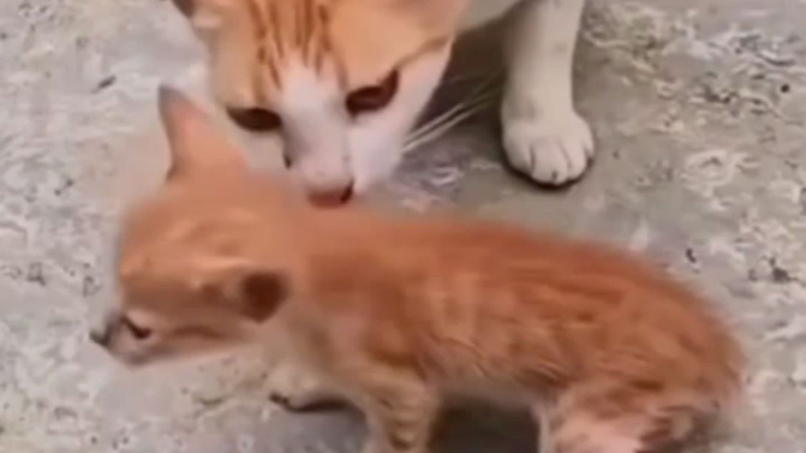 | 3763 | 2026-07-19 |
| [【哈基米TV】神人哈吉米对自己哈气](https://www.bilibili.com/video/BV1JVKz6bE5L) | 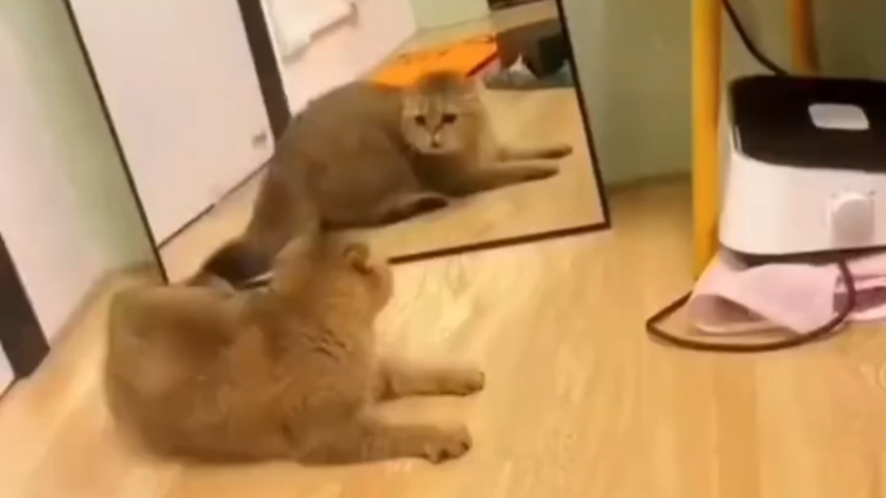 | 1183 | 2026-07-19 |
| [哈基米水淹七军](https://www.bilibili.com/video/BV1onKz6XEsH) | 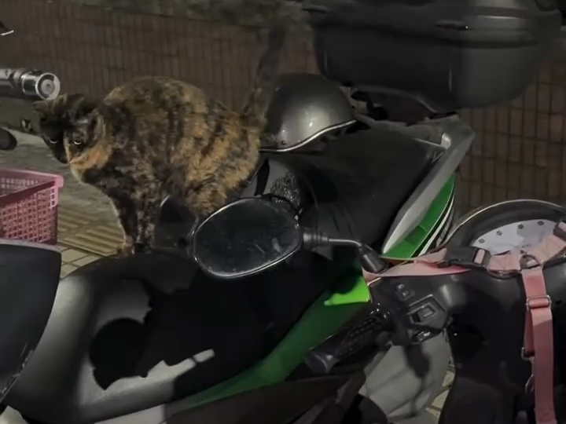 | 1702 | 2026-07-19 |
| [【神必中配】 超能吸哈基米/尼古喵真5](https://www.bilibili.com/video/BV1rQKz6aEbE) |  | 1991 | 2026-07-19 |
| [“有些大狗是注定要叫的”](https://www.bilibili.com/video/BV1rUKz6eEQo) |  | 2.0万 | 2026-07-19 |
| [☝😯 &lt;(º0º)&gt; ⚡⚡⚡](https://www.bilibili.com/video/BV11rKz6uEX6) | 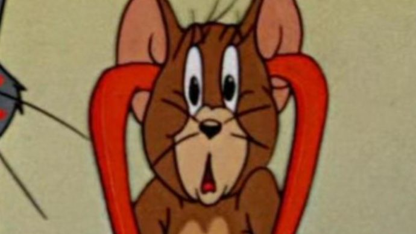 | 20.3万 | 2026-07-19 |
| [《猫丢了怎么办》](https://www.bilibili.com/video/BV1ZJKT6PECL) |  | 16.3万 | 2026-07-19 |
| [【基米】你求基米就行了](https://www.bilibili.com/video/BV1ZSKv67EhX) | 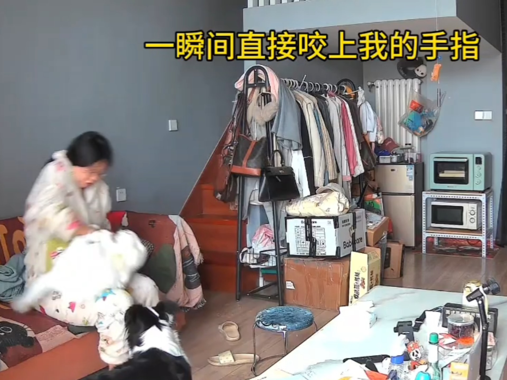 | 3099 | 2026-07-19 |
| [从夯到拉盘点近两月爆火的阴间Funk音乐](https://www.bilibili.com/video/BV1cDKq6xEWk) |  | 88.6万 | 2026-07-19 |
| [小动物们的森友会，梅花鹿和车座子也要踢“世界杯”！！！](https://www.bilibili.com/video/BV11qKq6PEv9) | 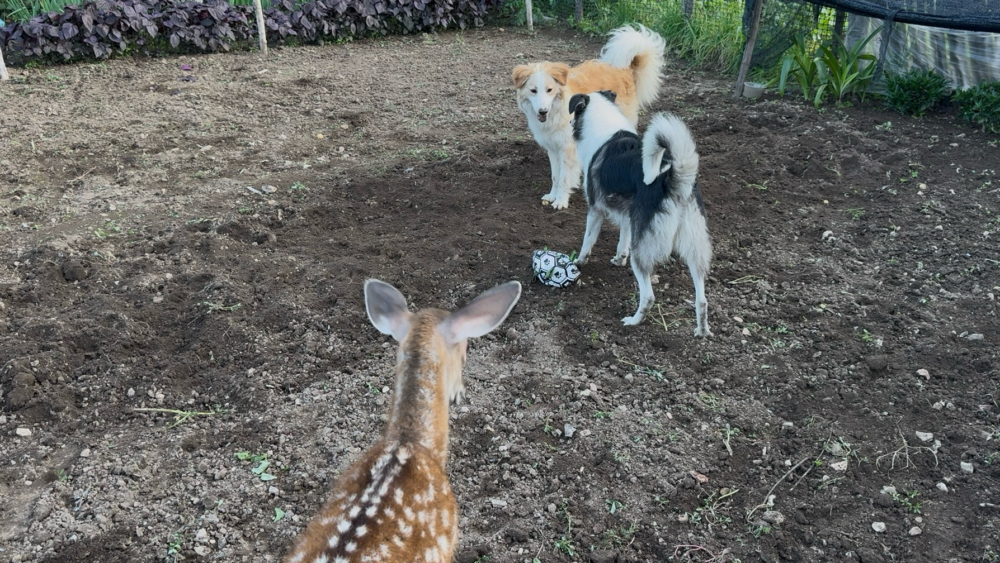 | 9.7万 | 2026-07-19 |
| [哈基米想钻进汽车里结果头被卡住了动弹不得](https://www.bilibili.com/video/BV1NHKB6NE25) | 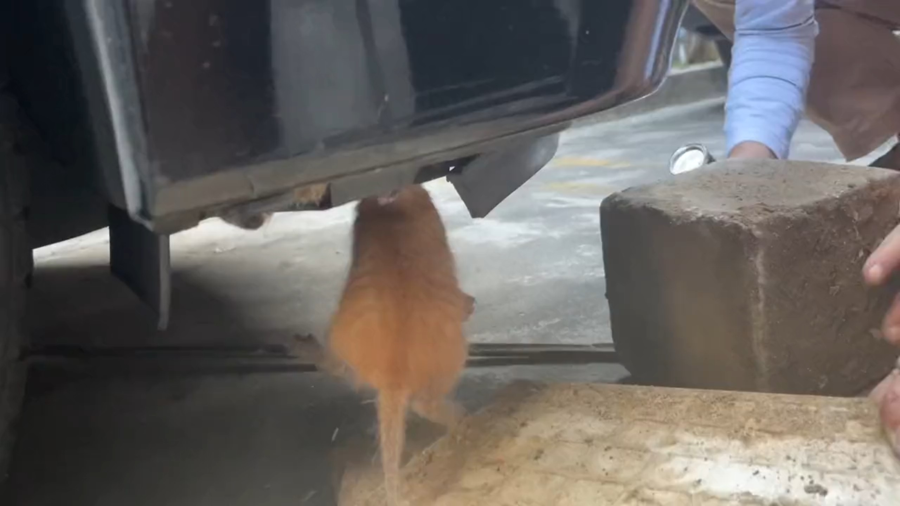 | 6714 | 2026-07-19 |
| [来自网吧的博弈](https://www.bilibili.com/video/BV1WHKB6PE1u) |  | 3.2万 | 2026-07-19 |
| [窗外，是老吴的身影](https://www.bilibili.com/video/BV1ePKB61EW4) | 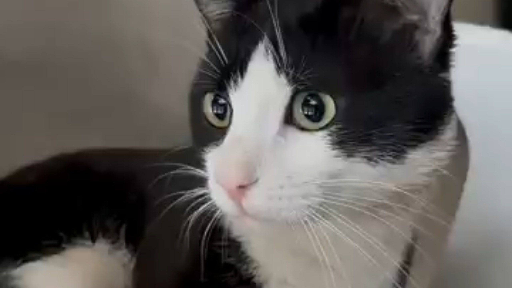 | 1.5万 | 2026-07-19 |
| [今天去游乐园玩耍咯#大橘为重 #猫咪的迷惑行为 #猫咪 #猫子柒](https://www.bilibili.com/video/BV1spKB6YERo) |  | 4.5万 | 2026-07-19 |
| [处刑！处刑！全部处刑！【重音teto/meme】](https://www.bilibili.com/video/BV1jXKv6jEy2) |  | 37.0万 | 2026-07-19 |
| [哈基米这个惊讶](https://www.bilibili.com/video/BV1NoKi6aEjS) | 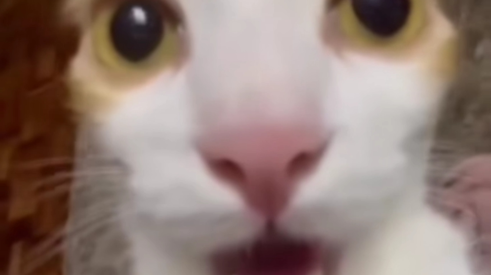 | 3040 | 2026-07-18 |
| [天 津 鼠 鼠 的 秘 密 ⑥](https://www.bilibili.com/video/BV1WAKN6ME6z) |  | 9.3万 | 2026-07-18 |
| [素   狗](https://www.bilibili.com/video/BV1SqKT6QEQy) | 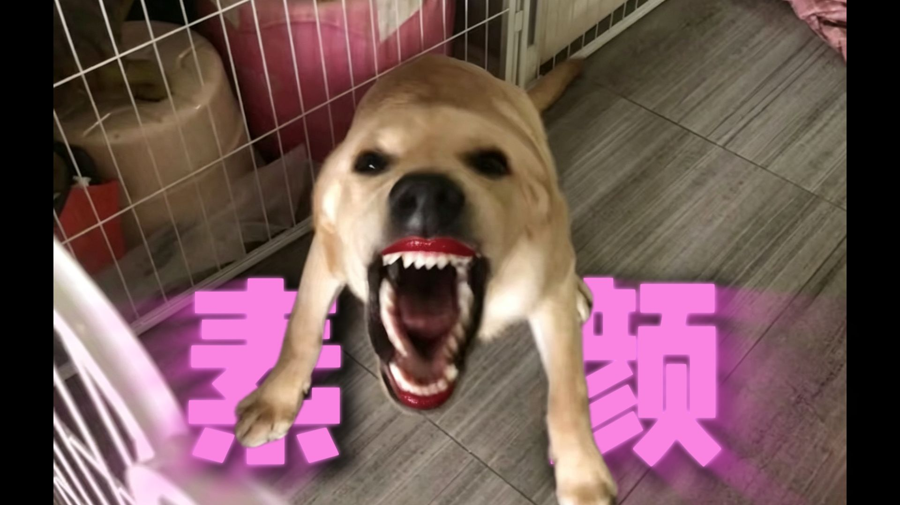 | 1.2万 | 2026-07-18 |
| [哈基米TV 街舞TV](https://www.bilibili.com/video/BV1jzKK6aE7x) |  | 392 | 2026-07-18 |
| [吕布洗澡应激？！辟谣](https://www.bilibili.com/video/BV1pbKK6uEbW) | 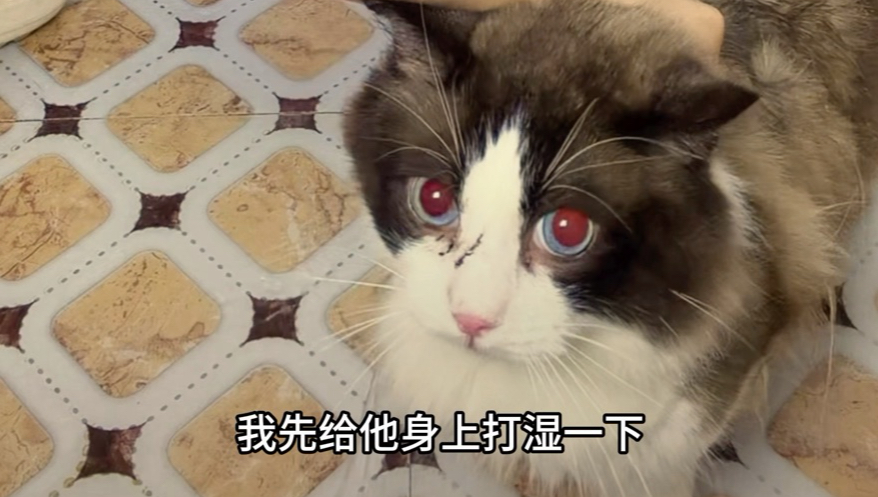 | 6.8万 | 2026-07-18 |
| [圆头耄耋已死，大狗叫还护得住版权吗？！【网络狠人106】](https://www.bilibili.com/video/BV1ptKP6AEcS) |  | 44.3万 | 2026-07-18 |
| [哈基米音乐时代结束，接下来是大狗叫的时代](https://www.bilibili.com/video/BV1jiKP6dEVY) |  | 416 | 2026-07-18 |
| [猫和老鼠](https://www.bilibili.com/video/BV1naNa6uE6c) |  | 1.7万 | 2026-07-18 |
| [🐶你说你不想大狗叫，我也不想大狗叫🐶《但》](https://www.bilibili.com/video/BV132Kw63EGa) | 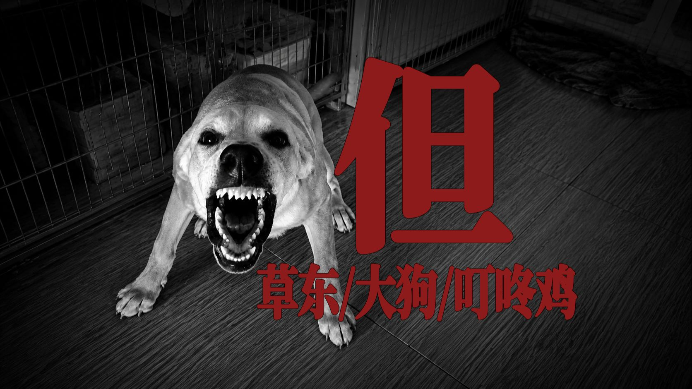 | 5.0万 | 2026-07-18 |
| [【大狗叫音乐】大狗说（伯虎说停顿卡点&amp;完整版）](https://www.bilibili.com/video/BV12FKN6gEDy) |  | 3.2万 | 2026-07-18 |
| [🐱下一站 哈星🐱](https://www.bilibili.com/video/BV1aAKw66ETh) | 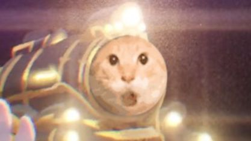 | 4521 | 2026-07-18 |
| [乡村兽医沉浸式看诊，这牛不对劲啊？](https://www.bilibili.com/video/BV1C7Kw6cEDn) |  | 24.5万 | 2026-07-18 |
| [-](https://www.bilibili.com/video/BV1wAKA68EC7) |  | 14.7万 | 2026-07-18 |
| [当威龙的鼠鼠朋友哈基蜂被偷了时...](https://www.bilibili.com/video/BV1nEKF6QEdZ) |  | 158.7万 | 2026-07-18 |
| [哈基米喔南北绿豆](https://www.bilibili.com/video/BV11JNR61E4r) |  | 2 | 2026-07-17 |
| [猫和老鼠 ｜ 请叫我修理大师](https://www.bilibili.com/video/BV1gVKJ6oE2A) |  | 17.7万 | 2026-07-17 |
| [《天天女儿》1-30](https://www.bilibili.com/video/BV19bNd6bEBH) | 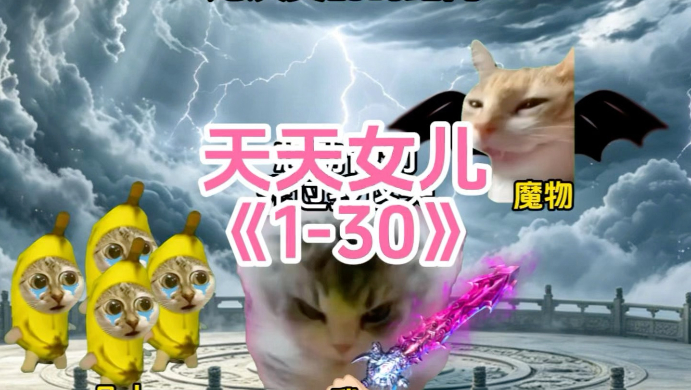 | 1.5万 | 2026-07-17 |
| [DECO*27 - Dummy Romance feat. Hatsune Miku](https://www.bilibili.com/video/BV1RENQ6SEsS) |  | 105.7万 | 2026-07-17 |
| [又来训练胆小咪了](https://www.bilibili.com/video/BV13ZKJ6oEY7) | 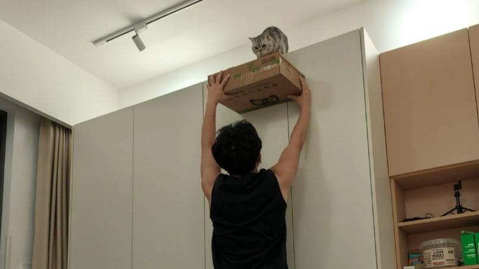 | 48.4万 | 2026-07-17 |
| [星际超级荒诞动画喜剧！《外星小偷里贝》第05话：崩老头星球【UP动画】](https://www.bilibili.com/video/BV1PJKV6bE1j) |  | 123.1万 | 2026-07-17 |
| [今日全款拿下医院账单！](https://www.bilibili.com/video/BV1teKj61E9E) | 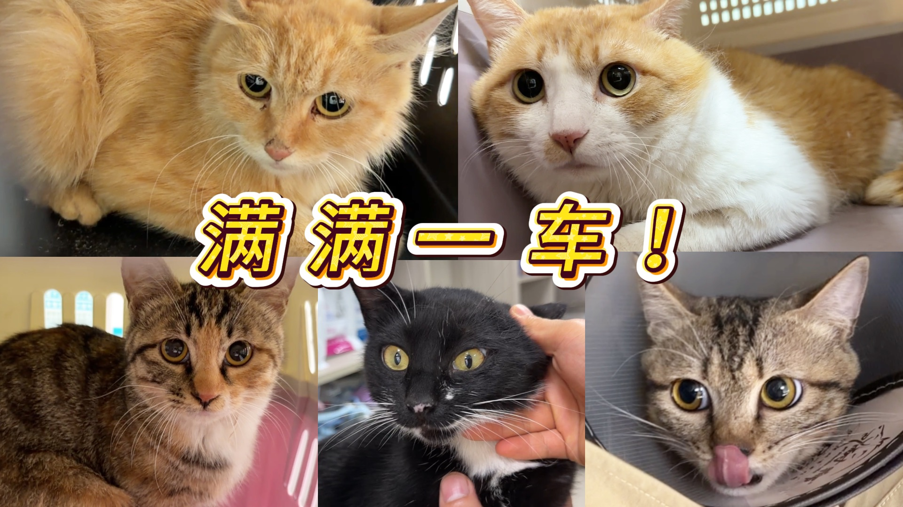 | 25.9万 | 2026-07-17 |
| [《哈基猫奇遇记：梦幻水族馆的诞生》 #猫咪  #哈基米 #萌宠](https://www.bilibili.com/video/BV1nLKE6qEQb) | 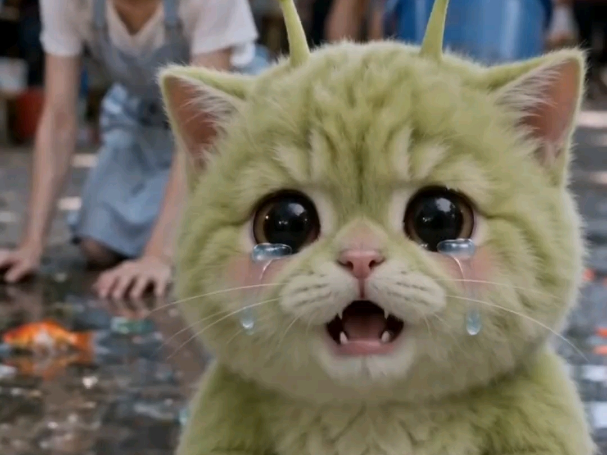 | 6693 | 2026-07-17 |
| [下个大狗叫](https://www.bilibili.com/video/BV1RBKV6LECg) |  | 17.5万 | 2026-07-17 |
| [【洛克王国世界】S3赛季 一条龙全收集 宝箱/眠枭之星/音乐/不咕钟零件/星霜灯/星火灯/南瓜灯/精灵果实/隐藏任务](https://www.bilibili.com/video/BV1xGK36xEnw) |  | 39.5万 | 2026-07-16 |
| [猫：强者从不抱怨环境！](https://www.bilibili.com/video/BV11vNB6hE72) | 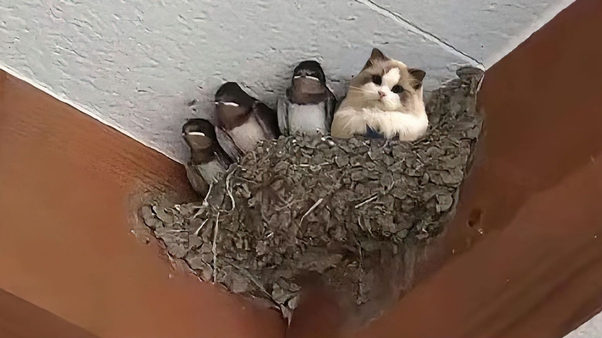 | 4.2万 | 2026-07-16 |
| [幸福感爆棚！委屈猫平淡又充实的一天！（和好朋友逛商场吃火锅）](https://www.bilibili.com/video/BV13ANz6GEBN) |  | 85.7万 | 2026-07-15 |
| [猫见猫爱的逗猫棒动画片｜沉浸式陪伴 猫咪不孤单](https://www.bilibili.com/video/BV15eNq6VEzF) | 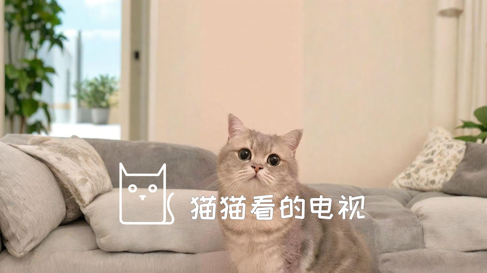 | 3100 | 2026-07-15 |
| [台风巴威来了！赶紧把狗子们都安顿好！趁着今天阳光明媚全部出来玩个够！](https://www.bilibili.com/video/BV1PDNv69E4s) | 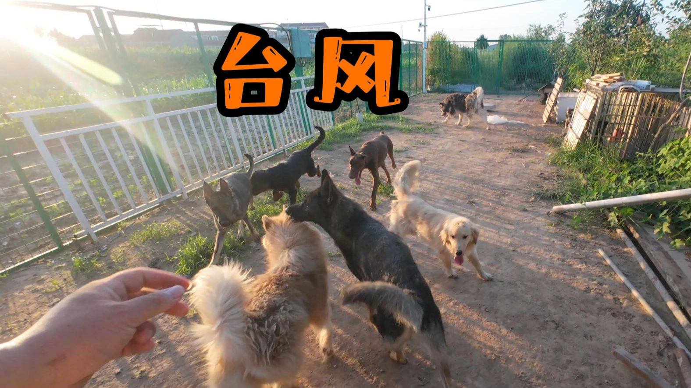 | 55.8万 | 2026-07-15 |
| [大黄视角](https://www.bilibili.com/video/BV1pLNq6xEak) | 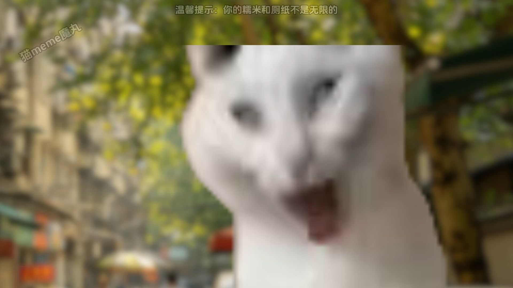 | 8.7万 | 2026-07-15 |
| [大狗大狗叫叫叫是什么梗？【梗学堂】](https://www.bilibili.com/video/BV1SrNq6qETi) |  | 30.6万 | 2026-07-15 |
| [布鲁斯偷学哈基米的招式](https://www.bilibili.com/video/BV1G6Nt67E12) | 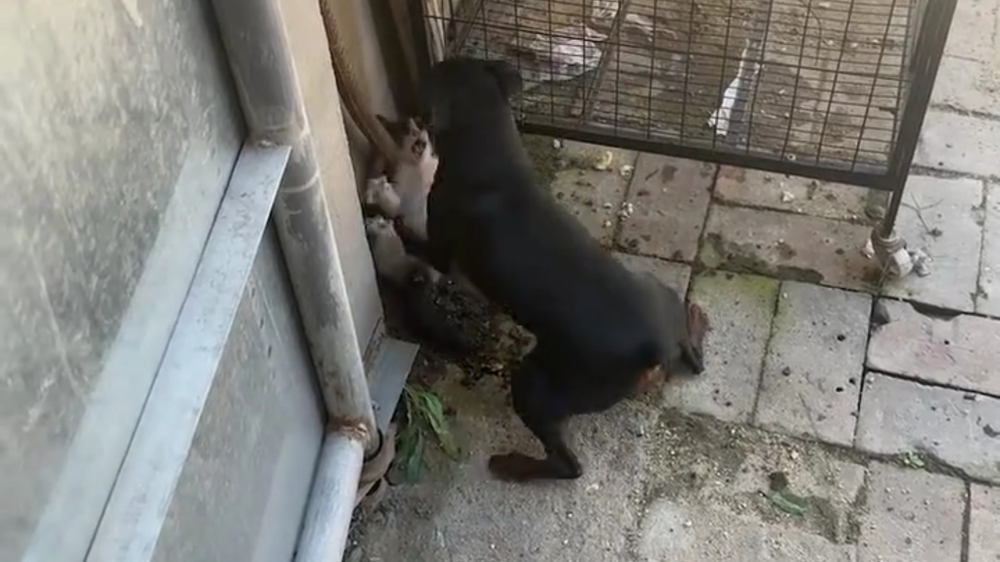 | 2745 | 2026-07-14 |
| [哈基米这个殴打猫条， 全宇宙第一幽默的生物](https://www.bilibili.com/video/BV16uN96eEjU) | 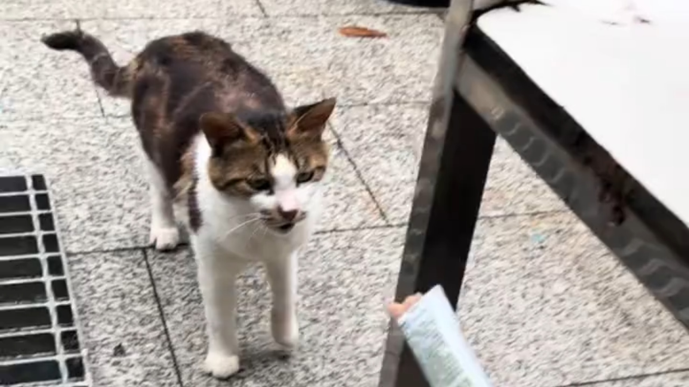 | 1237 | 2026-07-14 |
| [善良的鸡妈妈，看到陌生的小鸡忍不住想带](https://www.bilibili.com/video/BV1jFNR68EbJ) | 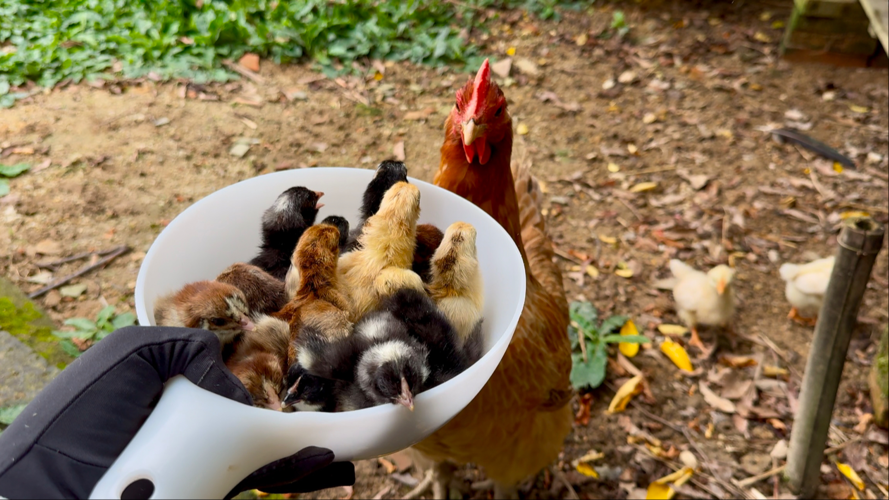 | 5.0万 | 2026-07-14 |
| [⚡来只老吴摇一摇⚡](https://www.bilibili.com/video/BV14UNU6aEfL) | 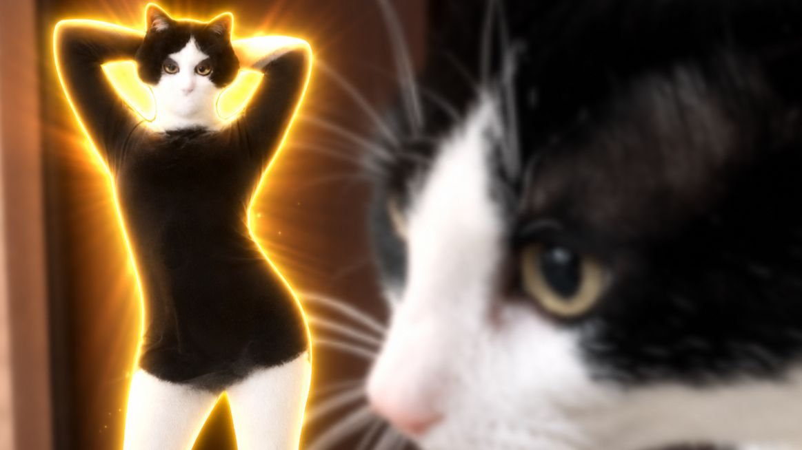 | 2.6万 | 2026-07-14 |
| [从夯到拉盘点六七月爆火的雷霆洗脑音乐](https://www.bilibili.com/video/BV1CWNX6NEeA) |  | 115.1万 | 2026-07-14 |
| [从夯到拉锐评爆火全网大狗叫神曲](https://www.bilibili.com/video/BV1hGN168EDp) |  | 143.1万 | 2026-07-14 |
| [举起小猫桑多涅](https://www.bilibili.com/video/BV1nfNc6nEGg) |  | 330.7万 | 2026-07-13 |
| [🐶“狗从天降，愤怒狰狞”🐶《凌云壮志&amp;小曲》【The Hills】｜](https://www.bilibili.com/video/BV1oXN46JEKa) |  | 59.4万 | 2026-07-11 |
| [⚡️来个好茬摇一摇⚡️](https://www.bilibili.com/video/BV1rJNj6wE2F) |  | 145.7万 | 2026-07-10 |
| [【饥荒mod】大狗叫替换猎犬音效](https://www.bilibili.com/video/BV1bwMW6BEHQ) | 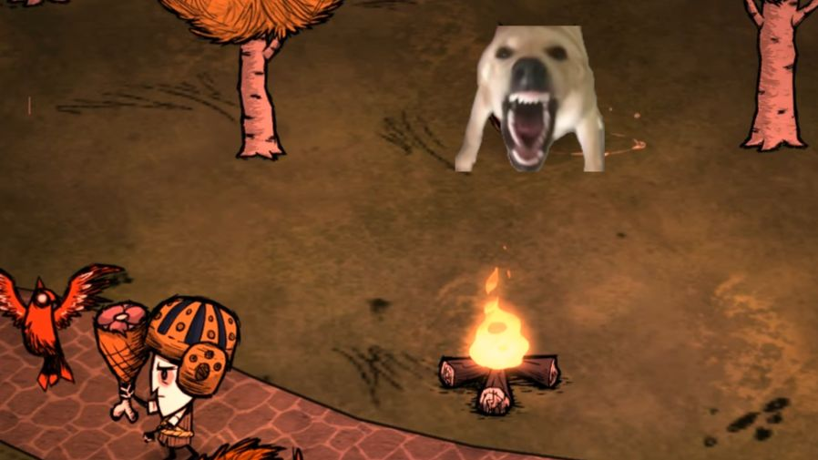 | 15.2万 | 2026-07-09 |
| [在广州的哈基米](https://www.bilibili.com/video/BV11yMg6aEf7) | 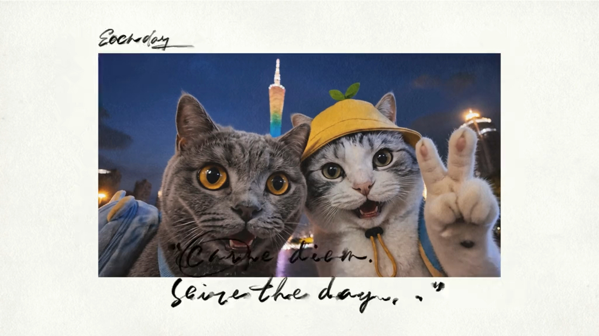 | 50 | 2026-07-08 |
| [【妙脆角小猫の小曲】《Terranova》--Janina](https://www.bilibili.com/video/BV1x8Ms6MEZG) | 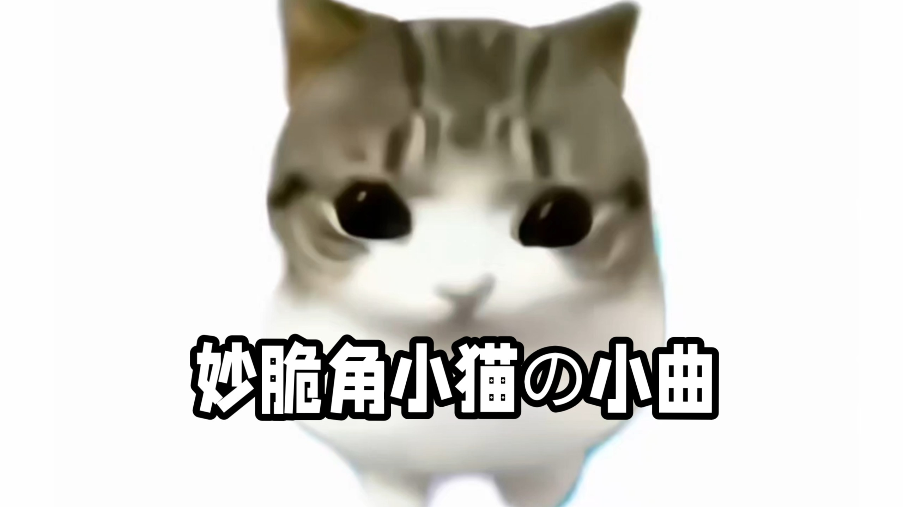 | 5.7万 | 2026-07-06 |
| [欠揍的哈基米](https://www.bilibili.com/video/BV1DUT969EpG) | 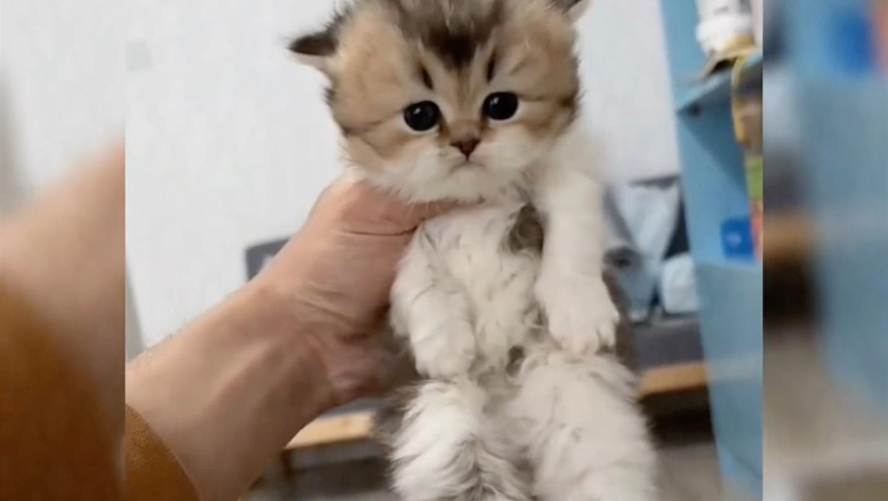 | 1271 | 2026-07-06 |
| [【循环歌单】《妙脆角小猫の小曲》《Terranova》DJ版](https://www.bilibili.com/video/BV1cQT16DEkR) |  | 4.3万 | 2026-07-06 |
| [如果一首歌去掉伴奏 只有人声会怎么样 /なんもねえ-《尼古喵喵》TV动画片头曲 – 忘れらんねえよ](https://www.bilibili.com/video/BV15PMT6AEyA) |  | 42.5万 | 2026-07-05 |
| [【HARDTEKK】《后室の小曲》《海盗克拉克の小曲》《静物の小曲》冷门佳作硬泰克：BL STUDIO HARDTEKK](https://www.bilibili.com/video/BV12Kjn62EDD) |  | 31.7万 | 2026-06-20 |
| [哈个气能爽成这样?](https://www.bilibili.com/video/BV1NFjA6ZEvA) | 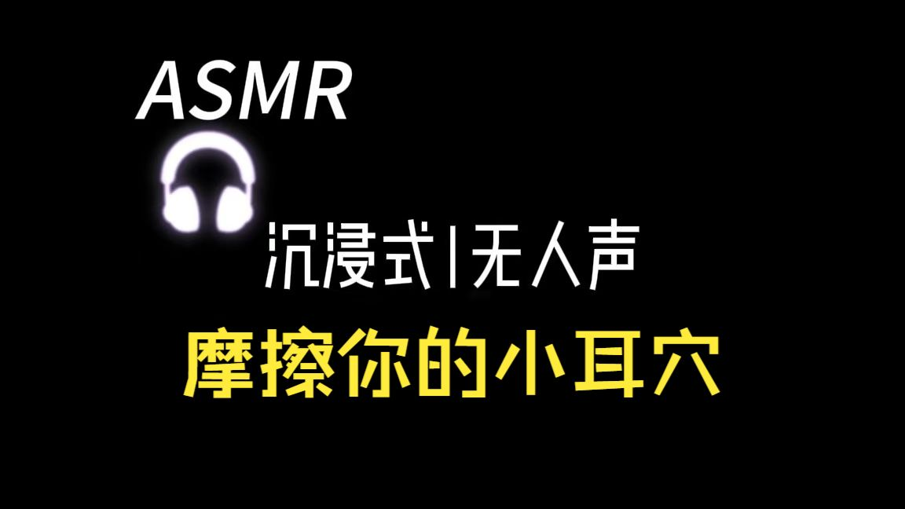 | 15.6万 | 2026-06-18 |
| [咪的快乐vlog（最后把朋友押那了）](https://www.bilibili.com/video/BV15jVA6KELe) | 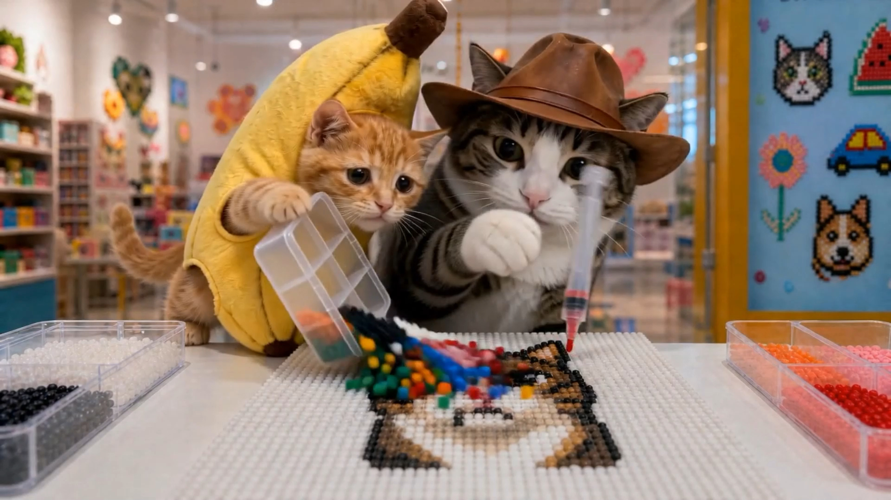 | 177.0万 | 2026-05-26 |
| [鸡叫一小时](https://www.bilibili.com/video/BV1ePcXzsETx) | 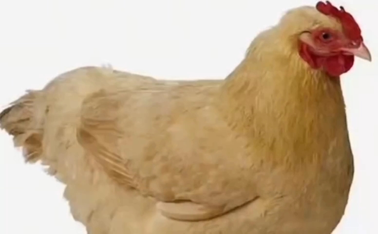 | 11.8万 | 2026-03-10 |
| [“哈基米九大冥曲”](https://www.bilibili.com/video/BV1ePbjzdEv4) |  | 13.5万 | 2025-08-15 |
| [三角基米：A CYBER&#x27;S WORLD？](https://www.bilibili.com/video/BV1QGNmz7EDH) |  | 5.1万 | 2025-06-21 |
| [憋得住吗😛](https://www.bilibili.com/video/BV1cp7MzHEjL) |  | 38.8万 | 2025-05-31 |
| [《给我闹》～最后的自由在这里](https://www.bilibili.com/video/BV16CLLzAEE2) |  | 72.4万 | 2025-04-25 |
| [小 笨 猫 摇 摆 一 分 钟Ⅰ](https://www.bilibili.com/video/BV1S4sce6E9j) |  | 43.0万 | 2024-08-24 |
| [真有这么好听？](https://www.bilibili.com/video/BV1Wy4y1i7AL) |  | 2174.5万 | 2020-12-19 |

---
*最后更新: 2026-07-21 05:32:18 (自动生成)*
*数据来源: [Bilibili](https://www.bilibili.com)*

## 使用说明

运行以下命令更新视频列表:
```bash
python3 fetch_hajimi_videos.py
```
