# awesome-hajimi
collections of hajimi (哈基米 in Chinese) on the Internet.

## 视频列表 (Video List)

| 视频标题 (Title) | 封面 | 播放量 (Views) | 发布日期 (Date) |
|---|---|---|---|
| [给姥姥家里的基米唱一下哈基米(›´ω`‹ )](https://www.bilibili.com/video/BV1uGfKB1EXR) | 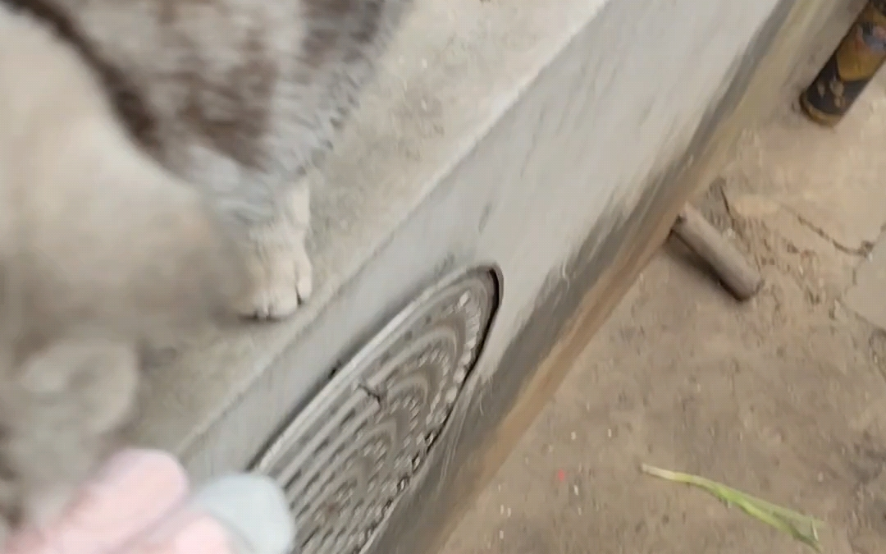 | 2 | 2026-02-23 |
| [哈基米又在捣乱了](https://www.bilibili.com/video/BV1UGfKByEC9) | 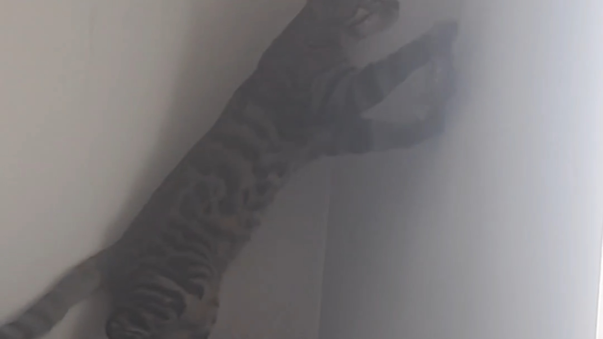 | 0 | 2026-02-23 |
| [哈基米表情包大全。](https://www.bilibili.com/video/BV1RFfKBXEcz) |  | 9 | 2026-02-23 |
| [[哈基米音乐】夜，哈基虫和你](https://www.bilibili.com/video/BV19AfKBDEP2) |  | 60 | 2026-02-23 |
| [哈基米](https://www.bilibili.com/video/BV1iqfKBtEXD) | 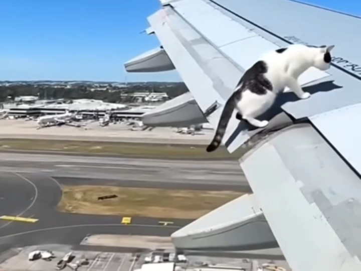 | 3 | 2026-02-23 |
| [26年三大抽象哈基米](https://www.bilibili.com/video/BV1nnf3ByE3s) | 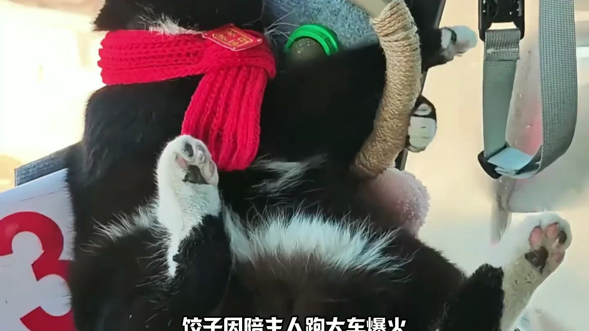 | 240 | 2026-02-23 |
| [鬼鬼祟祟的哈基米在干嘛？](https://www.bilibili.com/video/BV1VnfNBnEXP) |  | 309 | 2026-02-23 |
| [哈基米你别太离谱](https://www.bilibili.com/video/BV1JGfTBeEsL) |  | 516 | 2026-02-22 |
| [哈基米南北绿豆～](https://www.bilibili.com/video/BV14RfPBME8i) |  | 89 | 2026-02-22 |
| [哈基米欧码基里曼波之见人有形的大手大战哈基米佛山无影手之到了异世界就拿出真基米](https://www.bilibili.com/video/BV15EfNBQEnY) | 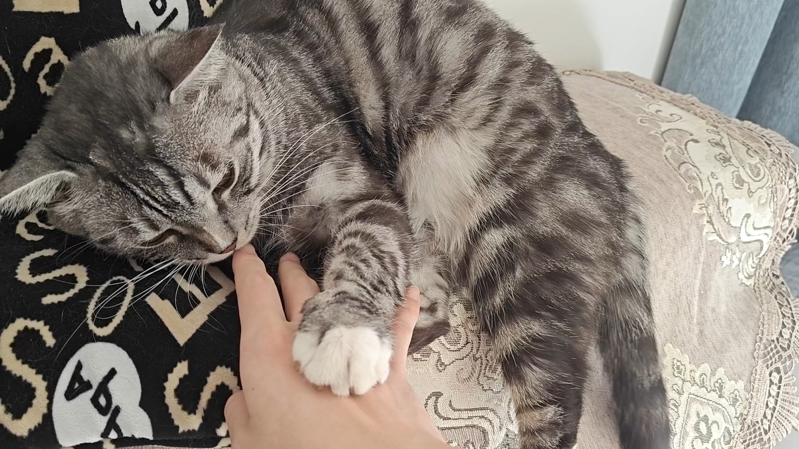 | 21 | 2026-02-22 |
| [是你吗？](https://www.bilibili.com/video/BV1c1fNBPE6Y) | 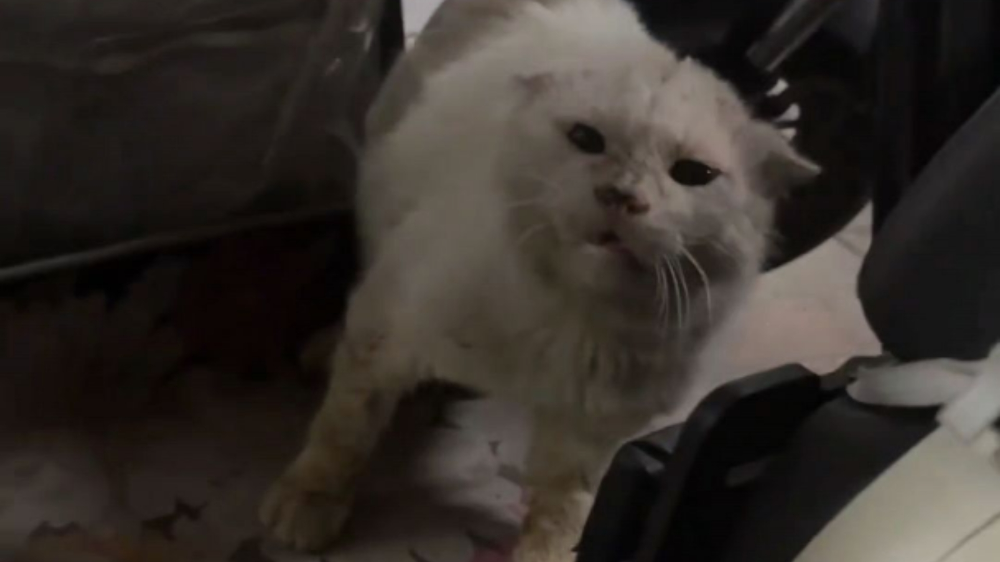 | 501 | 2026-02-22 |
| [哈基米杀完了](https://www.bilibili.com/video/BV1A6fNBqEe6) |  | 75 | 2026-02-22 |
| [哈基米日记之《另一叙述，私人回忆广告》](https://www.bilibili.com/video/BV14QfwBaEBR) |  | 359 | 2026-02-22 |
| [往事只能哈基米](https://www.bilibili.com/video/BV1bWfAB6E9d) | 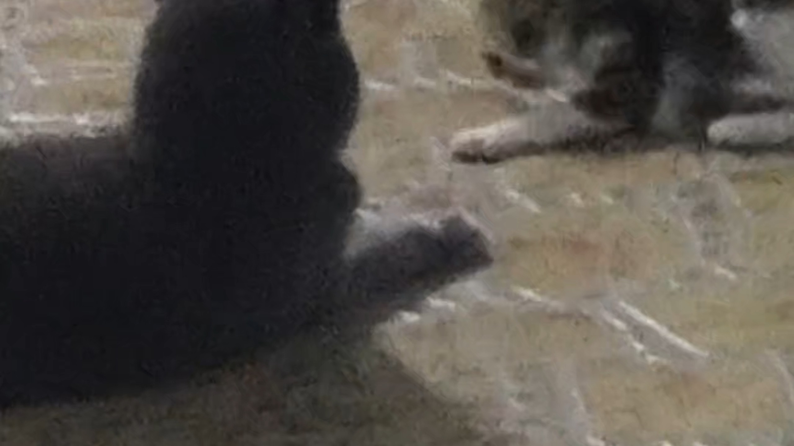 | 15 | 2026-02-22 |
| [【哈基米音乐】回忆の小曲 [𝑭𝑹𝑬𝑬]𝒍𝒖𝒄𝒌𝒚](https://www.bilibili.com/video/BV1jMfABDEXU) | 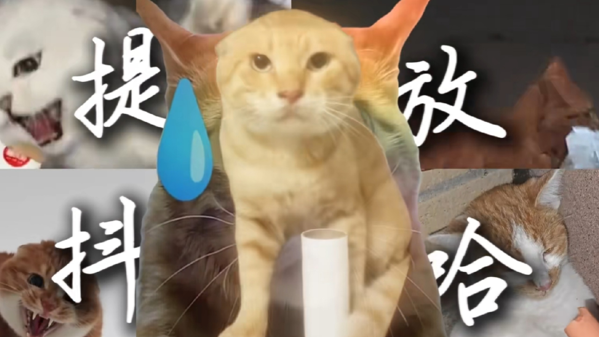 | 496 | 2026-02-22 |
| [快半岁的哈基米依旧喝奶](https://www.bilibili.com/video/BV1ZSfABQEFX) | 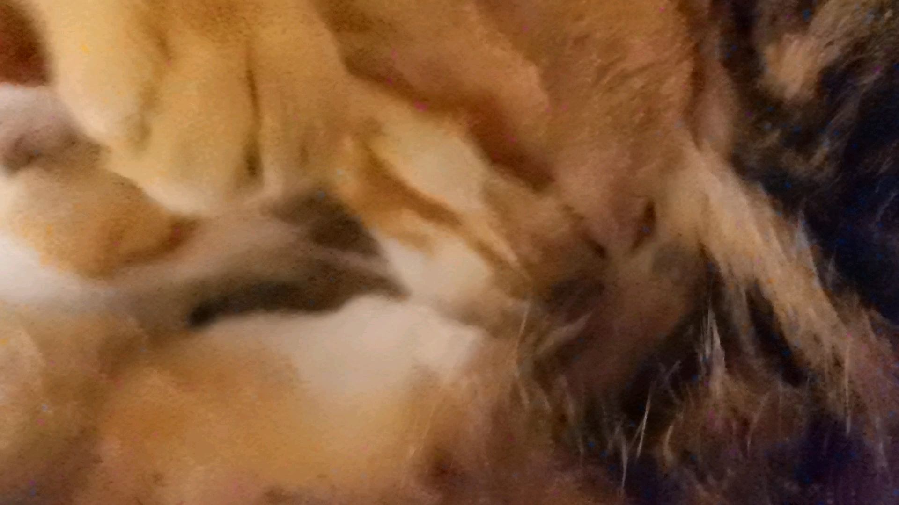 | 15 | 2026-02-22 |
| [哈基米南北绿豆阿西嘎阿西嘎](https://www.bilibili.com/video/BV1NifABaE2A) | 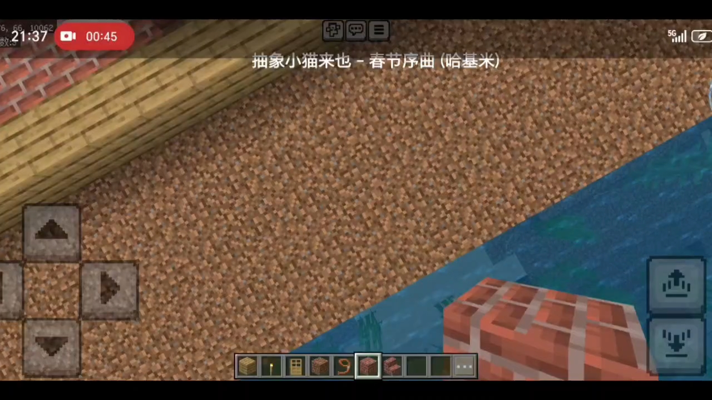 | 129 | 2026-02-22 |
| [哈基米](https://www.bilibili.com/video/BV123fPBqEVE) | 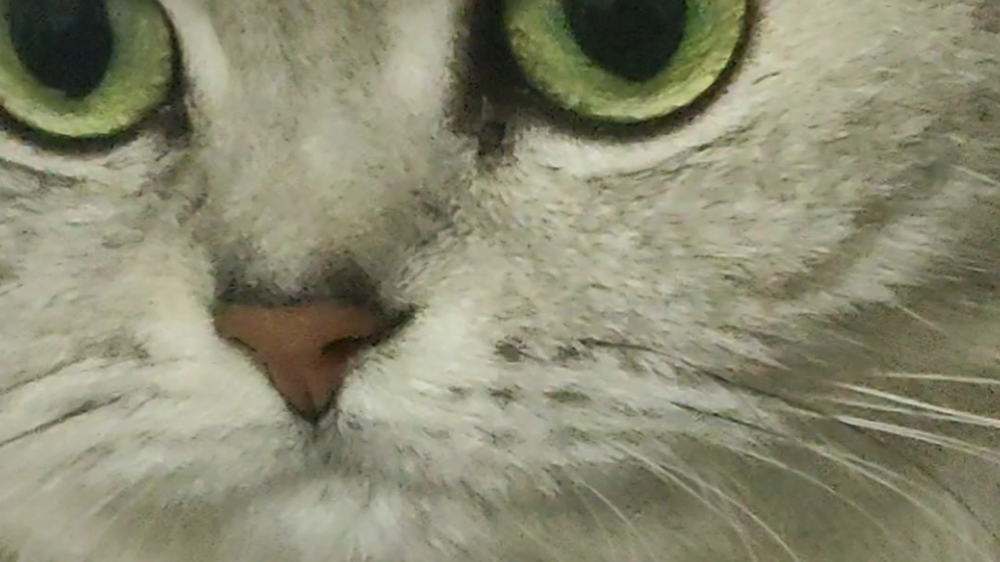 | 189 | 2026-02-22 |
| [【哈基米游戏主播】最新视频已上线，快来围观！](https://www.bilibili.com/video/BV1KVfPBTE1z) | 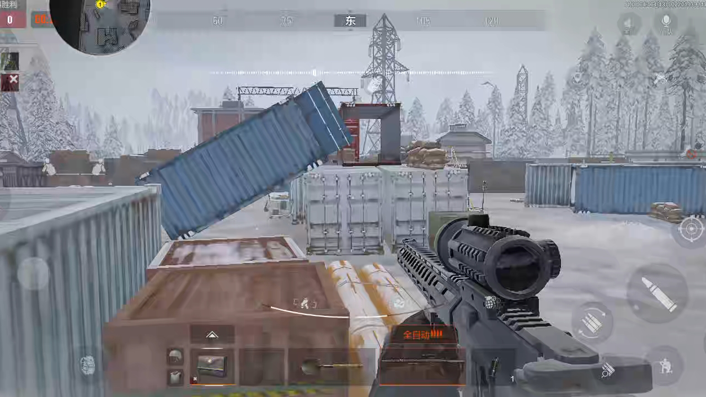 | 2 | 2026-02-22 |
| [【闹耄之城】😿数据线在胸口♿Cross Your Hachimi](https://www.bilibili.com/video/BV1GjfcBqEda) |  | 804 | 2026-02-22 |
| [春节期间我脑海里的旋律](https://www.bilibili.com/video/BV1VLfcBMEoA) |  | 39.3万 | 2026-02-22 |
| [小基米](https://www.bilibili.com/video/BV1VLfcBMEPQ) | 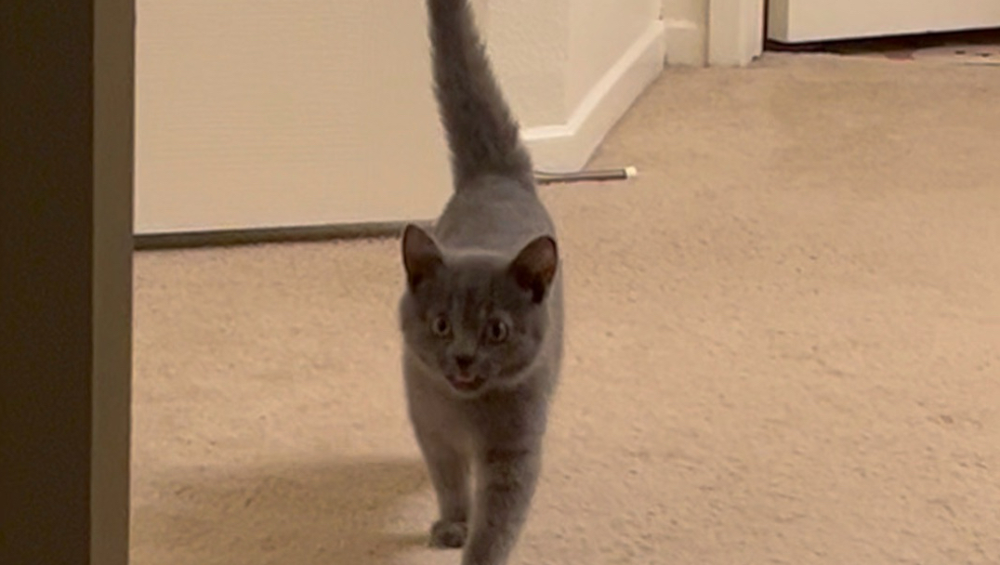 | 46 | 2026-02-22 |
| [🐱哈基米脑蚀🧠完整版](https://www.bilibili.com/video/BV16cfcBmE29) |  | 516 | 2026-02-22 |
| [【补档】哈基米超燃战斗音乐之Ascent（2026拜年基单品）](https://www.bilibili.com/video/BV1JcfcBmEPA) | 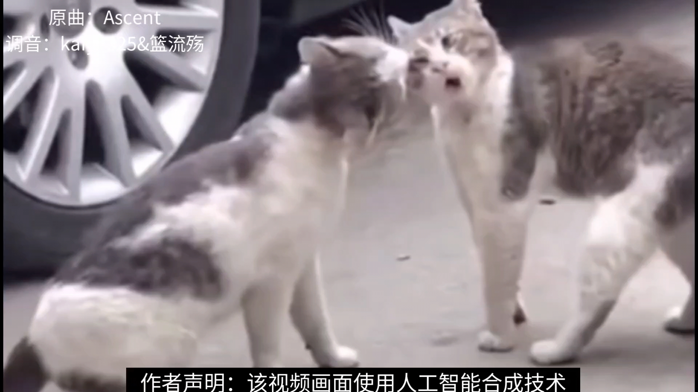 | 1224 | 2026-02-22 |
| [【补档】哈基米：基米洞（2026拜年基单品）](https://www.bilibili.com/video/BV1vufcBGEsa) |  | 1116 | 2026-02-22 |
| [白色耄耋：一哈一强普](https://www.bilibili.com/video/BV1qufcBGE37) | 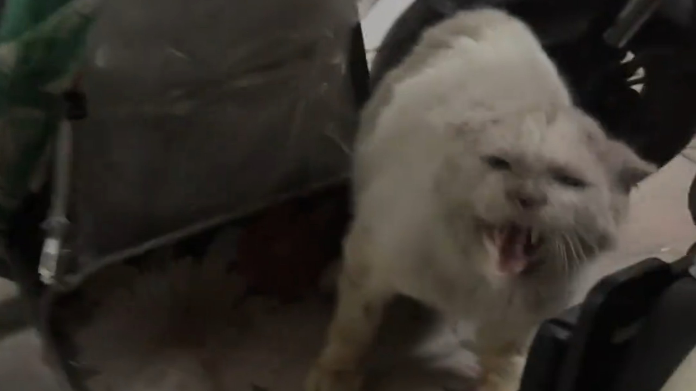 | 743 | 2026-02-22 |
| [哈基米🥰](https://www.bilibili.com/video/BV1fkfcBUEr2) | 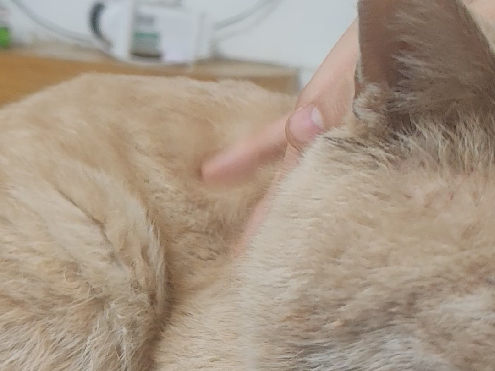 | 198 | 2026-02-22 |
| [kv2崩屁，但是把地狱哈基米崩进猫笼了](https://www.bilibili.com/video/BV1czfcBQEY9) |  | 261 | 2026-02-22 |
| [精卫(曼波哈基米 Remix)](https://www.bilibili.com/video/BV1pBfcBpE6o) |  | 12 | 2026-02-22 |
| [哈基米之歌](https://www.bilibili.com/video/BV1SPfwBeE3C) |  | 8 | 2026-02-22 |
| [666，怎么还有哈基米？](https://www.bilibili.com/video/BV113fwBfE5c) |  | 137 | 2026-02-22 |
| [白金之哈基米：孩子们我又回归了](https://www.bilibili.com/video/BV1Y3fHBhEik) |  | 5.4万 | 2026-02-22 |
| [哈基米来到哈基人家里百万撤离](https://www.bilibili.com/video/BV1evfwBVECy) | 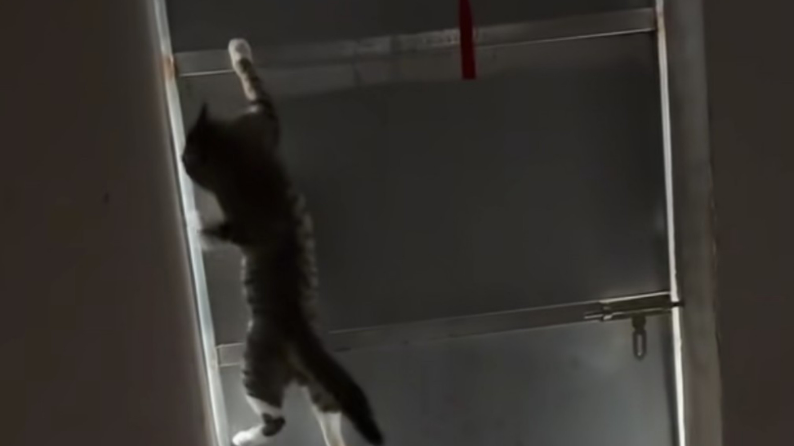 | 716 | 2026-02-22 |
| [【哈基米】“lookoutside/四尊的小曲”](https://www.bilibili.com/video/BV1HJfwBsEqC) |  | 1001 | 2026-02-22 |
| [哈基米之歌第一首](https://www.bilibili.com/video/BV1AvZfBmEcB) |  | 216 | 2026-02-22 |
| [哈基米四杀！](https://www.bilibili.com/video/BV1weZfB7EFD) | 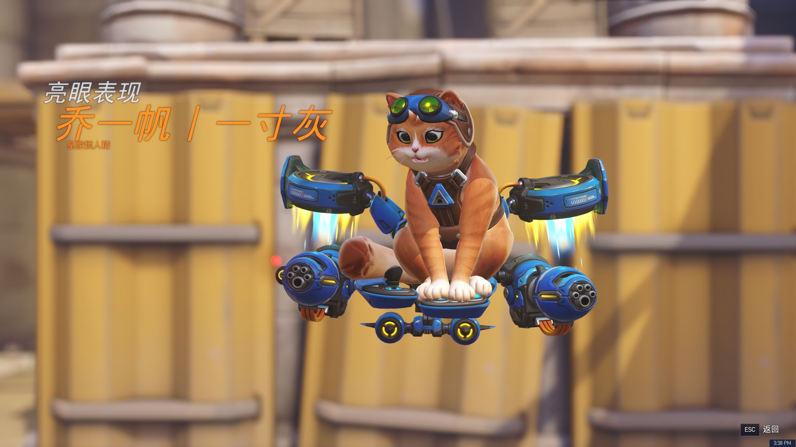 | 36 | 2026-02-22 |
| [数字方块哈基米正常S1~S4](https://www.bilibili.com/video/BV1UcfFBZEPg) |  | 281 | 2026-02-22 |
| [家有哈基米](https://www.bilibili.com/video/BV18cfFBfEgg) | 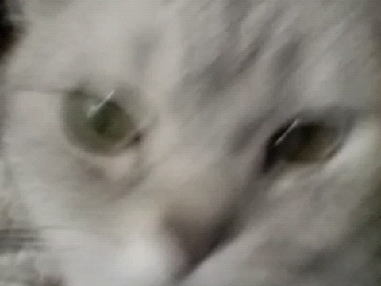 | 62 | 2026-02-22 |
| [刀盾大战哈基米](https://www.bilibili.com/video/BV1ebfFBzE6G) |  | 25 | 2026-02-22 |
| [【哈基米音乐】星哈追梦🎵](https://www.bilibili.com/video/BV1fsfFBGE3k) |  | 1357 | 2026-02-22 |
| [【就是一只哈基米】最新视频上线，求关注！](https://www.bilibili.com/video/BV1yGfFBnEVw) | 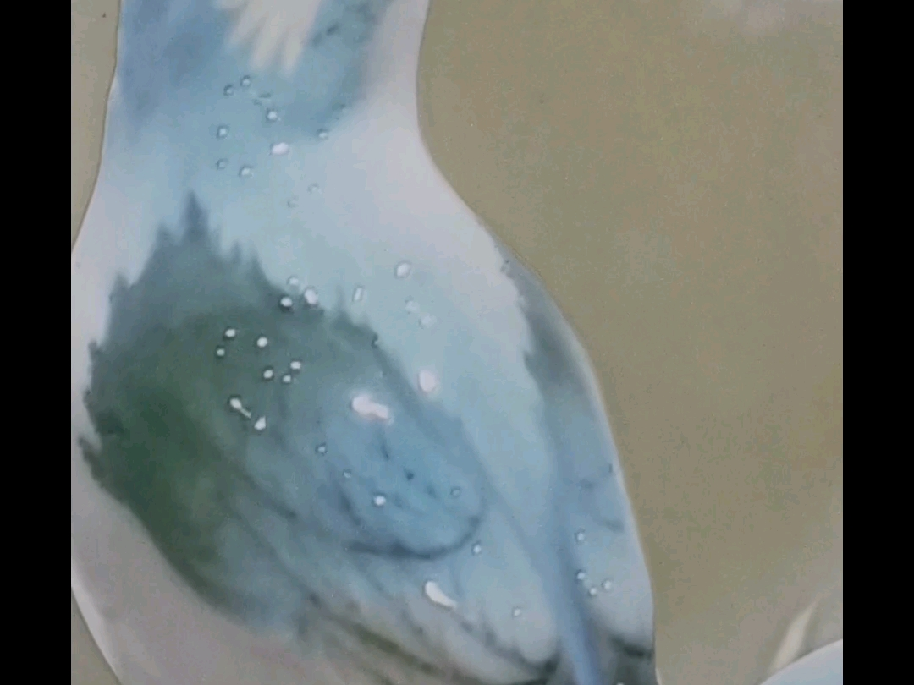 | 34 | 2026-02-22 |
| [【就是一只哈基米】最新视频已上线，快来围观！](https://www.bilibili.com/video/BV1AVfFBDEZU) |  | 144 | 2026-02-22 |
| [还是和米老鼠不熟吗](https://www.bilibili.com/video/BV1C9fFBpEMw) | 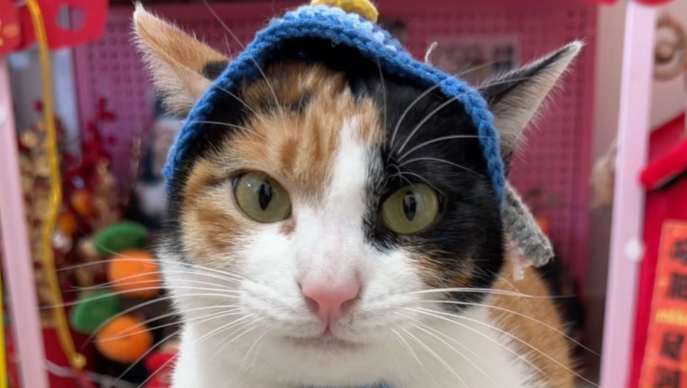 | 15.0万 | 2026-02-22 |
| [小安卡：哈基米也到了《基米到》【哈基米金曲】~](https://www.bilibili.com/video/BV186fFBwEkR) |  | 691 | 2026-02-22 |
| [万恶之源之哈基米开山鼻祖](https://www.bilibili.com/video/BV141fFBZEXw) | 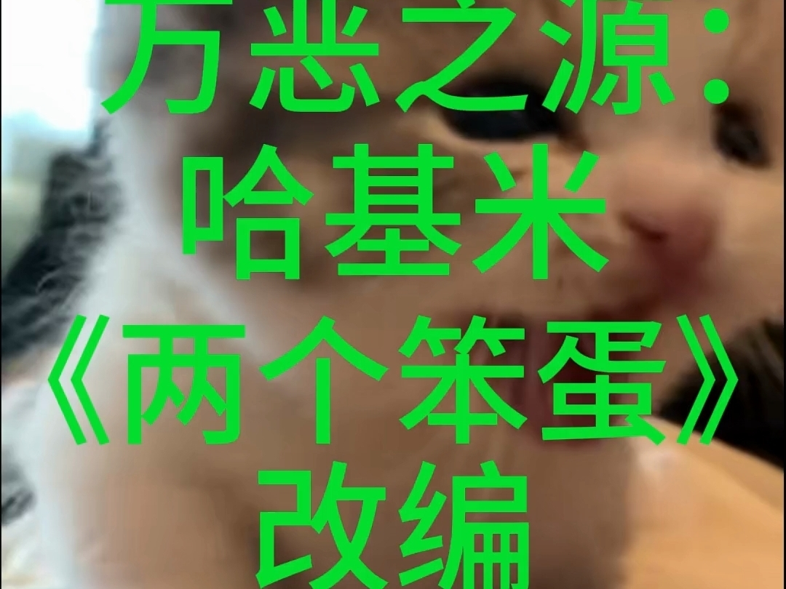 | 380 | 2026-02-22 |
| [哈基米被卡住了哈基人死活拔不出来](https://www.bilibili.com/video/BV14mfFB4Ezv) |  | 6983 | 2026-02-22 |
| [【创游世界】试玩哈基米摸金，开局就出了大红🤑](https://www.bilibili.com/video/BV12mfFB4EiF) | 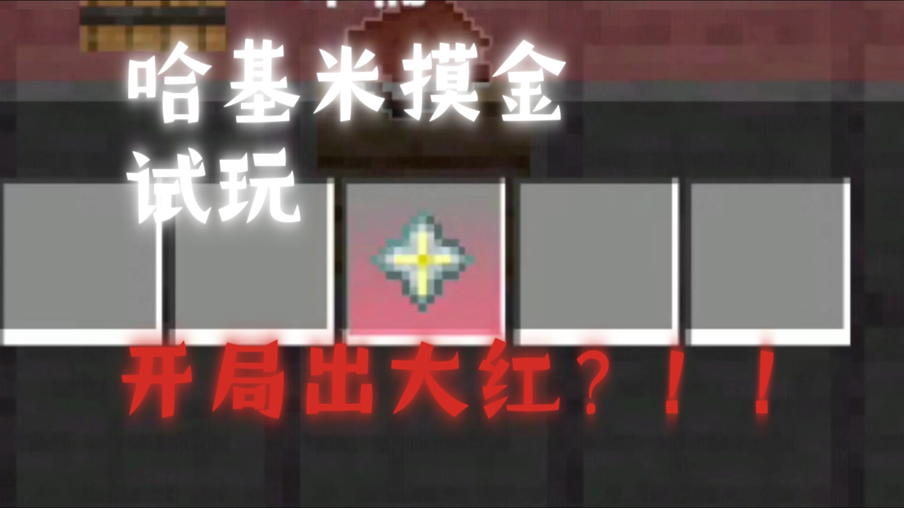 | 68 | 2026-02-22 |
| [哈基米依旧cos彪马](https://www.bilibili.com/video/BV1uoZoB9EGU) | 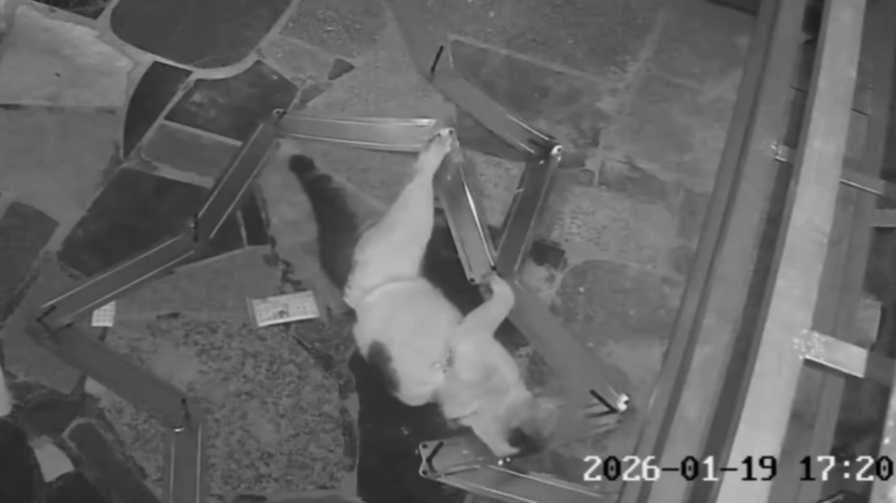 | 1.9万 | 2026-02-22 |
| [神人演唱哈基米山歌](https://www.bilibili.com/video/BV1yNZZB7E9s) |  | 170 | 2026-02-22 |
| [【哈基米】室内系的 track maker🐱](https://www.bilibili.com/video/BV15QfHBPEFK) |  | 897 | 2026-02-22 |
| [卡兹最诡异的图片18，哈基米已吃物资短缺](https://www.bilibili.com/video/BV1c5ZZBGE72) |  | 1.4万 | 2026-02-22 |
| [⚡️“是时候给新生代补充一点知识了”⚡️](https://www.bilibili.com/video/BV1spfJBLEdA) |  | 1.2万 | 2026-02-22 |
| [哈基米自转1分钟。](https://www.bilibili.com/video/BV1V3ZfBAExx) | 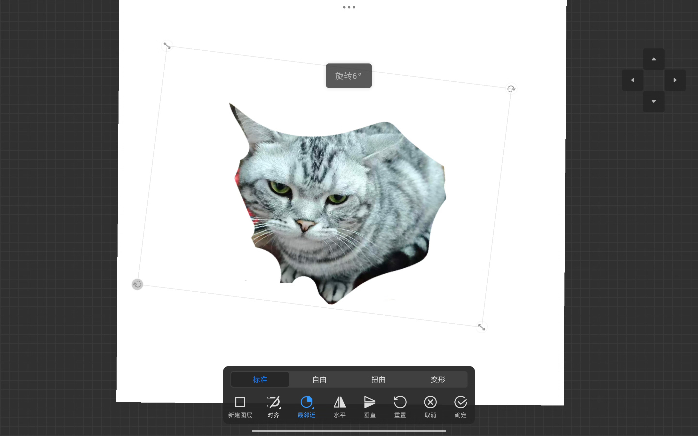 | 8 | 2026-02-22 |
| [10种地狱猫增强方案，看完不笑的奖励玩91把美跳](https://www.bilibili.com/video/BV18hZdBQEhu) | 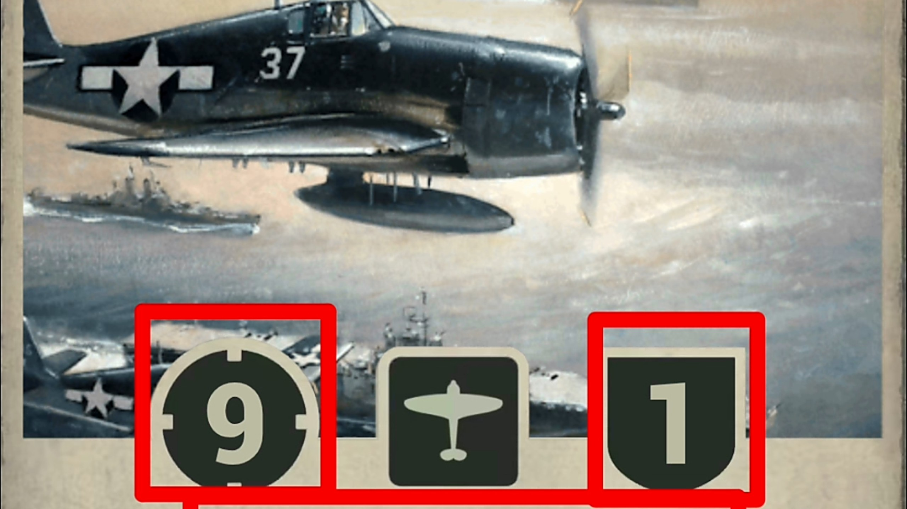 | 1.2万 | 2026-02-21 |
| [【哈基米音乐】🎶爵士好🐎](https://www.bilibili.com/video/BV19VfHBFEaH) |  | 2040 | 2026-02-21 |
| [哈基米是什么？](https://www.bilibili.com/video/BV1ALfpBmEh5) | 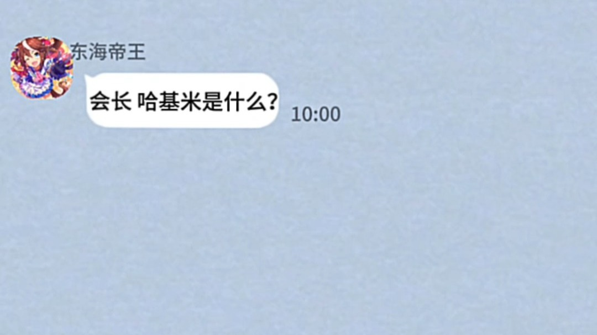 | 1542 | 2026-02-21 |
| [这猫怎么总是一惊一乍的😓](https://www.bilibili.com/video/BV1EBfJBNE2c) | 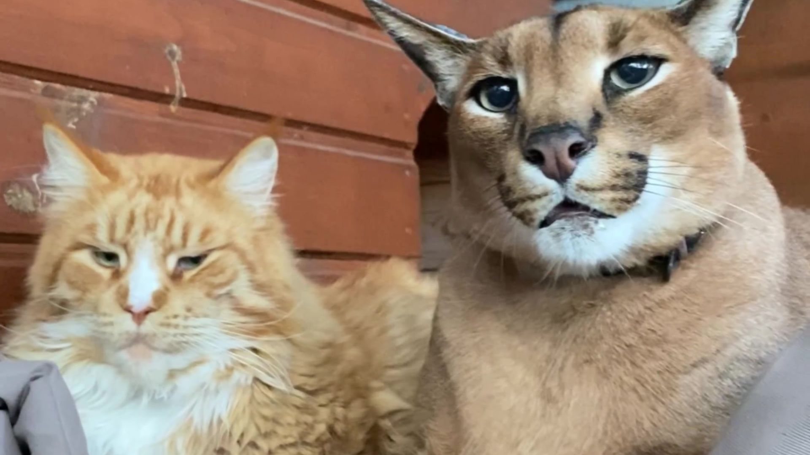 | 6617 | 2026-02-21 |
| [欧布哈基米：红凯之歌](https://www.bilibili.com/video/BV1W3fnBkEVp) |  | 4281 | 2026-02-21 |
| [非洲最致命的哈基米——黑足猫](https://www.bilibili.com/video/BV1uRfJBWE2s) | 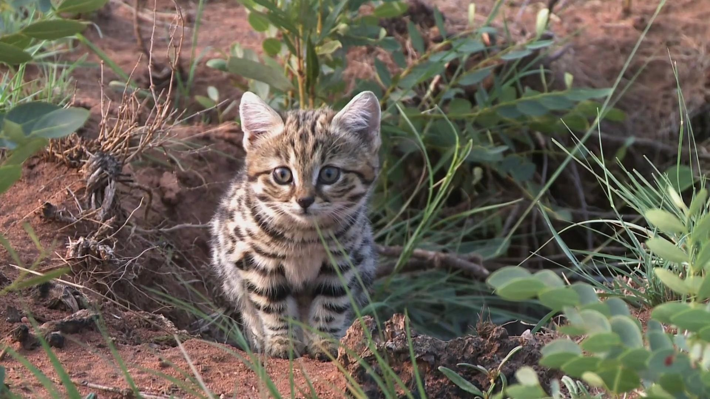 | 3109 | 2026-02-21 |
| [【智人TV】辣条口罩这一块 &amp; 拜年这一块](https://www.bilibili.com/video/BV1SafEBJEYW) | 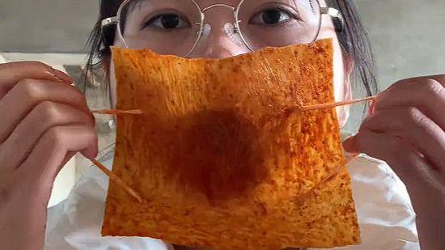 | 87.1万 | 2026-02-21 |
| [老吴哦～老吴哦老吴老吴老吴老吴～老吴哦～老吴哦老吴老吴老吴老吴～老吴哦～老吴哦老吴老吴老吴老吴老吴哦～老吴哦老吴老吴老吴老吴～#橘猫 哈基咪#哈基咪](https://www.bilibili.com/video/BV1f7fnBqEyV) | 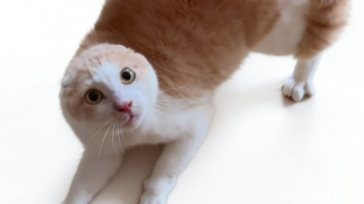 | 1.9万 | 2026-02-21 |
| [【哈基ミク】Manbo Brand【2026哈基米拜年基单品】](https://www.bilibili.com/video/BV1qWfnBeEfh) |  | 1025 | 2026-02-21 |
| [【新春特辑】哈基米50首名曲大合集&amp;不哈气挑战](https://www.bilibili.com/video/BV11ofLBiEz6) | 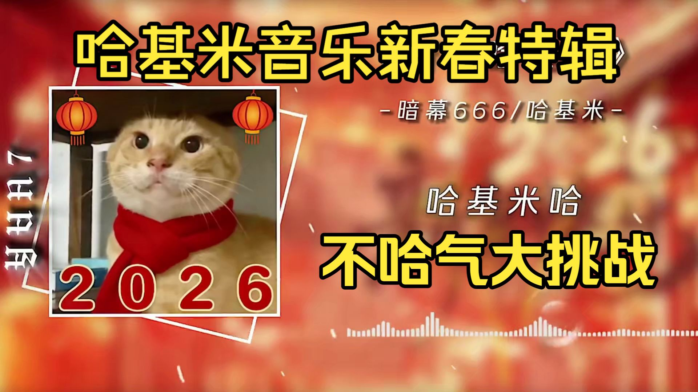 | 975 | 2026-02-21 |
| [【浴室翻唱】哈基米：春节序曲](https://www.bilibili.com/video/BV1bUfVBPEPc) | 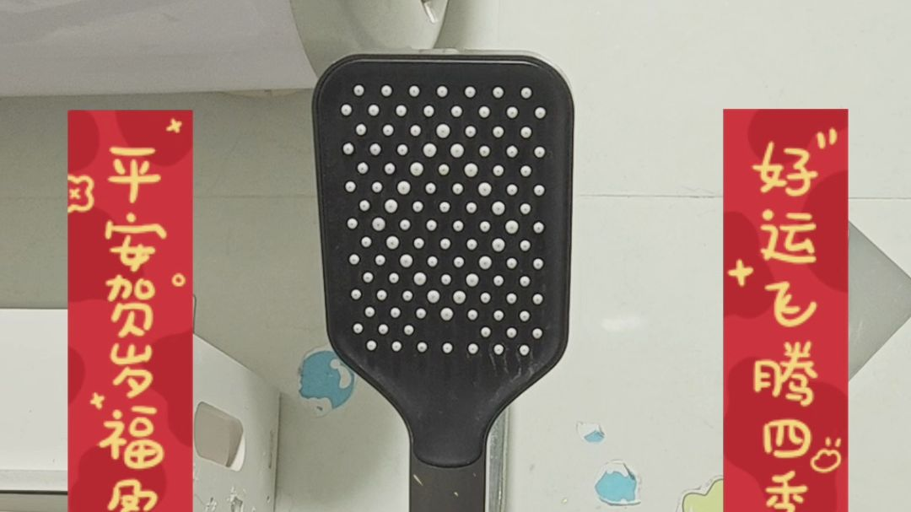 | 2538 | 2026-02-21 |
| [科比与圆头耄耋の爱恨情仇](https://www.bilibili.com/video/BV1Z3f5B7Eqx) |  | 4.2万 | 2026-02-21 |
| [跳楼基+123我哈你](https://www.bilibili.com/video/BV1t2f3BoEbZ) | 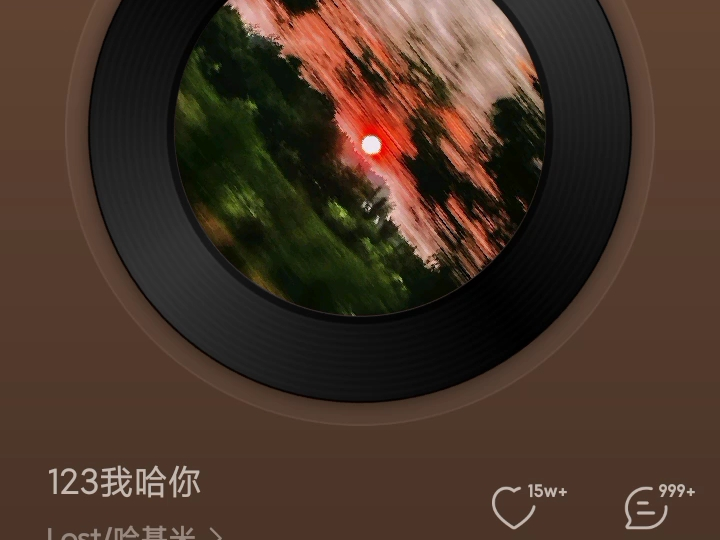 | 17 | 2026-02-20 |
| [《乱世哈》耄耋哈尽楼台宫阙 那登神长阶](https://www.bilibili.com/video/BV18UZ8BLE2s) | 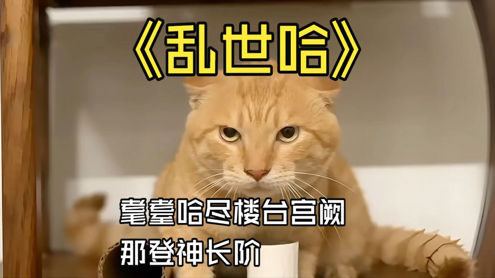 | 3235 | 2026-02-20 |
| [可恶的哈基米！](https://www.bilibili.com/video/BV1EHfuBKEna) | 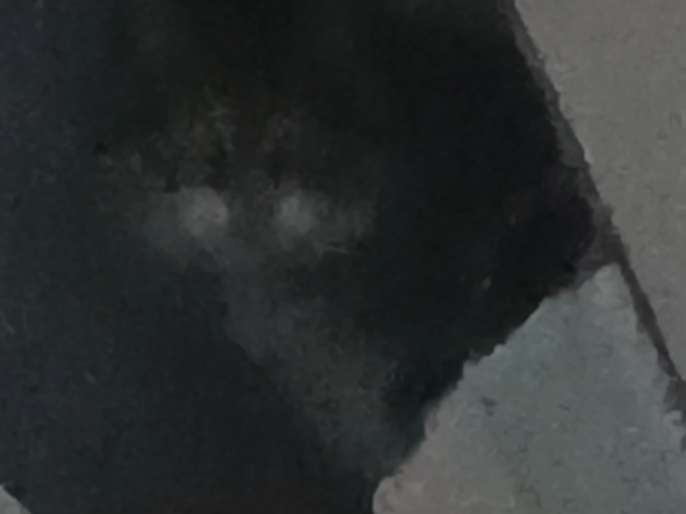 | 148 | 2026-02-20 |
| [🐔“真 希 望 鸡 能 叫 不 停”🐔](https://www.bilibili.com/video/BV1DAZrByEiS) |  | 6.6万 | 2026-02-20 |
| [初～四～迎～基～米～](https://www.bilibili.com/video/BV1uzZqBeE1S) |  | 1681 | 2026-02-20 |
| [压缩猫纯享版](https://www.bilibili.com/video/BV1zzZBBpERr) | 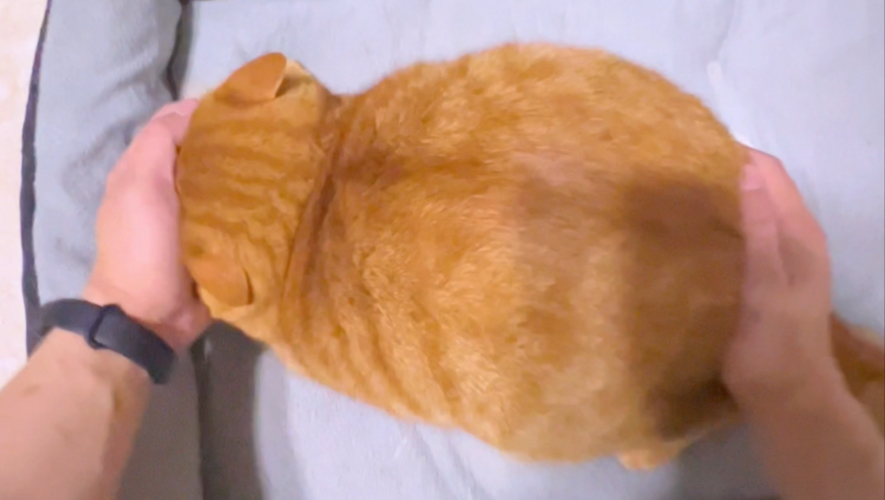 | 12.6万 | 2026-02-20 |
| [【基区零】咬哈力](https://www.bilibili.com/video/BV1QVZiBaEZQ) | 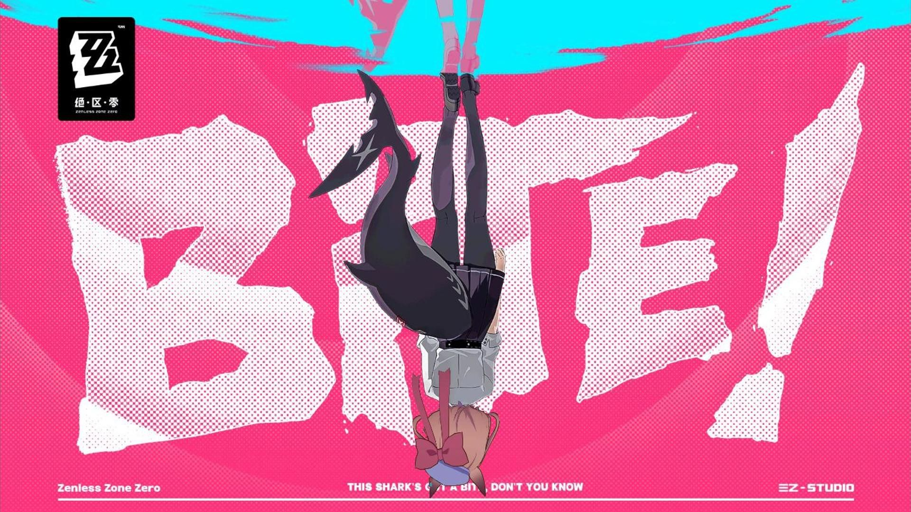 | 4021 | 2026-02-20 |
| [哆啦A梦哈基米原版](https://www.bilibili.com/video/BV1XgZiBeEPV) | 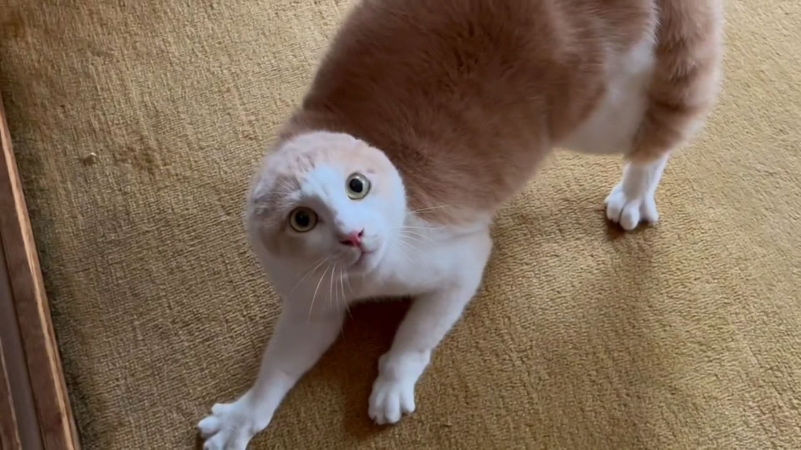 | 8267 | 2026-02-19 |
| [《雪地传来了哈气声》](https://www.bilibili.com/video/BV1jwZeBAE3A) | 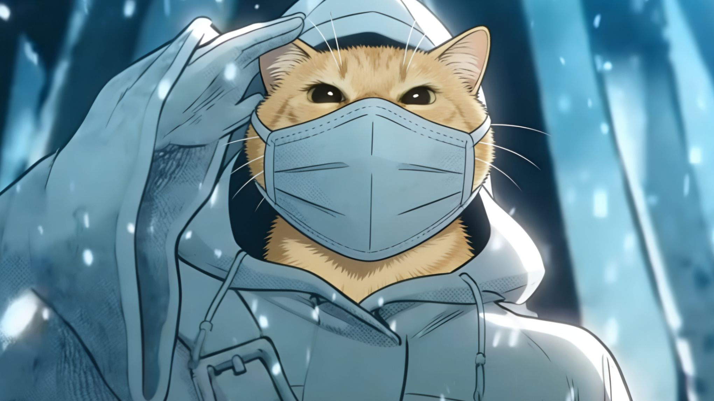 | 7.2万 | 2026-02-19 |
| [[哈基潜兵]哈基生化人](https://www.bilibili.com/video/BV1boZeBsEAr) |  | 6904 | 2026-02-19 |
| [【《命案の小曲》《笑脸の小曲》】《哈基米专享版》](https://www.bilibili.com/video/BV1GQZeBfEcx) | 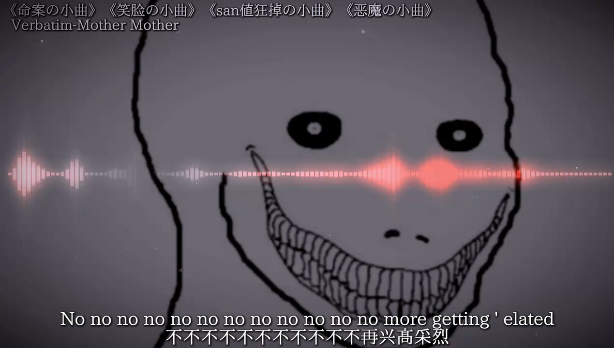 | 356 | 2026-02-19 |
| [【梗百科】撒贝宁老鼠干是啥梗？](https://www.bilibili.com/video/BV1wSZYB3ExD) |  | 556.4万 | 2026-02-19 |
| [新春《哈基米南北绿豆》说唱第二弹，JK小姐姐谢幕Wink!](https://www.bilibili.com/video/BV1xqZYBJEXu) |  | 411 | 2026-02-19 |
| [耄耋哈尽了吗…](https://www.bilibili.com/video/BV1LLZQB7Ear) | 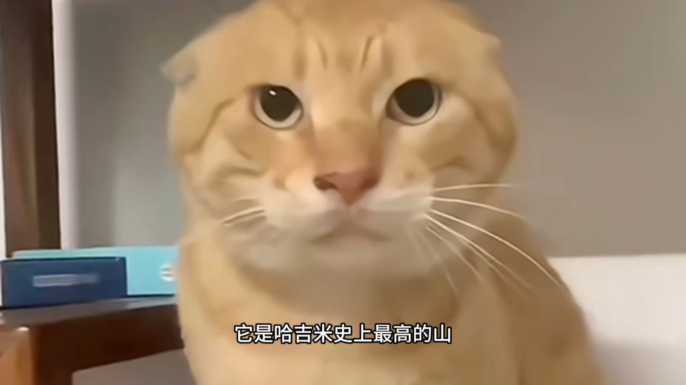 | 2309 | 2026-02-18 |
| [我的刀盾可爱动静：seedance2.0](https://www.bilibili.com/video/BV1zAZQBsEHi) | 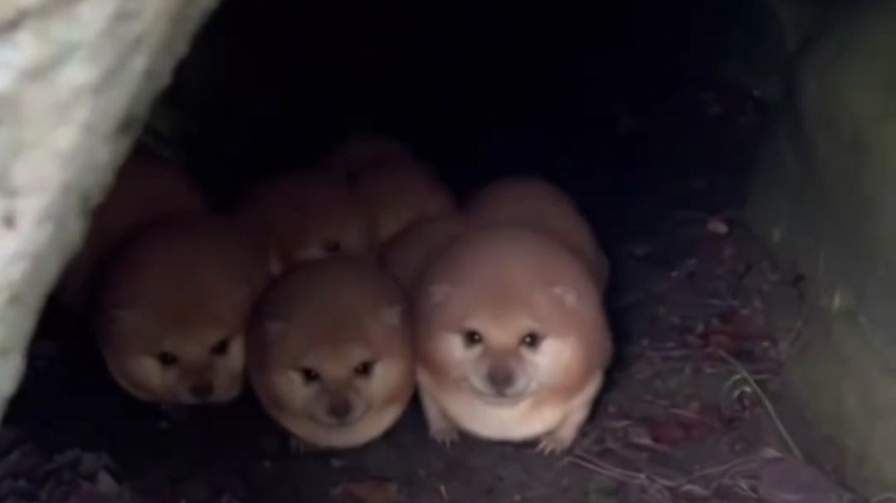 | 46.0万 | 2026-02-18 |
| [基～米～到！！！](https://www.bilibili.com/video/BV1RNZ1BfEgj) |  | 9.3万 | 2026-02-17 |
| [“西部慢拔out！！！”](https://www.bilibili.com/video/BV19kZnB4EVm) |  | 47.9万 | 2026-02-17 |
| [打火机（哈基米）](https://www.bilibili.com/video/BV1DiZ5BTEGB) | 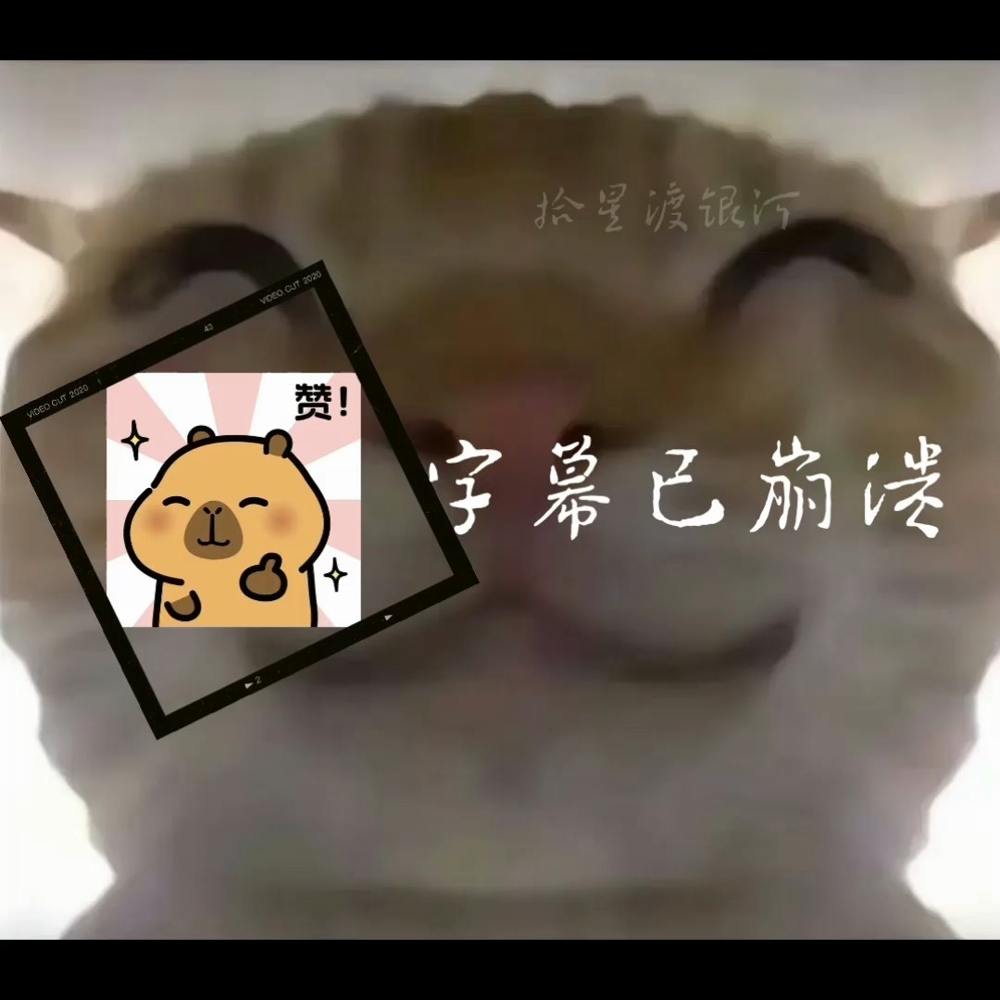 | 157 | 2026-02-17 |
| [【ai恐怖】逃 离 哈 基 米](https://www.bilibili.com/video/BV1hCZTBJEtE) |  | 365 | 2026-02-16 |
| [【致死量-13小时超长音乐合集】您的2026年热歌合集，请查收~~~](https://www.bilibili.com/video/BV18BZABTEcH) |  | 19.3万 | 2026-02-16 |
| [即梦Seedance 2.0 李小龙大战耄耋](https://www.bilibili.com/video/BV1ZyZ4BJEAR) |  | 4.1万 | 2026-02-15 |
| [朗诵《跳楼基》](https://www.bilibili.com/video/BV1rnZtBRE37) |  | 402 | 2026-02-15 |
| [“万物终归向海”《精卫》（加长版）](https://www.bilibili.com/video/BV1TMcqziEgb) |  | 26.2万 | 2026-02-15 |
| [哈基米：オッホ愛哟我滴妈](https://www.bilibili.com/video/BV1iuZ4B5Exs) |  | 4545 | 2026-02-15 |
| [哈基米笑传之产产兵【喵喵的结合】](https://www.bilibili.com/video/BV1ZAZLBUEwr) |  | 2.4万 | 2026-02-14 |
| [🐱I Really Like Hachimi🐱](https://www.bilibili.com/video/BV1G5ZLBGEdj) |  | 4.2万 | 2026-02-14 |
| [疯 狂 的 中 华 娘🐦挑战全网最全动作！](https://www.bilibili.com/video/BV1fCcpzLEFw) | 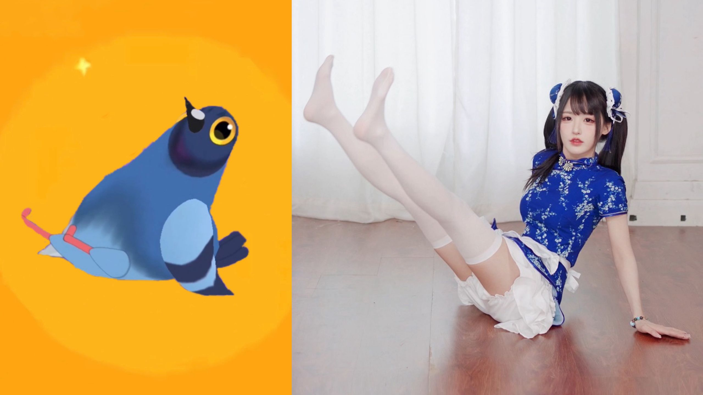 | 828.7万 | 2026-02-14 |
| [“给我擦皮鞋”“我要验牌”法国赌神-皮亚.卡松](https://www.bilibili.com/video/BV1CpcEzVE2F) |  | 24.4万 | 2026-02-13 |
| [26年最难听的洗脑神曲，到底是谁爱听！](https://www.bilibili.com/video/BV16scjzPEUN) |  | 514.9万 | 2026-02-13 |
| [这才是真正的阴乐](https://www.bilibili.com/video/BV14A6tBxEdN) |  | 49.4万 | 2026-02-01 |
| [循环音乐｜《精卫》&quot;万物终归向海 何必衔木石来&quot;](https://www.bilibili.com/video/BV1K5rSBHE64) |  | 87.6万 | 2026-01-17 |
| [哈基版所有的明天](https://www.bilibili.com/video/BV1pHp8zFE9k) | 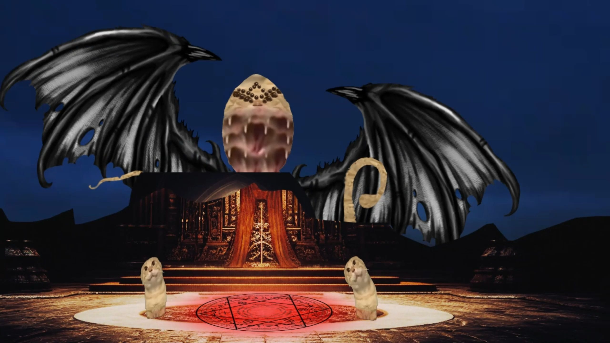 | 11.5万 | 2025-09-17 |
| [🐱㋰哈基集合体🐱](https://www.bilibili.com/video/BV1unhyziECZ) |  | 12.7万 | 2025-08-31 |
| [哈基米：Natalie](https://www.bilibili.com/video/BV1aSTqzFEH1) |  | 17.4万 | 2025-06-10 |
| [曼波《不许发财》](https://www.bilibili.com/video/BV1J8fDYaEsX) |  | 58.9万 | 2025-01-28 |

---
*最后更新: 2026-02-23 03:15:03 (自动生成)*
*数据来源: [Bilibili](https://www.bilibili.com)*

## 使用说明

运行以下命令更新视频列表:
```bash
python3 fetch_hajimi_videos.py
```
