# awesome-hajimi
collections of hajimi (哈基米 in Chinese) on the Internet.

## 视频列表 (Video List)

| 视频标题 (Title) | 封面 | 播放量 (Views) | 发布日期 (Date) |
|---|---|---|---|
| [Mugi，你最近在学英语吗？](https://www.bilibili.com/video/BV1zMgN6BEjn) | 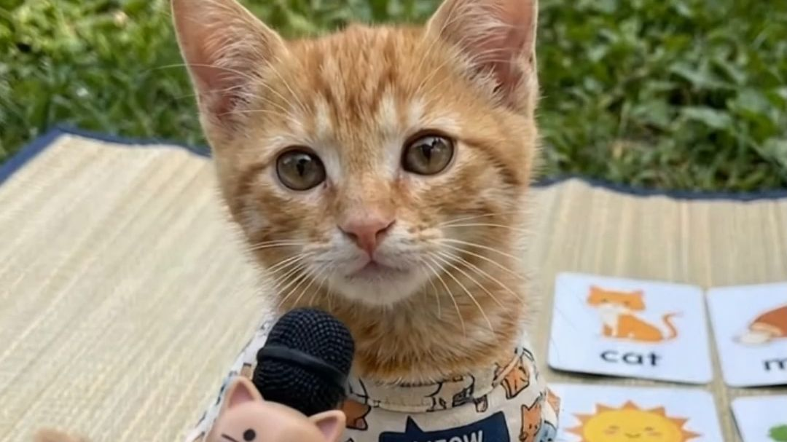 | 2.6万 | 2026-08-14 |
| [[镜片映射] 超绝哈基米南北绿斩 -19Day](https://www.bilibili.com/video/BV1rVgw6BE9X) |  | 2150 | 2026-08-14 |
| [【新日V】【微信切片】热唱哈基米音乐【奇比chippy】](https://www.bilibili.com/video/BV1rjgw6iEwd) | 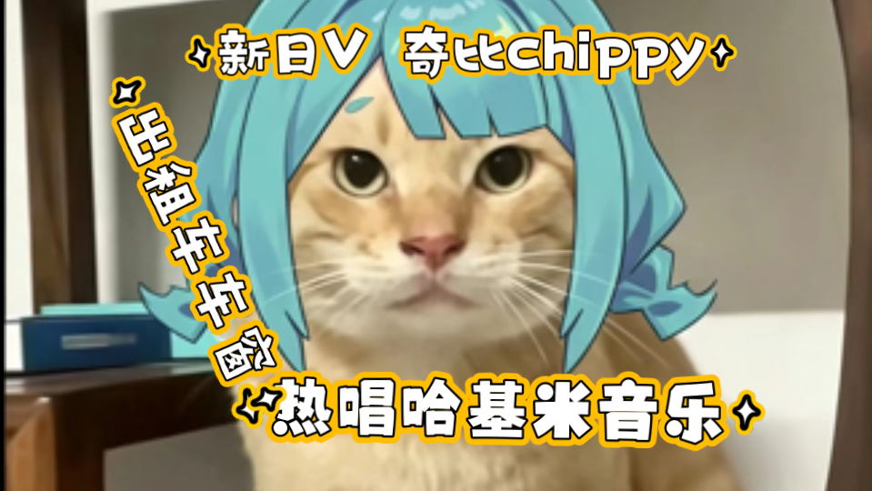 | 2270 | 2026-08-14 |
| [M18 I 地狱哈基米 I](https://www.bilibili.com/video/BV1Skgw6UESY) |  | 2435 | 2026-08-14 |
| [🐱！！！](https://www.bilibili.com/video/BV1w9gw63EDe) |  | 9177 | 2026-08-14 |
| [【喵喵的结合】感受一下官中翻译的实力](https://www.bilibili.com/video/BV1y9gw6gEKs) |  | 5604 | 2026-08-14 |
| [哈基米，我要你助我升空](https://www.bilibili.com/video/BV1DBgw6nEZy) |  | 1582 | 2026-08-14 |
| [何为张力5.0](https://www.bilibili.com/video/BV1iTgA6hEq7) |  | 4.0万 | 2026-08-14 |
| [当咬人哈基米被制裁时](https://www.bilibili.com/video/BV1qTgA6hEqH) | 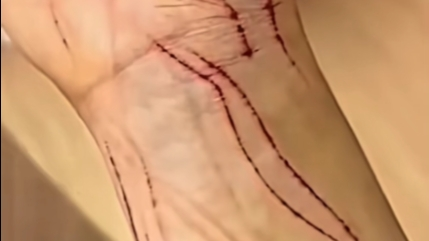 | 771 | 2026-08-14 |
| [猫儿这个不想被救](https://www.bilibili.com/video/BV1dugA6FEJo) | 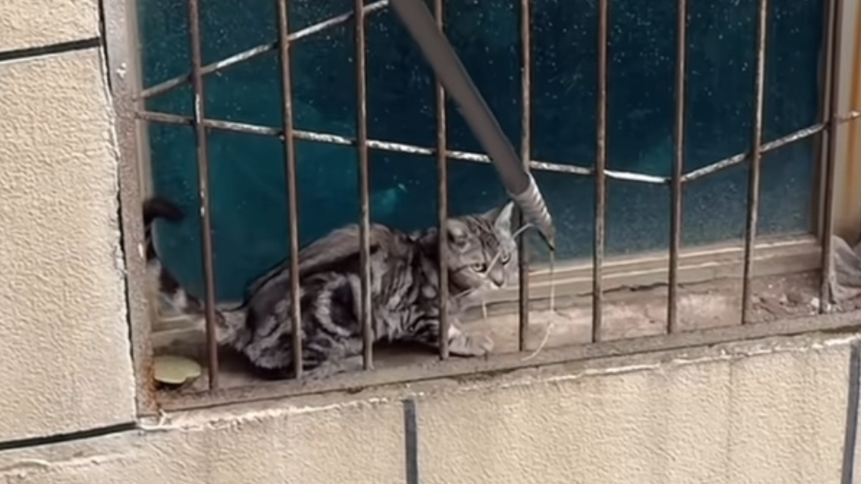 | 629 | 2026-08-14 |
| [大橘哥哥176](https://www.bilibili.com/video/BV1vugA6FESj) | 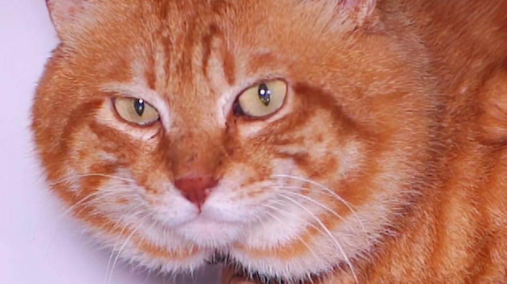 | 4.1万 | 2026-08-14 |
| [丑猫](https://www.bilibili.com/video/BV1Y5gA6dEPg) | 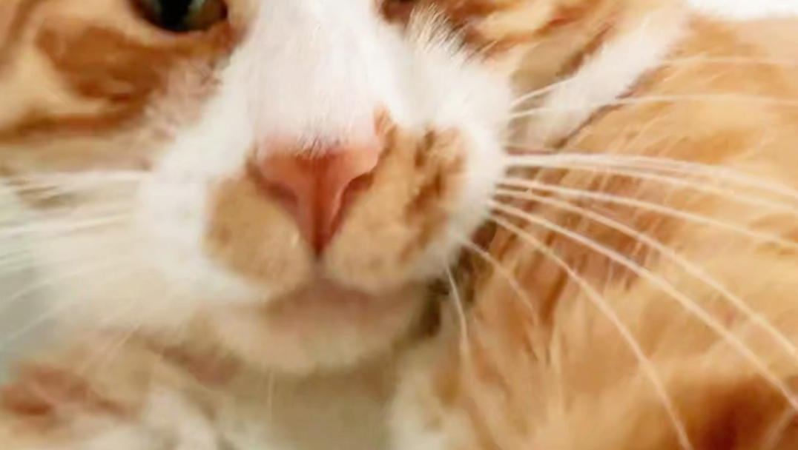 | 343 | 2026-08-14 |
| [再见了虎皮蛋糕](https://www.bilibili.com/video/BV1CRgw6zELX) | 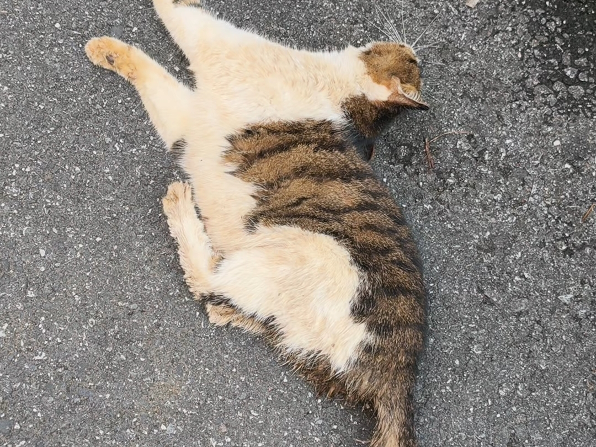 | 6291 | 2026-08-14 |
| [给钱了吗？你就摸我？！](https://www.bilibili.com/video/BV1yvgA6GENR) | 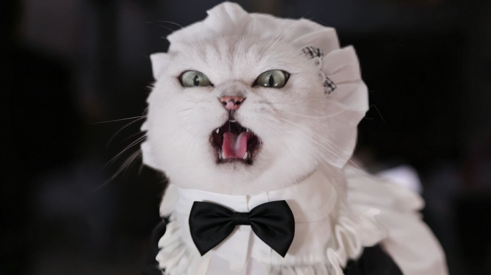 | 4.8万 | 2026-08-14 |
| [“当全世界都知道你10天后成为超人（22）”](https://www.bilibili.com/video/BV1BAgA6PE2o) | 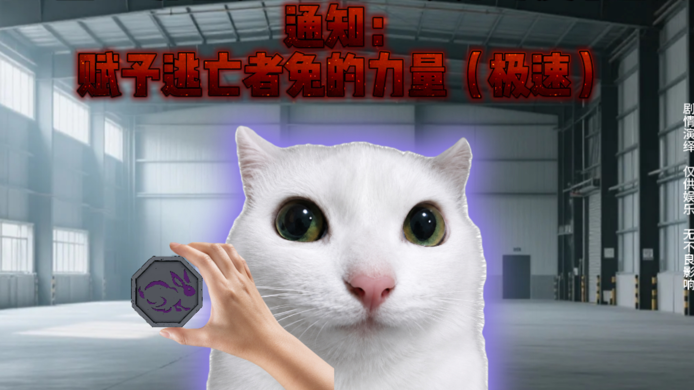 | 39.8万 | 2026-08-14 |
| [花500万养413只猫咪？她可能是上海养猫最多的阿姨！](https://www.bilibili.com/video/BV1gJgA6WEu3) |  | 27.0万 | 2026-08-14 |
| [辣条TV之队友标一下](https://www.bilibili.com/video/BV1HzgA6zEkf) | 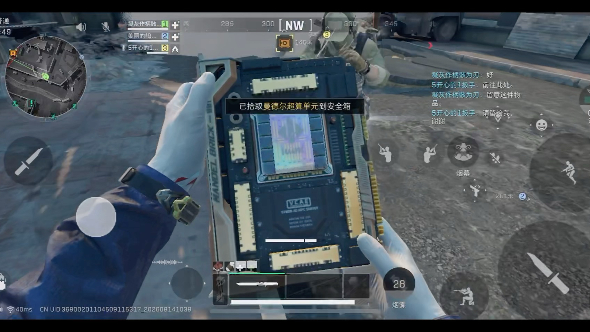 | 3.3万 | 2026-08-14 |
| [泰山崩于前而色不变](https://www.bilibili.com/video/BV1UpgA6nEr4) | 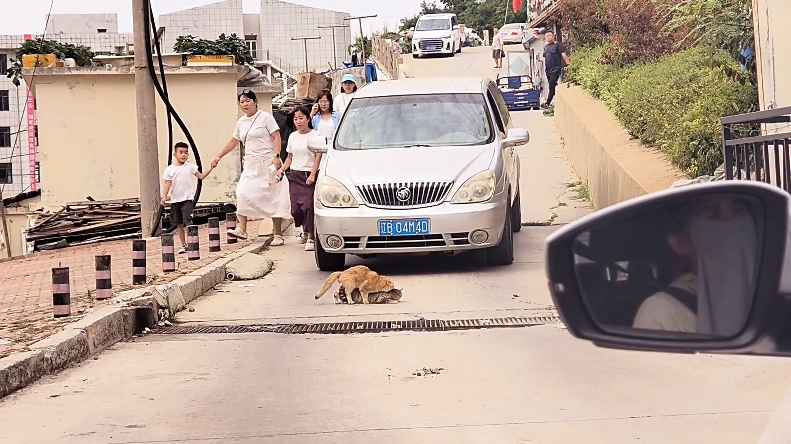 | 4707 | 2026-08-14 |
| [《走天涯》｜😡你的脚步流浪在天涯🌹我的思念随你到远方😡🌹【Hi-Res/4K】](https://www.bilibili.com/video/BV14bgA6jEr3) |  | 1060 | 2026-08-14 |
| [哈基猫奇遇记：烤架危机](https://www.bilibili.com/video/BV1DJgA6pEMK) |  | 2.5万 | 2026-08-14 |
| [哈基米成为了猫一杯](https://www.bilibili.com/video/BV12bgA6jEkV) | 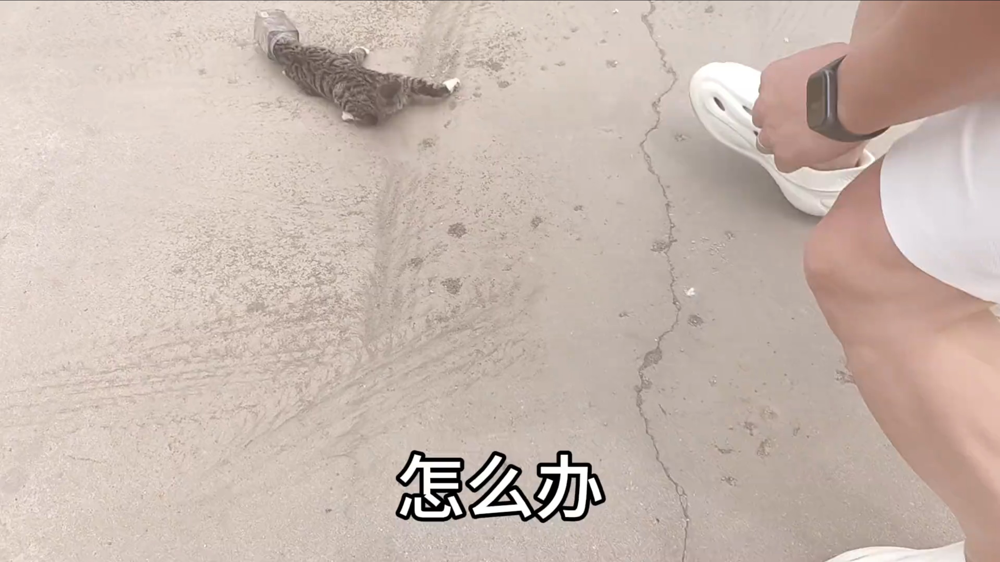 | 3768 | 2026-08-14 |
| [猫咪的头被卡在罐子里吃不到猫粮](https://www.bilibili.com/video/BV1s8gA61EYJ) | 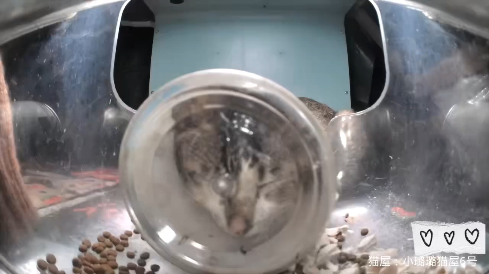 | 1785 | 2026-08-14 |
| [【雪绘Yukie】温柔女牙医~给雪王哄成小雪咪了！雪王变成雪🐢了说是](https://www.bilibili.com/video/BV1y8gA61ESW) |  | 1.1万 | 2026-08-14 |
| [悠闲的嘬！](https://www.bilibili.com/video/BV14xgA6EEyD) | 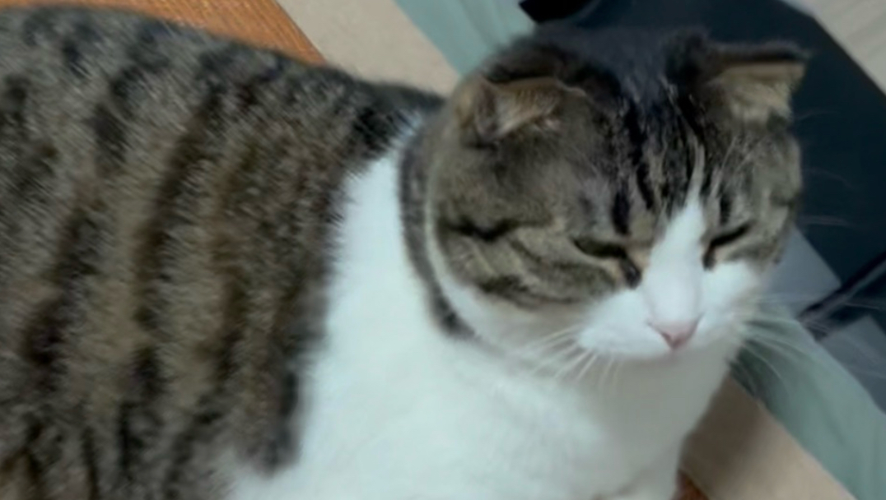 | 2.6万 | 2026-08-14 |
| [为什么猫咪经常会出现一些雷霆坐姿？](https://www.bilibili.com/video/BV1bxgA6EE5d) | 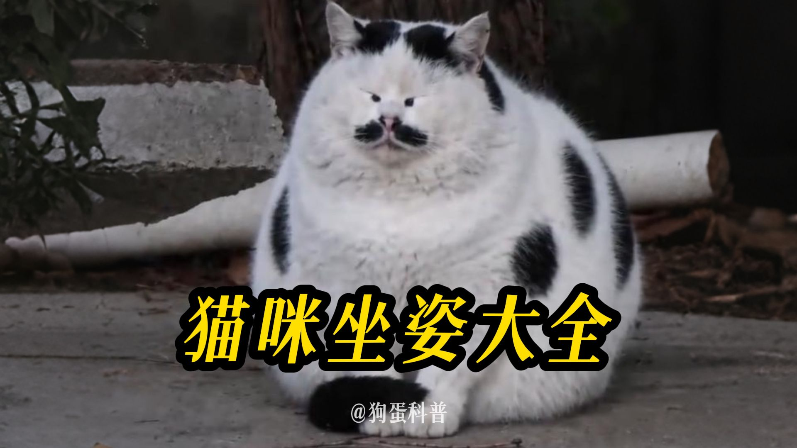 | 8098 | 2026-08-14 |
| [华强买瓜，但是印度傲慢小贩罗宾·郝](https://www.bilibili.com/video/BV124gA6mE87) |  | 1.0万 | 2026-08-14 |
| [全网最无奈的老吴](https://www.bilibili.com/video/BV1TCgF6gEew) | 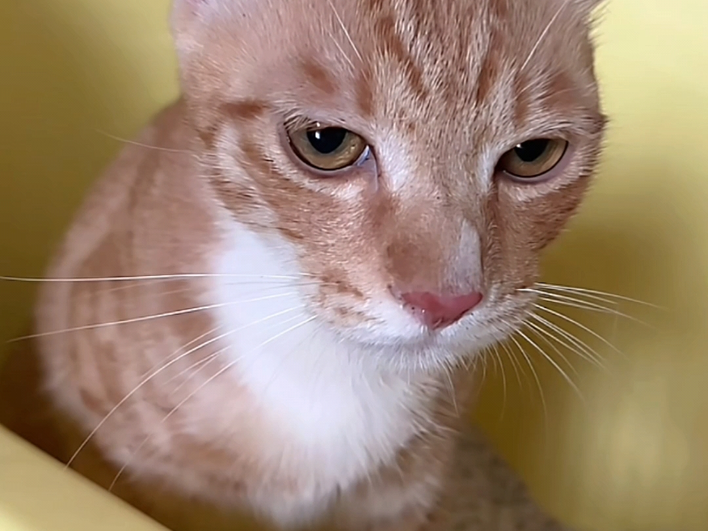 | 3621 | 2026-08-14 |
| [处刑拍手(物理意义)(处刑拍手)](https://www.bilibili.com/video/BV12ygF6BEvT) |  | 1024 | 2026-08-14 |
| [“比死神先来的是小狗的嘴筒子”｜听歌/小曲./音乐](https://www.bilibili.com/video/BV17ruf6QEw7) |  | 2.2万 | 2026-08-14 |
| [《随地大小睡》](https://www.bilibili.com/video/BV1GagF6mECB) | 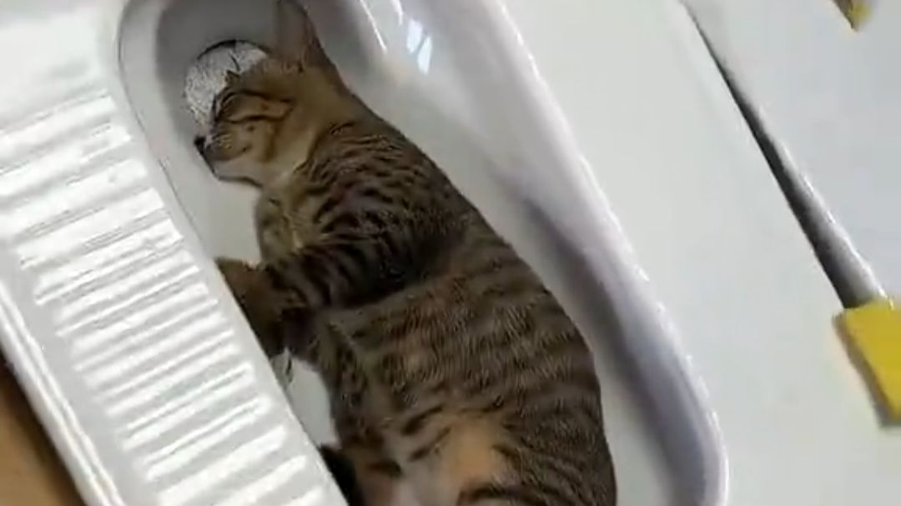 | 1.3万 | 2026-08-14 |
| [“好喜欢这种有精神病的猫咪，哈哈哈哈哈~”](https://www.bilibili.com/video/BV1yhgW6vEsN) | 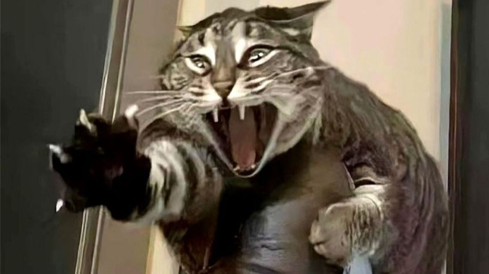 | 7891 | 2026-08-14 |
| [循环音乐｜《红色高跟鞋》“比死神先来的是小狗的嘴筒子”｜听歌/小曲./音乐](https://www.bilibili.com/video/BV17ruf6QEwZ) |  | 32.4万 | 2026-08-14 |
| [库洛官宣哈基米将永久下架，这下真是要当老资历了](https://www.bilibili.com/video/BV1negc6NE9W) | 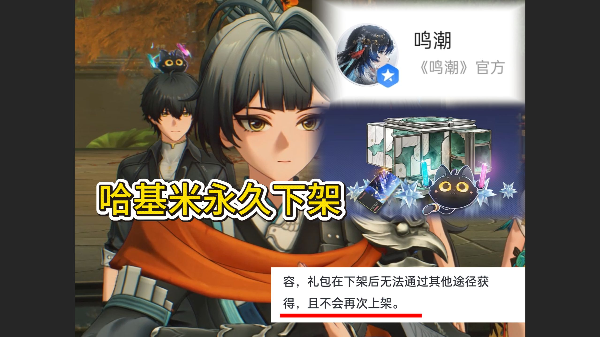 | 8.8万 | 2026-08-14 |
| [≽^⚈⩊⚈^≼](https://www.bilibili.com/video/BV1bJgc6yEib) | 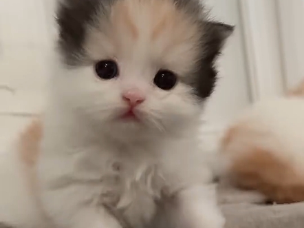 | 2971 | 2026-08-13 |
| [“当你忘记了给小猫开门后~”](https://www.bilibili.com/video/BV1bWgW63ELp) | 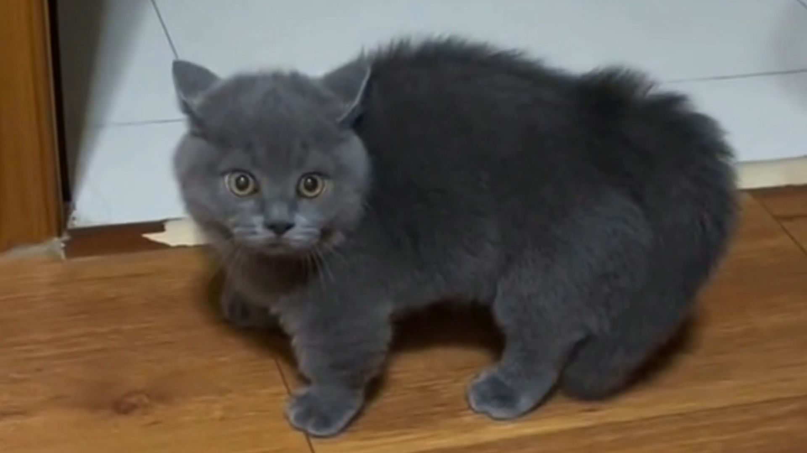 | 3.5万 | 2026-08-13 |
| [哈基米被哈基人踢了一脚后，选择握住拳头忍气吞声](https://www.bilibili.com/video/BV1MFgw67EbP) | 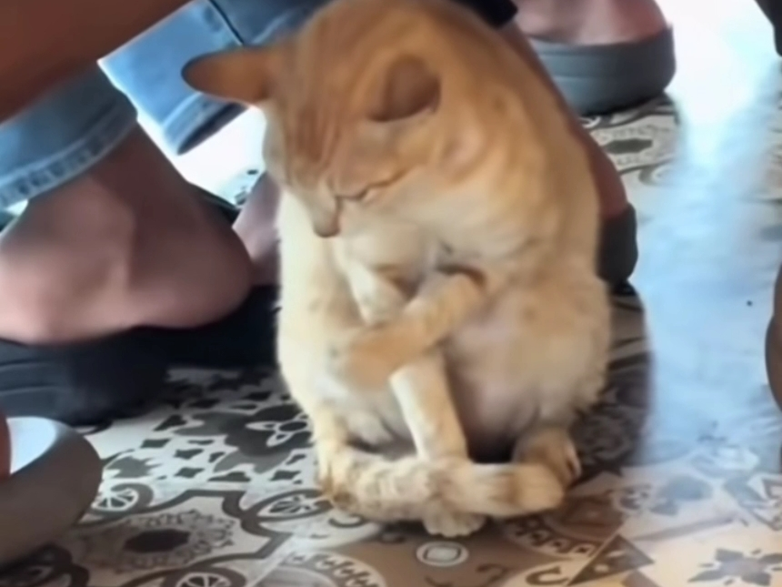 | 3.1万 | 2026-08-13 |
| [可观测宇宙中最委屈的一声老吴](https://www.bilibili.com/video/BV1bFgw67EPr) | 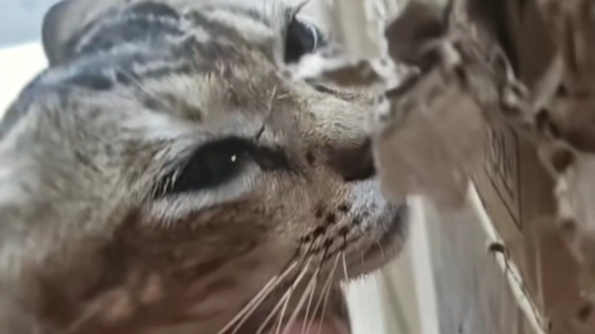 | 5.1万 | 2026-08-13 |
| [毛孩子TV，炫舞的人](https://www.bilibili.com/video/BV1Wtuf6hEyC) | 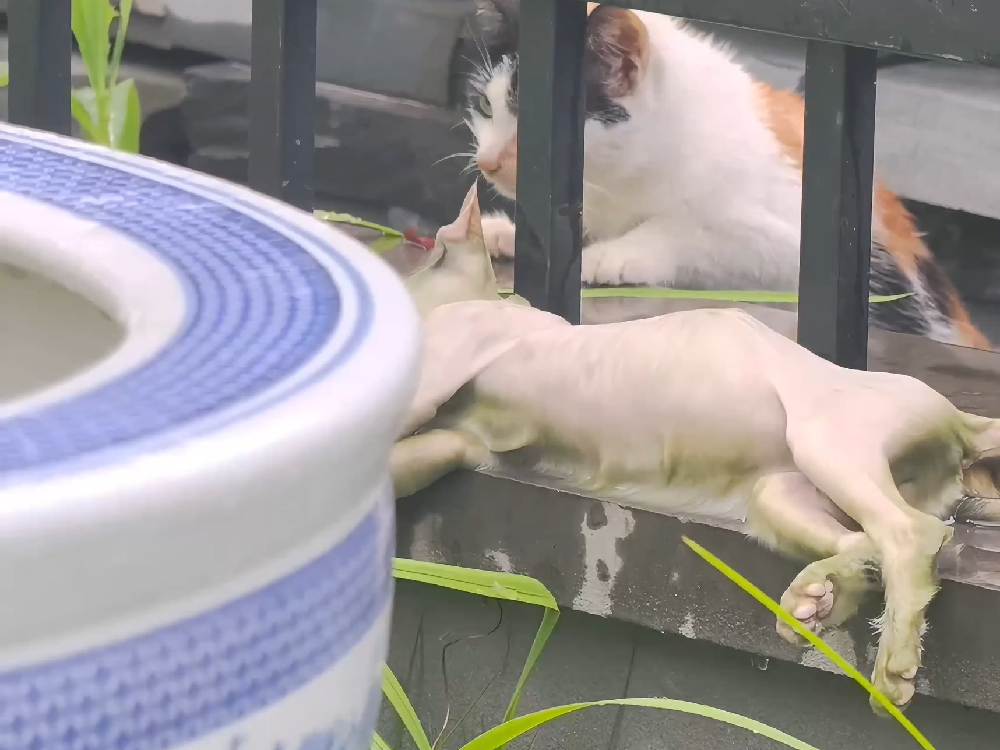 | 1136 | 2026-08-13 |
| [全网首发！鼠来宝/动作鼠鼠/宝藏月鼠鼠来啦！大坝！巴克什！长弓！全点位带跑来啦！](https://www.bilibili.com/video/BV139uf6CEEZ) |  | 34.9万 | 2026-08-13 |
| [笑了，说明还有人性](https://www.bilibili.com/video/BV1khgW6vECv) |  | 3.7万 | 2026-08-13 |
| [护送一只迷路的奶牛猫回家](https://www.bilibili.com/video/BV1yugs6zEU1) | 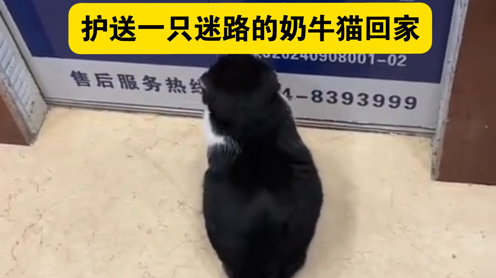 | 1.7万 | 2026-08-13 |
| [动物似乎比我们想象中更懂爱](https://www.bilibili.com/video/BV1RugW6SE5D) |  | 3.1万 | 2026-08-13 |
| [“ 猫咪的轮胎吸附能力到底有多强 ”](https://www.bilibili.com/video/BV1A2gn6ZEx9) | 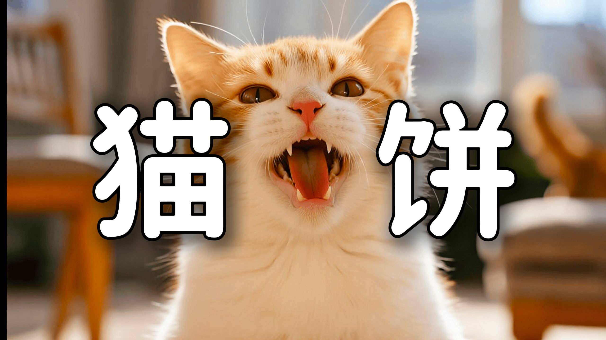 | 3.2万 | 2026-08-13 |
| [《根据真实故事不改编》](https://www.bilibili.com/video/BV1Hog36FEuC) | 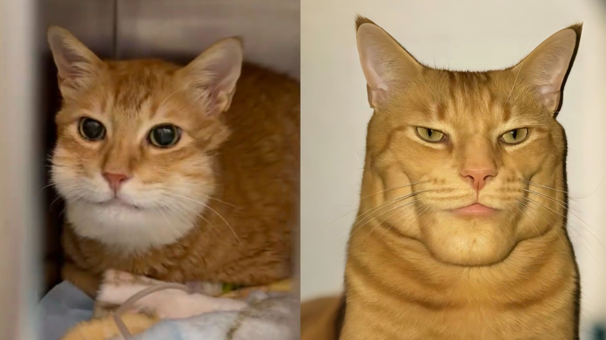 | 9.8万 | 2026-08-13 |
| [猫：饥饿始终慢我一步！](https://www.bilibili.com/video/BV1QZgG67EwK) | 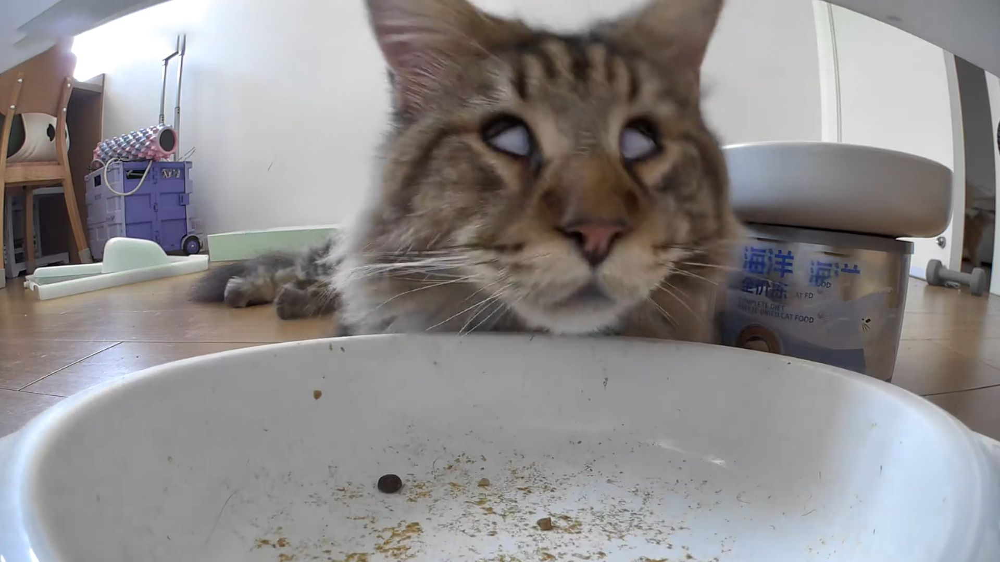 | 11.3万 | 2026-08-12 |
| [猫：把座位让给有需要的人](https://www.bilibili.com/video/BV1spui6iEmZ) |  | 5.6万 | 2026-08-11 |
| [你屁大点 抓什么老鼠啊](https://www.bilibili.com/video/BV1e9uQ68Epd) | 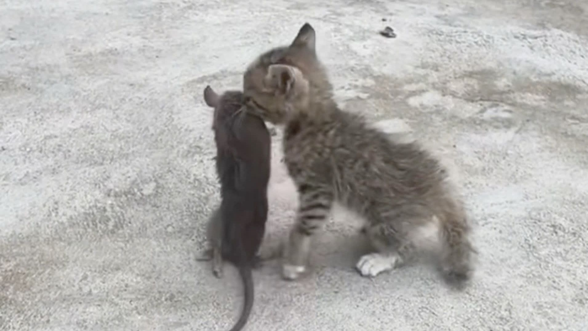 | 13.4万 | 2026-08-10 |
| [《动物迷惑行为大赏319》](https://www.bilibili.com/video/BV1E9uy67Ee2) | 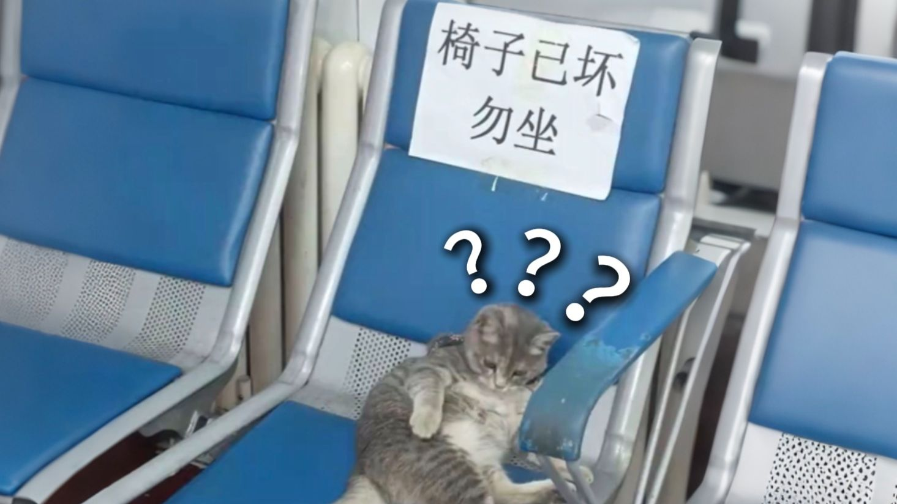 | 14.4万 | 2026-08-10 |
| [&#x27;盘点猫猫们的无语瞬间~”](https://www.bilibili.com/video/BV1pMu56iEg6) | 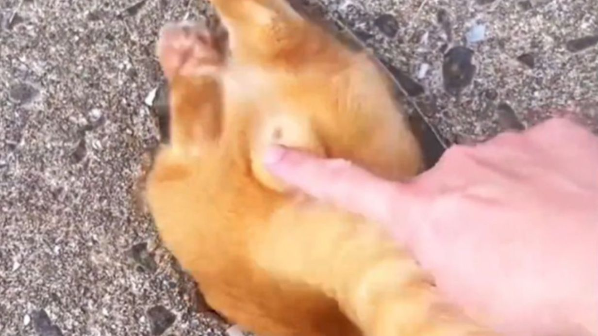 | 2.2万 | 2026-08-09 |
| [想 致 富 ， 先 撸 树 ！](https://www.bilibili.com/video/BV1Qwuu6NErt) | 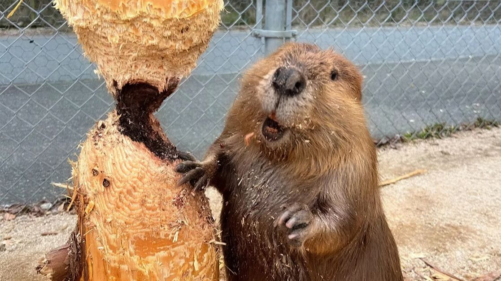 | 436.7万 | 2026-08-08 |
| [本来超喜欢小狗们的。。](https://www.bilibili.com/video/BV1Z4M26SEt8) |  | 9.9万 | 2026-08-08 |
| [《动物医患关系紧张》](https://www.bilibili.com/video/BV1XYut6dEaD) | 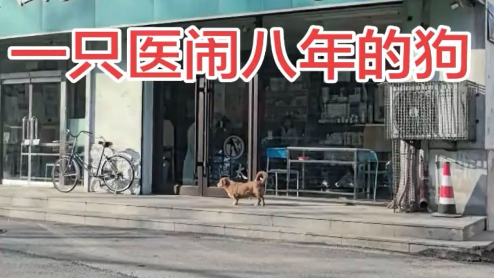 | 48.4万 | 2026-08-08 |
| [狞猫为什么总是哈气？狞猫什么时候不哈气？](https://www.bilibili.com/video/BV11auJ6sEGA) | 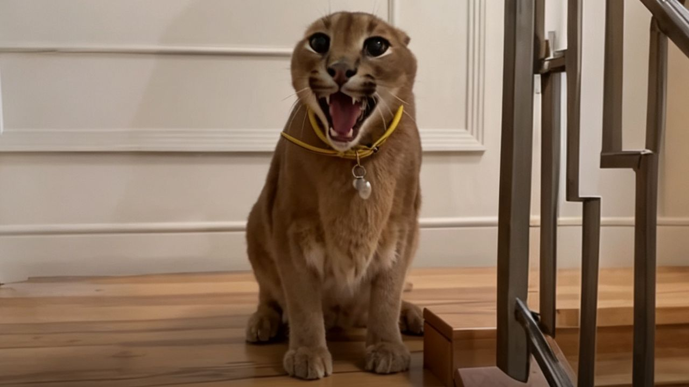 | 74.3万 | 2026-08-06 |
| [可爱动物叫声](https://www.bilibili.com/video/BV1mYMS6GEye) | 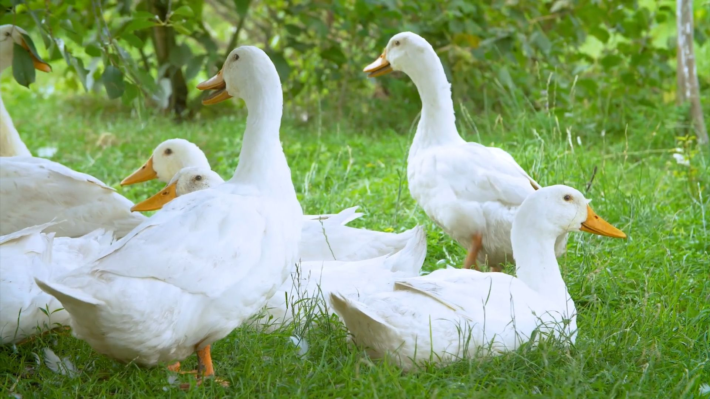 | 7940 | 2026-08-06 |
| [这就是传说中的熊孩子吧！](https://www.bilibili.com/video/BV1ZuuJ6gEMc) | 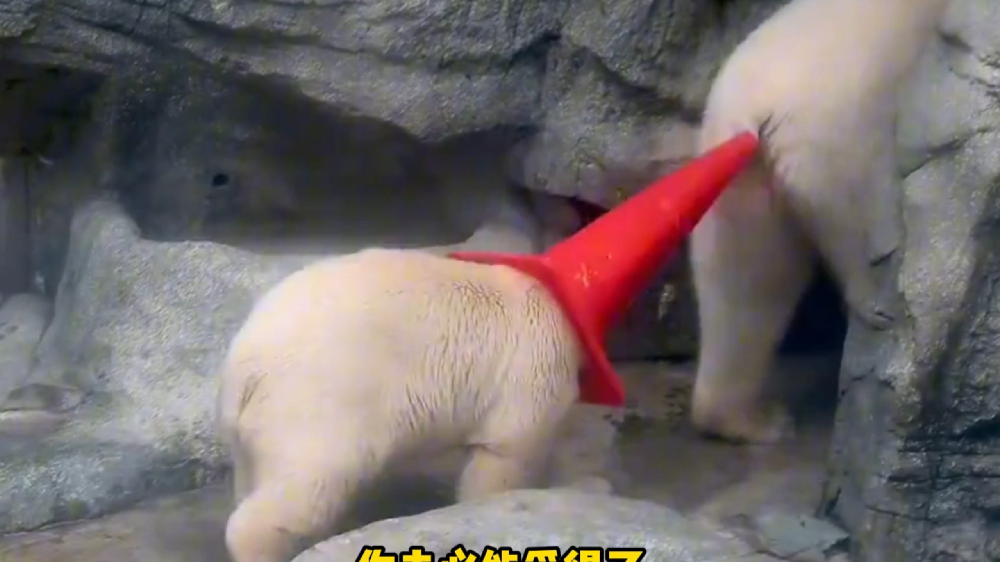 | 714.4万 | 2026-08-06 |
| [狗狗和猫咪对光学错觉地毯的搞笑反应！假3D洞恶作剧🤣](https://www.bilibili.com/video/BV1dNMC6TE31) | 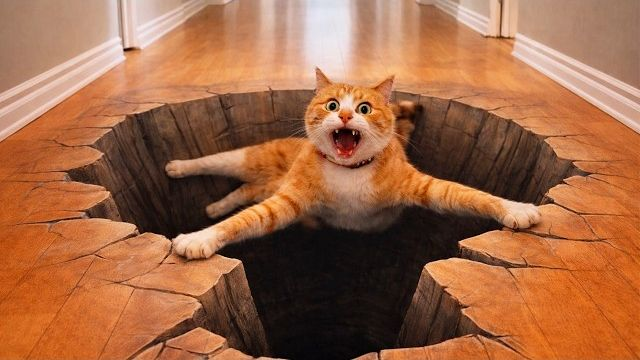 | 7.1万 | 2026-08-05 |
| [无猫爱猫人士可以来爽听了](https://www.bilibili.com/video/BV14HMX67EPA) |  | 76.4万 | 2026-08-03 |
| [大狗如何捕食妙脆角](https://www.bilibili.com/video/BV1H23m6iExN) | 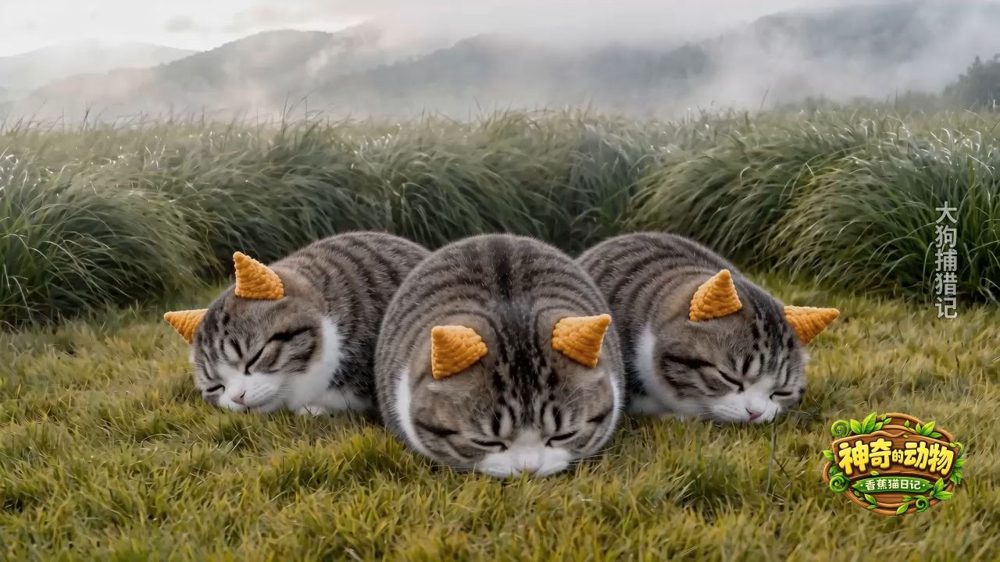 | 15.0万 | 2026-08-02 |
| [蛇为什么看到猫就害怕？](https://www.bilibili.com/video/BV14k3Q6RE8M) | 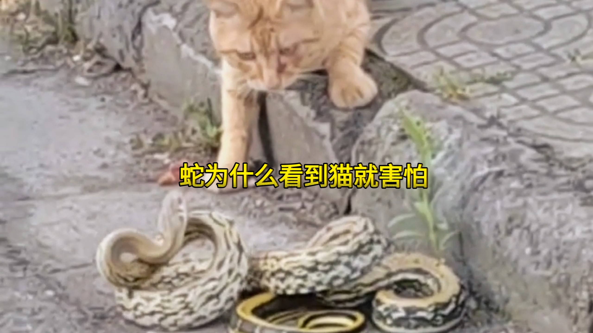 | 2172 | 2026-08-02 |
| [为什么猫咪打架前，都要嚼两下口香糖?](https://www.bilibili.com/video/BV1udG36mESe) |  | 18.6万 | 2026-08-01 |
| [为什么猫经常应激，而狗不会？](https://www.bilibili.com/video/BV1oy3r6CEU4) | 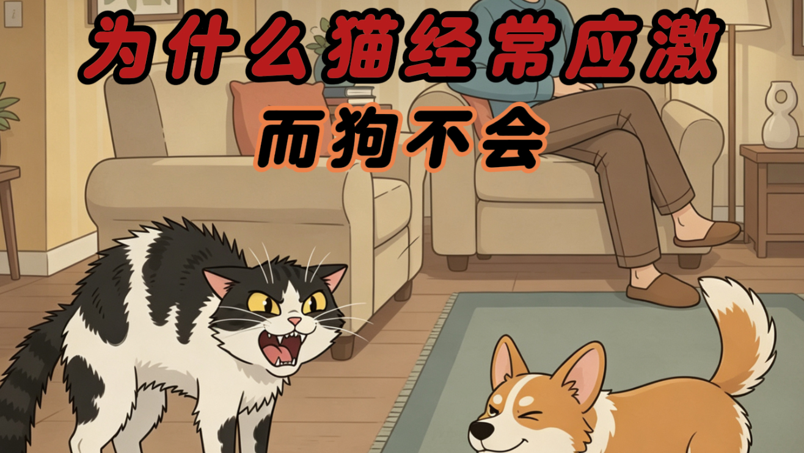 | 34.7万 | 2026-07-31 |
| [狗叔叔秒知道自己要被救了](https://www.bilibili.com/video/BV18W3n6qEnA) |  | 111.7万 | 2026-07-29 |
| [鸡看到鸡蛋被人类拿走，为什么不生气](https://www.bilibili.com/video/BV1kW3q6rEod) | 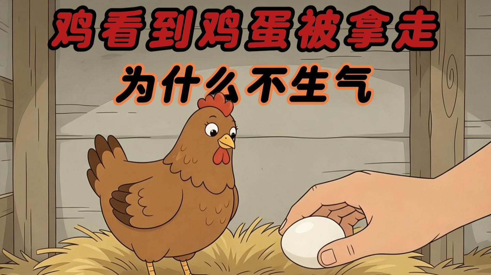 | 267.7万 | 2026-07-28 |
| [就喜欢这种有精神病的猫，哈哈哈哈哈](https://www.bilibili.com/video/BV1Ki3i6yEvK) | 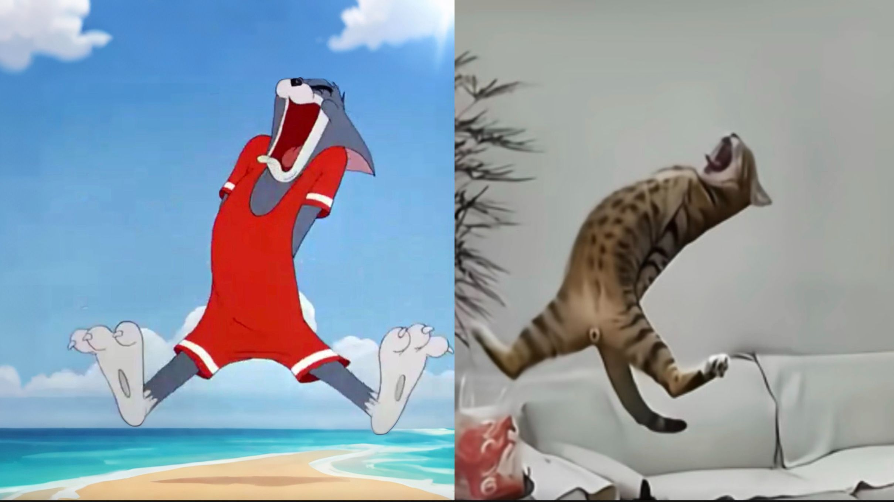 | 2.4万 | 2026-07-28 |
| [《猫权崛起一猫咪上位史》 猫，到底是怎么成为宠物的](https://www.bilibili.com/video/BV1eR3F6dES3) |  | 4.6万 | 2026-07-27 |
| [网友投喂小猫结局让人叹息](https://www.bilibili.com/video/BV1Xy356ZE1x) |  | 1.3万 | 2026-07-26 |
| [一口气带你认识4种超可爱萌宠](https://www.bilibili.com/video/BV1qigb6qEpX) | 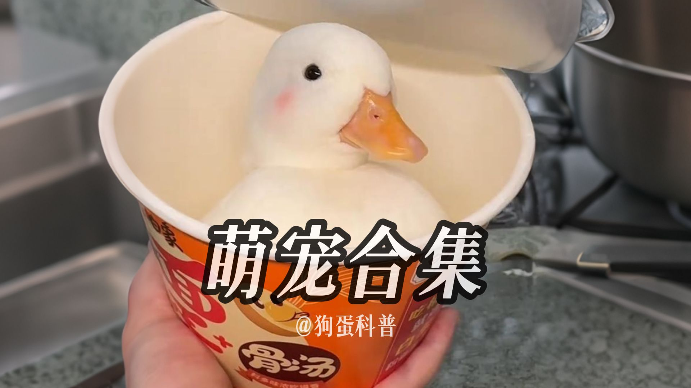 | 4.0万 | 2026-07-24 |
| [猫咪霸占一窝小鸡，把它们当成孩子，看来是带娃上瘾了](https://www.bilibili.com/video/BV1yvgt6EESp) | 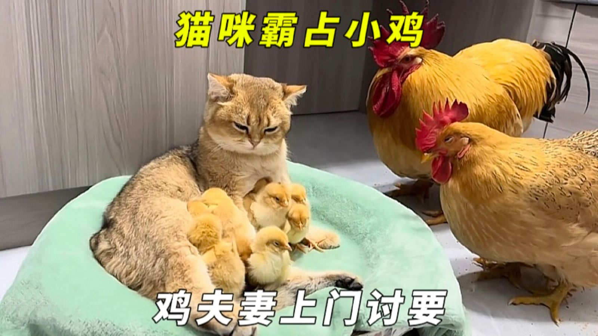 | 31.3万 | 2026-07-23 |
| [你还活着吗？😂 2026年最搞笑的鹦鹉瞬间](https://www.bilibili.com/video/BV1Bygx6eEXA) | 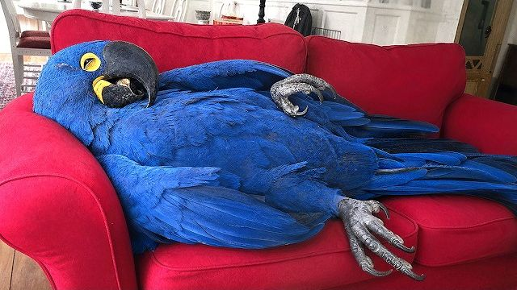 | 9.1万 | 2026-07-23 |
| [既然猫咪都有屎山代码，那么狗狗有吗？](https://www.bilibili.com/video/BV1bZKb6UEDV) |  | 33.7万 | 2026-07-22 |
| [游隼：见过导弹么你？？？？猫头鹰：见过鬼吗？](https://www.bilibili.com/video/BV1VAKm6MEh5) | 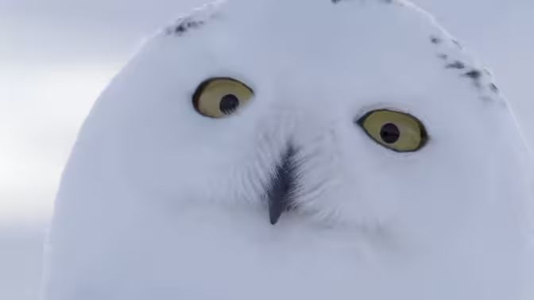 | 274.6万 | 2026-07-20 |
| [有种在宗门外遇见天才少年的感觉](https://www.bilibili.com/video/BV1TQK16oERr) | 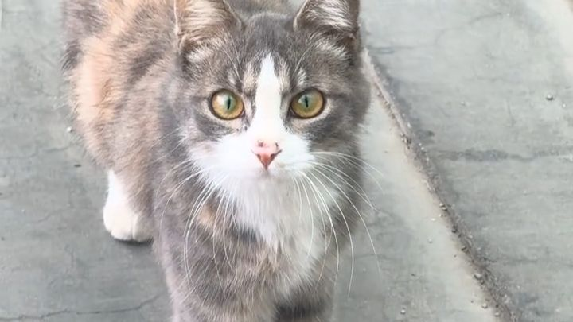 | 209.2万 | 2026-07-20 |
| [“鼠鼠我啊，洗到临头了~~”](https://www.bilibili.com/video/BV1WEKV6FEiH) | 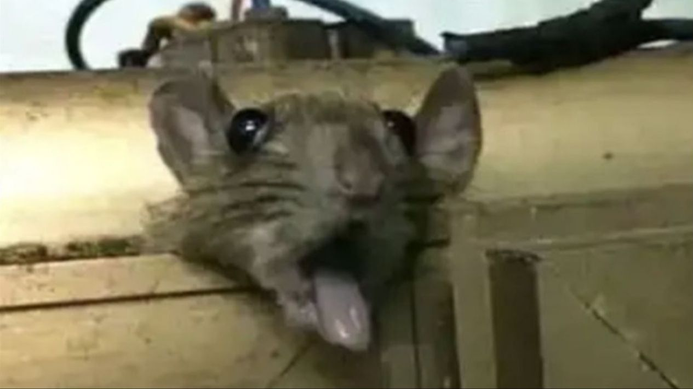 | 27.3万 | 2026-07-19 |
| [《妈妈酱，还养吗？不养门开开》](https://www.bilibili.com/video/BV1BJNd6vEyz) | 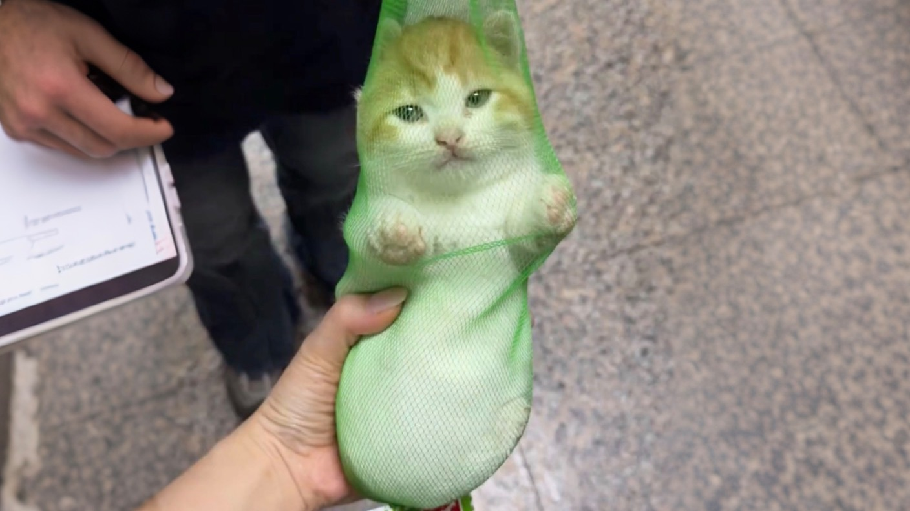 | 82.6万 | 2026-07-18 |
| [《 梭 哈 猿 神 》](https://www.bilibili.com/video/BV1qBNn6vE4E) | 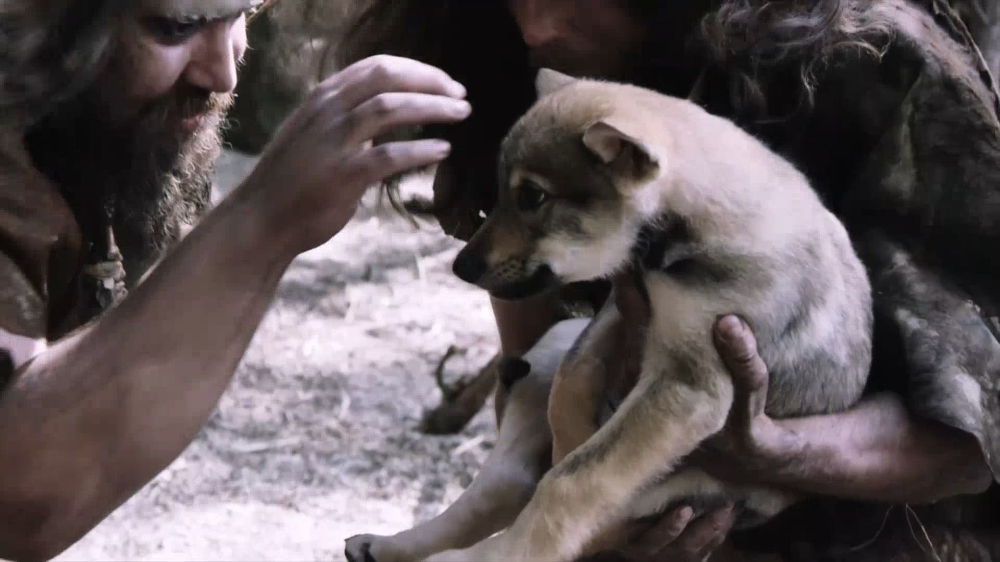 | 265.4万 | 2026-07-11 |
| [猫吵架，人围观](https://www.bilibili.com/video/BV1Y8Mh6aECa) | 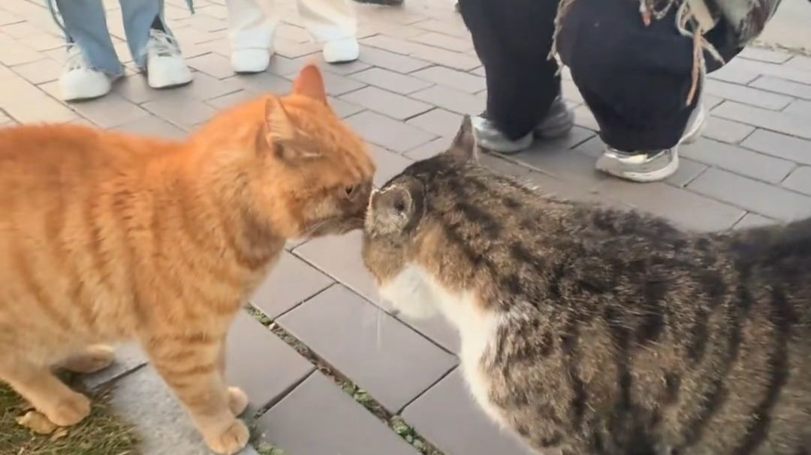 | 26.5万 | 2026-07-07 |
| [可爱动物叫声](https://www.bilibili.com/video/BV1Q7EC6sEuu) | 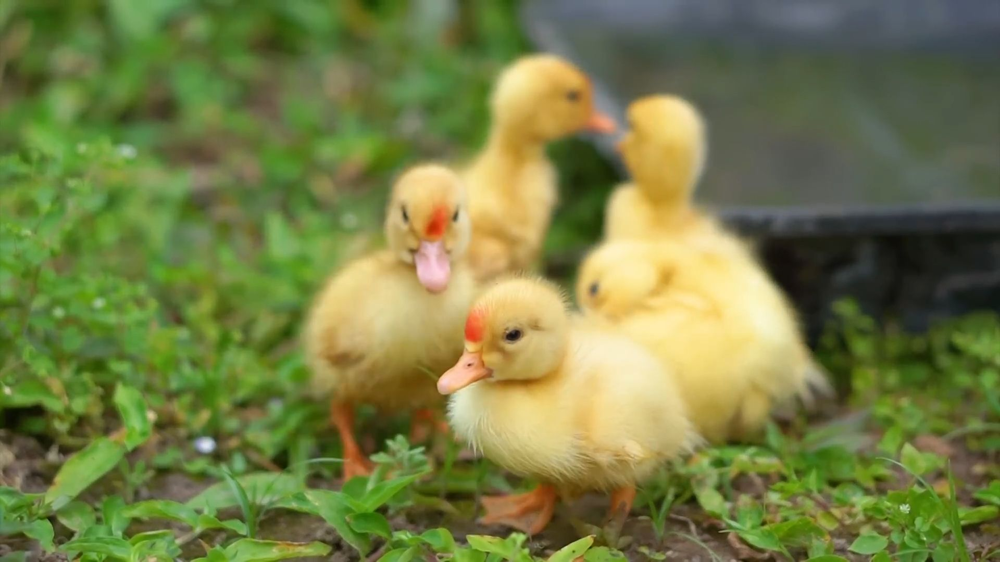 | 8.1万 | 2026-06-12 |
| [猫猫品种大赏](https://www.bilibili.com/video/BV1ab7R6XEFY) | 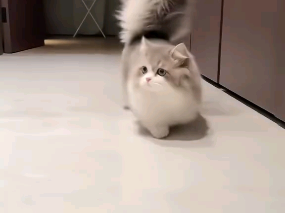 | 15.0万 | 2026-06-03 |
| [来~](https://www.bilibili.com/video/BV1xAVT6hEzo) | 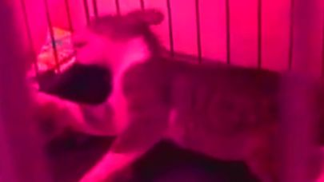 | 3654 | 2026-05-26 |
| [带猫体验自动洗车，全程瞪大眼](https://www.bilibili.com/video/BV15iLA6gE9r) | 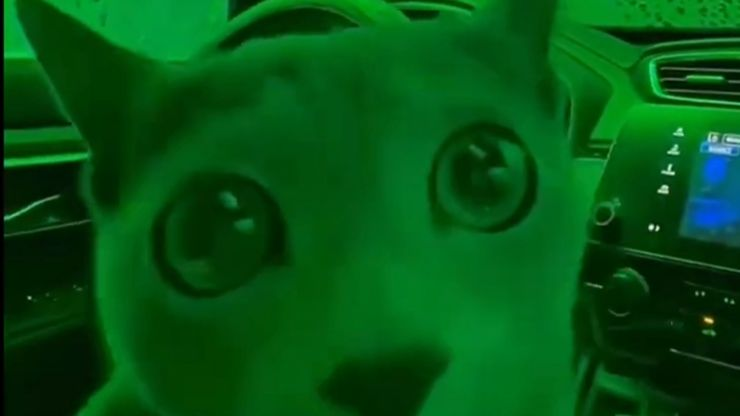 | 15.4万 | 2026-05-18 |
| [“豹豹被拉出来了…”【纯享版】](https://www.bilibili.com/video/BV1frR7BSETv) | 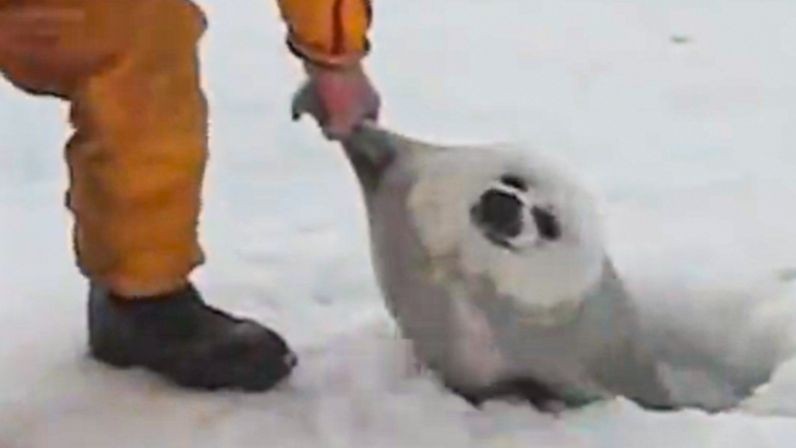 | 309.4万 | 2026-05-02 |
| [狗狗合集：一口气带你认识&quot;雪橇三傻&quot;](https://www.bilibili.com/video/BV1iNQkB6EQ1) |  | 45.9万 | 2026-03-25 |
| [卡皮巴拉：活着挺好，死了拉倒 ！！](https://www.bilibili.com/video/BV1KfwiziEy6) | 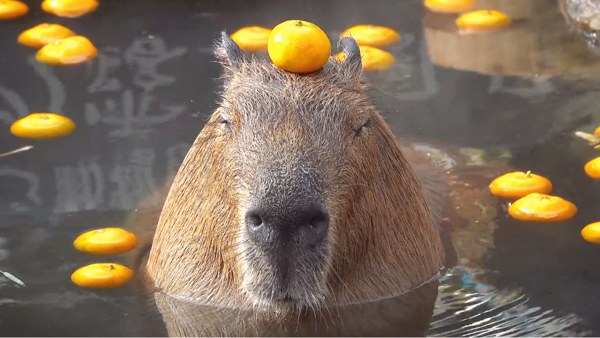 | 41.0万 | 2026-03-18 |
| [哈基米这个鸡猫关系](https://www.bilibili.com/video/BV1AfwRzJEpo) | 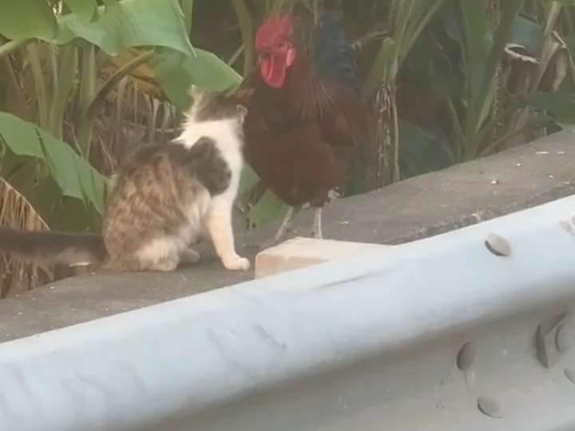 | 1665 | 2026-03-17 |
| [哈基米这个保时捷猫抓板](https://www.bilibili.com/video/BV1M5NFzrEEf) | 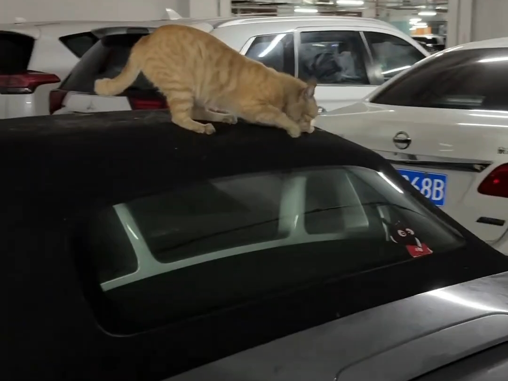 | 14.6万 | 2026-03-10 |
| [哈基米这个同仇敌忾](https://www.bilibili.com/video/BV1pyAazWEZ3) | 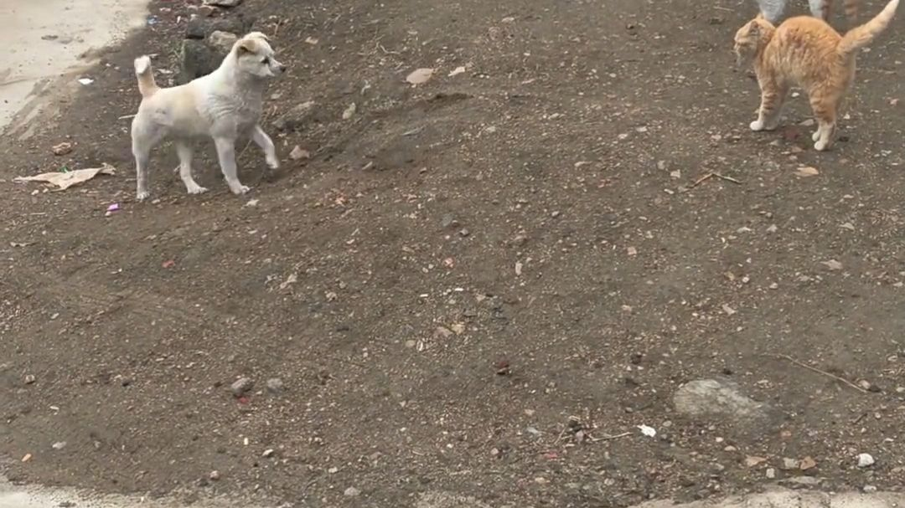 | 19.4万 | 2026-02-28 |
| [《野生动物迷惑图鉴》](https://www.bilibili.com/video/BV18sfZBtEbs) |  | 138.5万 | 2026-02-05 |
| [小狗狗偷偷带小鸭来野外探险](https://www.bilibili.com/video/BV13yrPBPEDv) | 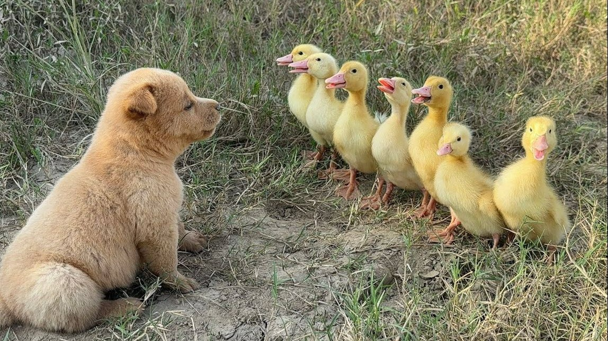 | 35.3万 | 2026-01-09 |
| [猫是世界上最可爱的🤣搞笑猫咪视频 2025](https://www.bilibili.com/video/BV1hisbzmE1S) | 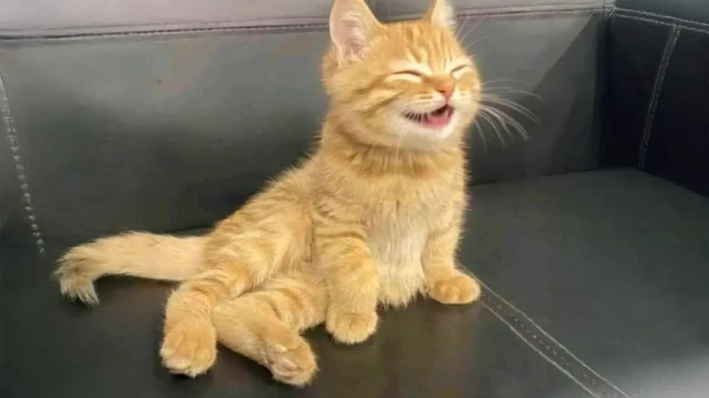 | 22.2万 | 2025-10-22 |
| [最容易出好猫的品种都有哪些？法老严选和小狗喵](https://www.bilibili.com/video/BV1h1pazHEXA) | 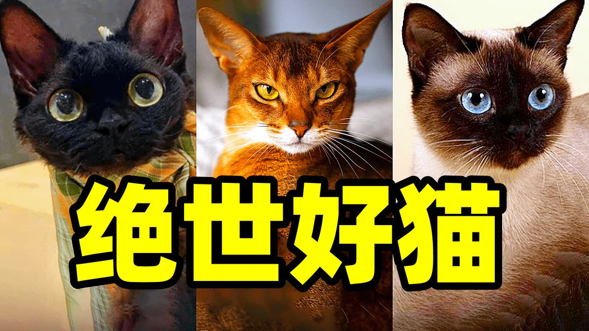 | 65.7万 | 2025-09-19 |
| [哈基米：人，明天还有我的饭吗](https://www.bilibili.com/video/BV1AYb8z5EuV) | 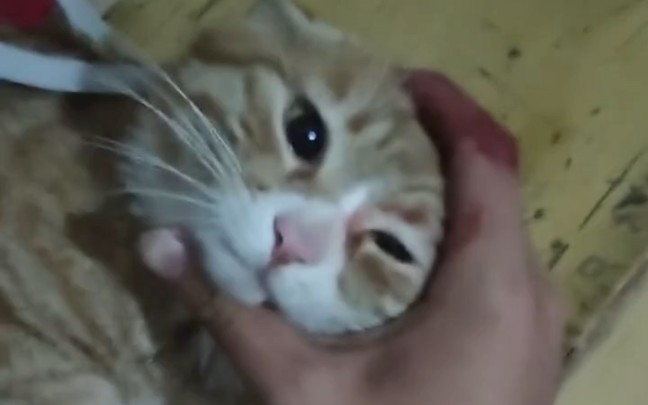 | 101.5万 | 2025-08-13 |
| [刚被救出来一半就开始哈气吗，哈基米你这家伙](https://www.bilibili.com/video/BV19abMzeEcz) | 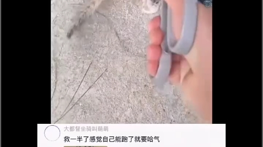 | 102.1万 | 2025-08-10 |
| [号称“小剑齿虎”，但它更愿意做一只黏人的哈基米](https://www.bilibili.com/video/BV144GKzGEyk) | 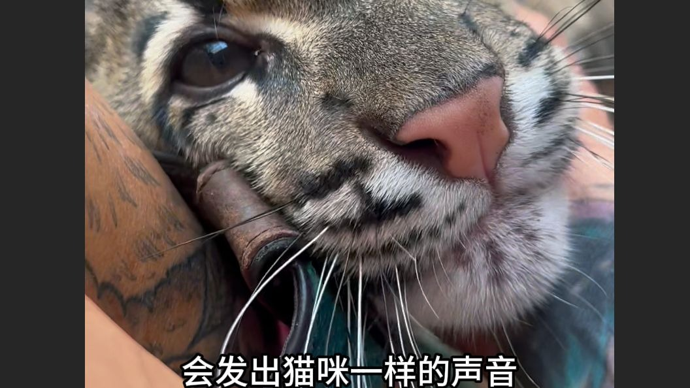 | 45.7万 | 2025-07-09 |
| [不会哈气学哈气，哈基米打歌](https://www.bilibili.com/video/BV1Ro5Fz5Ep6) |  | 7675 | 2025-05-10 |
| [哈基米狩猎时刻](https://www.bilibili.com/video/BV1XNVhz4ECP) | 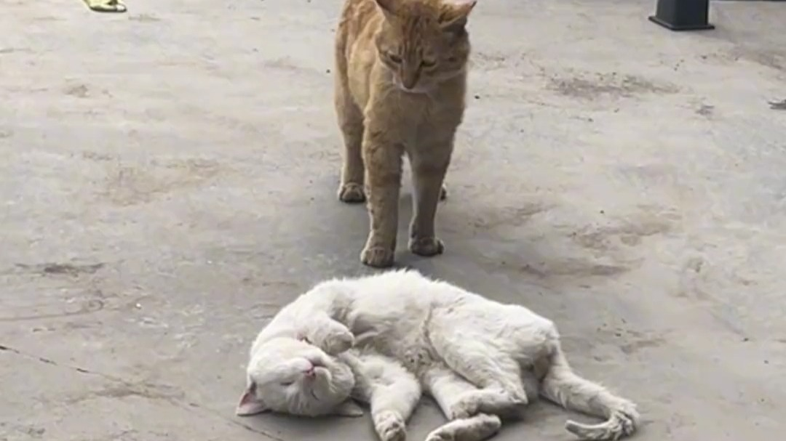 | 36.0万 | 2025-05-07 |
| [哈基汪对豪猫使用大狗叫和大旋风😨](https://www.bilibili.com/video/BV1tXwZe6Erq) | 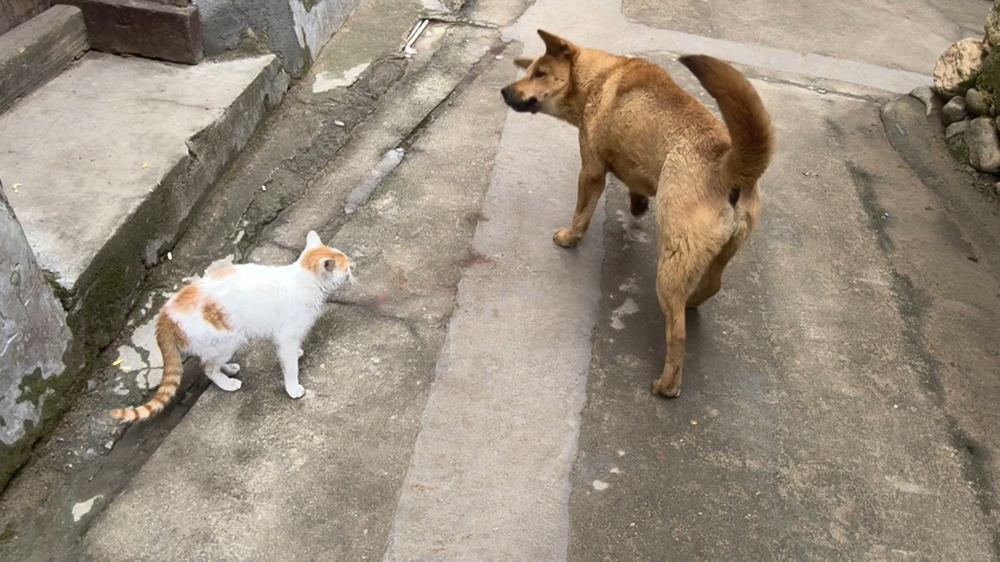 | 53.7万 | 2025-02-17 |
| [这不就是大号哈基米吗](https://www.bilibili.com/video/BV1eJcze4EML) | 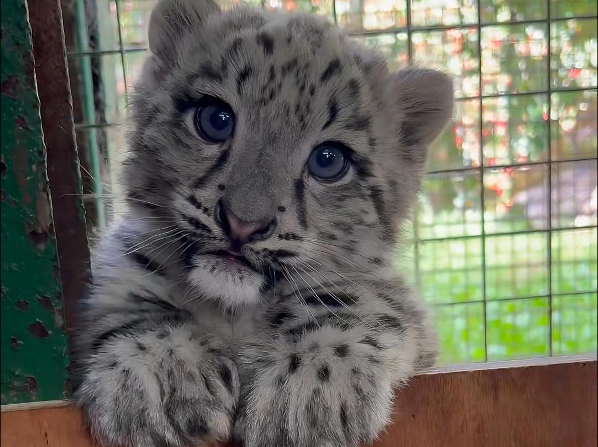 | 56.0万 | 2025-01-15 |
| [哈基米tv之影逝二度](https://www.bilibili.com/video/BV1cG8PejENY) |  | 101.5万 | 2024-07-19 |
| [盘点小奶猫的搞笑日常！](https://www.bilibili.com/video/BV12y411b7KG) |  | 17.4万 | 2024-06-06 |
| [小哥投喂流浪猫差点被反杀，下一秒直接让它后悔！](https://www.bilibili.com/video/BV18w411F7V7) | 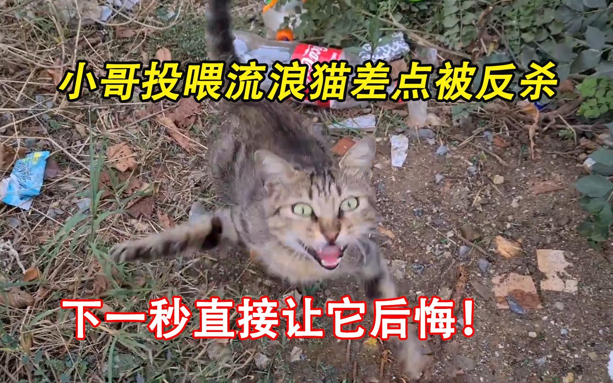 | 32.9万 | 2023-10-22 |

---
*最后更新: 2026-08-15 03:02:51 (自动生成)*
*数据来源: [Bilibili](https://www.bilibili.com)*

## 使用说明

运行以下命令更新视频列表:
```bash
python3 fetch_hajimi_videos.py
```
