# awesome-hajimi
collections of hajimi (哈基米 in Chinese) on the Internet.

## 视频列表 (Video List)

| 视频标题 (Title) | 封面 | 播放量 (Views) | 发布日期 (Date) |
|---|---|---|---|
| [张顺飞：朝你大腮捏一把【彩白盒战day1】](https://www.bilibili.com/video/BV1JM3s6PEaS) |  | 1234 | 2026-08-02 |
| [哈基米的幽默瞬间（7）](https://www.bilibili.com/video/BV1VM3D6FEwy) | 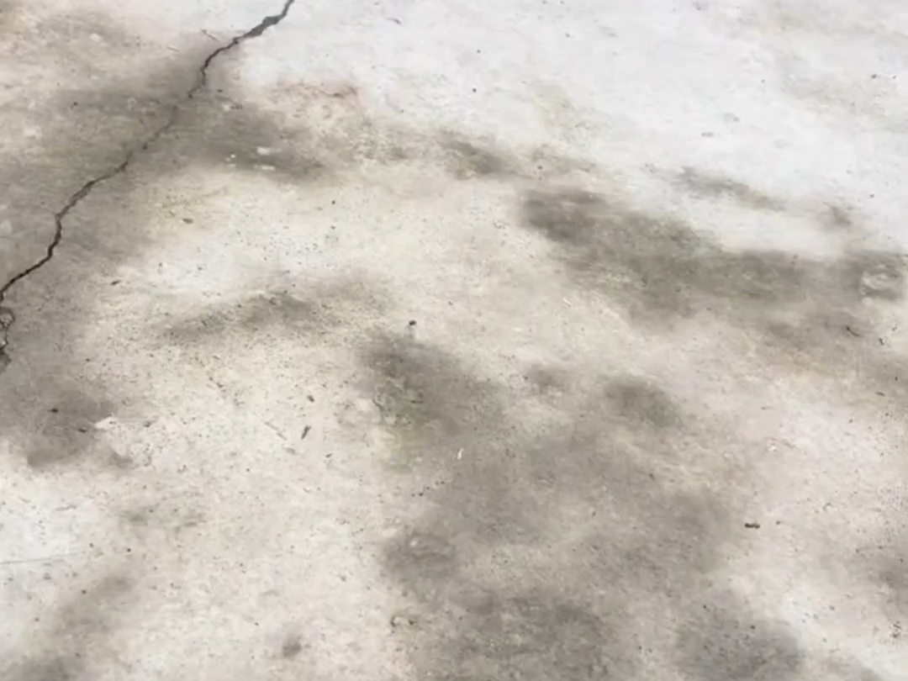 | 1692 | 2026-08-02 |
| [最哈人的大狗叫](https://www.bilibili.com/video/BV1nX3S6gEjw) |  | 1996 | 2026-08-02 |
| [！ ？ 老吴  ？ ！](https://www.bilibili.com/video/BV1ce3D6GEoM) | 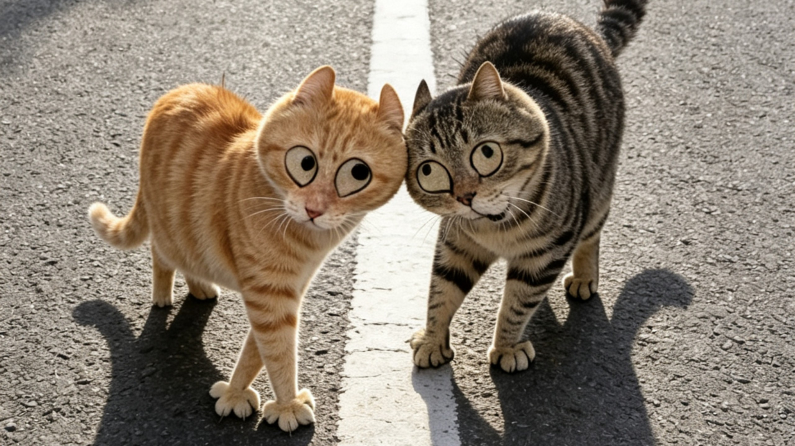 | 1252 | 2026-08-02 |
| [老吴：哈基米震撼来袭！](https://www.bilibili.com/video/BV187GV6HE9Y) | 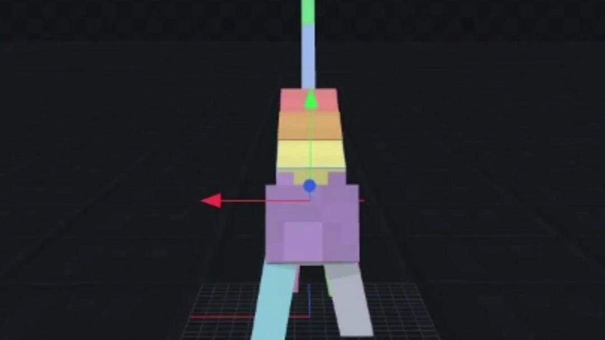 | 748 | 2026-08-02 |
| [我家的哈基米](https://www.bilibili.com/video/BV1Q93D6tEv8) | 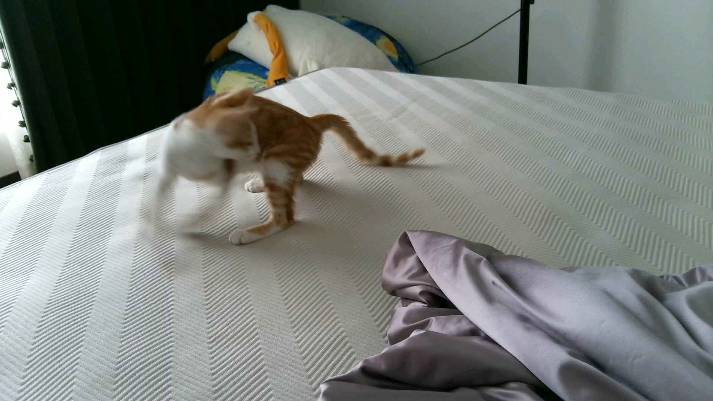 | 1110 | 2026-08-02 |
| [【7月】哈基大狗排行榜#22](https://www.bilibili.com/video/BV1Zq3U6hE17) | 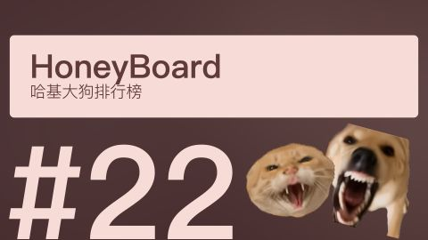 | 1.1万 | 2026-08-01 |
| [基米售货机之丑橘大乱斗](https://www.bilibili.com/video/BV1YH3m6XE8Z) |  | 11.1万 | 2026-08-01 |
| [[补档]它转身就走了  像是下定了某种决心  再没看我一眼](https://www.bilibili.com/video/BV1p23m6iE1X) | 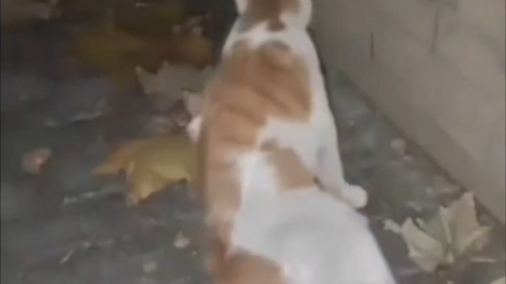 | 5221 | 2026-08-01 |
| [小哈基米](https://www.bilibili.com/video/BV1RsGG6oE3M) | 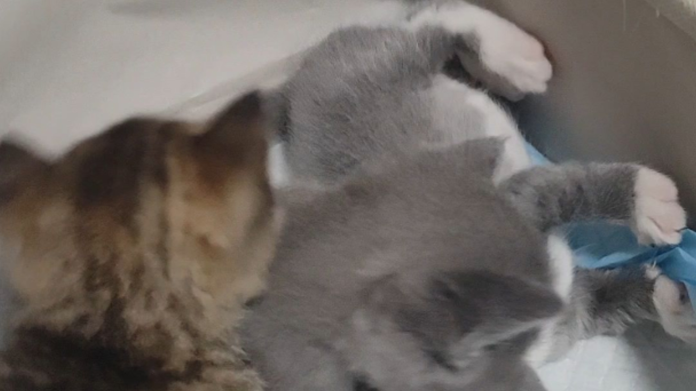 | 452 | 2026-08-01 |
| [哈基米之魔鬼辣条](https://www.bilibili.com/video/BV1NNGG6rEsz) | 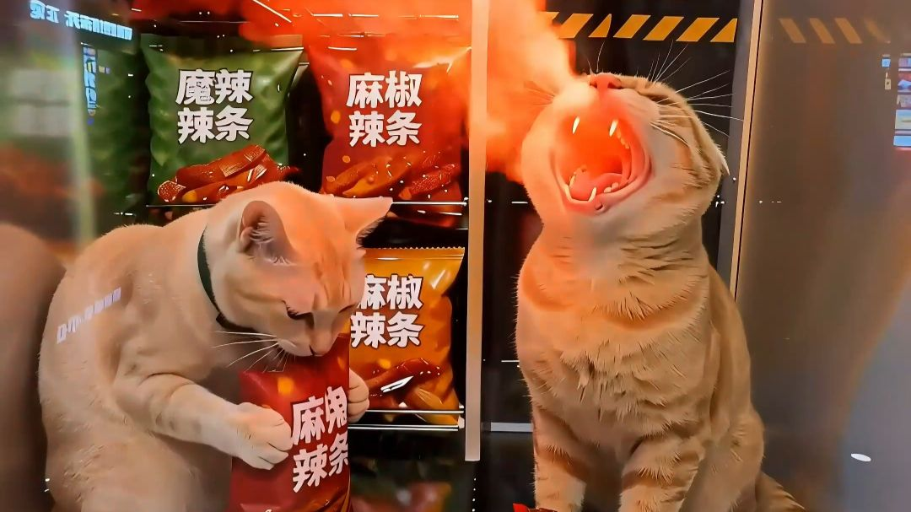 | 1584 | 2026-08-01 |
| [哈基米这个小馋猫](https://www.bilibili.com/video/BV1AgGG6MEnq) | 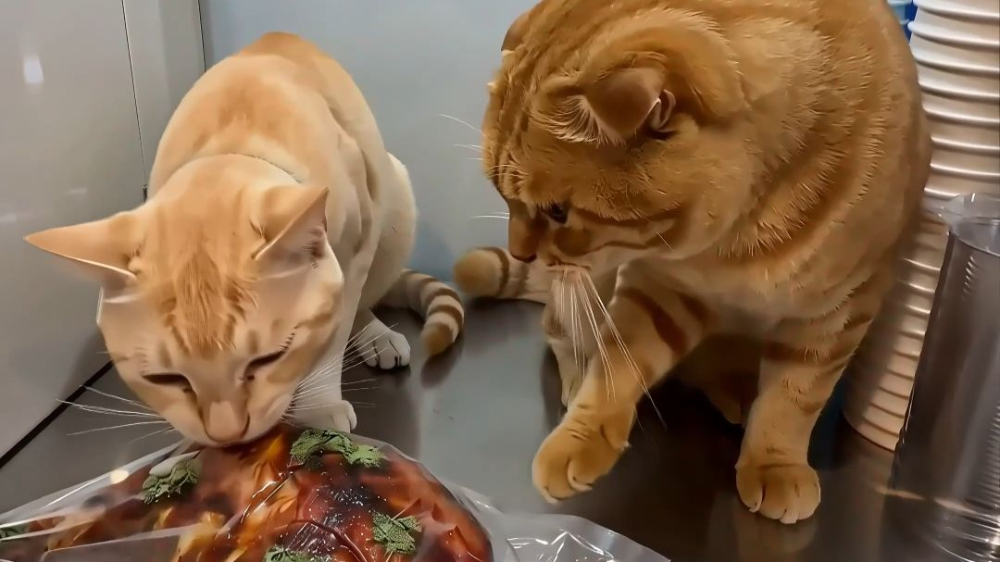 | 1728 | 2026-08-01 |
| [【战雷金曲】⚡️Thunder Dancer⚡️ 在D点后偷偷加强俄联邦的二人完整版【哈基米音乐】](https://www.bilibili.com/video/BV1CSGG66EuG) |  | 4174 | 2026-08-01 |
| [你咋这样 哈基米](https://www.bilibili.com/video/BV1AUGG6GEmD) | 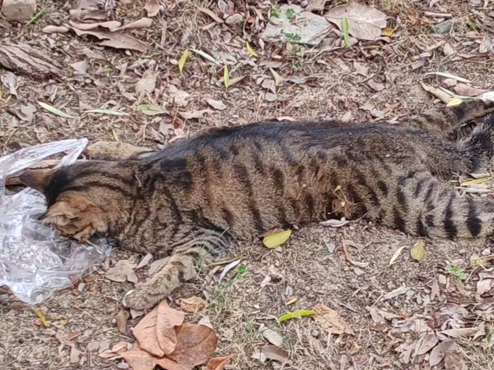 | 7551 | 2026-08-01 |
| [哈基米，曼波…](https://www.bilibili.com/video/BV1whGV6CEQd) | 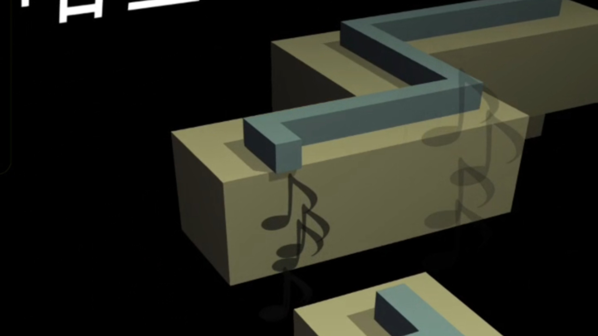 | 527 | 2026-08-01 |
| [【7月至8月】《哈基米衰亡史》大狗叫时代——哈基米&quot;关键词&quot;新视频每日动态榜](https://www.bilibili.com/video/BV1TcGG65Es1) | 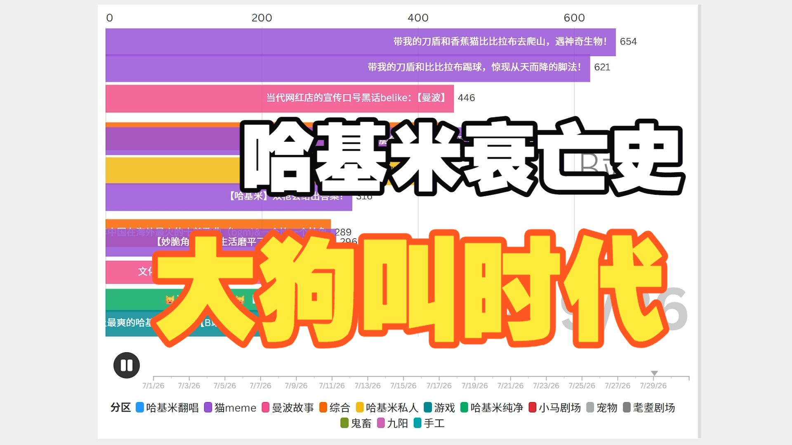 | 647 | 2026-08-01 |
| [可恶的哈基米敢睡在我模型盒里😡😡](https://www.bilibili.com/video/BV11tGV6yE59) | 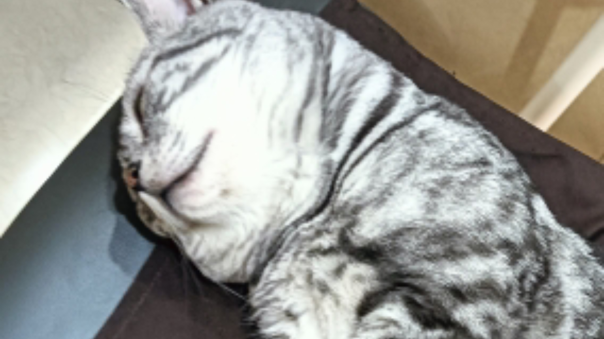 | 576 | 2026-08-01 |
| [不，我的哈基米](https://www.bilibili.com/video/BV1mBGg6gExG) | 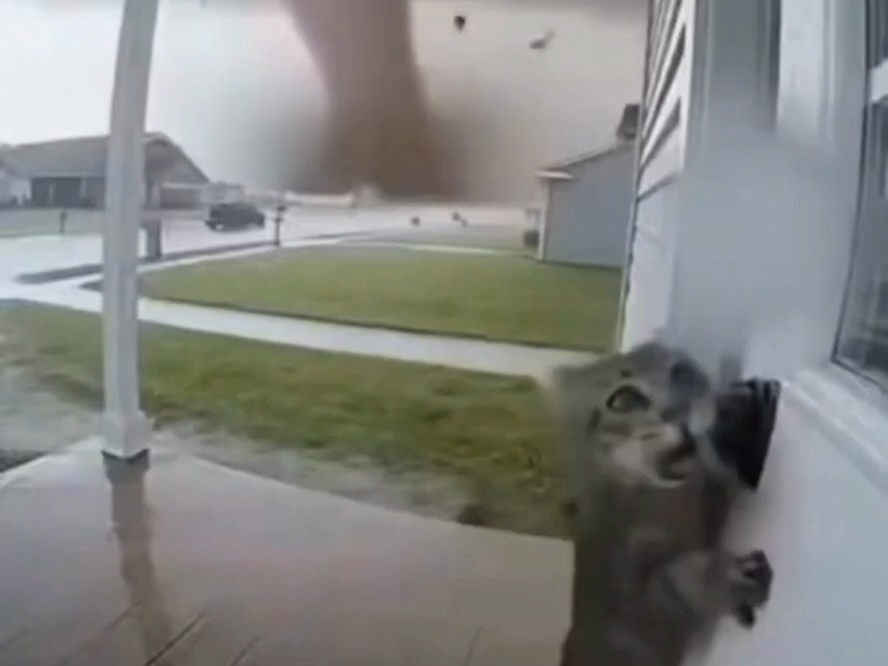 | 941 | 2026-08-01 |
| [哈基米触发了自己的底层代码](https://www.bilibili.com/video/BV1QbGg6jEbD) | 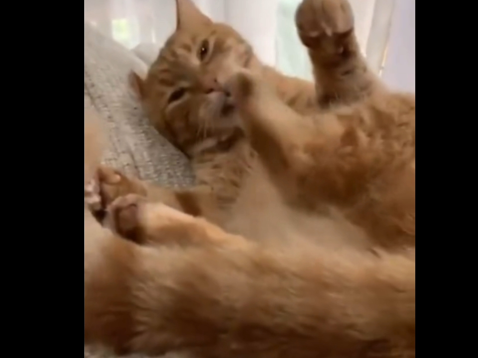 | 902 | 2026-08-01 |
| [【哀基米】灰原哀励志哈遍全世界！哈！哈！哈！【B萌应援】](https://www.bilibili.com/video/BV1z9Gg6FEKm) |  | 1920 | 2026-08-01 |
| [又是一只奇怪的哈基米（第2只）](https://www.bilibili.com/video/BV1w8G36iEQh) | 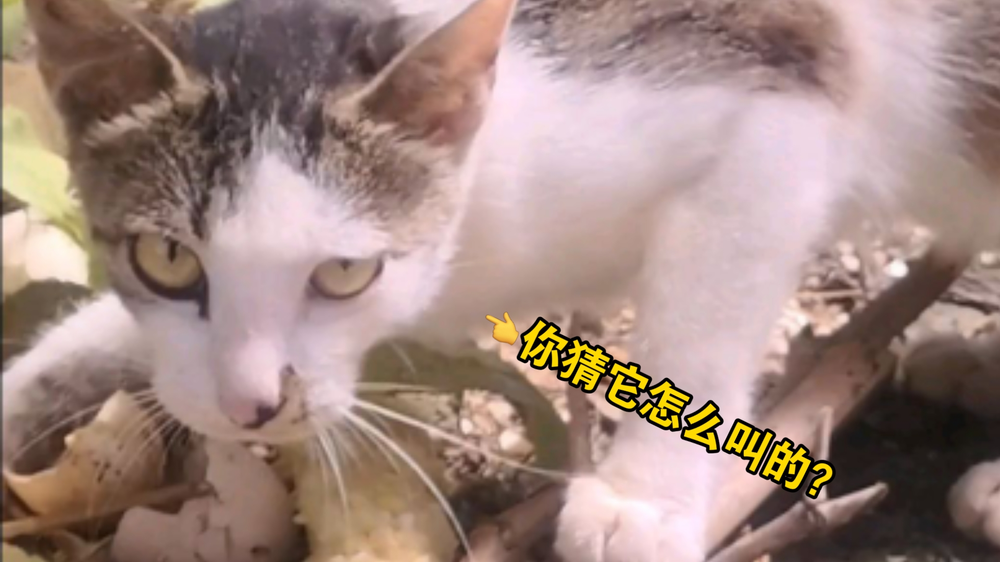 | 655 | 2026-08-01 |
| [循环《落泪DJ｜哈基米》我真的特别爱你为什么你会流泪！](https://www.bilibili.com/video/BV1nvG36wEKo) |  | 104 | 2026-08-01 |
| [在电视上放老吴哈基米的反应](https://www.bilibili.com/video/BV1aPGu6yE1D) | 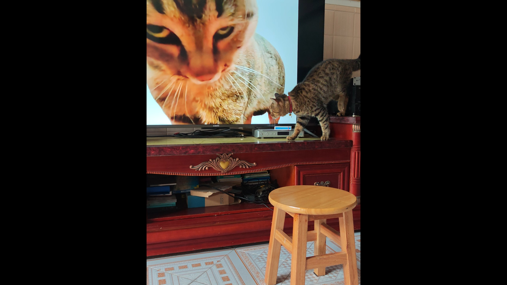 | 4.0万 | 2026-08-01 |
| [哈基米们被一网打尽了](https://www.bilibili.com/video/BV1ZRGM6DEjo) | 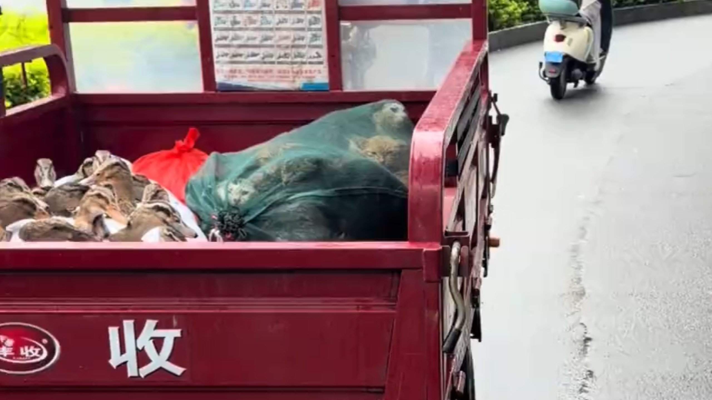 | 3025 | 2026-08-01 |
| [鬼畜电影：郝哥的传奇人生](https://www.bilibili.com/video/BV1wTGg6aEop) |  | 3.9万 | 2026-08-01 |
| [&quot;大狗？？老吴！！&quot;](https://www.bilibili.com/video/BV1dTGP6TE5v) |  | 146.4万 | 2026-08-01 |
| [循环歌单｜【硬曲的主人】｜“【邪恶豆包の小曲】【杀死比赛の小曲】前方高能，神即将降临”](https://www.bilibili.com/video/BV1fc386VEY1) |  | 51.3万 | 2026-08-01 |
| [猫：看好了，我只教一遍！](https://www.bilibili.com/video/BV1ABGK6REfp) | 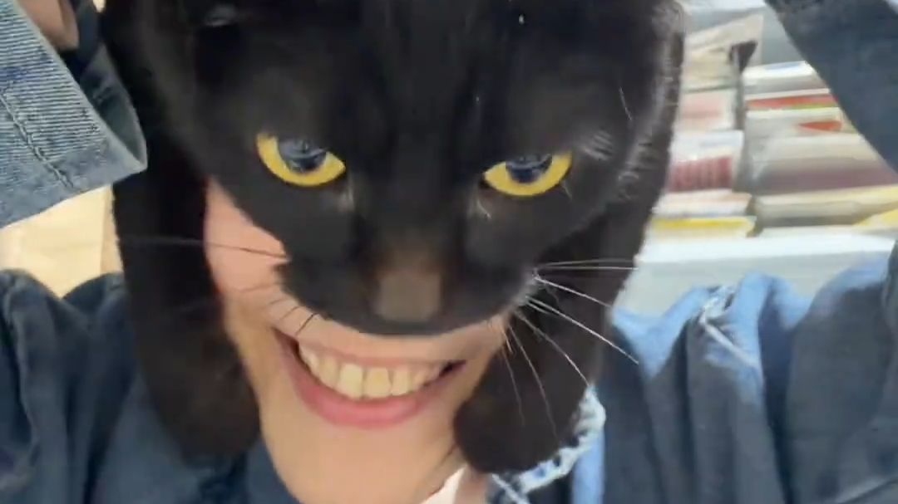 | 11.7万 | 2026-08-01 |
| [哈基米“猫语”合集](https://www.bilibili.com/video/BV1GyGu67Ecs) | 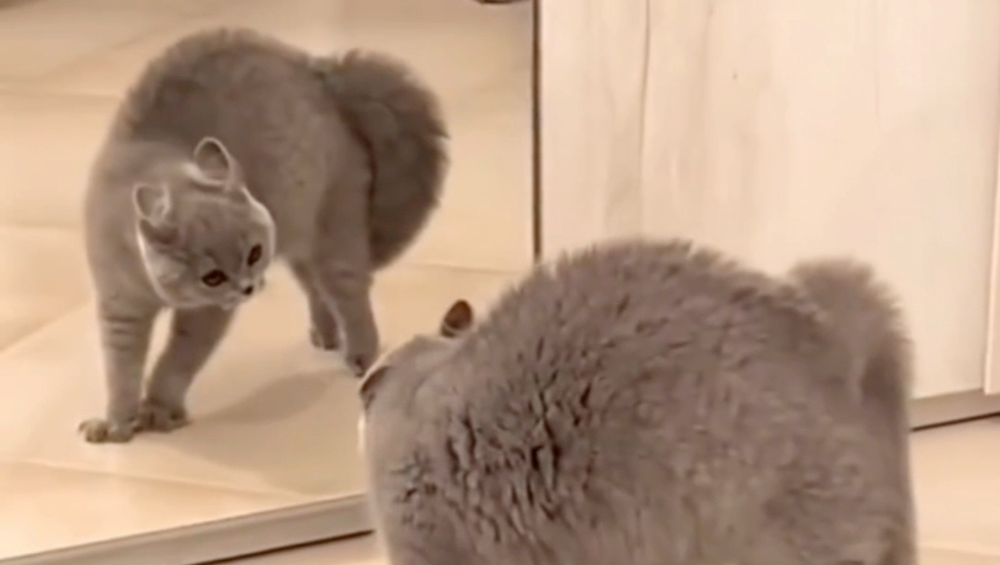 | 1851 | 2026-08-01 |
| [哈基米的幽默日常（6）](https://www.bilibili.com/video/BV1XWGg6SEf1) | 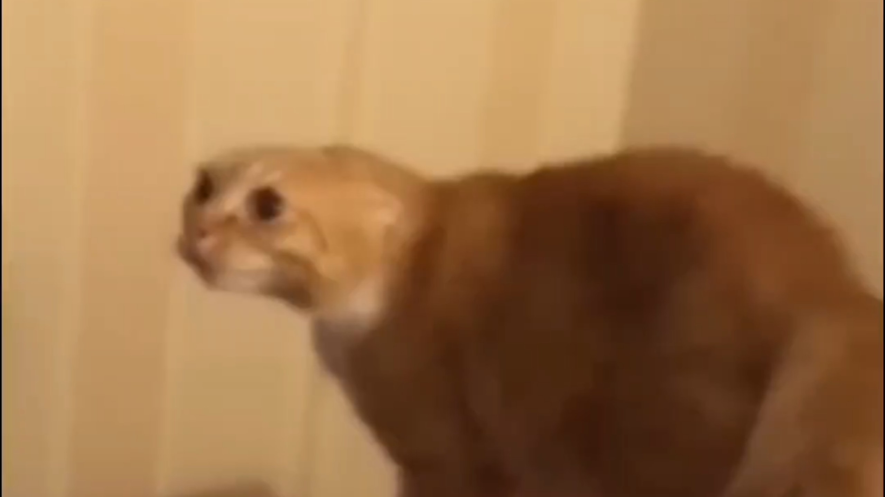 | 1799 | 2026-08-01 |
| [哈基米之冰冻魔法药水](https://www.bilibili.com/video/BV1i9GK6CEAG) | 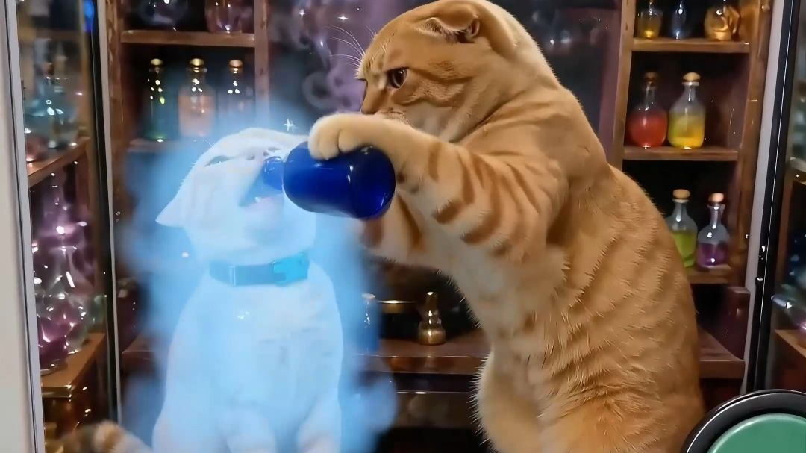 | 4186 | 2026-07-31 |
| [如果一个广西人开始吃这些东西，说明他已经快饿死了😵](https://www.bilibili.com/video/BV1x4GP6sEzq) |  | 136.3万 | 2026-07-31 |
| [哈基米嚼口香糖一次嚼个够，基供向](https://www.bilibili.com/video/BV1msGP6RE3p) | 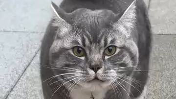 | 1801 | 2026-07-31 |
| [【完整版】处刑鼓掌 / Execution Clap Remix](https://www.bilibili.com/video/BV1CbGw65EPB) |  | 534 | 2026-07-31 |
| [键帽园区最窝囊选手 狂拉答辩的耄耋](https://www.bilibili.com/video/BV1HGGc6TEeZ) |  | 26.0万 | 2026-07-31 |
| [往事只能哈基](https://www.bilibili.com/video/BV12nGw6SErz) | 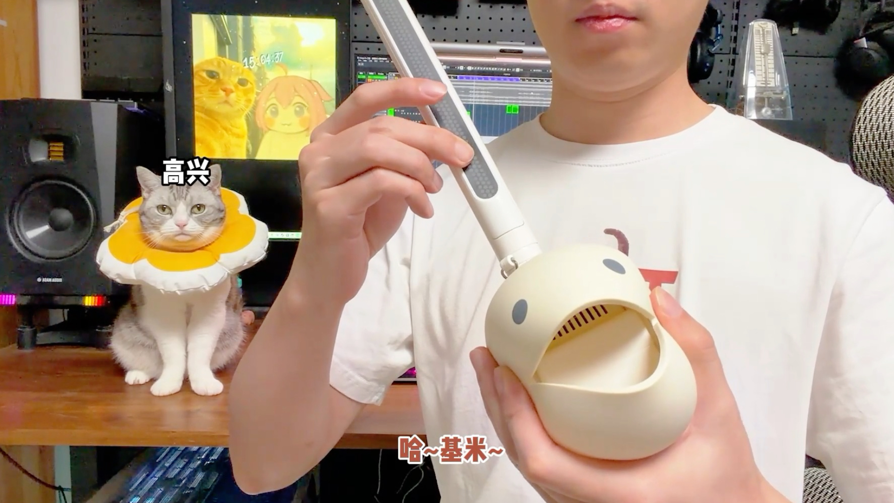 | 5160 | 2026-07-31 |
| [水岸猫部落已具雏形，它们也有自己的新餐厅啦。](https://www.bilibili.com/video/BV1mpGw6EEs4) |  | 22.9万 | 2026-07-31 |
| [哈基米因为绝育了看见了自己喜欢的猫直接应激](https://www.bilibili.com/video/BV1aXGw6ZEB1) | 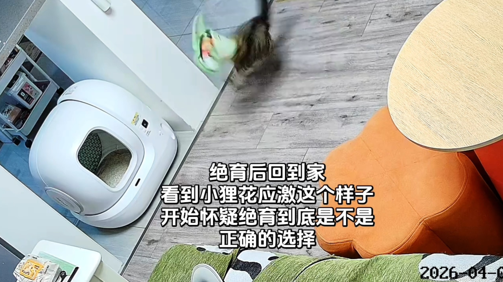 | 3670 | 2026-07-31 |
| [哈基米：你跑不过我信不信](https://www.bilibili.com/video/BV1jxGA6KED3) |  | 1257 | 2026-07-31 |
| [猫咪身体冷知识2，别再误会你家猫啦！](https://www.bilibili.com/video/BV1G4346fE5o) |  | 25.8万 | 2026-07-31 |
| [哈基米你这家伙都快没气了还哈气呢](https://www.bilibili.com/video/BV17jGc6eEmr) | 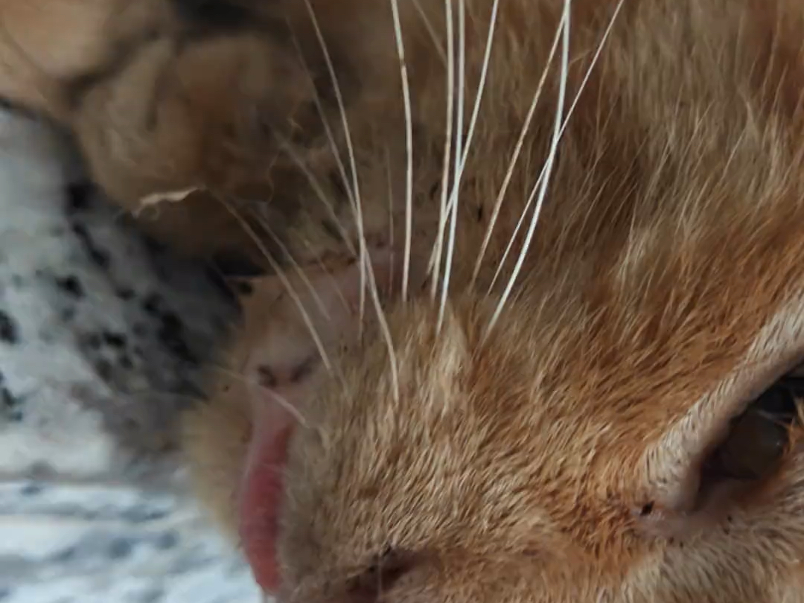 | 4946 | 2026-07-31 |
| [臭宝真是绝世好猫～](https://www.bilibili.com/video/BV1SJ386cE3V) | 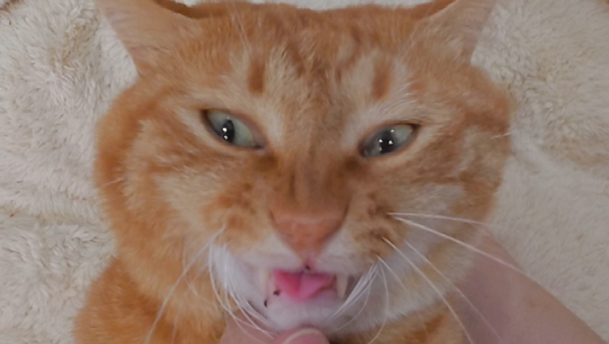 | 3.9万 | 2026-07-31 |
| [除了学习什么都学的舅舅！！四十六集](https://www.bilibili.com/video/BV1A93h6oEuC) | 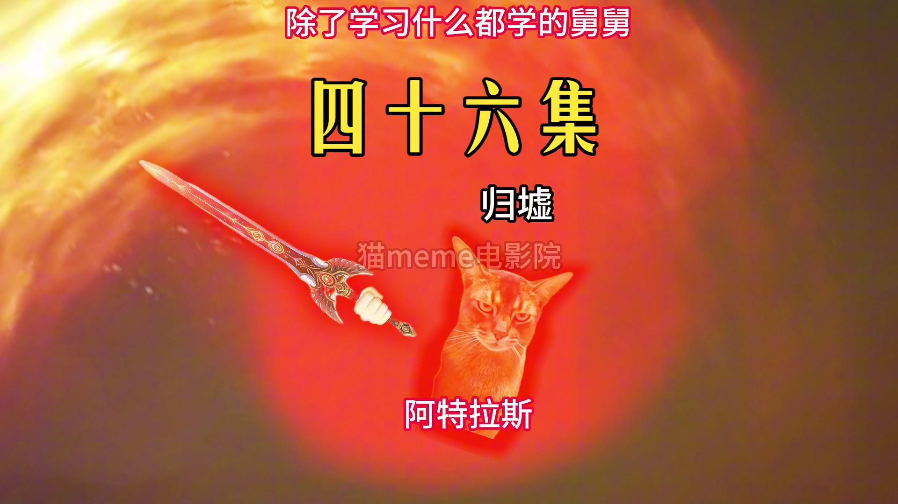 | 10.2万 | 2026-07-31 |
| [教嘬握手3.0版本！](https://www.bilibili.com/video/BV1RPGw6hE67) | 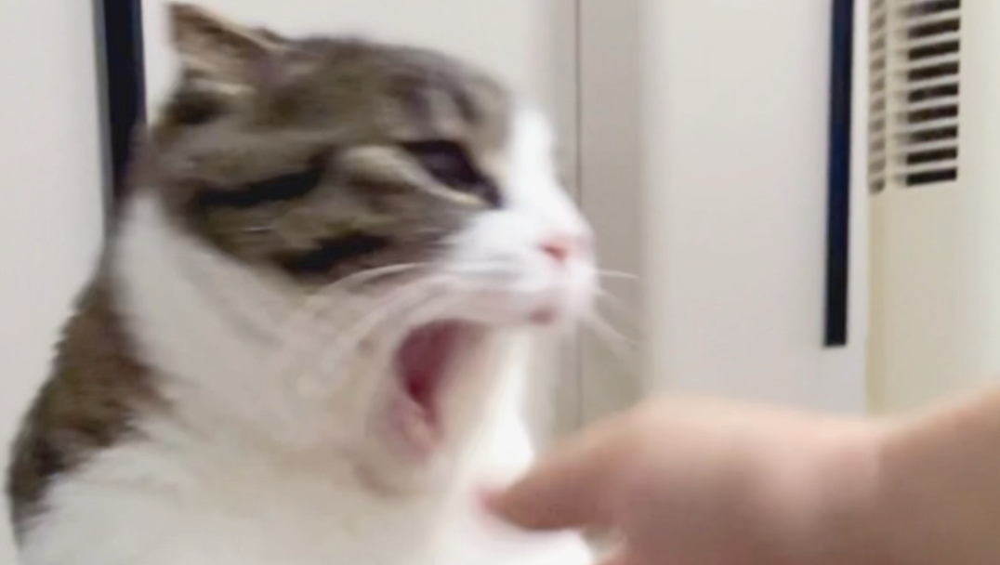 | 4.2万 | 2026-07-31 |
| [在仿真电动老虎脚下放一碗肉，狗子们敢去吃吗？](https://www.bilibili.com/video/BV1wk316aE8i) | 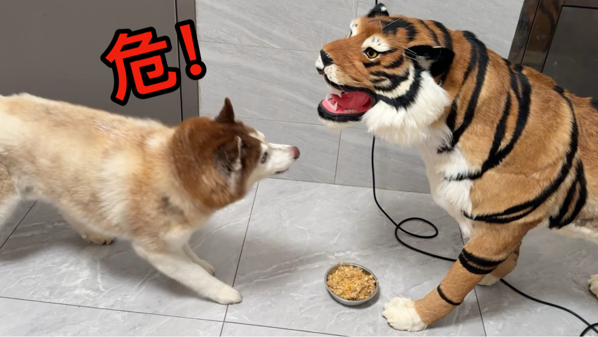 | 53.5万 | 2026-07-31 |
| [哈基米被塑料袋套到头之后直接应激疯狂乱窜还把其他哈基米得弄应激](https://www.bilibili.com/video/BV1ND3h6fESh) | 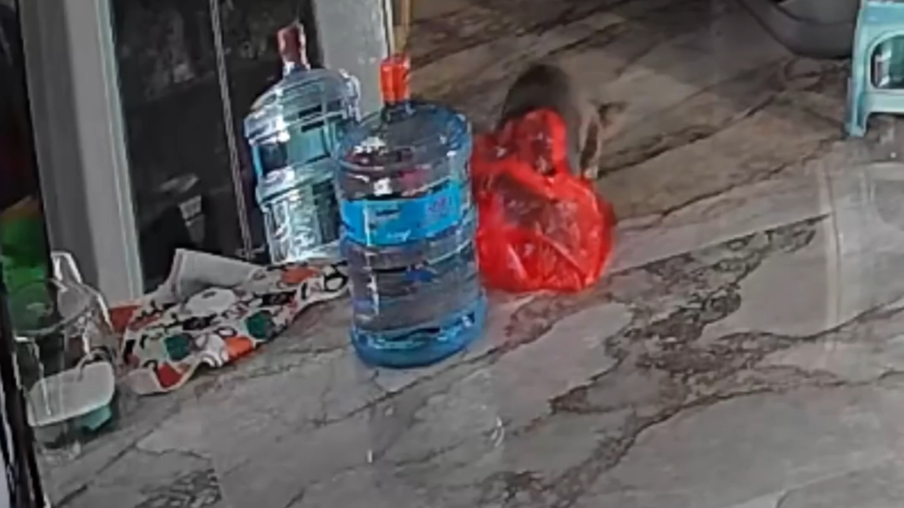 | 1.4万 | 2026-07-31 |
| [“我已经连续战斗了12个小时...” ｜ 【Bang Bang Bang】蜘蛛侠の小曲 电锯人の小曲](https://www.bilibili.com/video/BV1bP3h6cEjV) |  | 3.2万 | 2026-07-31 |
| [艾斯比视频](https://www.bilibili.com/video/BV1xw3b69E4Y) |  | 2.9万 | 2026-07-30 |
| [废狱哈基米](https://www.bilibili.com/video/BV1ow386kEZ7) |  | 1378 | 2026-07-30 |
| [哈气和头顶的阴影有关，阴影过头顶就可以哈气。](https://www.bilibili.com/video/BV1Am346LEtL) | 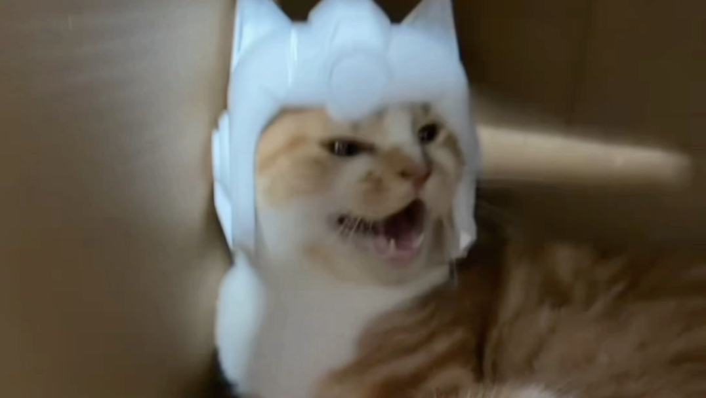 | 7.6万 | 2026-07-30 |
| [猫茸菌，是每个小区里最受欢迎的菌子](https://www.bilibili.com/video/BV1ic3t6iEZE) |  | 4.4万 | 2026-07-30 |
| [哈基米这个母爱，这个是好猫吗？基供向](https://www.bilibili.com/video/BV1cD346VEhf) | 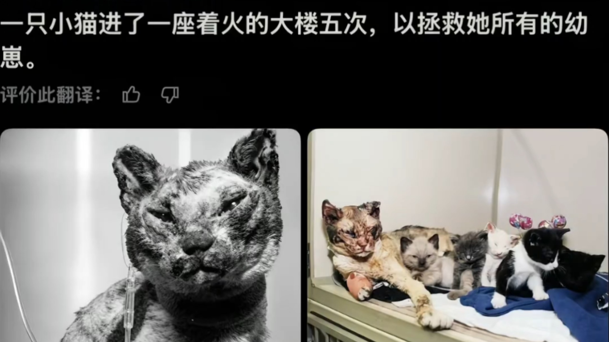 | 7246 | 2026-07-30 |
| [小猫：人，咪起床了](https://www.bilibili.com/video/BV13g3t68Epd) | 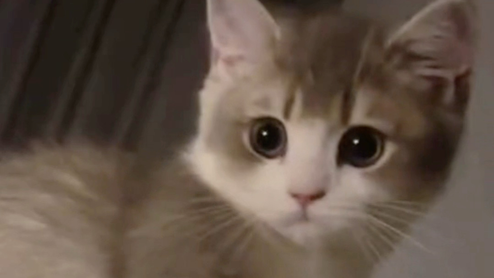 | 6.1万 | 2026-07-30 |
| [“一滴一滴刺痛我的心”-0.98x《梦的翅膀受了伤》](https://www.bilibili.com/video/BV1gV3t6tE3w) |  | 5005 | 2026-07-30 |
| [基米受伤版～背着背包去宁夏#哈基米  #梦的翅膀受了伤 #不孬摇 #梦的翅膀受了伤dj](https://www.bilibili.com/video/BV15A3x64EbE) |  | 3800 | 2026-07-30 |
| [网红基米口音正绕，基供向](https://www.bilibili.com/video/BV1uQ3x69EHG) | 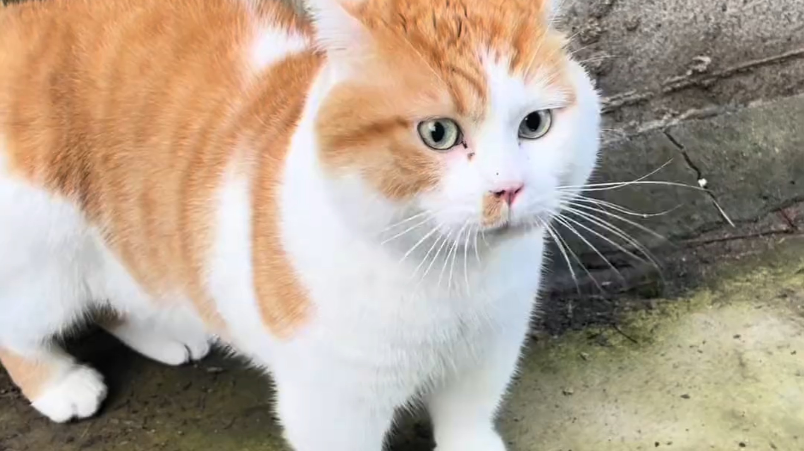 | 3.7万 | 2026-07-30 |
| [你知道七月份最火的梗有哪些吗?](https://www.bilibili.com/video/BV1kc3168Ep5) |  | 124.6万 | 2026-07-30 |
| [【基米】基米这个秒开状态](https://www.bilibili.com/video/BV1xm3J6wEEm) | 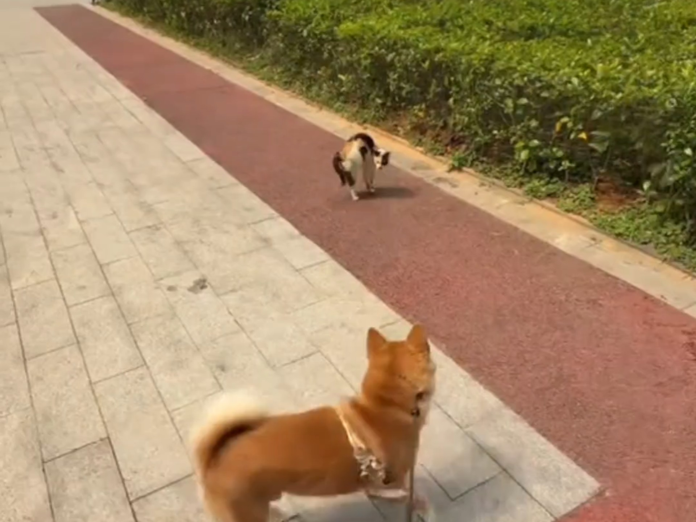 | 3.3万 | 2026-07-30 |
| [哈基米失误将哈基鸟放飞，哈基鸟嘲笑哈基米](https://www.bilibili.com/video/BV1HA3s6qECD) | 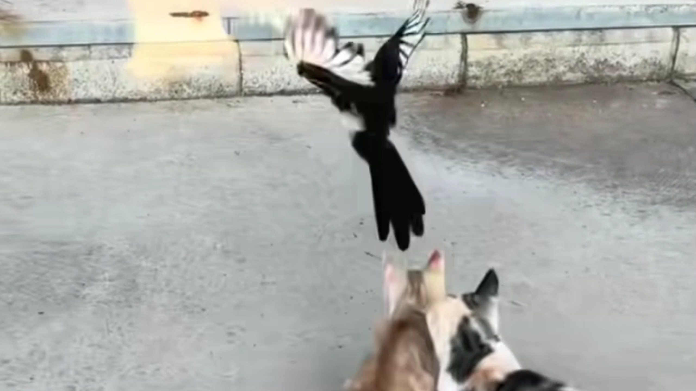 | 2.0万 | 2026-07-29 |
| [恐怖光哈基米](https://www.bilibili.com/video/BV1HN3s6KEMN) | 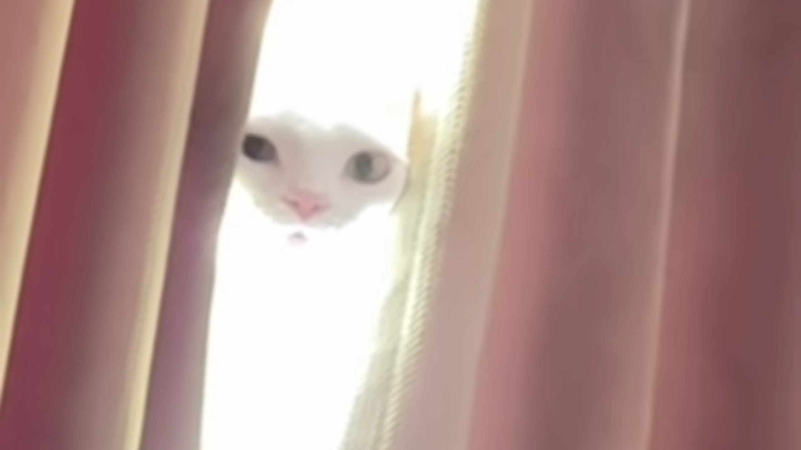 | 5395 | 2026-07-29 |
| [哈基米](https://www.bilibili.com/video/BV1yo3y6wEe2) |  | 9 | 2026-07-29 |
| [哈基米能飞～哈基米能飞～](https://www.bilibili.com/video/BV18W316CEUQ) | 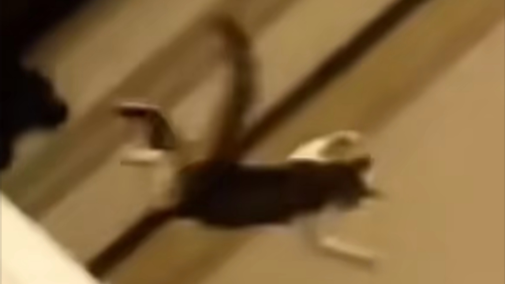 | 2887 | 2026-07-29 |
| [涂鸦躲猫猫：用AI帮我找人？谁能藏到最后！](https://www.bilibili.com/video/BV1r2316ZEMp) |  | 237.7万 | 2026-07-29 |
| [哈基米挑战马蜂窝](https://www.bilibili.com/video/BV1DT326GEYK) | 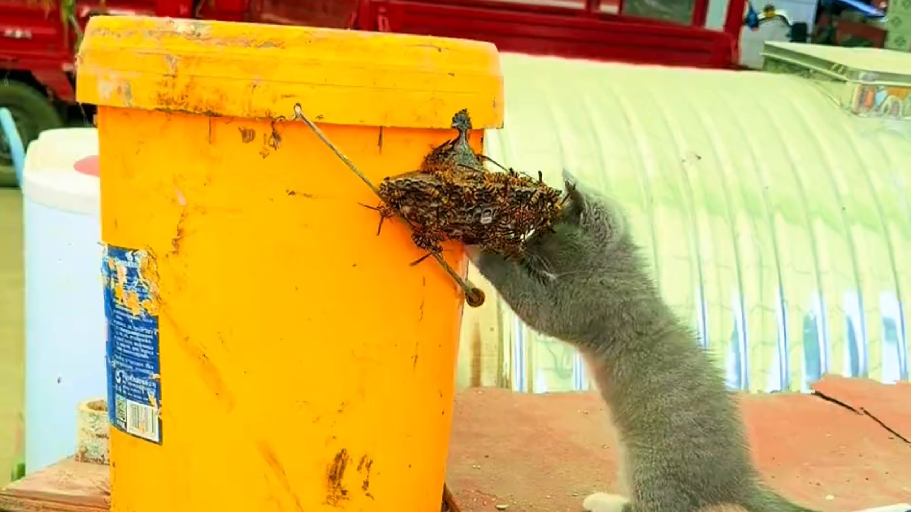 | 7408 | 2026-07-29 |
| [“可恶的老鼠敢伪装成哈基米”](https://www.bilibili.com/video/BV1KV326gEkE) | 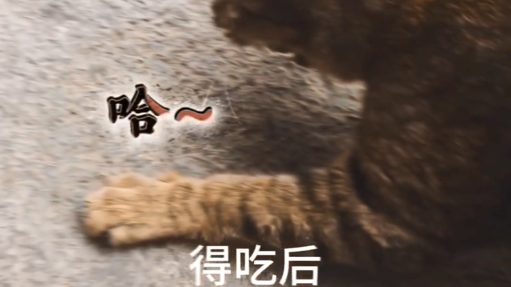 | 11.9万 | 2026-07-29 |
| [从幼儿园到大学](https://www.bilibili.com/video/BV18J3C6BEXY) |  | 18.0万 | 2026-07-29 |
| [哈哈哈，哈基米看见老吴这个恐惧，这时髦吗？](https://www.bilibili.com/video/BV1xg3k6dEMQ) | 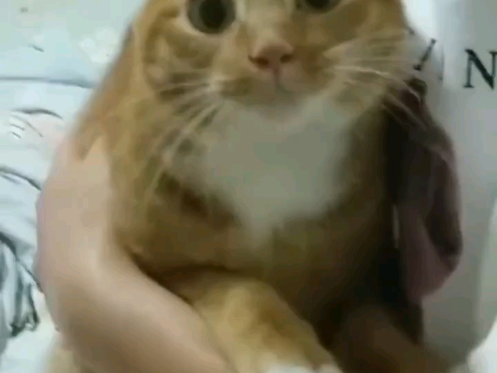 | 2213 | 2026-07-29 |
| [当阿什拉夫知道自己是哈基米之后](https://www.bilibili.com/video/BV1Ku3k64E2k) |  | 198 | 2026-07-29 |
| [小猫：你坏坏，不想跟你玩](https://www.bilibili.com/video/BV1cA3e6bEhR) | 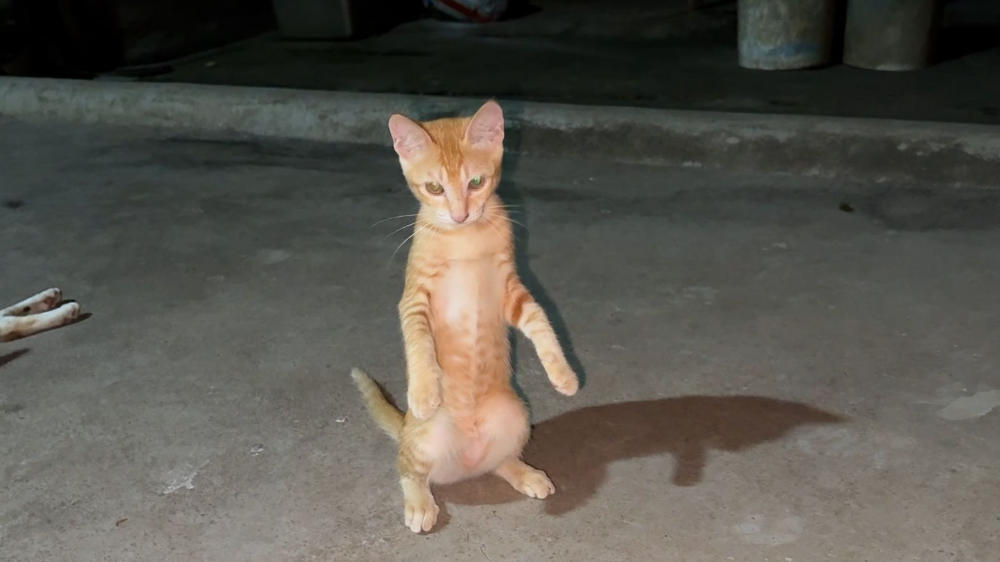 | 1.3万 | 2026-07-28 |
| [花1美元救了一只濒死的小钝口螈，最终我买到了全世界最稀有的1万美元的那只](https://www.bilibili.com/video/BV1MZ3q6EEMT) | 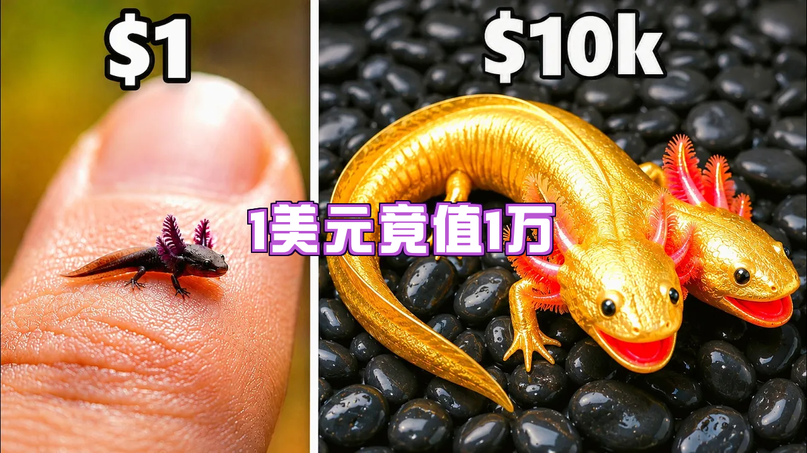 | 3.6万 | 2026-07-28 |
| [喵扎特，一位有音乐细胞的哈吉咪音乐家！](https://www.bilibili.com/video/BV1tMgf6ME7J) |  | 2.0万 | 2026-07-28 |
| [当你在弟弟的小学课本上画大狗叫会发生什么？](https://www.bilibili.com/video/BV1DG3N6fEBW) | 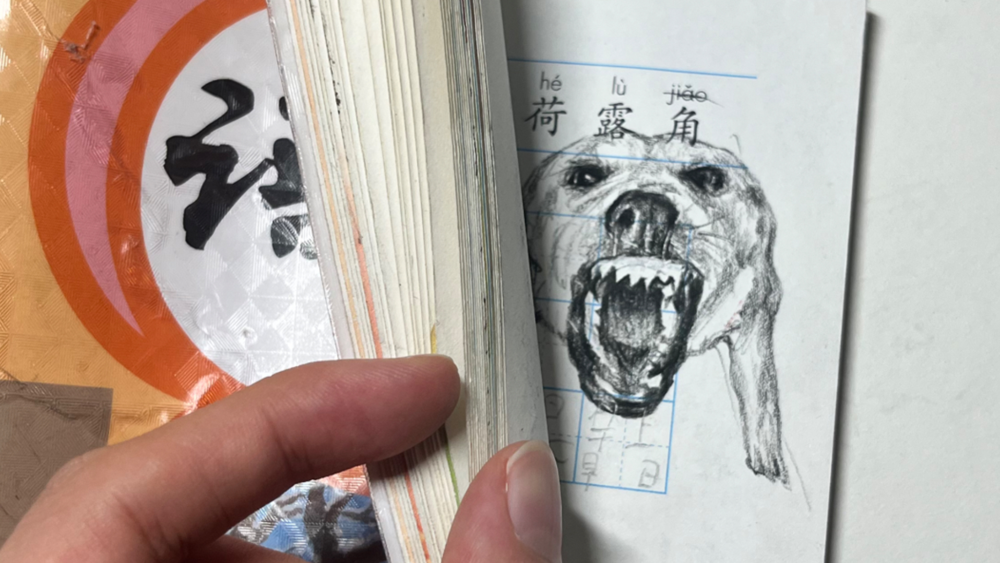 | 33.1万 | 2026-07-28 |
| [【中文字幕/4K修复】ベノム(猛毒)](https://www.bilibili.com/video/BV1mCge6TEbL) |  | 266 | 2026-07-28 |
| [基米拍案叫绝](https://www.bilibili.com/video/BV1Cq3e6NEkX) | 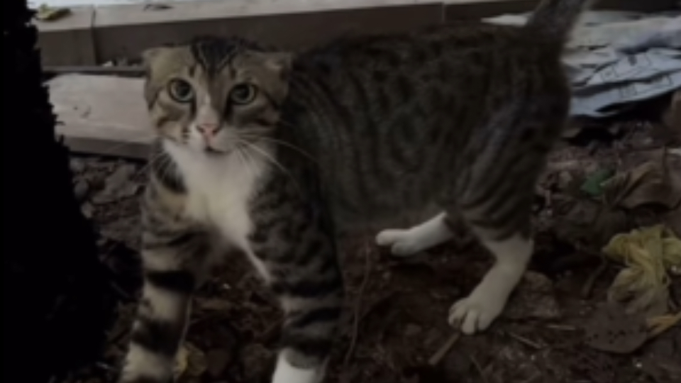 | 2.6万 | 2026-07-28 |
| [狂野哈基米1-5合集](https://www.bilibili.com/video/BV1ZV3w6hEe4) |  | 597 | 2026-07-27 |
| [橘猫姐姐不爱吃番茄，使劲把番茄摔在盘子里弄了妈妈一身汤汁！](https://www.bilibili.com/video/BV1ry3w6gECV) |  | 15.6万 | 2026-07-27 |
| [吕布VS狗哥 原片放出大家看个爽](https://www.bilibili.com/video/BV1St3F6VEKi) | 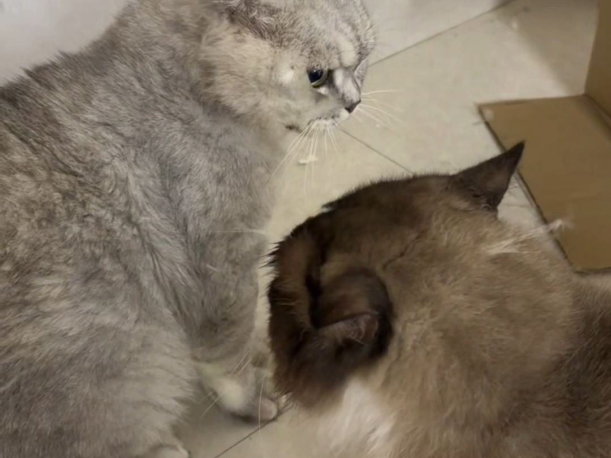 | 10.9万 | 2026-07-27 |
| [护主这块还得看吕布](https://www.bilibili.com/video/BV1iQ3F6oEDb) | 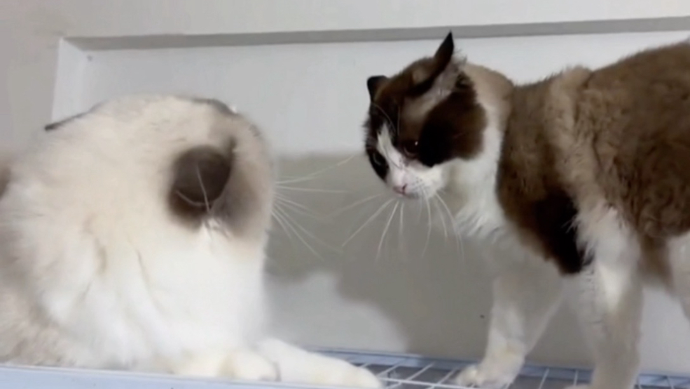 | 14.5万 | 2026-07-27 |
| [能绷住的可以改名绷带了！](https://www.bilibili.com/video/BV1Gqgf6JEiZ) |  | 358.9万 | 2026-07-27 |
| [小猫的心愿总会被看见！心心念念蹦床的小橘，收到猫妈妈准备的超大惊喜💕](https://www.bilibili.com/video/BV1wJ3c6zE1y) |  | 4.4万 | 2026-07-27 |
| [男友视角](https://www.bilibili.com/video/BV1Wj3c66EQW) | 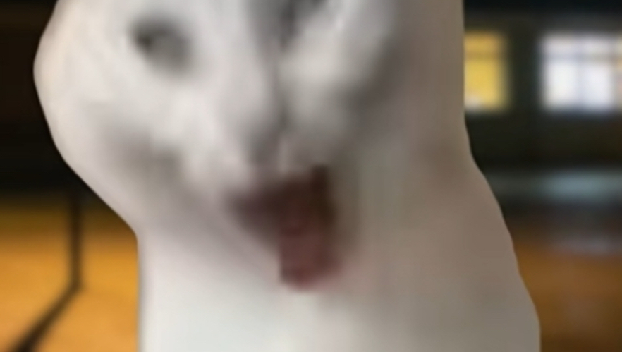 | 23.1万 | 2026-07-27 |
| [“可观测宇宙最无奈的一声老吴”](https://www.bilibili.com/video/BV1rBgZ6ZE9H) | 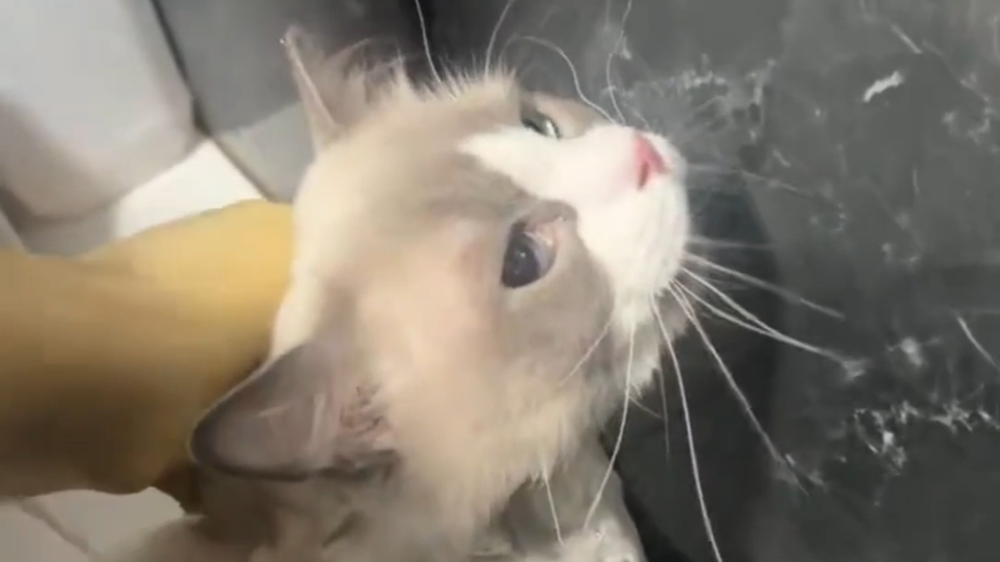 | 12.3万 | 2026-07-27 |
| [哈基米vs蛇](https://www.bilibili.com/video/BV1tvgX6xEEL) | 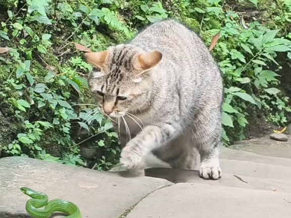 | 714 | 2026-07-27 |
| [在机密开972万的反应堆总控核心！爆率究竟会怎样？](https://www.bilibili.com/video/BV16ag96jE7L) | 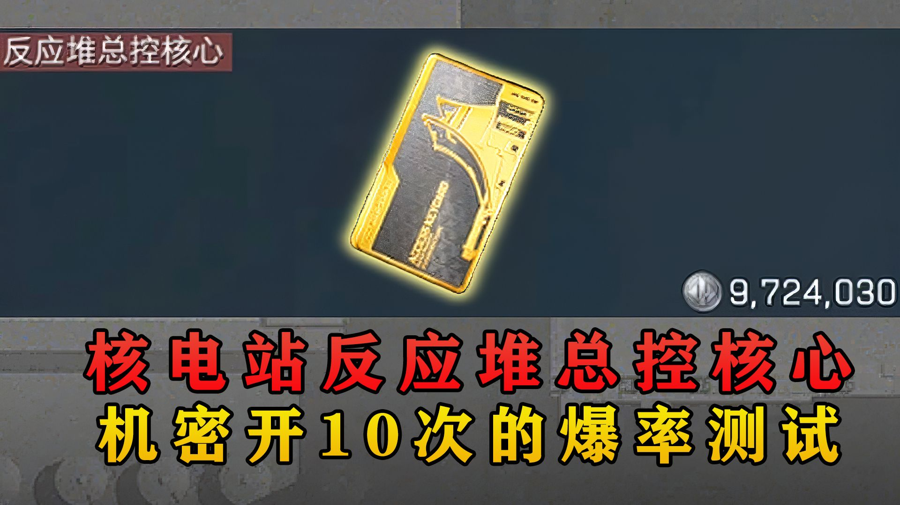 | 493.7万 | 2026-07-26 |
| [耗时两年半，我们终于拍到了刀盾狗捕猎妙脆角猫的全过程。](https://www.bilibili.com/video/BV1V23j6KEqo) |  | 8.7万 | 2026-07-26 |
| [台风过来后，小区下的哈基咪](https://www.bilibili.com/video/BV1Zq3j63EE7) | 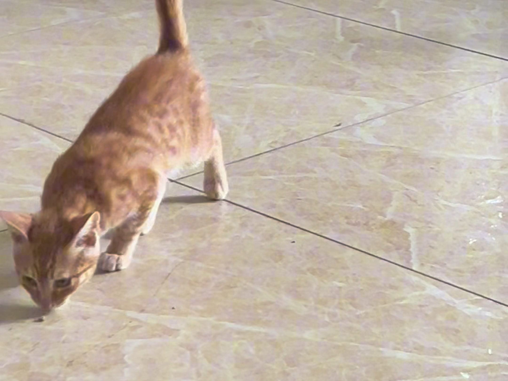 | 761 | 2026-07-26 |
| [《狗出没》](https://www.bilibili.com/video/BV1E83G6hEeP) |  | 8.0万 | 2026-07-25 |
| [🐶妄想感伤大狗联盟🐶](https://www.bilibili.com/video/BV13c3g6kEne) |  | 9.7万 | 2026-07-25 |
| [这才是《西蒙海耶の小曲》原版MV](https://www.bilibili.com/video/BV1Xz3g61E8d) |  | 45.3万 | 2026-07-25 |
| [野猫闯入家中打家猫打出屎来](https://www.bilibili.com/video/BV1fW3g6dEHP) | 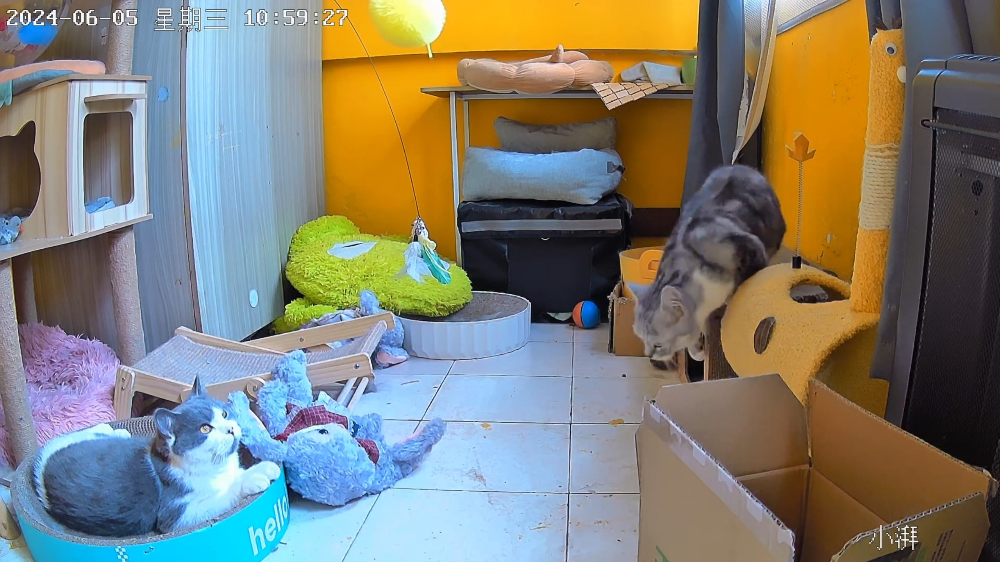 | 1.3万 | 2026-07-25 |
| [再见狸花猫](https://www.bilibili.com/video/BV1Nt3u6PEZf) | 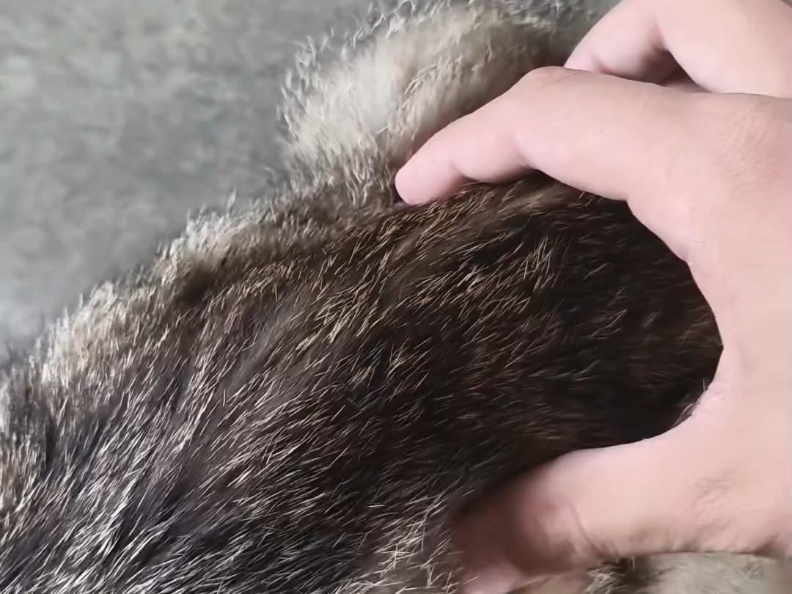 | 5.5万 | 2026-07-25 |
| [当大狗叫遇到小狗叫](https://www.bilibili.com/video/BV1LmgY61ETh) |  | 17.4万 | 2026-07-24 |
| [丑橘&amp;基米的激情献唱](https://www.bilibili.com/video/BV1Eigh6LErZ) | 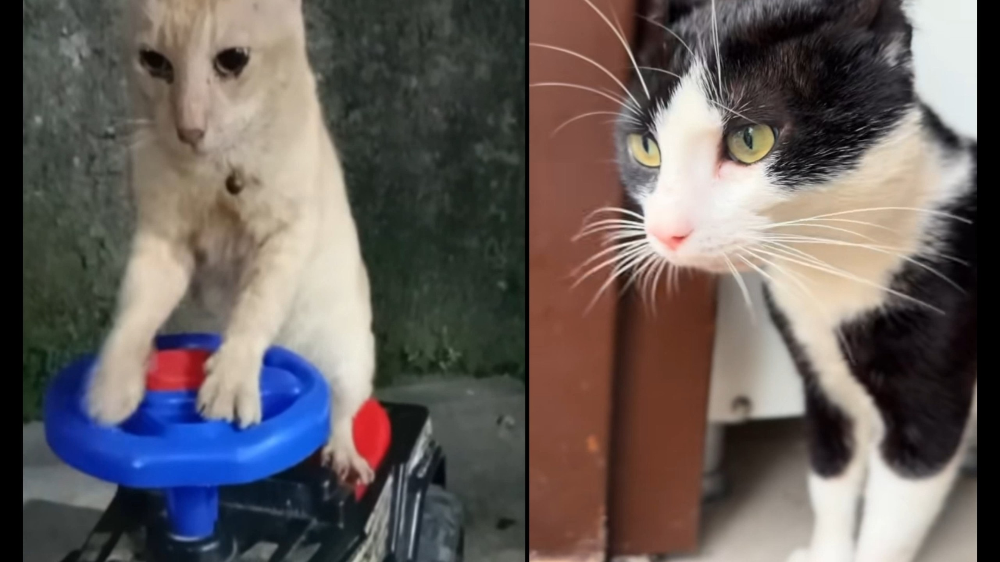 | 3.0万 | 2026-07-24 |
| [哈基米这个二猫转](https://www.bilibili.com/video/BV1q3gD6PE2o) | 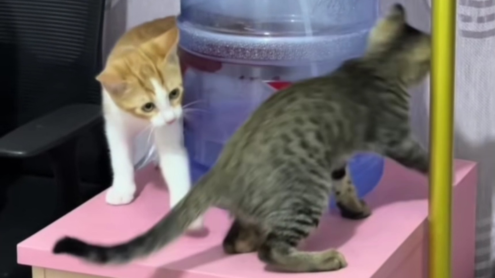 | 4.8万 | 2026-07-23 |
| [当我试图驯服AI做短剧（5）](https://www.bilibili.com/video/BV1EiKB69EjC) | 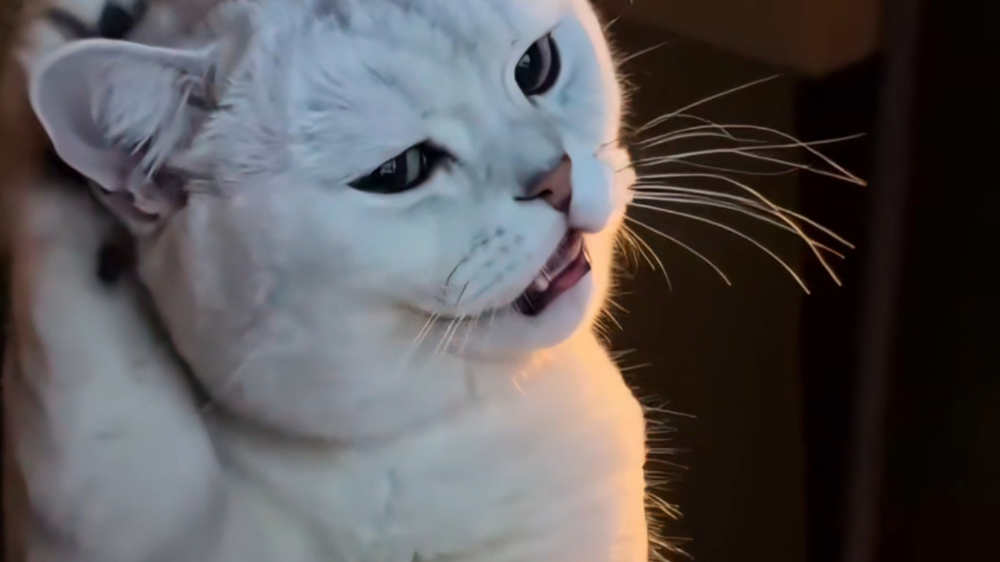 | 237.9万 | 2026-07-19 |
| [拉拉的一生](https://www.bilibili.com/video/BV15hKF6CEz2) | 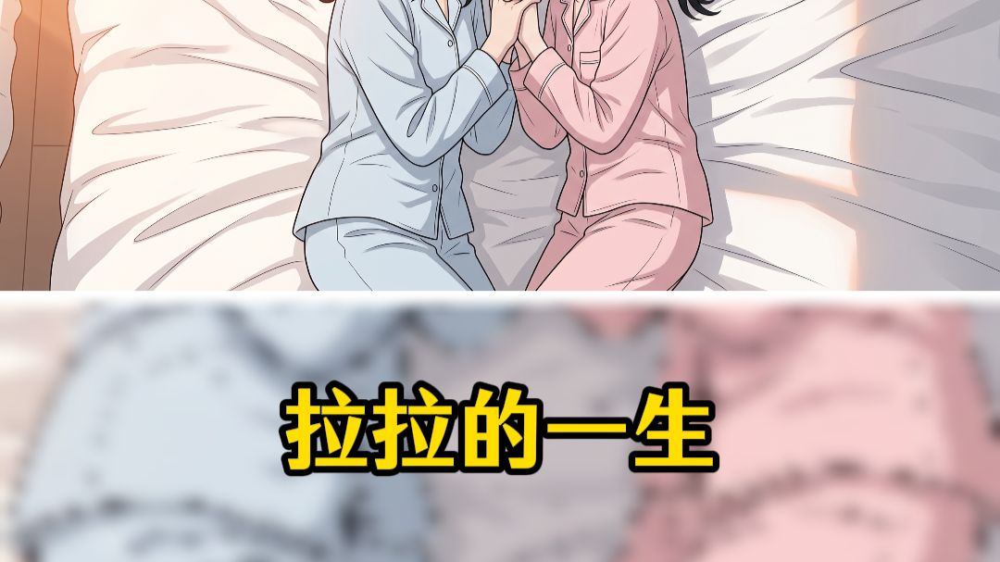 | 29.6万 | 2026-07-18 |
| [哈吉米之歌](https://www.bilibili.com/video/BV1pdKF64EQj) |  | 39 | 2026-07-18 |
| [【耄耋食堂】今天吃猫和老鼠同款机械猫硬糖](https://www.bilibili.com/video/BV1hvNd6sEeC) | 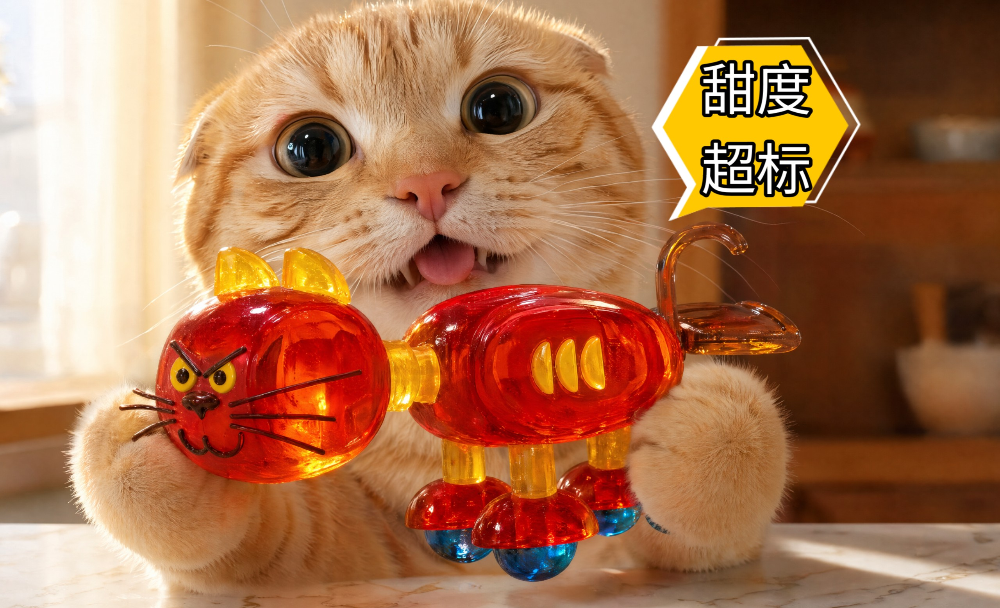 | 2.1万 | 2026-07-17 |
| [可怜小猫2个月疑似胳膊被人卸了。](https://www.bilibili.com/video/BV17CT56REVi) |  | 1.9万 | 2026-06-29 |
| [哈基米之哈基风车](https://www.bilibili.com/video/BV1ecWKzJE7c) |  | 2127 | 2025-09-18 |

---
*最后更新: 2026-08-02 05:39:03 (自动生成)*
*数据来源: [Bilibili](https://www.bilibili.com)*

## 使用说明

运行以下命令更新视频列表:
```bash
python3 fetch_hajimi_videos.py
```
