# awesome-hajimi
collections of hajimi (哈基米 in Chinese) on the Internet.

## 视频列表 (Video List)

| 视频标题 (Title) | 封面 | 播放量 (Views) | 发布日期 (Date) |
|---|---|---|---|
| [哈基米的幽默瞬间（5）](https://www.bilibili.com/video/BV1LHGc6cEiG) |  | 1849 | 2026-07-31 |
| [[男声翻唱]  ?!人是猫!? 哈基米! 哈基米!](https://www.bilibili.com/video/BV1Bz3t6zE4s) |  | 387 | 2026-07-31 |
| [哈基米南北绿豆](https://www.bilibili.com/video/BV1Bk386LETD) |  | 1200 | 2026-07-31 |
| [哈基米一边翻滚一边触发挠痒代码，差点代码错误](https://www.bilibili.com/video/BV1By3a6QEU7) | 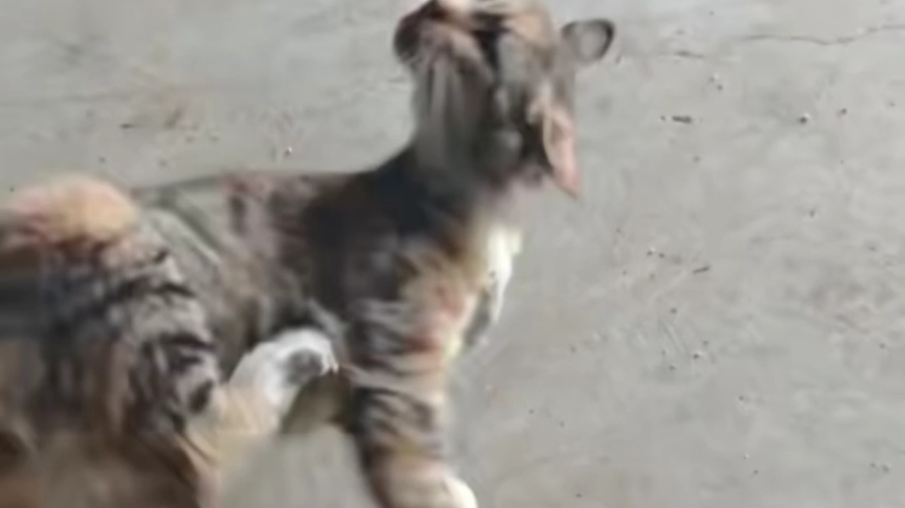 | 1127 | 2026-07-30 |
| [哈基人正在给乖巧的哈基米吹风](https://www.bilibili.com/video/BV1By3a6QESb) | 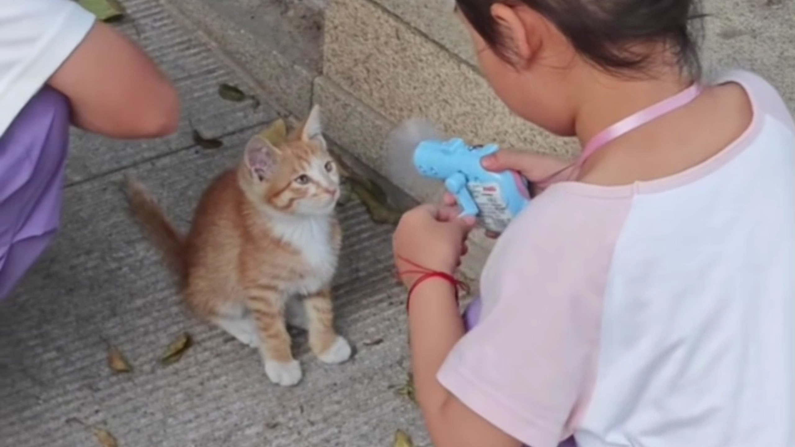 | 1165 | 2026-07-30 |
| [哈基米限时音效返场](https://www.bilibili.com/video/BV1jt3h6yE4h) |  | 1350 | 2026-07-30 |
| [哈基米这个老实](https://www.bilibili.com/video/BV1bd3t6ZEkY) |  | 2683 | 2026-07-30 |
| [隐藏事件：飞翔的哈基米](https://www.bilibili.com/video/BV14w3b69ExZ) | 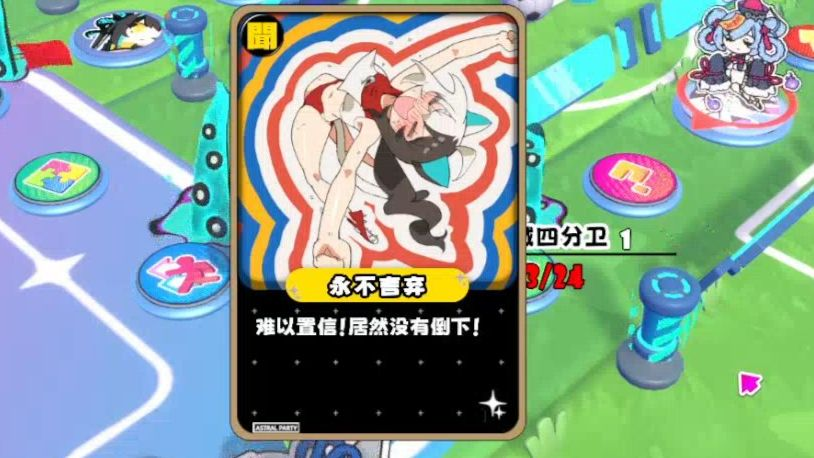 | 3513 | 2026-07-30 |
| [打上哈基米](https://www.bilibili.com/video/BV1Mz3b6bE95) |  | 1461 | 2026-07-30 |
| [真没有想到哈基米这么厉害？](https://www.bilibili.com/video/BV1Mz3b6bEas) | 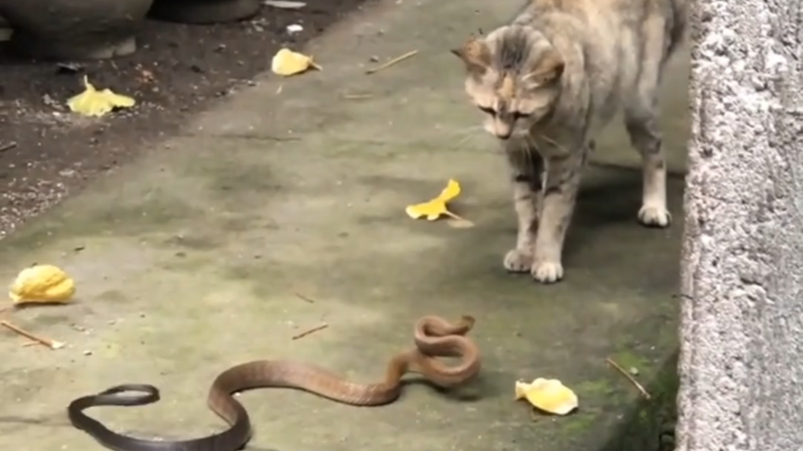 | 305 | 2026-07-30 |
| [用哈基米玩偶抽奖？](https://www.bilibili.com/video/BV1Ec3865EXR) | 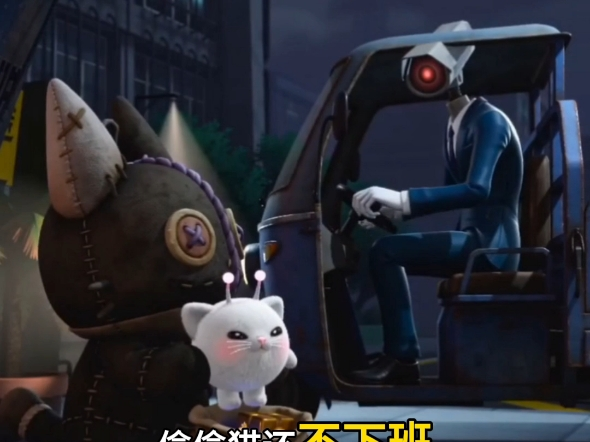 | 601 | 2026-07-30 |
| [绯英爻光哈基米](https://www.bilibili.com/video/BV1dM386BETc) |  | 392 | 2026-07-30 |
| [三哈对立，哈基米这个奇怪叫声](https://www.bilibili.com/video/BV1KZ3x6SEXV) | 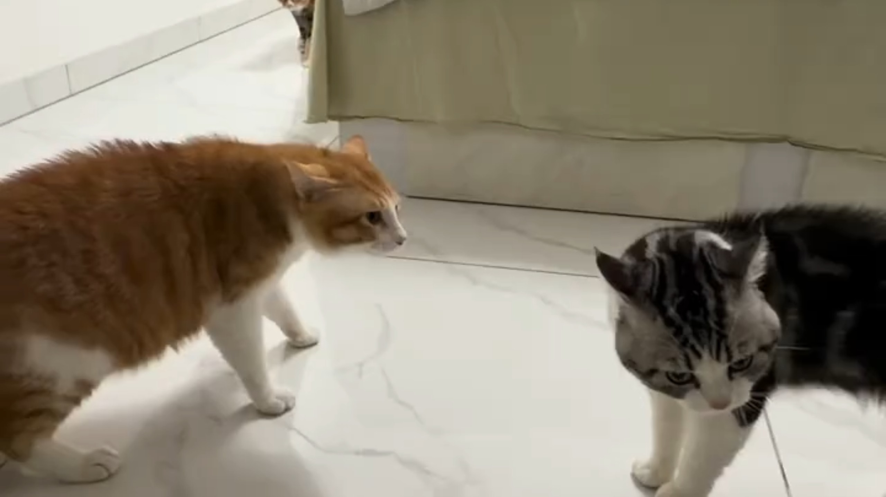 | 425 | 2026-07-30 |
| [恐怖哈基米！7限金猫又爆杀螃蟹！](https://www.bilibili.com/video/BV1ga346xEQt) | 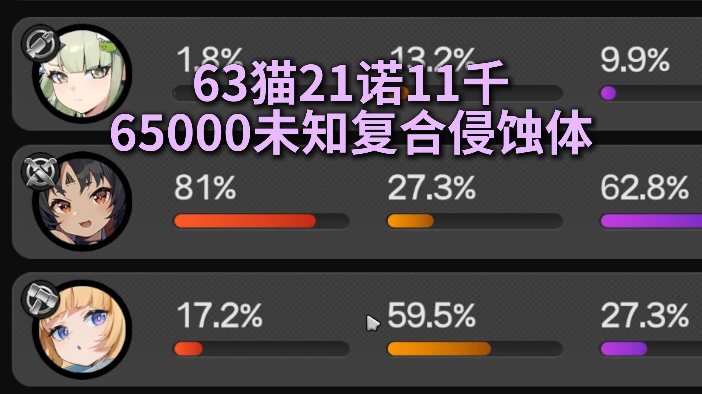 | 404 | 2026-07-30 |
| [哈基米的幽默瞬间4）](https://www.bilibili.com/video/BV1Kz346DEoc) | 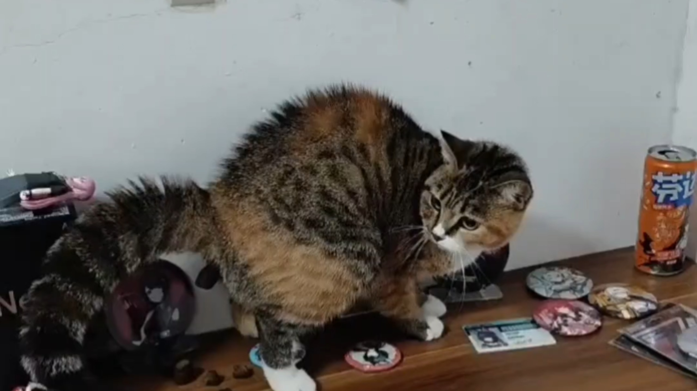 | 614 | 2026-07-30 |
| [朝气蓬勃｜Papi酱《生气了》平壤版](https://www.bilibili.com/video/BV1D33t6ZEKc) |  | 10.0万 | 2026-07-30 |
| [干嘛猫的vlog（和好朋咪海洋公园一日游！）](https://www.bilibili.com/video/BV1bQ3x6XEpF) | 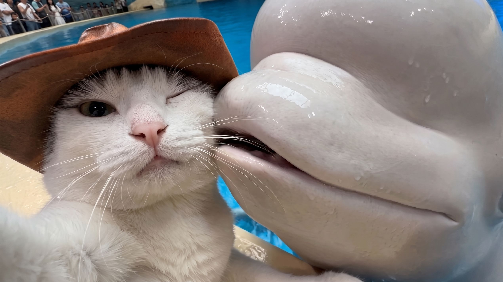 | 36.5万 | 2026-07-30 |
| [哈基米这个进场时机谁能绷得住？](https://www.bilibili.com/video/BV16Q346kEUs) | 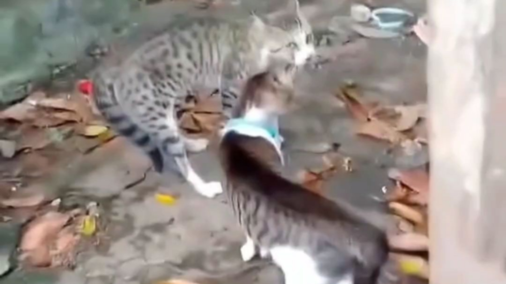 | 1.5万 | 2026-07-30 |
| [循环歌单｜“【趣味英语の小曲】【AGUDO MAGKLCO”】](https://www.bilibili.com/video/BV1ks3x63E5h) |  | 160.0万 | 2026-07-30 |
| [我的悲伤是狗叫的（完整版）](https://www.bilibili.com/video/BV1VH3s6sEuo) |  | 3.2万 | 2026-07-30 |
| [公报私仇基米](https://www.bilibili.com/video/BV1YH3s6sESJ) | 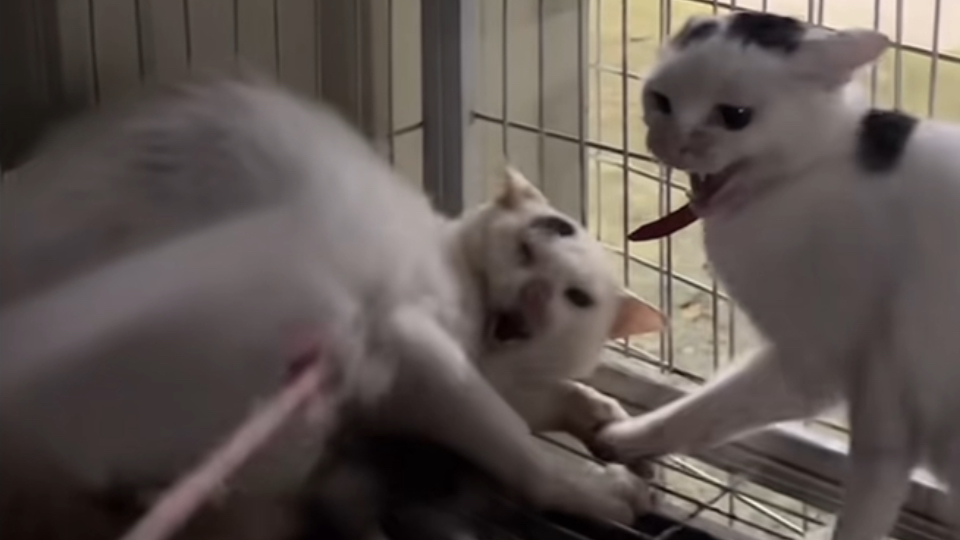 | 7000 | 2026-07-30 |
| [【哈基米音乐】FUNK NA MIRA（柳宗元的小曲）](https://www.bilibili.com/video/BV1XA3x6xEZ3) |  | 493 | 2026-07-30 |
| [训依旧](https://www.bilibili.com/video/BV1SK3W61EW6) | 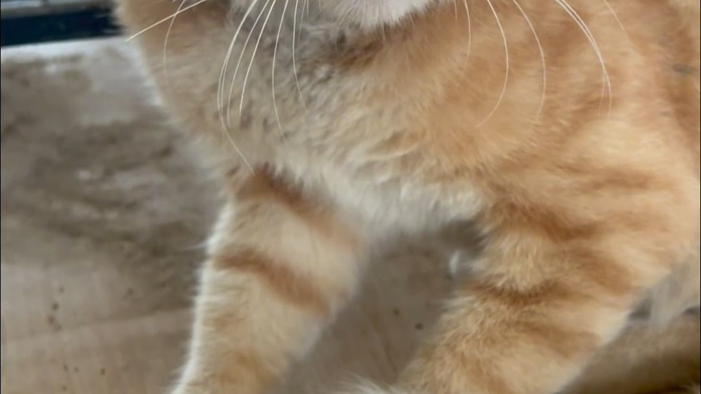 | 4362 | 2026-07-30 |
| [老吃家小笨狗](https://www.bilibili.com/video/BV1hD3x6WEQ9) | 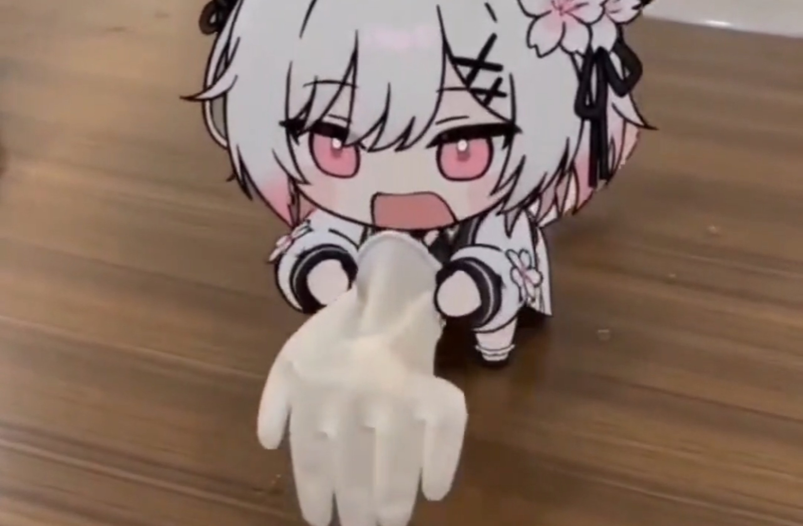 | 926 | 2026-07-30 |
| [基米这个史山代码 还会原地踏步](https://www.bilibili.com/video/BV1oS3p64Eop) | 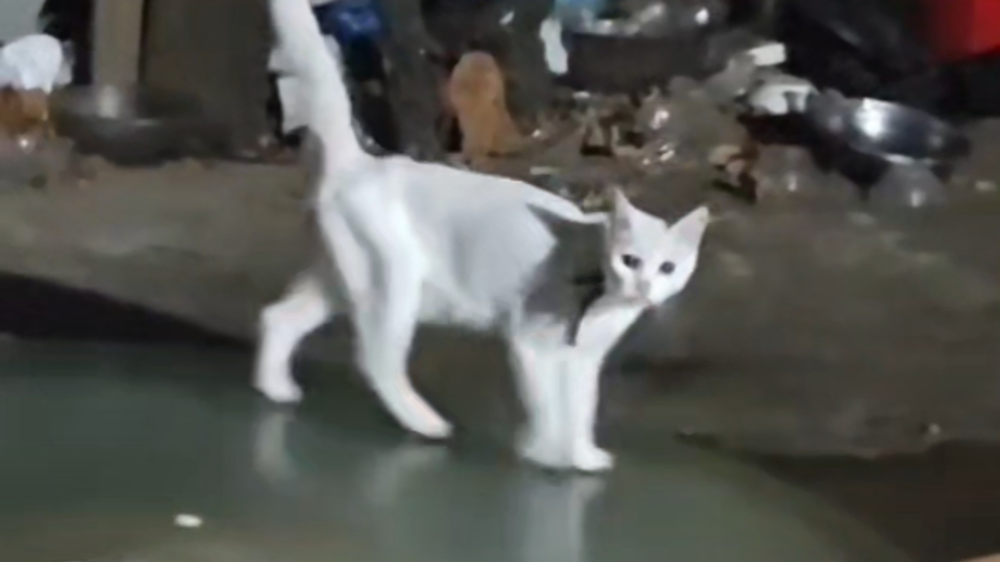 | 1271 | 2026-07-30 |
| [《哈基猫奇遇记：贝壳炸鸡岛》](https://www.bilibili.com/video/BV1oD3p6dECi) | 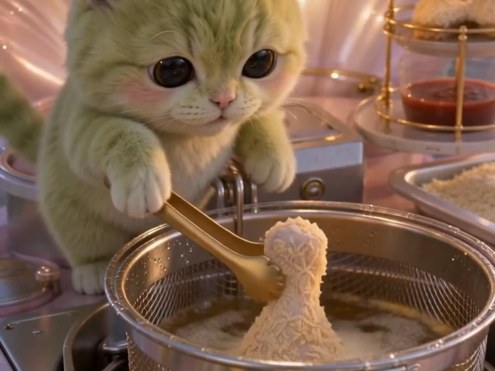 | 8.1万 | 2026-07-30 |
| [哈基米这个愿基上钩](https://www.bilibili.com/video/BV15d3p6WE2H) | 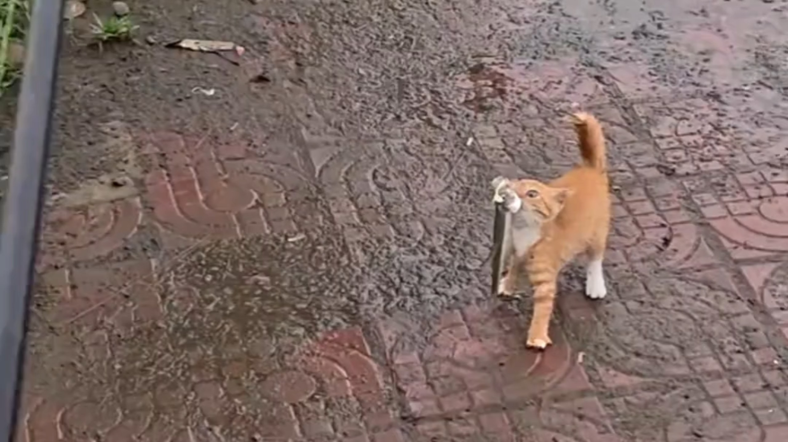 | 3.3万 | 2026-07-30 |
| [糟糕的揩咪油手法](https://www.bilibili.com/video/BV15R3n6jE3q) | 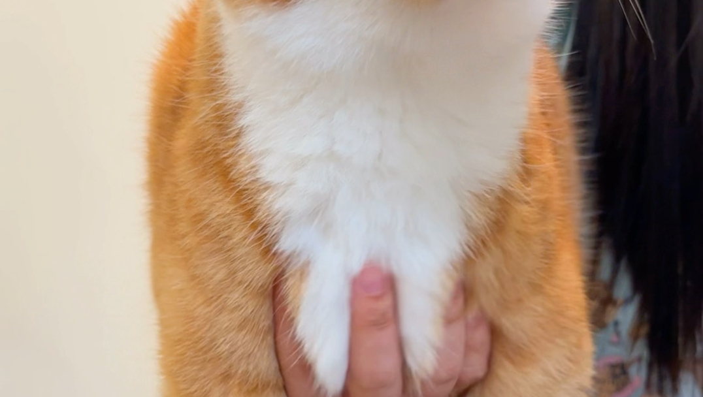 | 16.6万 | 2026-07-30 |
| [基米视频](https://www.bilibili.com/video/BV1253W6gE7T) | 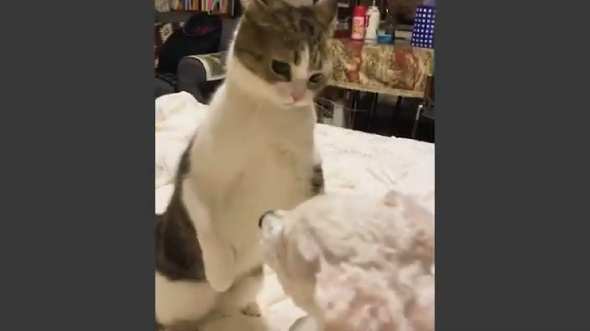 | 157 | 2026-07-30 |
| [被上学磨平妙脆角](https://www.bilibili.com/video/BV1Gr3W6XEoh) |  | 1949 | 2026-07-30 |
| [哈基米被石头给卡住了](https://www.bilibili.com/video/BV1bS3W6jEFR) | 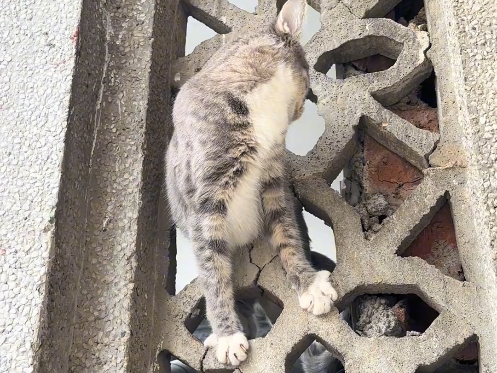 | 3954 | 2026-07-30 |
| [基米依旧底层代码冲突](https://www.bilibili.com/video/BV15Y3J6kEpz) | 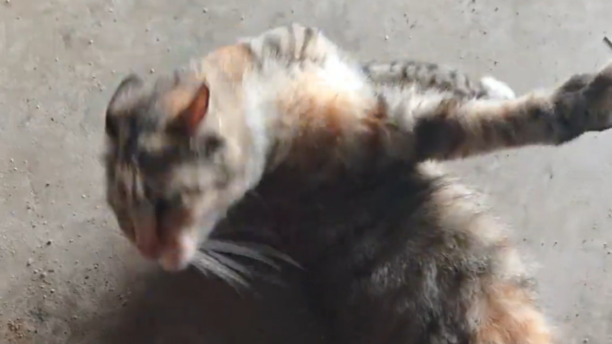 | 2.5万 | 2026-07-29 |
| [？！哈基米？！ ？！大狗叫？！ ？！叮咚鸡？！](https://www.bilibili.com/video/BV11U3J6hEax) |  | 161 | 2026-07-29 |
| [哪个才是土豆男孩真正叫声（第24关）](https://www.bilibili.com/video/BV1Hd3J6dE3r) | 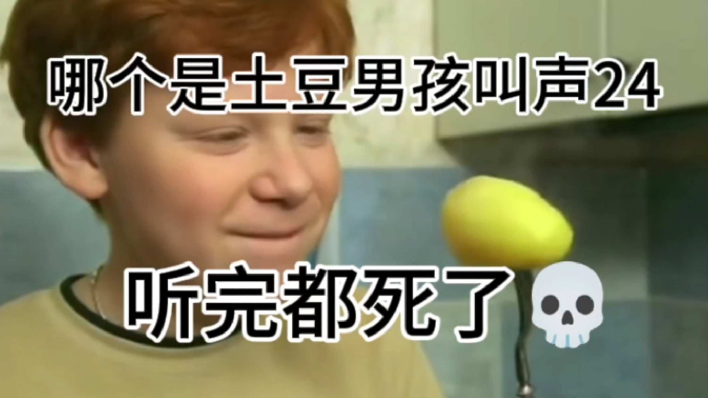 | 3310 | 2026-07-29 |
| [哈基蛇你这家伙，被哈基米附体了。](https://www.bilibili.com/video/BV1T43n6vErN) | 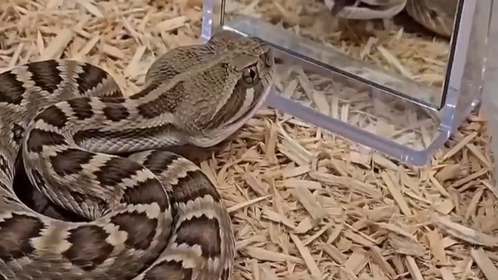 | 22.4万 | 2026-07-29 |
| [蒙古哈基米开始呼麦，老吴，这时髦吗？](https://www.bilibili.com/video/BV1uW3n6qE3G) | 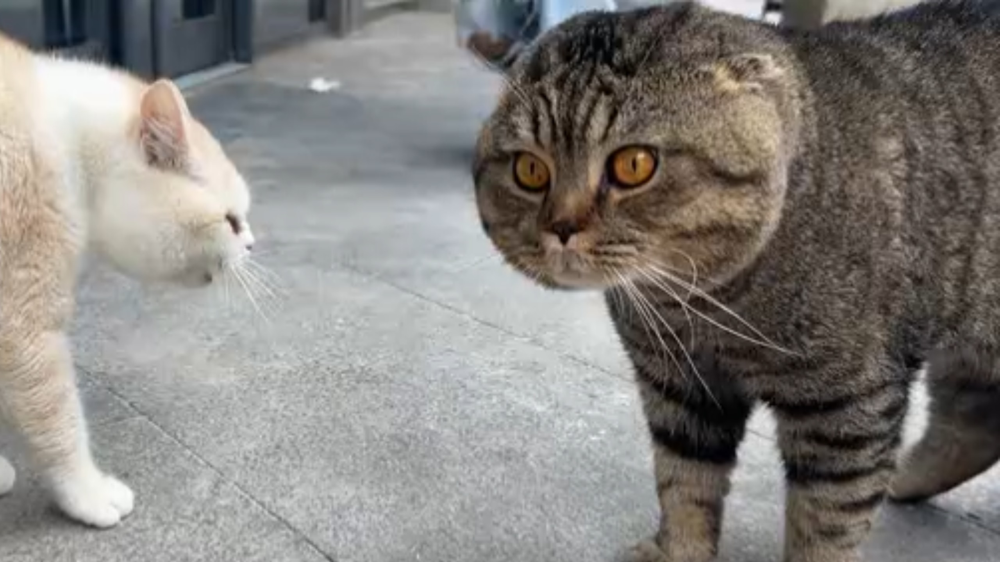 | 5796 | 2026-07-29 |
| [【哈基米音乐】GIve up（Brightest Light）](https://www.bilibili.com/video/BV15g3n6jEyF) |  | 410 | 2026-07-29 |
| [这时髦？](https://www.bilibili.com/video/BV1Xd3n6yEH8) | 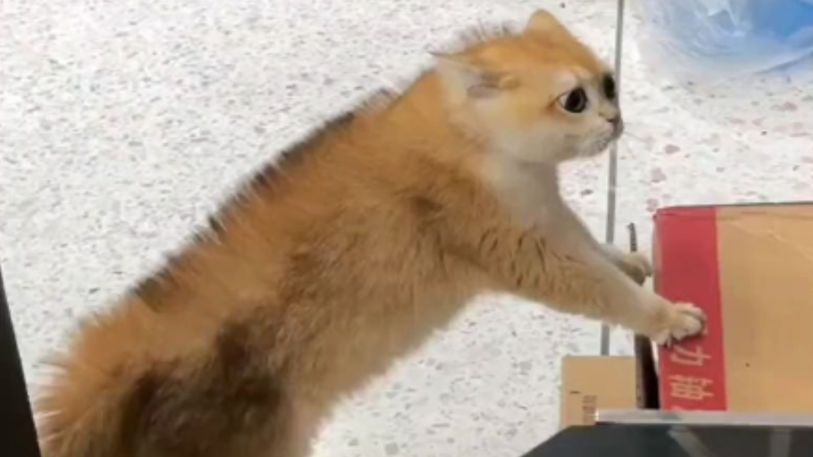 | 2576 | 2026-07-29 |
| [狼王回归？5支大连4位狼主！死守哈基米多顿命脉！【战锤40K】](https://www.bilibili.com/video/BV1d5316SEbG) |  | 6.4万 | 2026-07-29 |
| [今天是小猫当家！](https://www.bilibili.com/video/BV1Sb316gE2U) | 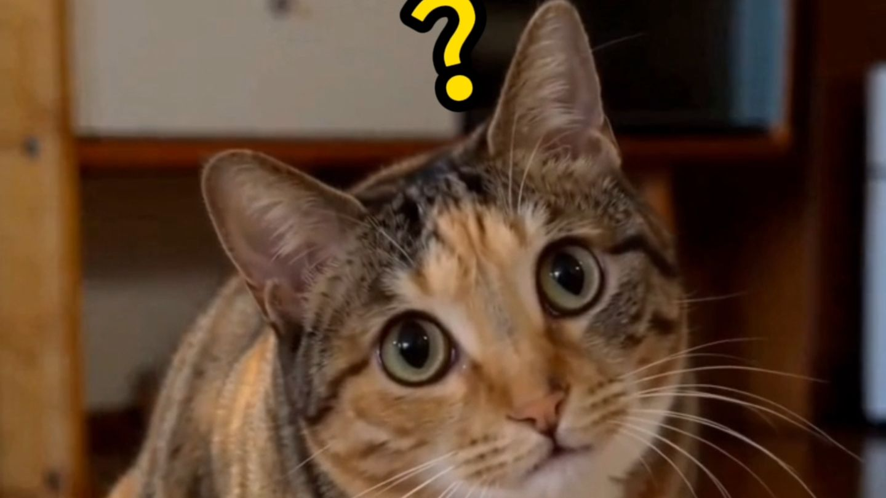 | 26.9万 | 2026-07-29 |
| [哈基米音乐](https://www.bilibili.com/video/BV1gN3261Ejs) |  | 2502 | 2026-07-29 |
| [基米小学：喵喵喵喵喵喵喵喵喵喵](https://www.bilibili.com/video/BV1Zy3E65EtF) | 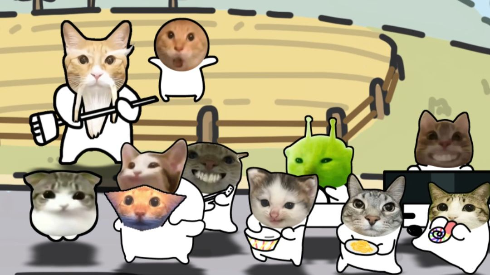 | 3.4万 | 2026-07-29 |
| [这大狗叫魔了！](https://www.bilibili.com/video/BV16U3164EYy) |  | 83.6万 | 2026-07-29 |
| [《  它  不  在  是  一  个  男  孩  》](https://www.bilibili.com/video/BV1JS316dEj6) |  | 9999 | 2026-07-29 |
| [哈基米意外离世被好友哈基汪埋葬了起来](https://www.bilibili.com/video/BV1CW326YEJ1) | 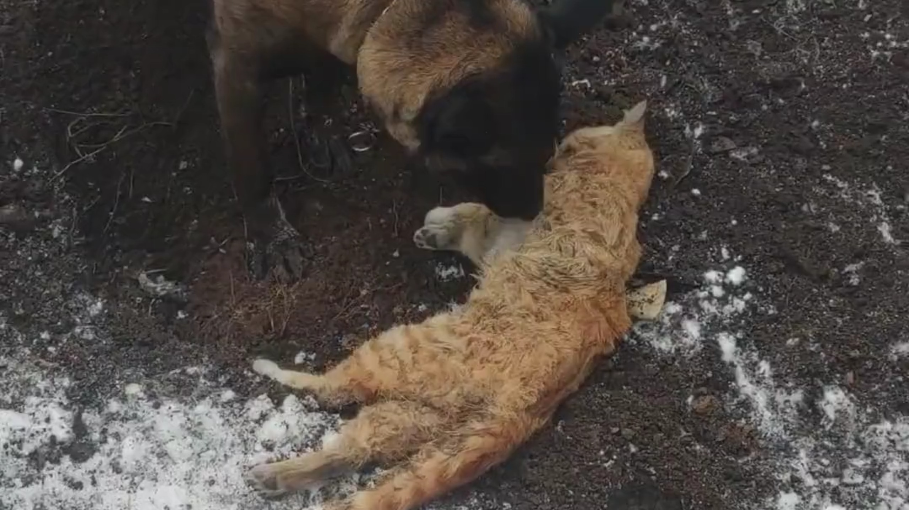 | 5.9万 | 2026-07-29 |
| [哈鸡咪~~](https://www.bilibili.com/video/BV1tKgf6zEte) | 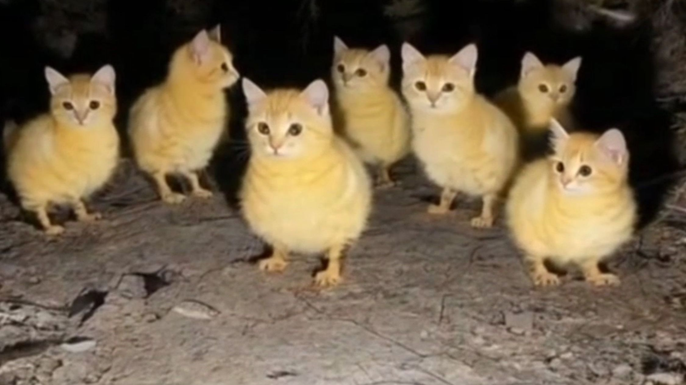 | 1342 | 2026-07-29 |
| [搞了一个耄耋开瓶器，物尽其用了](https://www.bilibili.com/video/BV1M3326rEnB) | 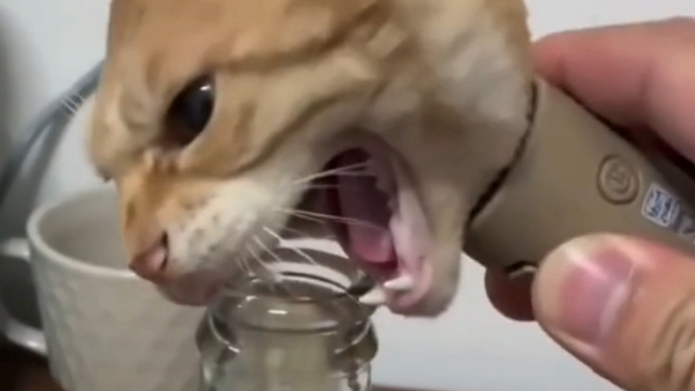 | 6.9万 | 2026-07-29 |
| [妙脆角是怎样炼成的？](https://www.bilibili.com/video/BV1fy3C6HEbG) | 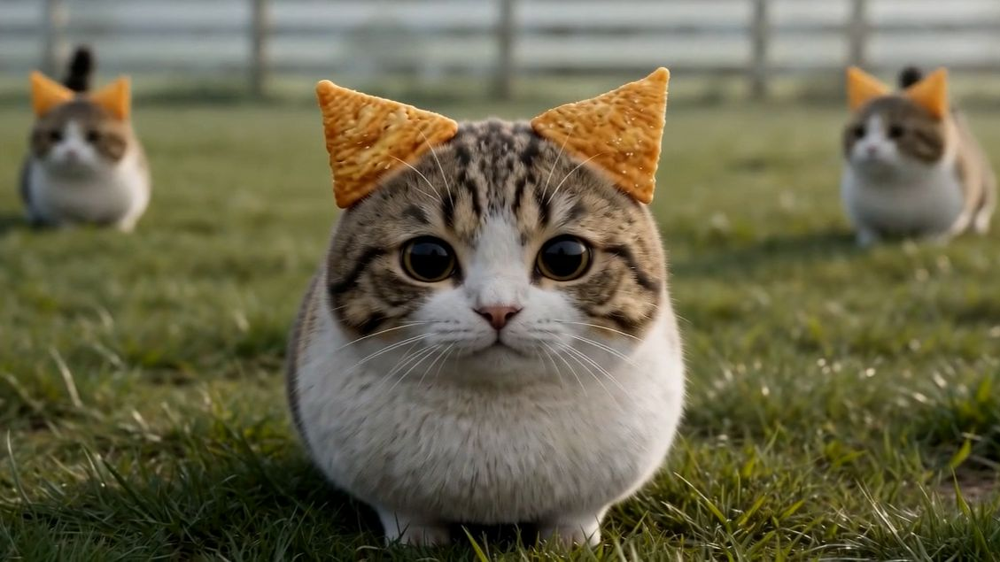 | 4.2万 | 2026-07-29 |
| [无能的哈基汪](https://www.bilibili.com/video/BV1Nv3C6bEJP) | 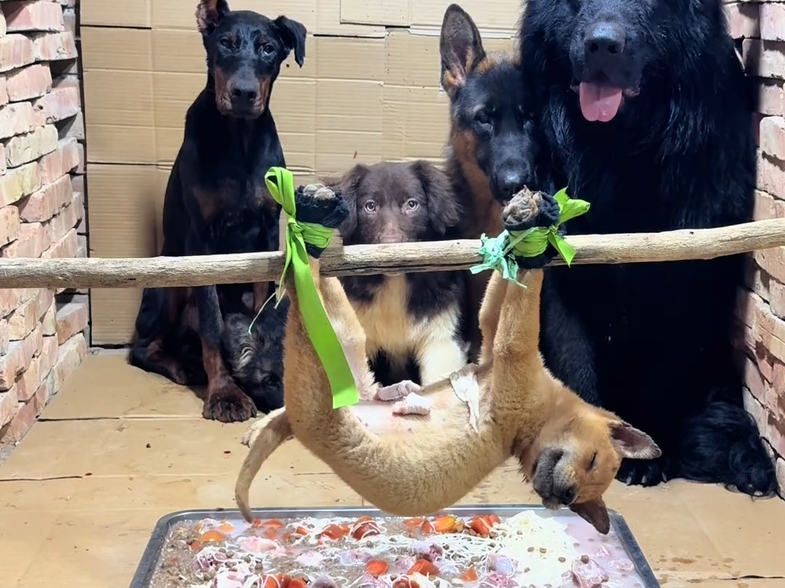 | 10.9万 | 2026-07-29 |
| [曼波の小曲](https://www.bilibili.com/video/BV13r3y6VEnK) |  | 108 | 2026-07-29 |
| [哈基蜂与无名蛇](https://www.bilibili.com/video/BV1rRge6fErv) |  | 131.7万 | 2026-07-29 |
| [夏天的哈基米是这个样子吗？✨](https://www.bilibili.com/video/BV11Q3g6qEaa) | 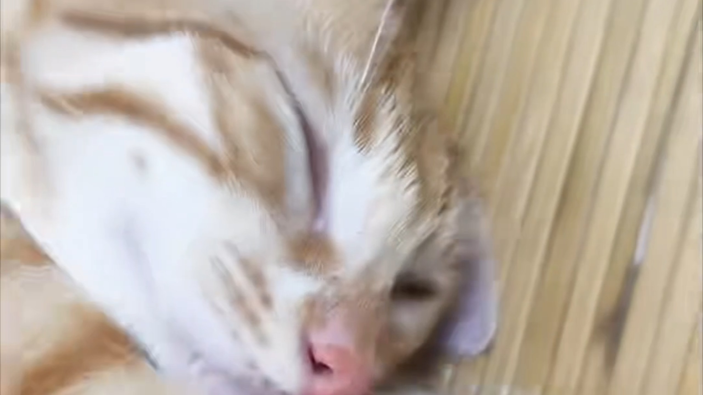 | 1649 | 2026-07-29 |
| [欧美手法配爵士豪猫～](https://www.bilibili.com/video/BV1Qf3r6PEvd) | 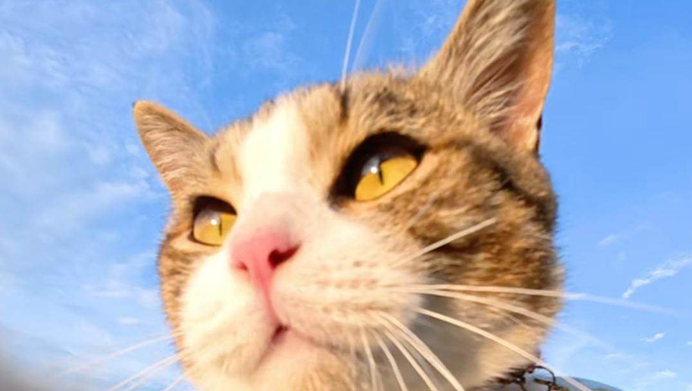 | 17.3万 | 2026-07-29 |
| [《基米翅膀受了伤》完整版🎵](https://www.bilibili.com/video/BV1aP3v62Enq) |  | 1.2万 | 2026-07-29 |
| [哈基米这个小白手套](https://www.bilibili.com/video/BV1Er3r61EZP) | 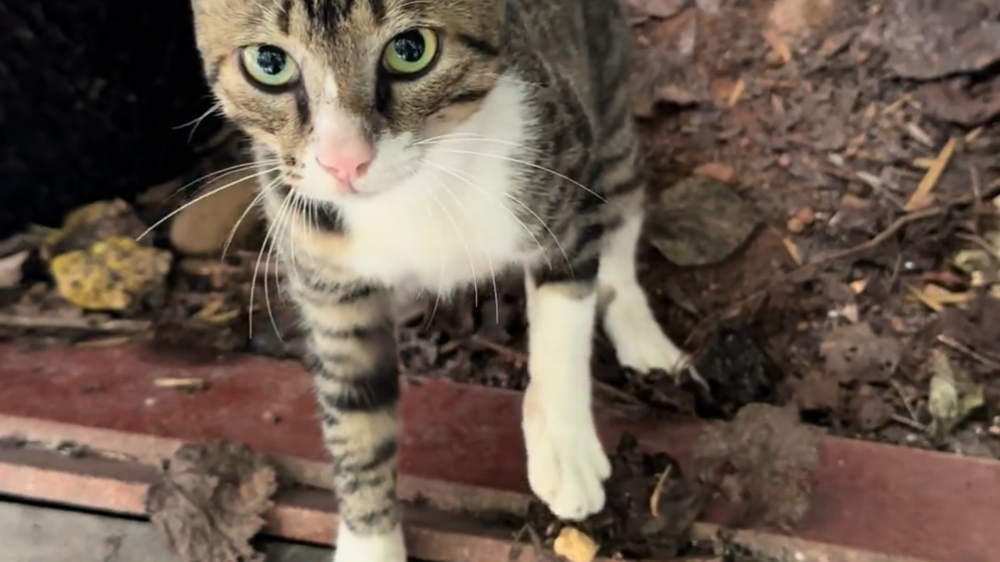 | 4705 | 2026-07-29 |
| [史上最强哈基米vs现代最强哈基米！](https://www.bilibili.com/video/BV1Hj3k6QE2n) | 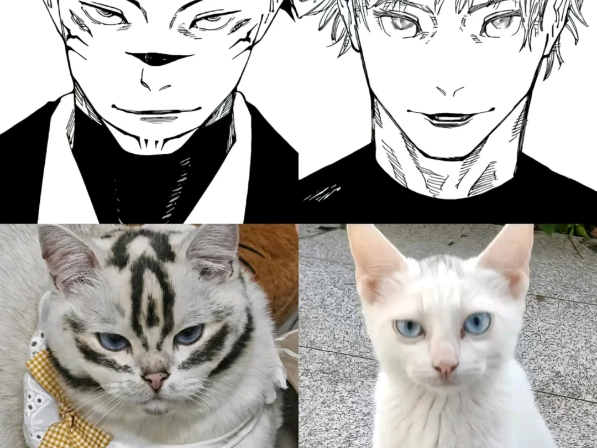 | 5.6万 | 2026-07-29 |
| [【梗知识】晚安小鸟](https://www.bilibili.com/video/BV1e33r6KEjm) |  | 2.3万 | 2026-07-28 |
| [神人尼古喵喵在猫咖打工当哈基米](https://www.bilibili.com/video/BV1bE3z6XE4R) | 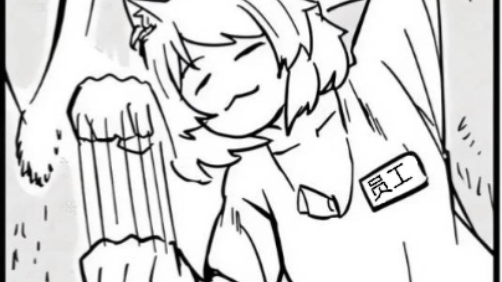 | 2.4万 | 2026-07-28 |
| [布鲁斯仅用0.01秒就知道自己得救了，反观哈基米……](https://www.bilibili.com/video/BV1ud3z6tEUg) | 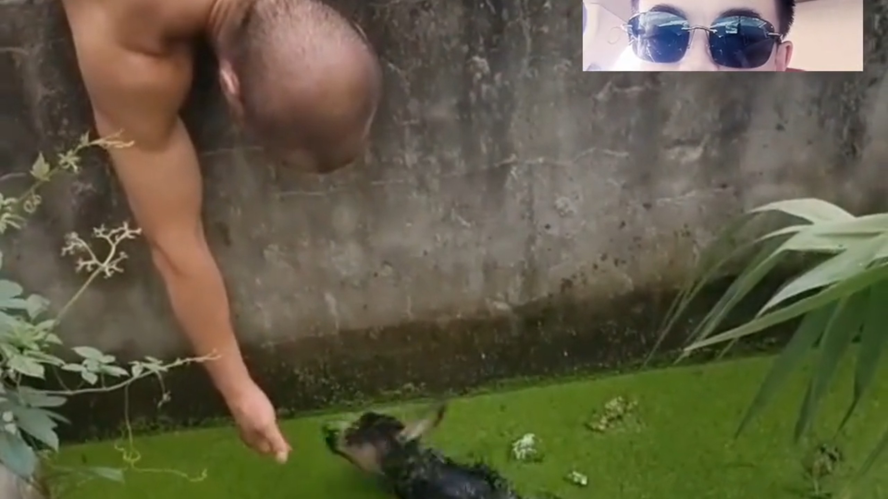 | 5.6万 | 2026-07-28 |
| [完整版｜｜《蓝莲哈》｜｜“哈基米南北绿豆”](https://www.bilibili.com/video/BV1Wp3q6GE21) | 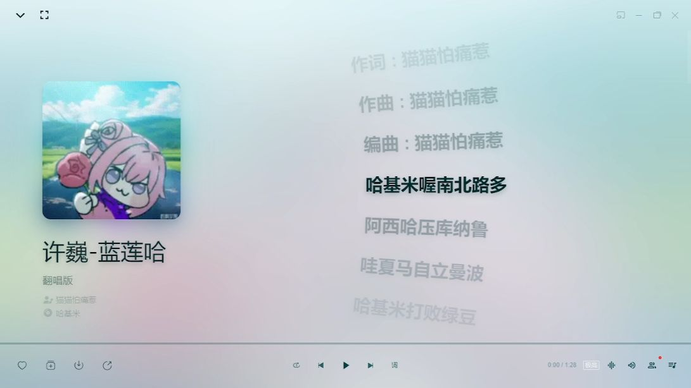 | 175 | 2026-07-28 |
| [哈基米，哈基米，哈基米，哈基米南北绿豆！！！（金团儿）](https://www.bilibili.com/video/BV1GU3q6sECD) | 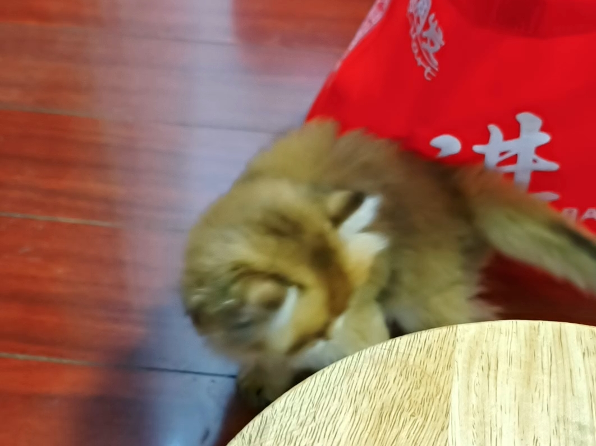 | 428 | 2026-07-28 |
| [完了 哈基米开始反向驯化人类了](https://www.bilibili.com/video/BV1o73P6iEzv) | 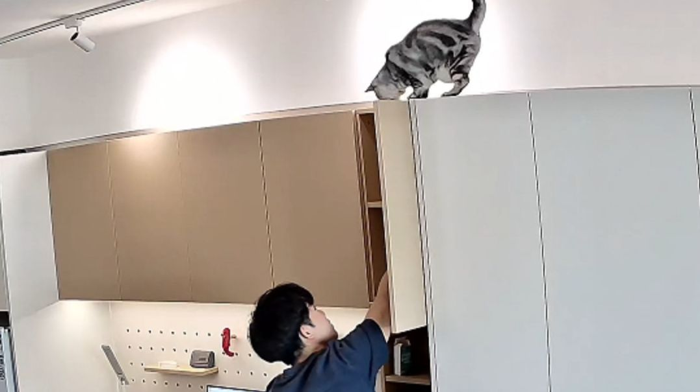 | 2407 | 2026-07-28 |
| [动画：{猫meme×我的世界} [哈基米世界-第15集：悬赏与逃脱]](https://www.bilibili.com/video/BV1f73B6eEuB) |  | 15.6万 | 2026-07-28 |
| [台风天 哈基米是怎么度过的～](https://www.bilibili.com/video/BV13P3v6mEFq) |  | 43.7万 | 2026-07-28 |
| [伤不起的哈基米～](https://www.bilibili.com/video/BV1sL3v6uEUW) |  | 2279 | 2026-07-28 |
| [愤怒😡哈基米锐评新赛季](https://www.bilibili.com/video/BV17a3v6tEnn) |  | 1629 | 2026-07-28 |
| [人！进来看咪们在游轮上玩疯了](https://www.bilibili.com/video/BV1gy3Y6rERR) |  | 1.5万 | 2026-07-28 |
| [小峰布偶猫老英雄最全解析](https://www.bilibili.com/video/BV1XE3e67ERe) | 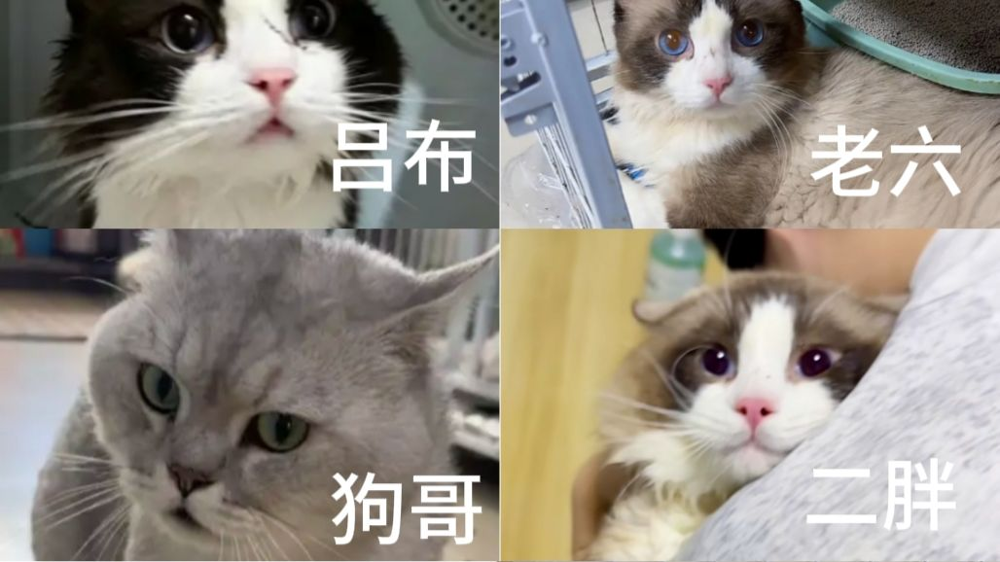 | 5.7万 | 2026-07-28 |
| [【基米】依旧拍大蒜--基米](https://www.bilibili.com/video/BV1aigm6JEhQ) | 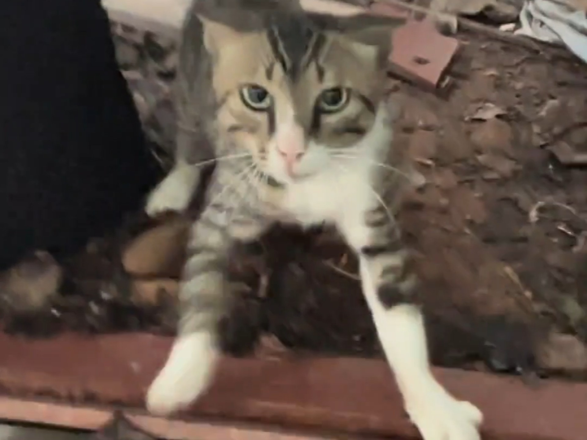 | 6388 | 2026-07-28 |
| [基米夏日旅游记](https://www.bilibili.com/video/BV1gU3c6UEP4) |  | 4007 | 2026-07-27 |
| [会唱歌的免费的鸡蛋！！](https://www.bilibili.com/video/BV1LL3w6cE9p) |  | 158.4万 | 2026-07-27 |
| [往事只能哈基米～～](https://www.bilibili.com/video/BV12i3w61Ewq) |  | 364 | 2026-07-27 |
| [哈吉米](https://www.bilibili.com/video/BV1cF3F6YEWT) | 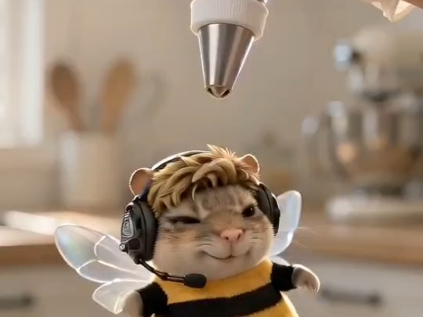 | 69 | 2026-07-27 |
| [⚡梦的翅膀已经受了伤⚡](https://www.bilibili.com/video/BV1qygZ69EbX) |  | 1.1万 | 2026-07-27 |
| [哈我此言良久立](https://www.bilibili.com/video/BV1KCgR6ZEvC) |  | 9280 | 2026-07-27 |
| [哈基米之生日蛋糕](https://www.bilibili.com/video/BV1cDgX6LE1M) | 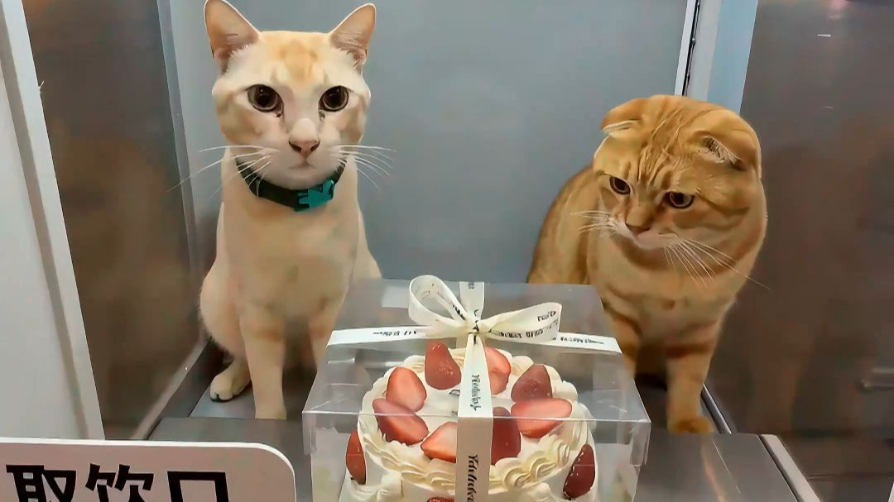 | 3.7万 | 2026-07-26 |
| [哥哥！请不要和我对对子！！！](https://www.bilibili.com/video/BV1k4g96SEFs) | 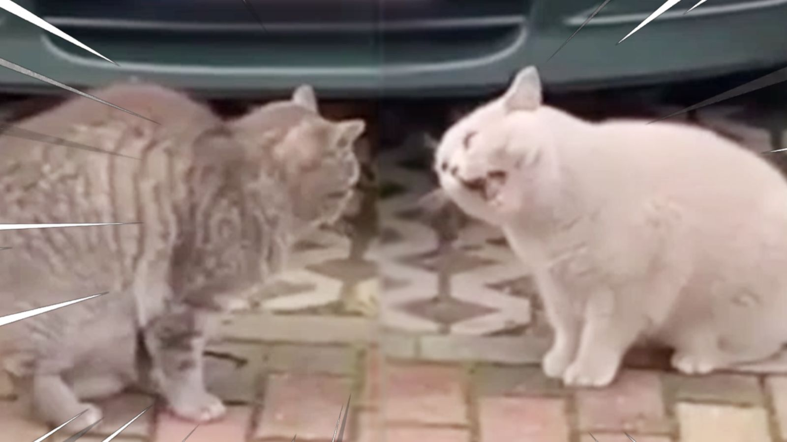 | 29.1万 | 2026-07-26 |
| [中国人能飞FUNK！🚀🚀🚀](https://www.bilibili.com/video/BV1Gg3E6BE2h) |  | 4.0万 | 2026-07-26 |
| [巴特扩音器，但是老吴🗣🎶～～](https://www.bilibili.com/video/BV1Z63j6uEwN) | 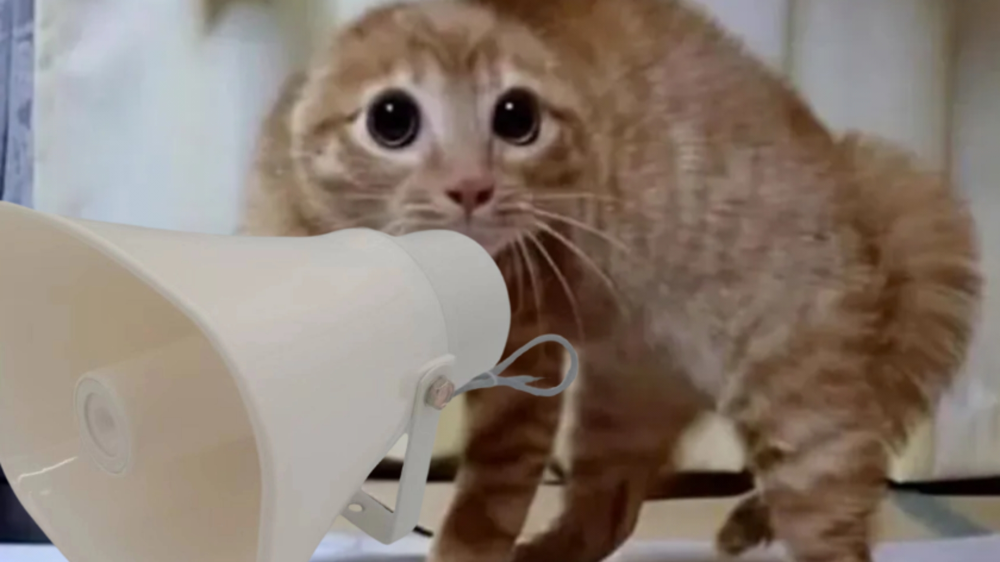 | 1.4万 | 2026-07-26 |
| [“一颗土豆一根线， 插入同心金属片。 微弱电流来服务， 心跳超时重登陆”｜《土豆服务器の小曲》｜《Versatile》-DJ铁柱](https://www.bilibili.com/video/BV1Fx3G6PEk8) |  | 116.1万 | 2026-07-26 |
| [【嘉然】哈基米哦南北绿豆～](https://www.bilibili.com/video/BV1Cy3L6mEHo) |  | 8463 | 2026-07-26 |
| [我嘴巴大慢慢叫，这基米你就先哈下吧～](https://www.bilibili.com/video/BV1Ur376tEsZ) |  | 5.3万 | 2026-07-26 |
| [啊？58.0](https://www.bilibili.com/video/BV1GN356xEA3) |  | 82.8万 | 2026-07-26 |
| [捡回来喂了要10天了，大伙儿看看是不是豪猫](https://www.bilibili.com/video/BV1J1336hEEC) | 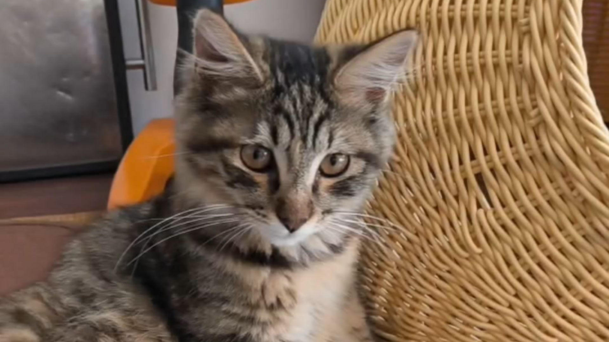 | 5.8万 | 2026-07-25 |
| [哈基米？曼波？你可能不认识她们 但你一定听过她们唱的歌](https://www.bilibili.com/video/BV1Ri3g6mEcn) |  | 220 | 2026-07-25 |
| [猫妈妈给小猫买了围巾，却没给自己买——小猫的甜蜜惊喜一定会让你感动](https://www.bilibili.com/video/BV1Y6Ks6CEFp) |  | 2569 | 2026-07-25 |
| [猫：我咋会这么倒霉啊~](https://www.bilibili.com/video/BV1wiKH6SE5s) |  | 2.1万 | 2026-07-24 |
| [🐧中国人进入大飞行时代🐧](https://www.bilibili.com/video/BV19rgQ6aEPv) | 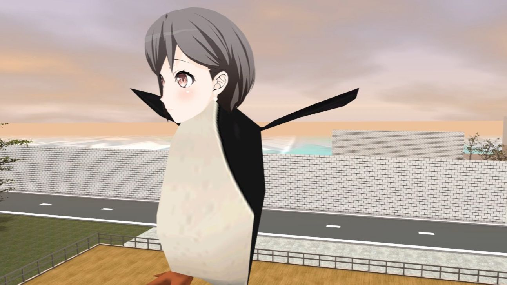 | 24.1万 | 2026-07-23 |
| [“!盘点近期全网爆火的压迫感神曲!”](https://www.bilibili.com/video/BV1amg66fEjL) |  | 108.2万 | 2026-07-22 |
| [你们来评评理！今天商场里这三个套装，到底谁才是显眼包之王？](https://www.bilibili.com/video/BV1XEgz6fEXB) |  | 9.1万 | 2026-07-22 |
| [猫和老鼠 ｜ 好险，差点就喊出来了](https://www.bilibili.com/video/BV1EUK26mEuE) |  | 24.8万 | 2026-07-20 |
| [循环歌单｜【雷霆动物の小曲】【闪球の小曲】｜——《BL STUDIO HARDTEKK》](https://www.bilibili.com/video/BV1s6NQ6vEKW) |  | 77.1万 | 2026-07-19 |
| [诶？大狗！](https://www.bilibili.com/video/BV1kgNd6rEsH) | 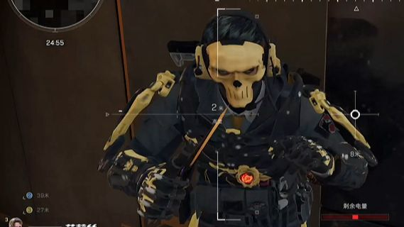 | 18.8万 | 2026-07-17 |
| [基米捞鱼](https://www.bilibili.com/video/BV16KNb68E2T) | 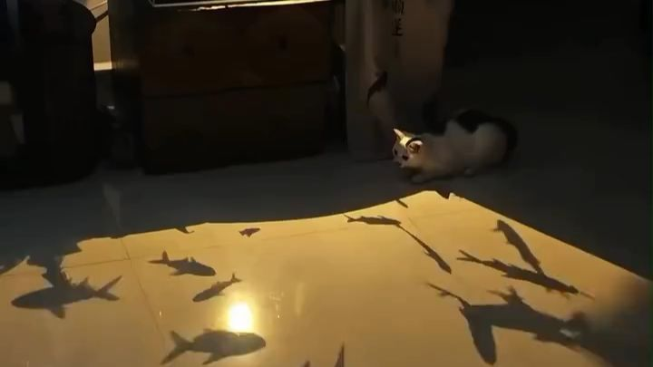 | 7.1万 | 2026-07-14 |
| [野外真的有“月薪猫”？还会玩泥，实在太可爱了！](https://www.bilibili.com/video/BV1paNV64EJX) | 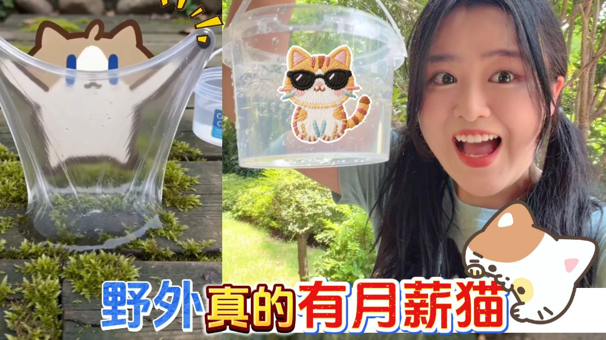 | 135.5万 | 2026-07-14 |
| [宗主致敬过这一段](https://www.bilibili.com/video/BV18NNj6kEzr) |  | 31.8万 | 2026-07-10 |
| [【大狗叫音乐】🎵We don&#x27;t talk anymore🎵不言狗叫](https://www.bilibili.com/video/BV14oT96JE7E) |  | 20.5万 | 2026-07-06 |
| [顶到子宫口，女生是什么感觉呢？](https://www.bilibili.com/video/BV1h6Mc65EDf) |  | 41.9万 | 2026-07-05 |
| [【热推歌曲】舌尖上的哈基米](https://www.bilibili.com/video/BV1Je1GBmEv2) | 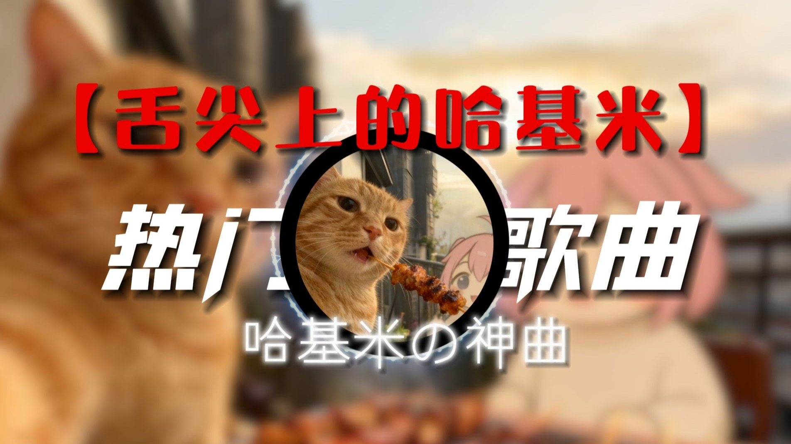 | 1.3万 | 2025-11-01 |
| [发明项目：五哈基米阵容，局部坏死的反义词是？](https://www.bilibili.com/video/BV1sBL6zCEQX) |  | 39.2万 | 2025-04-27 |

---
*最后更新: 2026-07-31 05:46:35 (自动生成)*
*数据来源: [Bilibili](https://www.bilibili.com)*

## 使用说明

运行以下命令更新视频列表:
```bash
python3 fetch_hajimi_videos.py
```
