# awesome-hajimi
collections of hajimi (哈基米 in Chinese) on the Internet.

## 视频列表 (Video List)

| 视频标题 (Title) | 封面 | 播放量 (Views) | 发布日期 (Date) |
|---|---|---|---|
| [假如哈基米重生在18年那个夏天...🎵](https://www.bilibili.com/video/BV16yGK6SEgo) |  | 1483 | 2026-08-01 |
| [⚡️宗 主 连 携 技⚡️](https://www.bilibili.com/video/BV1Nr3s6rE79) |  | 4.1万 | 2026-08-01 |
| [田野里的哈基米～](https://www.bilibili.com/video/BV1fvGu6WENK) | 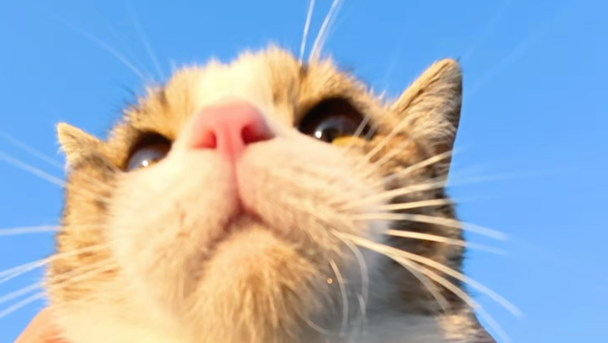 | 1.3万 | 2026-08-01 |
| [哈基米的幽默瞬间（补档的补档）](https://www.bilibili.com/video/BV131Gu62Ezr) | 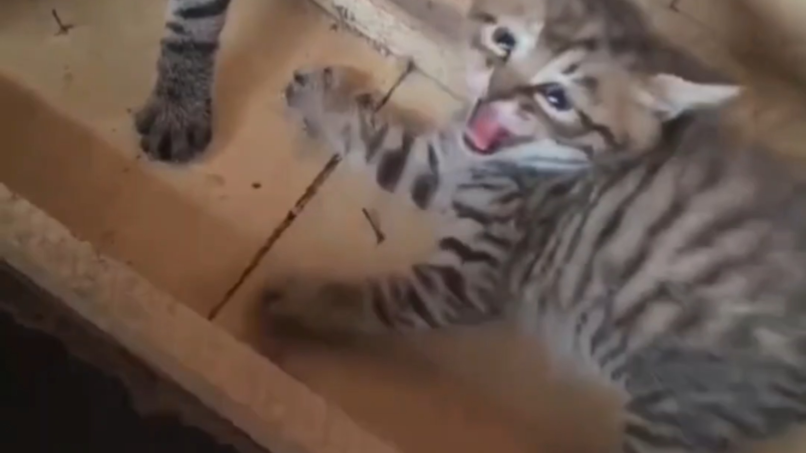 | 1264 | 2026-08-01 |
| [哈基米喝酒，昏倒过去了](https://www.bilibili.com/video/BV1umGT6qEWj) | 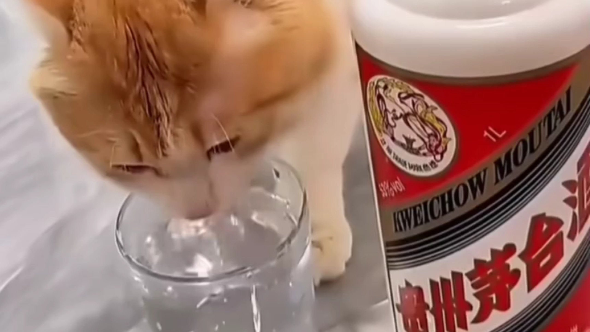 | 4551 | 2026-07-31 |
| [哈基米](https://www.bilibili.com/video/BV1U4GK6AEah) | 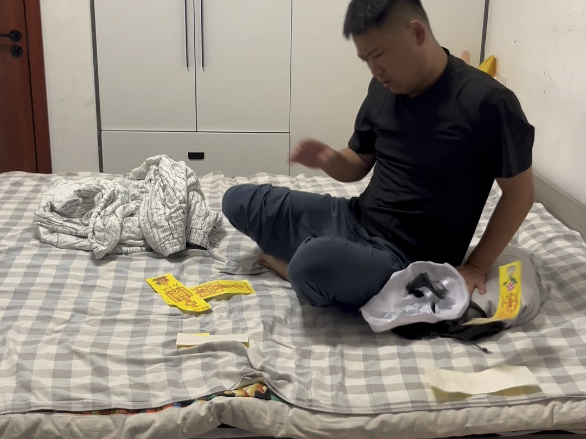 | 5395 | 2026-07-31 |
| [华强买瓜但《行尸走肉》华强和郝哥大战丧尸！（有血腥内容，胆小勿入）](https://www.bilibili.com/video/BV1QjGP6cE33) |  | 8864 | 2026-07-31 |
| [大狗嚼vs耄耋哈基米](https://www.bilibili.com/video/BV1ChGP6DEY9) |  | 6747 | 2026-07-31 |
| [对于恨哈基米这件事，我觉得我得说两句](https://www.bilibili.com/video/BV1SnGP6tEwa) |  | 798 | 2026-07-31 |
| [哈基米打工的一天](https://www.bilibili.com/video/BV1JBGw6uEWs) | 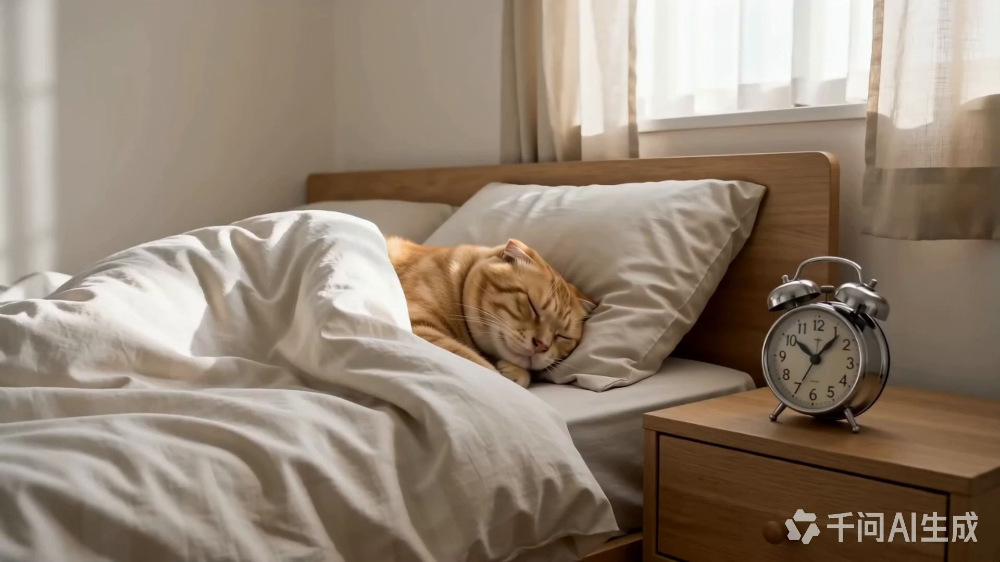 | 3530 | 2026-07-31 |
| [哈基米的终极冲锋](https://www.bilibili.com/video/BV1EWGN6LEXk) | 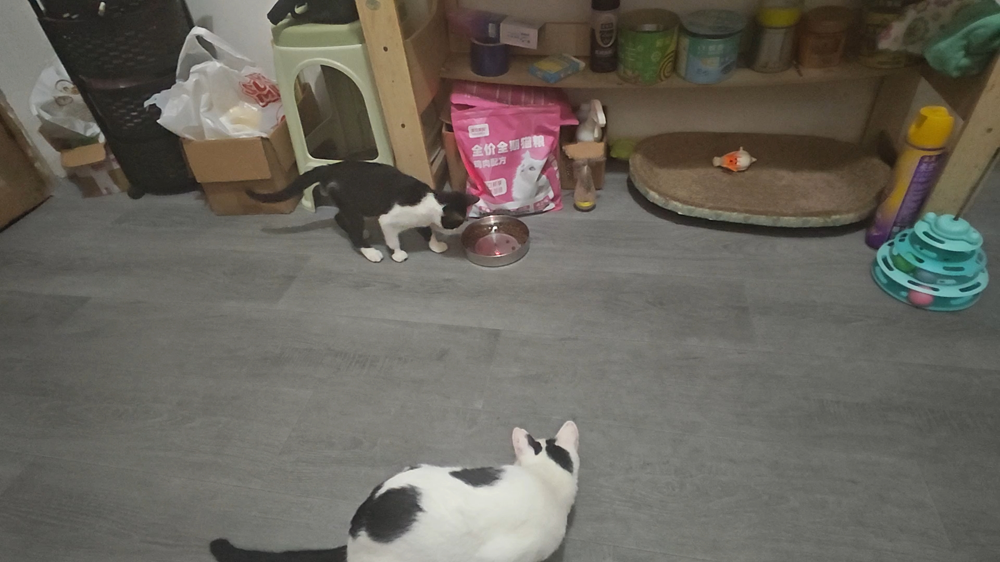 | 1372 | 2026-07-31 |
| [Bili_Board术力口传说曲周榜第72期2026年7月31日第31周](https://www.bilibili.com/video/BV1aQ3t6aER5) |  | 13.7万 | 2026-07-31 |
| [基米百态合集 最可爱的生物 太可怜了！](https://www.bilibili.com/video/BV1hRGw64EVq) | 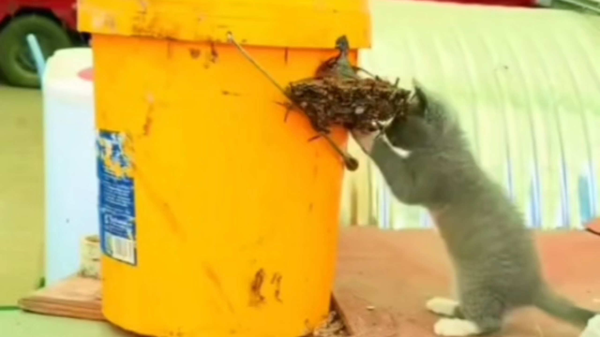 | 7245 | 2026-07-31 |
| [哈基米调掉落水桶里面直接得吃饱了](https://www.bilibili.com/video/BV1aXGw6ZEPW) | 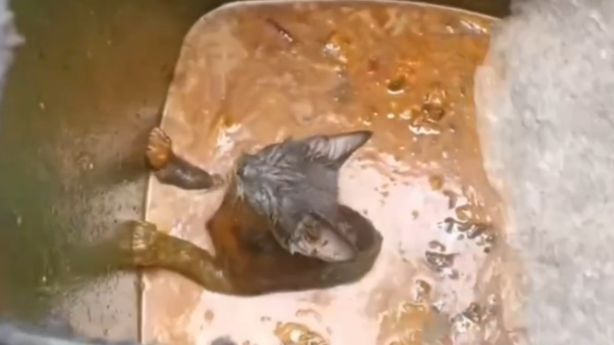 | 5561 | 2026-07-31 |
| [Double kill,但是大狗叫和哈基米唱](https://www.bilibili.com/video/BV1iyGw6PERu) |  | 1601 | 2026-07-31 |
| [雷霆大叔热舞蹦迪！神人臭猫厕所平移！](https://www.bilibili.com/video/BV1uw3M6PEec) |  | 21.8万 | 2026-07-31 |
| [哈基米的头被轮胎的卡住了](https://www.bilibili.com/video/BV1WX3h6tEnP) | 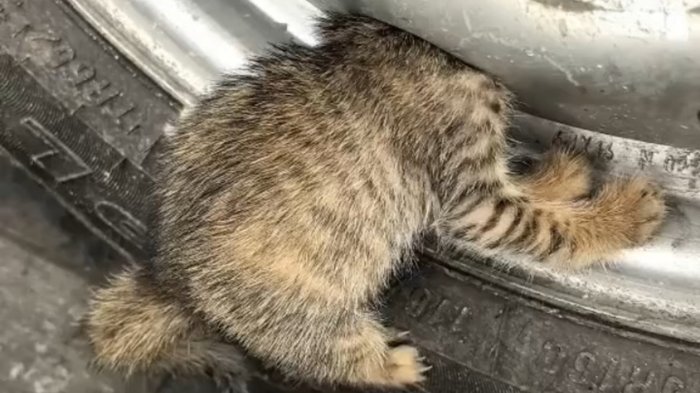 | 5.5万 | 2026-07-31 |
| [尼古喵喵 第5集](https://www.bilibili.com/video/BV1zv3t6GE26) |  | 10.7万 | 2026-07-30 |
| [小猫咪剪个指甲气出狗叫了都](https://www.bilibili.com/video/BV1583b6vEw7) | 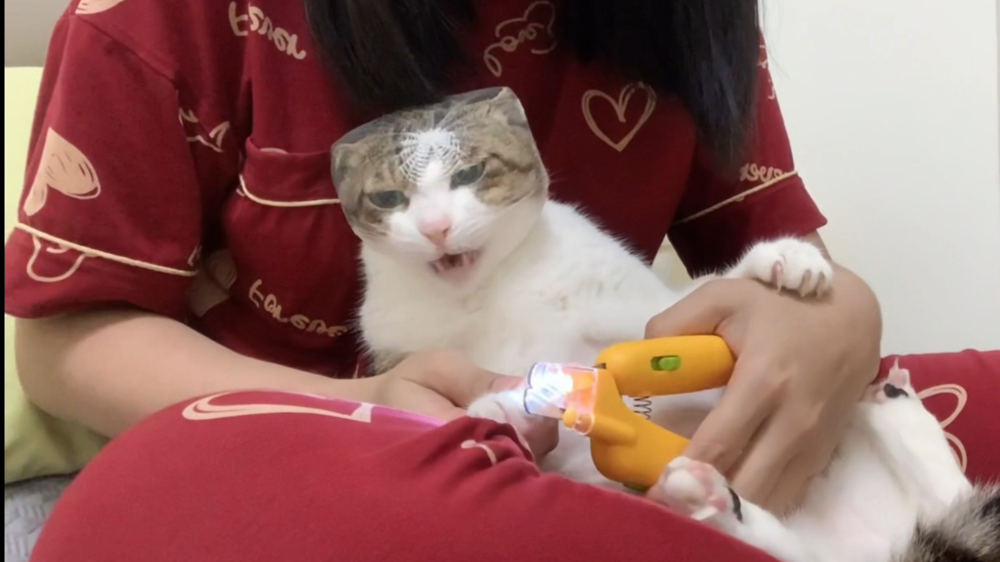 | 7.5万 | 2026-07-30 |
| [7月30日神人迷惑行为大赏，量大管饱](https://www.bilibili.com/video/BV1Bj346iESt) |  | 7.1万 | 2026-07-30 |
| [鸡哥寻找它的爱情去了，鸽子被猫灭了好几只](https://www.bilibili.com/video/BV1J93463Ead) | 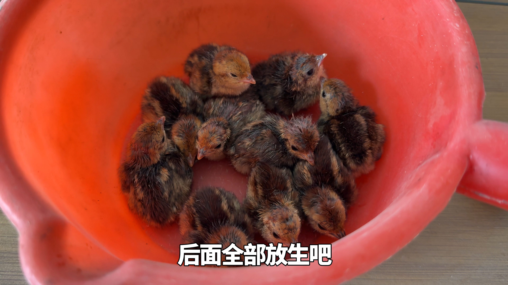 | 3.6万 | 2026-07-30 |
| [哈基米被这盆水给电了](https://www.bilibili.com/video/BV1bi346XE36) | 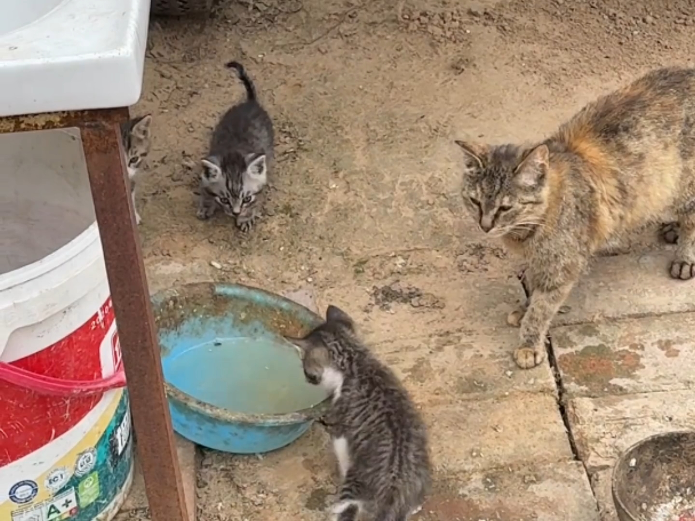 | 6260 | 2026-07-30 |
| [【花小烙】游隼：地球上俯冲速度最快的“鸟中战斗机”是如何炼成的？](https://www.bilibili.com/video/BV1UFge6qEty) |  | 244.0万 | 2026-07-30 |
| [☝😯 折世贸啊？！⚡⚡⚡](https://www.bilibili.com/video/BV1kb3t6jE8N) |  | 34.2万 | 2026-07-30 |
| [7.30小峰布偶猫录屏（老六背身偷袭狗哥，狗哥老六再次开战）](https://www.bilibili.com/video/BV1iP3t6eEJR) | 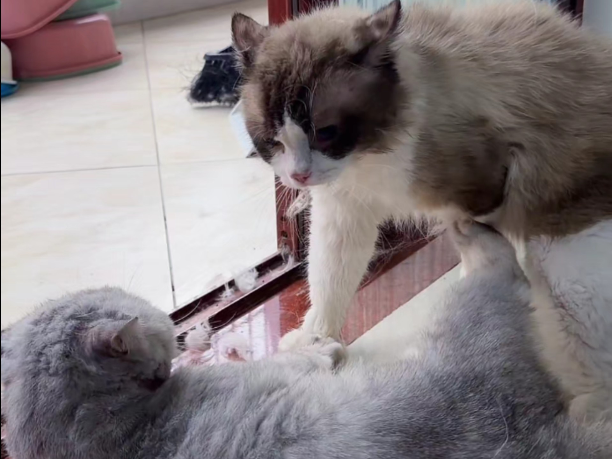 | 1.8万 | 2026-07-30 |
| [什么叫a包点站了个防御塔啊](https://www.bilibili.com/video/BV1P73H6hE3z) | 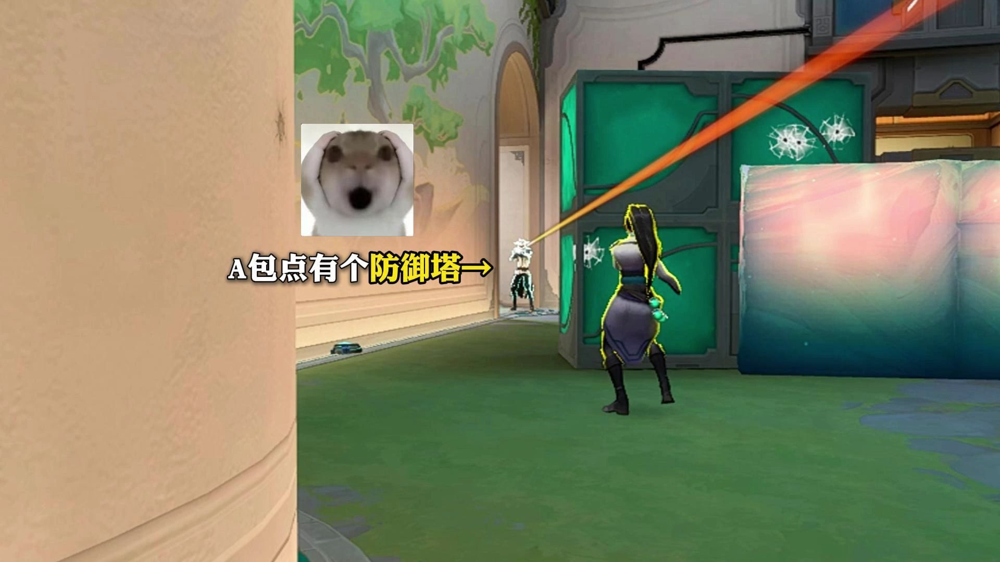 | 6.2万 | 2026-07-30 |
| [我也有今天](https://www.bilibili.com/video/BV12q3s65Ecq) | 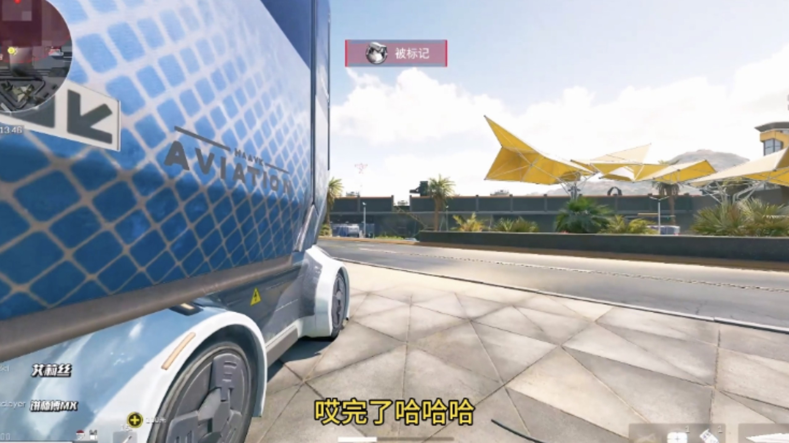 | 50.9万 | 2026-07-30 |
| [让你把我锁外面](https://www.bilibili.com/video/BV1vH3s6sEct) | 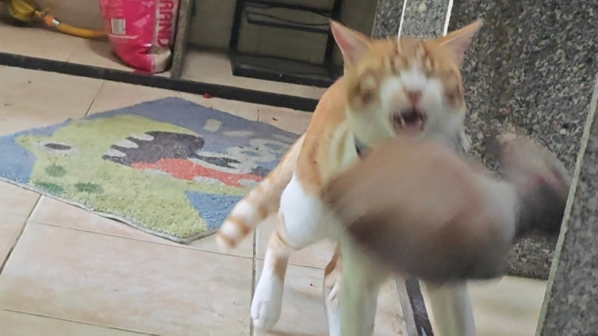 | 7.0万 | 2026-07-30 |
| [记得按时吃饭哦](https://www.bilibili.com/video/BV1vr3x68EtJ) | 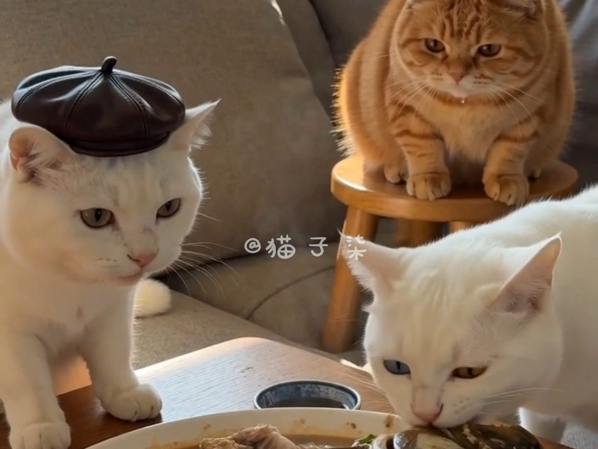 | 8.2万 | 2026-07-30 |
| [别点进来！！！](https://www.bilibili.com/video/BV1U4316rE21) |  | 122.6万 | 2026-07-30 |
| [基米来舞一段](https://www.bilibili.com/video/BV1pZ3H6AEE6) | 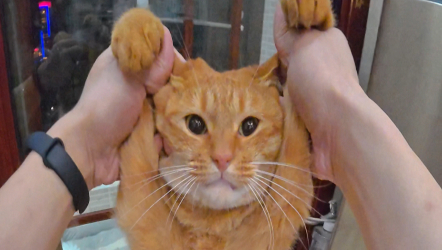 | 1.9万 | 2026-07-30 |
| [听猫，如听仙乐耳暂明！](https://www.bilibili.com/video/BV1o43J61EUg) |  | 13.1万 | 2026-07-30 |
| [绳匠！不要往猫粮里〇〇喵！](https://www.bilibili.com/video/BV1SK3W61EJK) |  | 3.0万 | 2026-07-30 |
| [太好了！捡到爵士豪猫了！](https://www.bilibili.com/video/BV1P73W6uEig) | 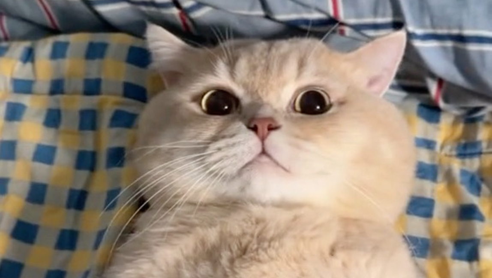 | 342.5万 | 2026-07-30 |
| [今天是倒了八辈子霉了！](https://www.bilibili.com/video/BV1oS3n6UEbT) | 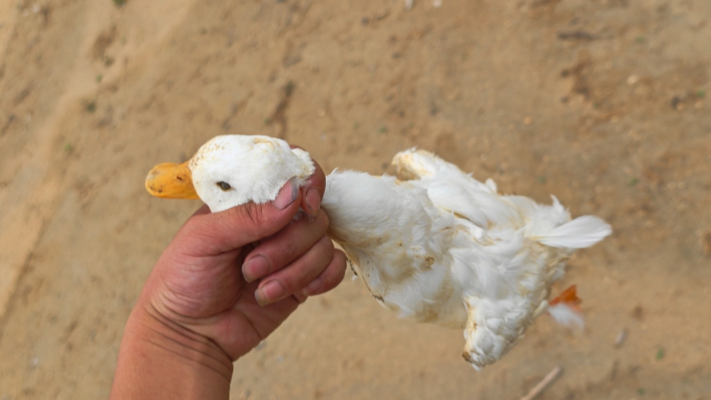 | 21.2万 | 2026-07-29 |
| [大橘哥172-观看猫片](https://www.bilibili.com/video/BV1dS3n6UENE) | 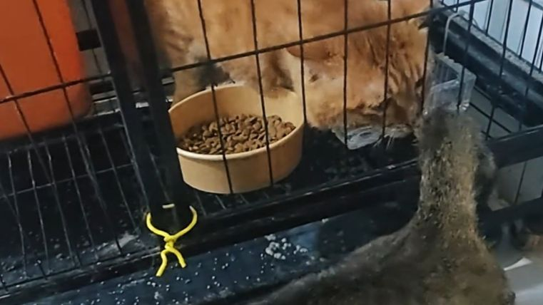 | 5.1万 | 2026-07-29 |
| [🐧：给你发消息不回，视频不看🐧](https://www.bilibili.com/video/BV1sz316YE7K) |  | 11.3万 | 2026-07-29 |
| [Bili_Board术力口周榜第112期2026年7月29日第30周](https://www.bilibili.com/video/BV1Ez3z6uEEE) |  | 31.7万 | 2026-07-29 |
| [竹林遭遇野猪？咪师傅的挖笋奇遇记！](https://www.bilibili.com/video/BV1LQ3C62Ek9) | 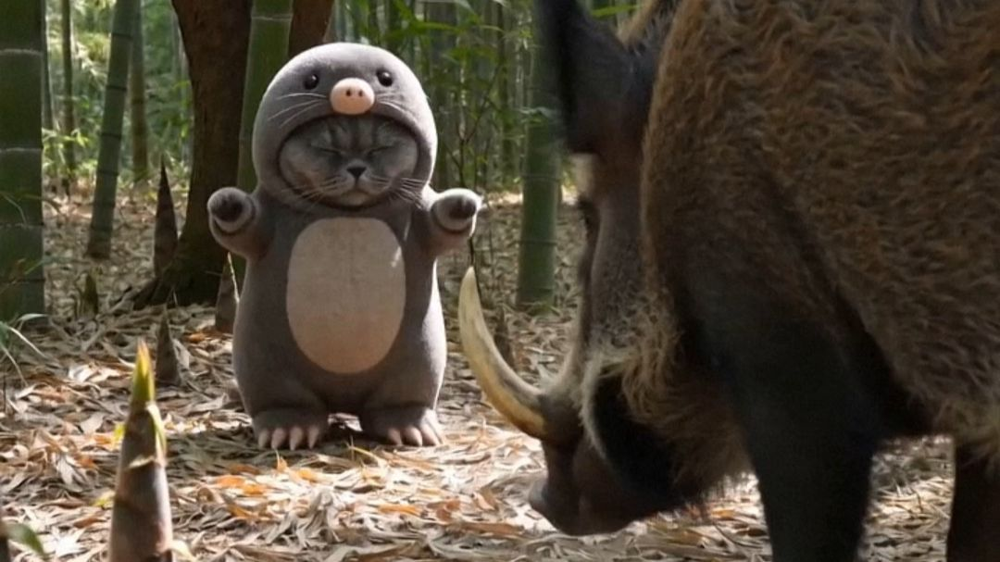 | 1.6万 | 2026-07-29 |
| [【抱歉，误删重发】诶嘿猫vlog（和好朋咪们来到了一个神奇的地方......）](https://www.bilibili.com/video/BV1uA3y6uEmT) | 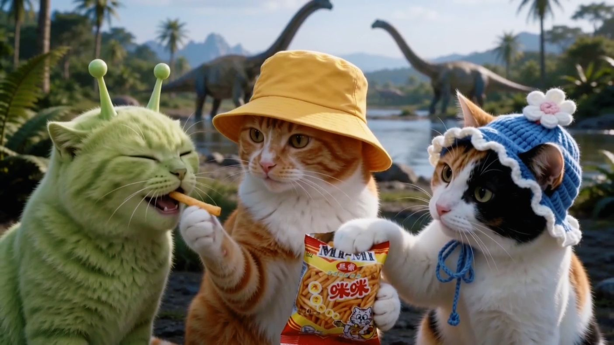 | 68.8万 | 2026-07-29 |
| [忍住别笑 😅 搞笑猫咪狗狗合集 2026 😹 第107集](https://www.bilibili.com/video/BV1vV3C6kEqa) | 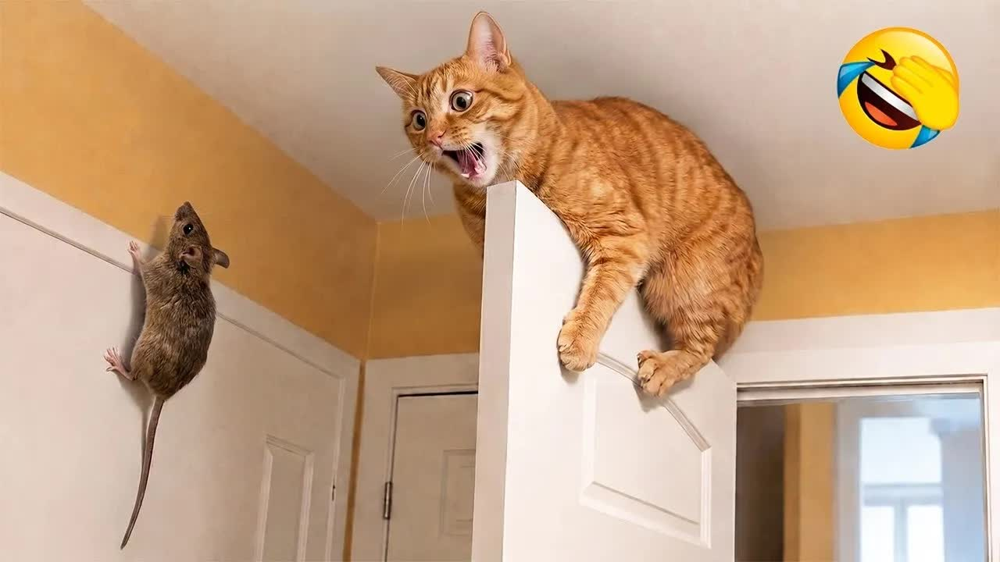 | 331 | 2026-07-29 |
| [《宗教？P教！》](https://www.bilibili.com/video/BV1o53i6ZE2Q) |  | 148.6万 | 2026-07-29 |
| [me爱奶奶 奶奶爱me](https://www.bilibili.com/video/BV1gr3k6vEVU) |  | 1921 | 2026-07-29 |
| [给我听爽晕过去了](https://www.bilibili.com/video/BV1CQ3k6oEQj) | 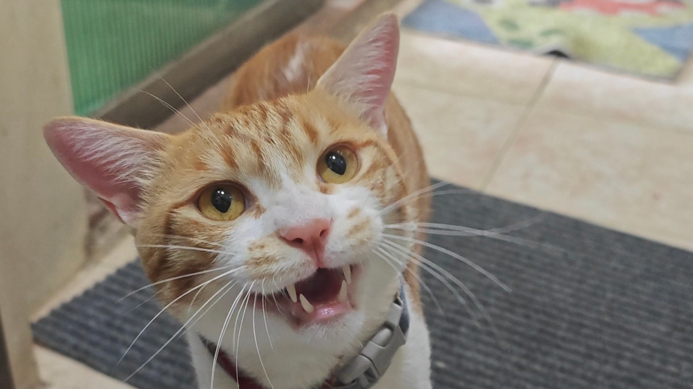 | 3.0万 | 2026-07-29 |
| [肘～带小猫去蜀黍家过好日子了……](https://www.bilibili.com/video/BV1Un3z6HEcF) | 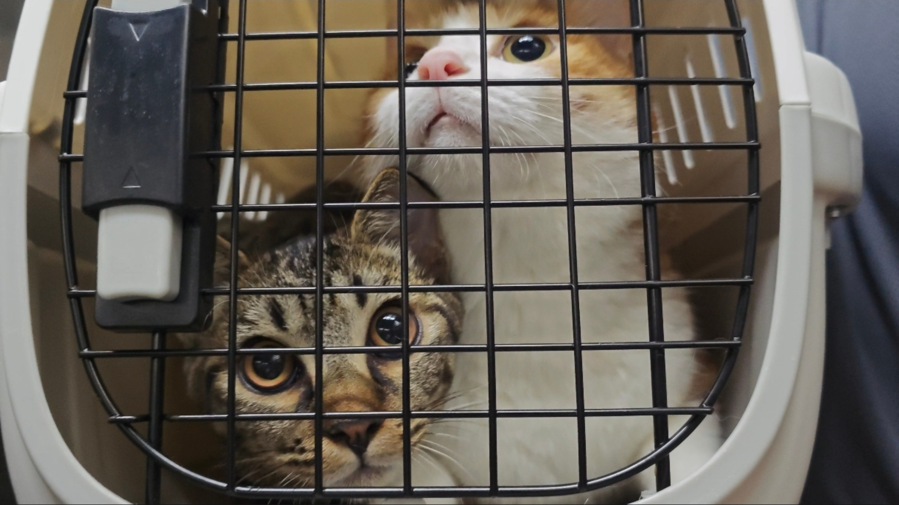 | 9356 | 2026-07-28 |
| [可恶的人类一直骗小猫！](https://www.bilibili.com/video/BV1if3i6ZE4S) | 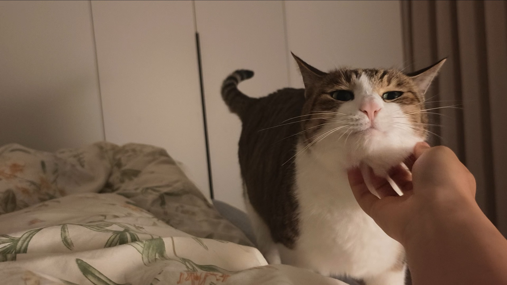 | 4.3万 | 2026-07-28 |
| [将猫狗喝水画面放慢100倍，才发现它们有着明显的不同](https://www.bilibili.com/video/BV1Cy3i6MEq1) | 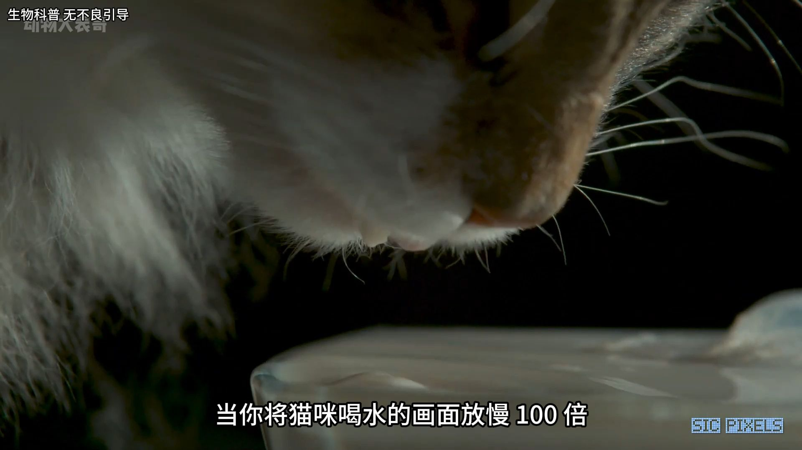 | 26.4万 | 2026-07-28 |
| [猫和老鼠 ｜ 大力出奇迹](https://www.bilibili.com/video/BV1bU3v62EQA) |  | 8.9万 | 2026-07-28 |
| [干嘛猫vlog~遇上“百万英镑”餐厅，伦敦奇遇记！](https://www.bilibili.com/video/BV1ng3B6gEHi) |  | 20.0万 | 2026-07-28 |
| [yophonelinging炸基小曲](https://www.bilibili.com/video/BV1Nw3B61EwS) | 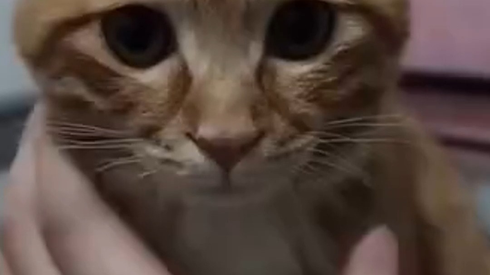 | 2633 | 2026-07-28 |
| [【类の人】张顺飞：6324抽象遗孤  哦对了，你知道飞八分钱吗？](https://www.bilibili.com/video/BV18K3v6LEz8) |  | 14.2万 | 2026-07-28 |
| [台风天刮进一只奇怪的猫，竟然会掉“妙脆角”？猴子和刀盾吃完表情亮了…🤤](https://www.bilibili.com/video/BV1ij3i6tEBb) | 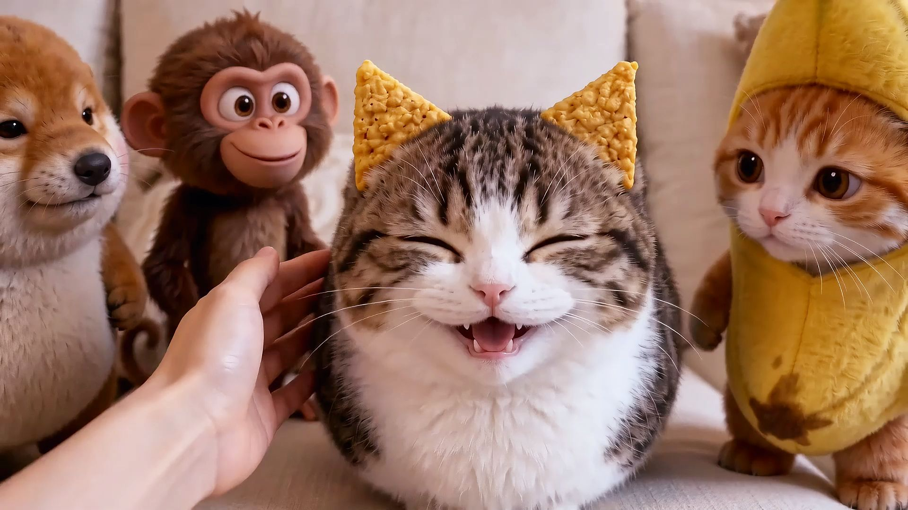 | 6.2万 | 2026-07-28 |
| [童年回顾《猫和老鼠》](https://www.bilibili.com/video/BV19p3i6pEno) |  | 1.0万 | 2026-07-28 |
| [⚡老 年 阿 伟⚡【AI全民制作人】](https://www.bilibili.com/video/BV1RV3e6DEaD) |  | 22.0万 | 2026-07-28 |
| [奇 妙 的 企 喵 ！](https://www.bilibili.com/video/BV1Xy3c6HEG3) | 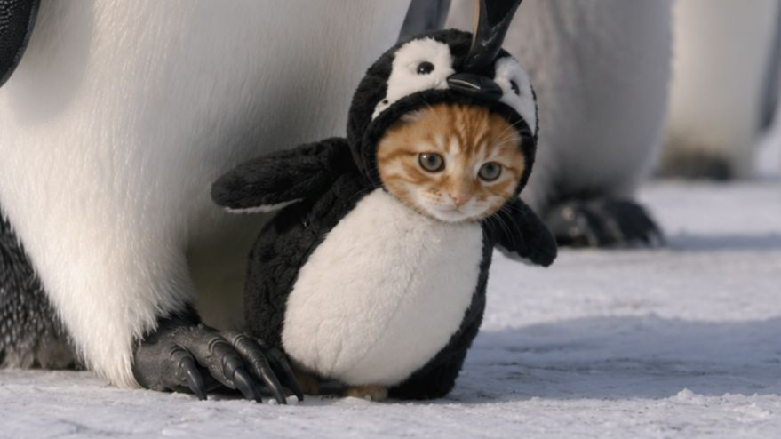 | 2.8万 | 2026-07-28 |
| [第4集｜妙脆角猫与刀盾初遇](https://www.bilibili.com/video/BV1k23P62EtB) | 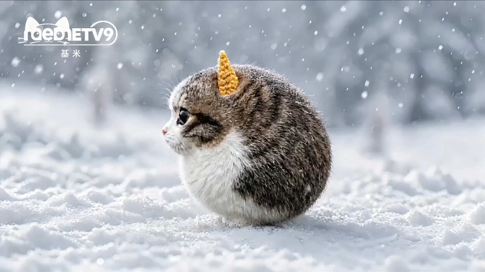 | 23.9万 | 2026-07-28 |
| [《咪的翅膀受了伤》](https://www.bilibili.com/video/BV1Q83P6tEeB) |  | 2.2万 | 2026-07-28 |
| [基米发癫之基米快跑 基米GO 基米GO 基米GO！](https://www.bilibili.com/video/BV1FV3P6gEMp) | 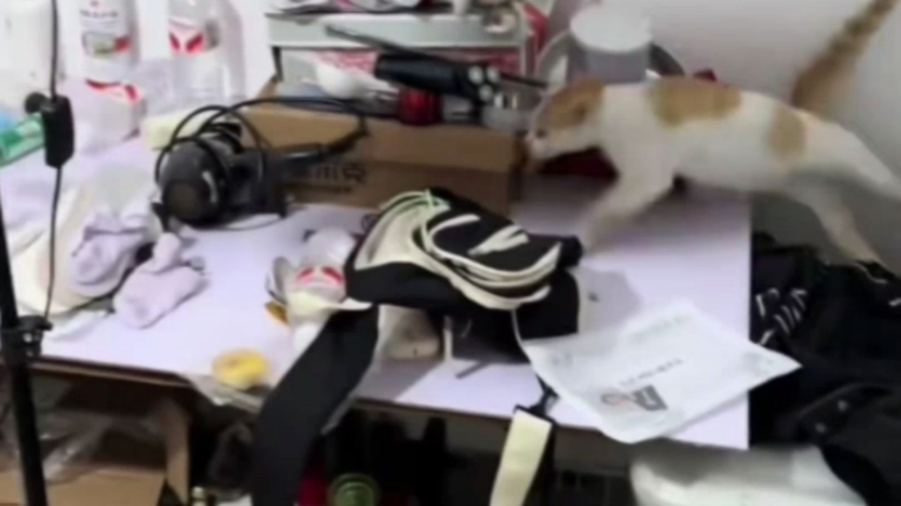 | 363 | 2026-07-27 |
| [逼小猫吃我做的罐头，第一次在小猫脸上看到这种表情](https://www.bilibili.com/video/BV1PZ3c6kE7w) | 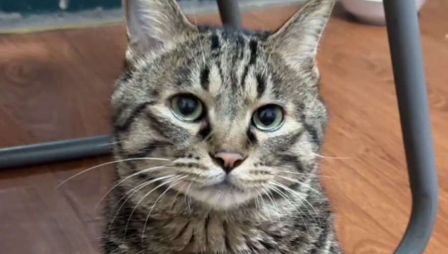 | 11.6万 | 2026-07-27 |
| [这野猫开智了，是只智猫【哈基动物园317期】](https://www.bilibili.com/video/BV17u3F64EXj) | 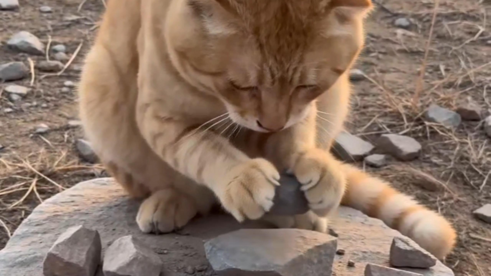 | 2083 | 2026-07-27 |
| [救命啊！有2个黑熊精追我！](https://www.bilibili.com/video/BV1f23F6cEJZ) | 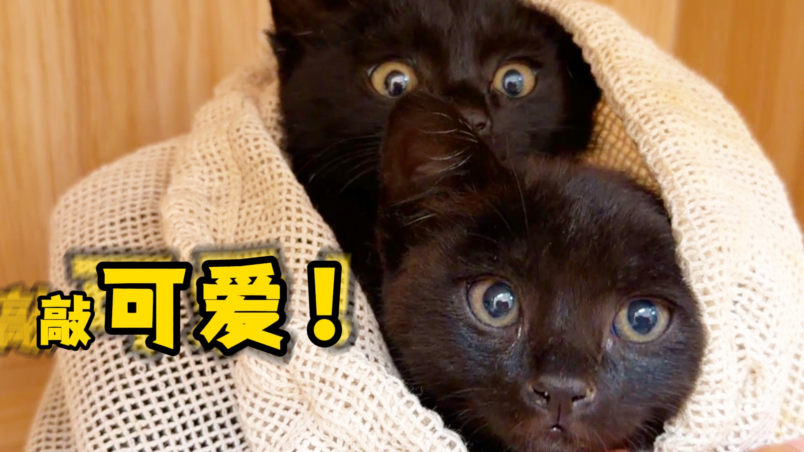 | 61.4万 | 2026-07-27 |
| [我长的丑被嫌弃了 但还有小耄陪我](https://www.bilibili.com/video/BV1723F6FEQq) | 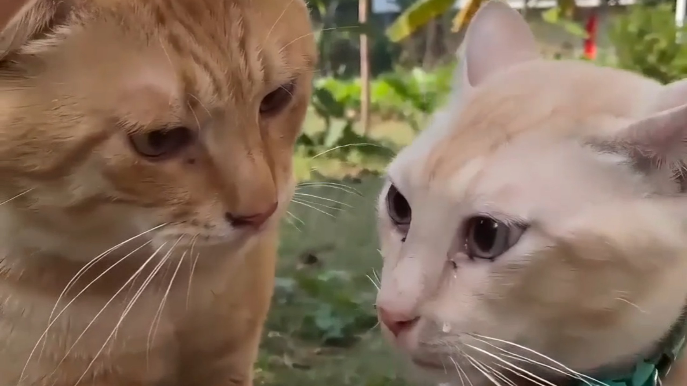 | 4668 | 2026-07-27 |
| [曼波哈基米 ARASHI - Monster 哈基米版本](https://www.bilibili.com/video/BV1bvNg6oEmJ) |  | 178 | 2026-07-27 |
| [猫哥逃跑失败！看来是想日光浴了！](https://www.bilibili.com/video/BV1qtgf6sEyG) | 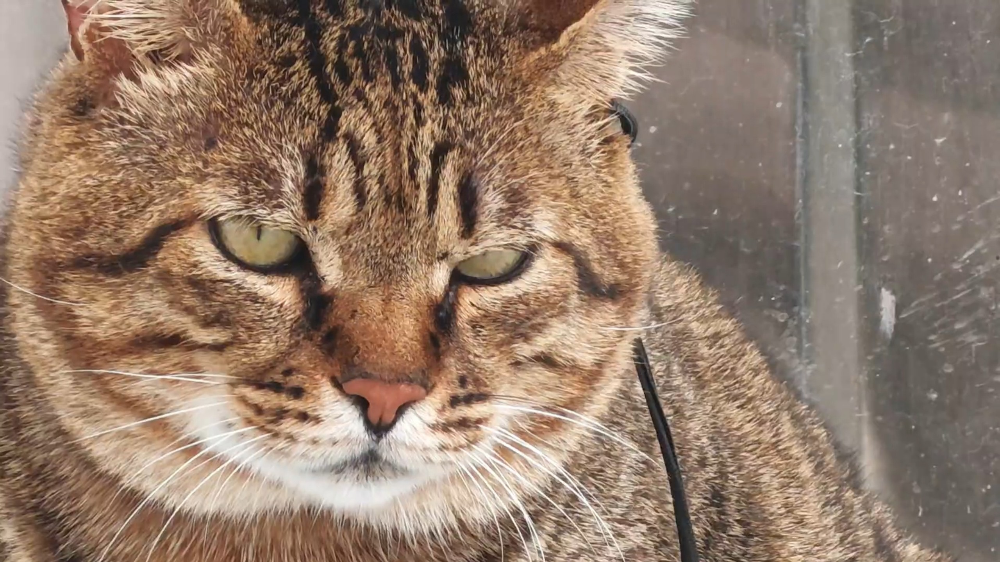 | 2.2万 | 2026-07-27 |
| [津 门 幸 运 大 转 轮 ③](https://www.bilibili.com/video/BV1Tpgd6wEMS) |  | 53.3万 | 2026-07-26 |
| [妙:这个人怎么会这么烦啊！](https://www.bilibili.com/video/BV1Ggg96aENp) | 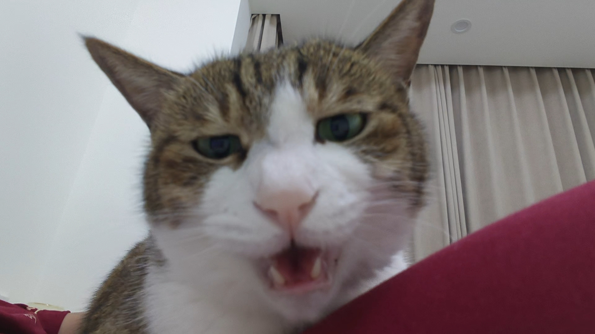 | 3.9万 | 2026-07-26 |
| [当真千金被接回家发现我在荡秋千时](https://www.bilibili.com/video/BV1XTg96YE8Y) |  | 8.9万 | 2026-07-26 |
| [🏝️猫妈带崽荒岛求生记，汪汪救援队登场！🐶🚤](https://www.bilibili.com/video/BV1pU376XEZw) |  | 5993 | 2026-07-26 |
| [伪人猫是什么梗？](https://www.bilibili.com/video/BV1gj3E6eEj8) |  | 93.6万 | 2026-07-26 |
| [猫妈遛娃记：游乐场初体验的惊喜与反差萌🐱🎠](https://www.bilibili.com/video/BV19D3E6gELd) | 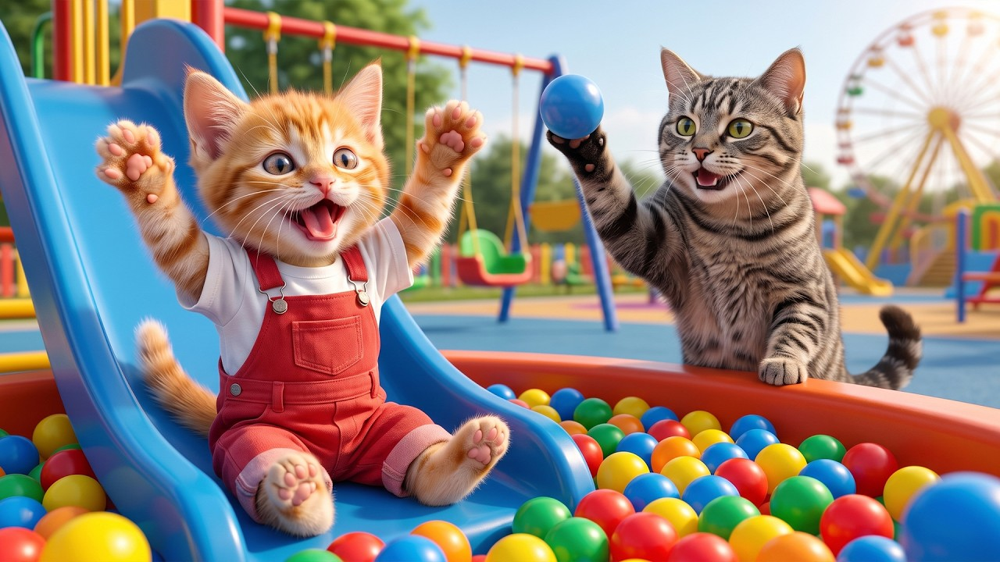 | 6079 | 2026-07-26 |
| [《哈基猫奇遇记：神奇钟表工坊》](https://www.bilibili.com/video/BV1a93E6uEh6) | 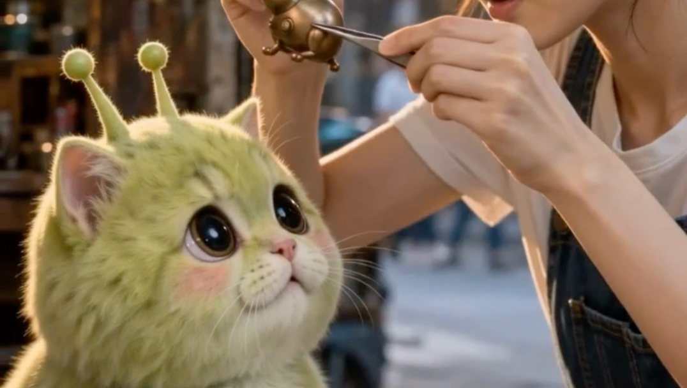 | 21.2万 | 2026-07-26 |
| [离神还有些距离，离人已经很远了](https://www.bilibili.com/video/BV1Do3E6KEiA) |  | 70.0万 | 2026-07-26 |
| [看完这期的真神了神了神了神了神了神了神了神了神了](https://www.bilibili.com/video/BV1Ab3j6mES7) | 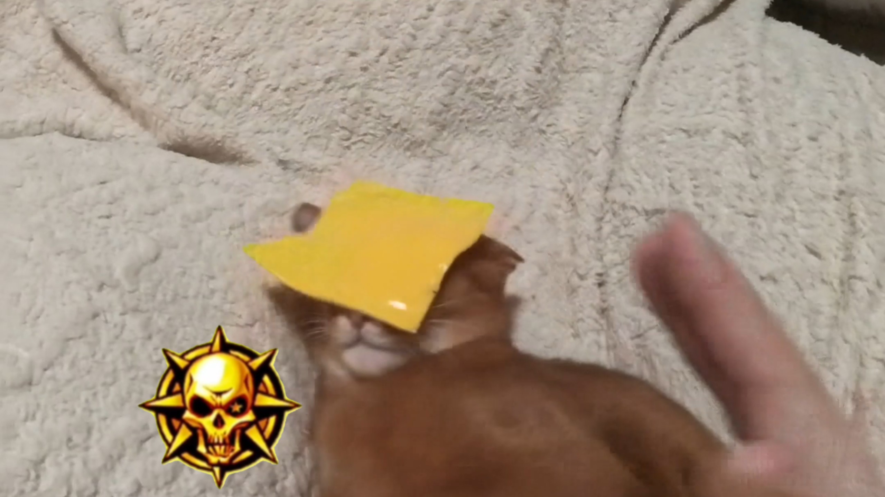 | 16.2万 | 2026-07-26 |
| [大狗叫和哈基米](https://www.bilibili.com/video/BV1yP376XE1U) | 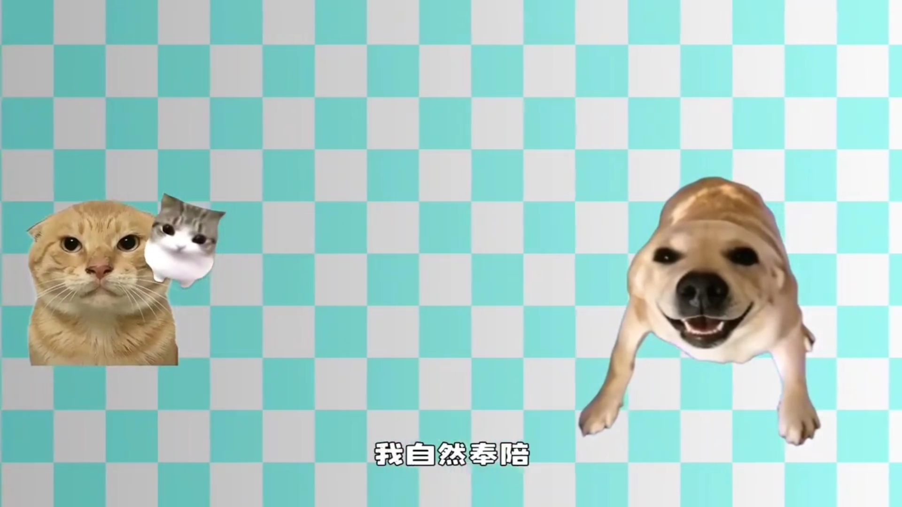 | 537 | 2026-07-26 |
| [可爱动物](https://www.bilibili.com/video/BV1mr376tEwY) | 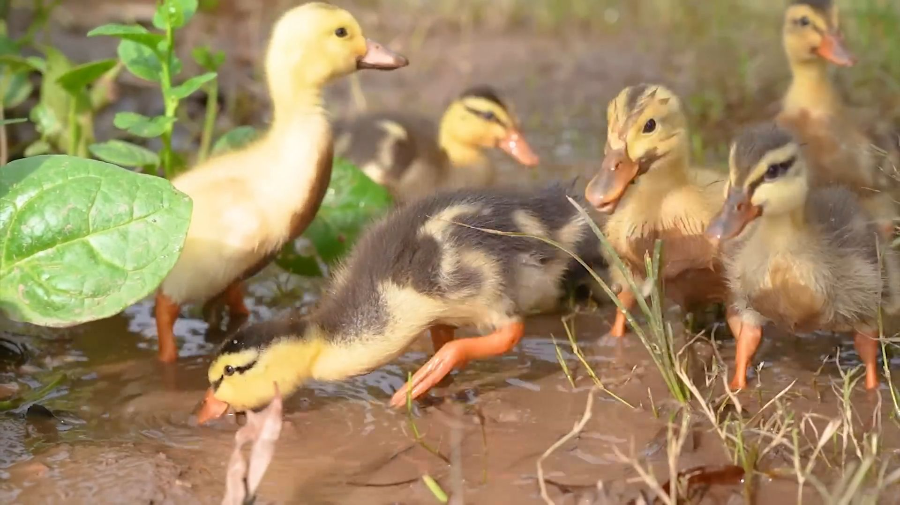 | 4400 | 2026-07-26 |
| [咪惑行为大赏 16](https://www.bilibili.com/video/BV1Ng3M6ZEF1) | 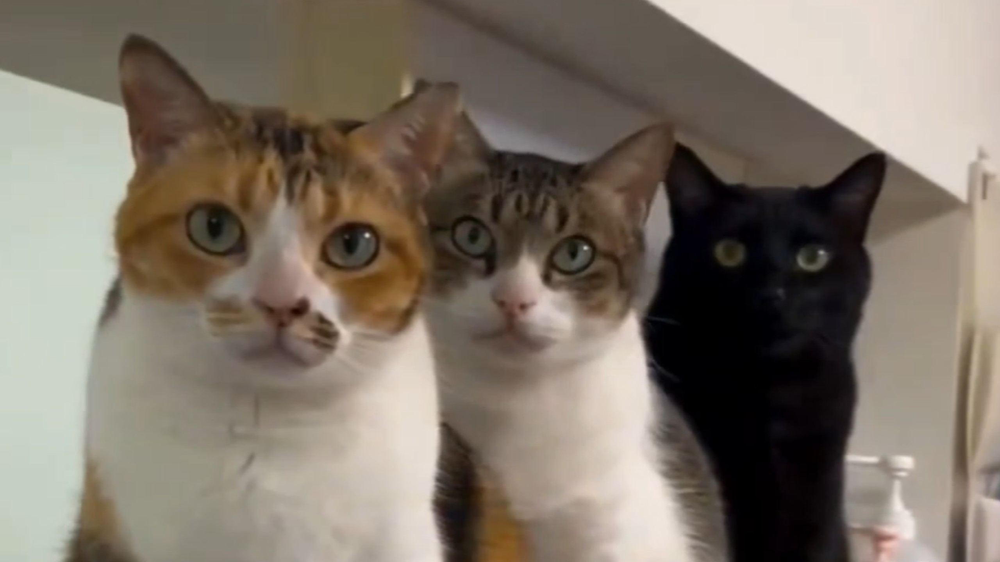 | 4.6万 | 2026-07-26 |
| [比比拉布和刀盾10-15集一口气看到爽](https://www.bilibili.com/video/BV1aK356REru) |  | 4.7万 | 2026-07-25 |
| [虽万般不舍，但这一次还是要和你说再见了……](https://www.bilibili.com/video/BV14V3G6GEn2) | 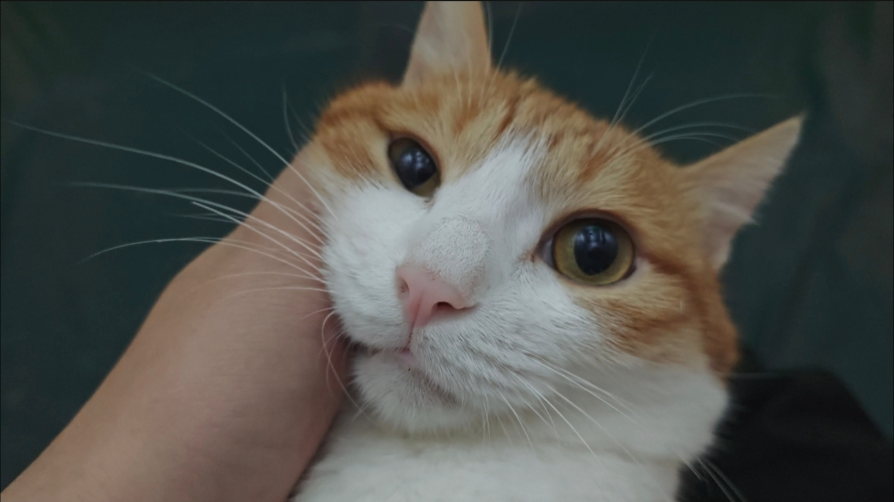 | 3.8万 | 2026-07-25 |
| [“往事只能哈基米”](https://www.bilibili.com/video/BV1pe3u6cE2V) |  | 4.5万 | 2026-07-25 |
| [橘猫做饭，今天做虾肉饺子](https://www.bilibili.com/video/BV1np3g6tEA1) | 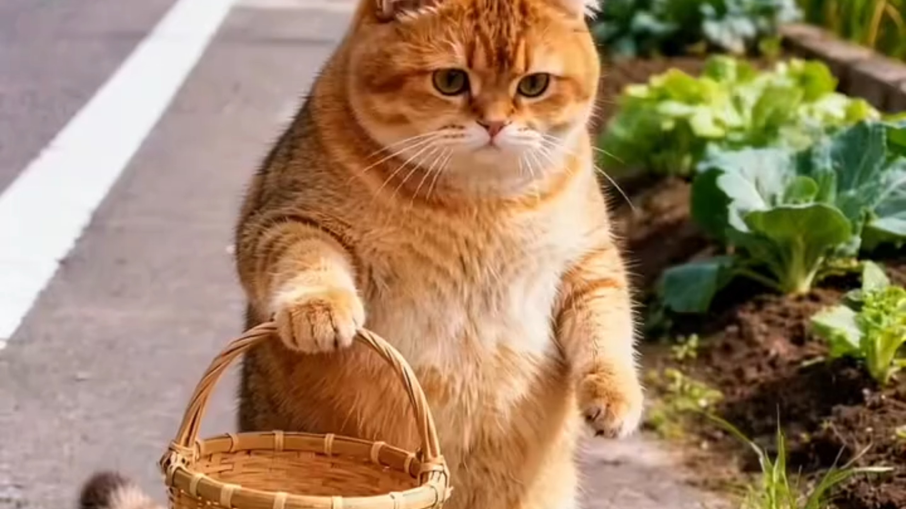 | 9380 | 2026-07-25 |
| [哈基米也有人教版？](https://www.bilibili.com/video/BV1S63M6TEz6) |  | 131 | 2026-07-25 |
| [“流浪猫的花语手慢无”](https://www.bilibili.com/video/BV1SPg46DEGz) | 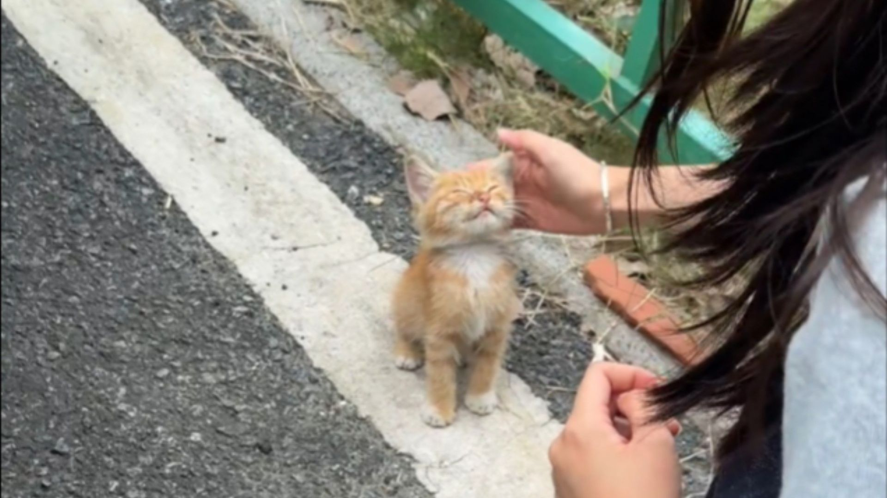 | 14.8万 | 2026-07-24 |
| [出门防拆家神器！4K沉浸式猫咪专属CATTV](https://www.bilibili.com/video/BV1T1Kn6REdT) | 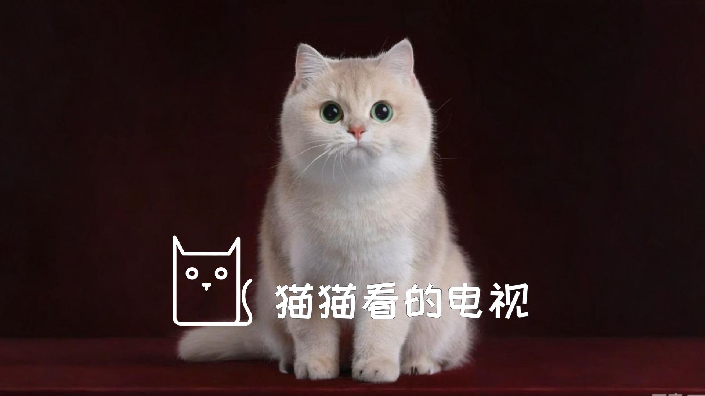 | 5440 | 2026-07-24 |
| [ASMR高细节颗粒感触发，让你大脑发麻｜Bakery无人声助眠](https://www.bilibili.com/video/BV1FxK16yEth) |  | 56.5万 | 2026-07-23 |
| [哈基米 [Eva (feat. Ева Польна] (长夜月摇の小曲)](https://www.bilibili.com/video/BV1SugQ6WErZ) |  | 266 | 2026-07-23 |
| [假如一千年后的博物馆......](https://www.bilibili.com/video/BV1QwgS6nER7) |  | 168.2万 | 2026-07-23 |
| [憋笑猜歌挑战，看谁能憋笑到最后！#憋笑挑战看谁能坚持到最后！](https://www.bilibili.com/video/BV1tXgS6jEKj) |  | 1.2万 | 2026-07-23 |
| [哈基米？哈基米！｜《チクッ 》](https://www.bilibili.com/video/BV1M4gU6LEjE) |  | 161 | 2026-07-23 |
| [四 v 一](https://www.bilibili.com/video/BV1gFg16TETA) | 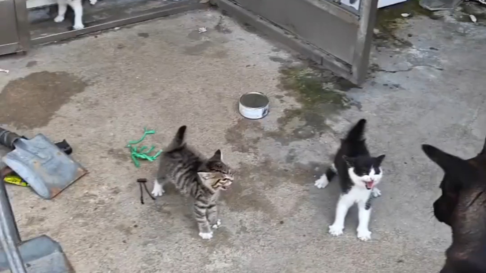 | 5.8万 | 2026-07-22 |
| [永远猜不到哈基米从哪个方向出现](https://www.bilibili.com/video/BV1HDgC6WErM) | 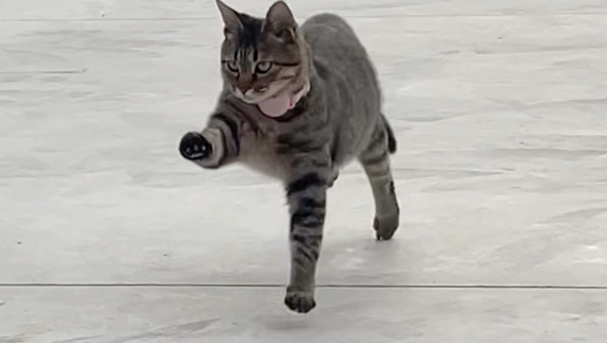 | 1.6万 | 2026-07-22 |
| [我弄坏了奶奶……现在她到处拉屎！ 💩 - 我是猫](https://www.bilibili.com/video/BV131Km6zEpv) |  | 9481 | 2026-07-20 |
| [【哈基米吉米】HACHIMI MAMBO FUNK](https://www.bilibili.com/video/BV1QHK26KEoW) |  | 189 | 2026-07-20 |
| [众所周知，流浪猫的花语手慢无！](https://www.bilibili.com/video/BV11kKN66ESx) | 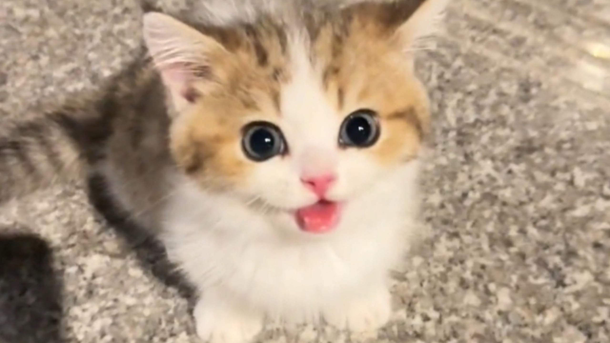 | 1.9万 | 2026-07-19 |
| [⚡️5分49秒带你爽溜四大教主⚡️【拼好歌】](https://www.bilibili.com/video/BV17PKH6rEvj) |  | 48.6万 | 2026-07-17 |
| [入才如玉](https://www.bilibili.com/video/BV1EbN86YEHL) |  | 12.8万 | 2026-07-15 |
| [处刑拍手-但是重音与初音（重发）](https://www.bilibili.com/video/BV17tTQ6hE5Z) |  | 66.6万 | 2026-07-06 |
| [猫爸猫妈：当猫咪捡到一只小猪崽…🐱🐷](https://www.bilibili.com/video/BV1i4RTBJEWa) |  | 2.5万 | 2026-05-01 |
| [翻唱一下哈基米音乐](https://www.bilibili.com/video/BV1Fit2zpErN) |  | 1493 | 2025-08-08 |
| [哈基米音乐](https://www.bilibili.com/video/BV1toveexEHN) | 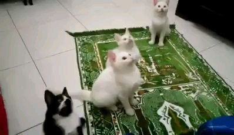 | 692 | 2024-08-01 |

---
*最后更新: 2026-08-01 05:39:16 (自动生成)*
*数据来源: [Bilibili](https://www.bilibili.com)*

## 使用说明

运行以下命令更新视频列表:
```bash
python3 fetch_hajimi_videos.py
```
