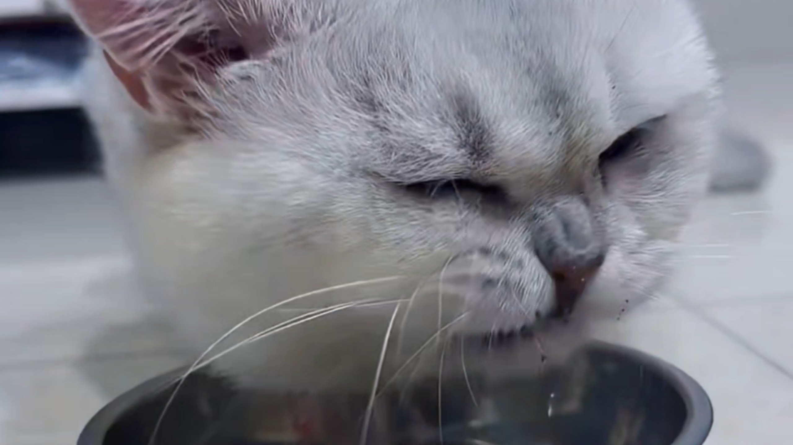

# awesome-hajimi
collections of hajimi (哈基米 in Chinese) on the Internet.

## 视频列表 (Video List)

| 视频标题 (Title) | 封面 | 播放量 (Views) | 发布日期 (Date) |
|---|---|---|---|
| [恐怖版新音乐∶扭曲的基米（整完版）](https://www.bilibili.com/video/BV1RNpu6gEhn) |  | 477 | 2026-10-07 |
| [宽 体 普 鲸  Wide Deepseek](https://www.bilibili.com/video/BV1uypA6JEqN) |  | 5926 | 2026-10-06 |
| [10.6吕布老吴老六车轮战军训缅英纯享版](https://www.bilibili.com/video/BV1xQpA6yEUK) |  | 2.5万 | 2026-10-06 |
| [哈基米被两个全装欺负了](https://www.bilibili.com/video/BV1xNpc6METm) |  | 227 | 2026-10-06 |
| [10.5老吴把猫薄荷当饭吃 吃完后疯狂打滚](https://www.bilibili.com/video/BV1vyHx69EBP) |  | 4.8万 | 2026-10-05 |

---
*最后更新: 2026-10-07 08:28:34 (自动生成)*
*数据来源: [Bilibili](https://www.bilibili.com)*

## 使用说明

运行以下命令更新视频列表:
```bash
python3 fetch_hajimi_videos.py
```
